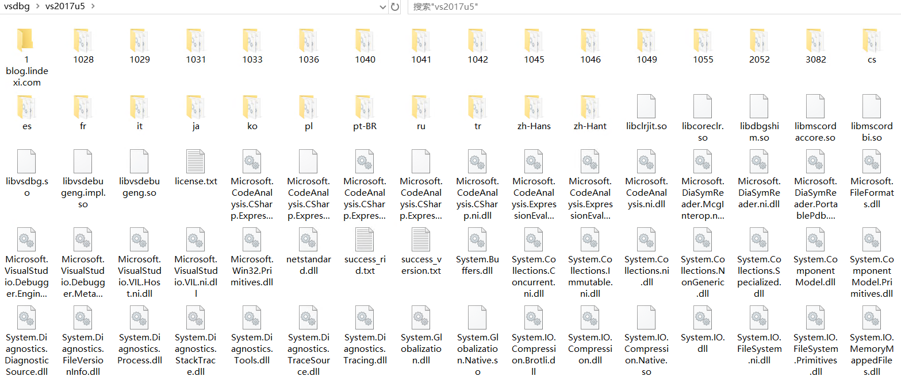

# VisualStudio 解决首次调试 docker 的 vs2017u5 exists, deleting 太慢问题

首次调试需要下载一些有趣的内容用于辅助调试，这部分内容大概有 100 多 M 在 VS 里面需要在半天。本文告诉大家如何在外面使用其他强大的下载工具下载完成之后复制回去

<!--more-->
<!-- CreateTime:6/22/2020 10:50:09 AM -->

<!-- 发布 -->

本文特别参考了 [visual studio 容器工具首次加载太慢 vsdbg\vs2017u5 exists, deleting 的解决方案 - microestc - 博客园](https://www.cnblogs.com/microestc/p/10784877.html ) 的方法，在此基础上做一点补充

可以看到的输出窗口信息如下

```
1>Doubi -> D:\lindexi\Doubi\Doubi\bin\Debug\netcoreapp3.1\Doubi.dll
1>C:\Windows\System32\WindowsPowerShell\v1.0\powershell.exe -NonInteractive -NoProfile -WindowStyle Hidden -ExecutionPolicy RemoteSigned -File "C:\Users\lindexi\AppData\Local\Temp\GetVsDbg.ps1" -Version vs2017u5 -RuntimeID linux-x64 -InstallPath "C:\Users\lindexi\vsdbg\vs2017u5"
1>Info: Using vsdbg version '16.6.20415.1'
1>Info: Using Runtime ID 'linux-x64'
1>Info: C:\Users\lindexi\vsdbg\vs2017u5 exists, deleting.
```

这里面有三个关键的信息

第一个是使用的 vsdbg 版本号，也就是 `1>Info: Using vsdbg version '16.6.20415.1'` 中的 `16.6.20415.1` 版本号，请记下

第二个是 Runtime ID 号。也就是 `1>Info: Using Runtime ID 'linux-x64'` 的 `linux-x64` 号，也请记下

最后是输出的文件路径，也就是 `1>Info: C:\Users\lindexi\vsdbg\vs2017u5 exists, deleting.` 的 `C:\Users\lindexi\vsdbg\vs2017u5` 路径，请记下

手动下载需要拼接下载路径，下载路径是 `https://vsdebugger.azureedge.net/vsdbg-(你的版本号 .号换成-号)/vsdbg-(你的Runtime ID).zip` 链接

根据上面所记的信息，这里的 `vsdbg-(你的版本号 .号换成-号)` 应该替换为 `16.6.20415.1` 版本号，同时将此版本的 `.` 号更改为 `-` 号，更改之后的内容如下 `vsdbg-16-6-20415-1` 这就是拼接的第一个版本号

然后再拼接上 Runtime ID 号，如上面记下的第二个关键信息，也就是 `linux-x64` 替换如下 `vsdbg-linux-x64.zip` 最后拼接的链接如下

```
https://vsdebugger.azureedge.net/vsdbg-16-6-20415-1/vsdbg-linux-x64.zip
```

打开自己收藏的强大的下载工具，如 dotnet FileDownloader 或 IDM 等工具下载此压缩包。对应上面链接，我下载之后放在 CSDN 欢迎小伙伴点击 [此链接](https://download.csdn.net/download/lindexi_gd/12542418) 下载。如有其他版本下载不了，可以邮件或 QQ 联系我，我可以帮你下载

下载完成之后，将压缩包解压到输出的文件路径，也就是刚才记住的第三个信息。如我的路径是 `C:\Users\lindexi\vsdbg\vs2017u5` 文件夹，解压缩时不带上压缩包名字

最终解压缩之后的 `C:\Users\lindexi\vsdbg\vs2017u5`  大概如下

<!--  -->


接下来在 `C:\Users\lindexi\vsdbg\vs2017u5` 文件夹创建两个文件，分别是 success_version.txt 和 success_rid.txt 文件

在 `success_version.txt` 文件里面填写 VSDbg 版本号，也就是刚才记下的第一个信息，如我的是 `16.6.20415.1` 版本号

在 `success_rid.txt` 文件里面填写 Runtime ID 号，也就是刚才记下的第二个信息，如我的是 `linux-x64` 号

完成之后，如果此时的 VS 还在准备调试中，可以点击生成菜单，关闭这一次的生成，然后再继续生成。如果上面步骤没有错的话，应该很快就会看到 vs2017u5 exists, deleting 这一步骤很快就跳过了

跳过之后如果可以看到 linux-musl-x64 的下载，如以下输出内容

```
1>C:\Windows\System32\WindowsPowerShell\v1.0\powershell.exe -NonInteractive -NoProfile -WindowStyle Hidden -ExecutionPolicy RemoteSigned -File "C:\Users\lindexi\AppData\Local\Temp\GetVsDbg.ps1" -Version vs2017u5 -RuntimeID linux-musl-x64 -InstallPath "C:\Users\lindexi\vsdbg\vs2017u5\linux-musl-x64"
1>Info: Using vsdbg version '16.6.20415.1'
1>Info: Using Runtime ID 'linux-musl-x64'
```

依然需要记下三个关键信息，和上面的差不多


第一个信息是版本号，也就是 `1>Info: Using vsdbg version '16.6.20415.1'` 的 `16.6.20415.1` 版本号，请记下

第二个是 Runtime ID 号。也就是 `1>Info: Using Runtime ID 'linux-musl-x64'` 的 `linux-musl-x64` 号，也请记下

第三个信息是输出路径，也就是 `1>C:\Windows\System32\WindowsPowerShell\v1.0\powershell.exe -NonInteractive -NoProfile -WindowStyle Hidden -ExecutionPolicy RemoteSigned -File "C:\Users\lindexi\AppData\Local\Temp\GetVsDbg.ps1" -Version vs2017u5 -RuntimeID linux-musl-x64 -InstallPath "C:\Users\lindexi\vsdbg\vs2017u5\linux-musl-x64"` 的 `C:\Users\lindexi\vsdbg\vs2017u5\linux-musl-x64` 文件夹

对比上面的步骤，可以看到是放在 vs2017u5 的 `linux-musl-x64` 文件夹

注意第二个信息的是 `linux-musl-x64` 和上面步骤的 `linux-x64` 不相同

接下来拼接下载路径，和上面步骤差不多，下载路径是 `https://vsdebugger.azureedge.net/vsdbg-(你的版本号 .号换成-号)/vsdbg-(你的Runtime ID).zip` 链接

用记住的第一个信息替换版本号，如使用 16.6.20415.1 替换 `vsdbg-(你的版本号 .号换成-号)` 可以拿到 `vsdbg-16-6-20415-1` 版本号

使用记住的第二个信息替换 Runtime ID 号，如使用 `linux-musl-x64` 替换 `vsdbg-(你的Runtime ID).zip` 可以拿到 `vsdbg-linux-musl-x64.zip` 链接

拼接起来的链接大概如下，这个版本我放在 CSDN 上，点击 [此链接](https://download.csdn.net/download/lindexi_gd/12542461) 可以下载

```
https://vsdebugger.azureedge.net/vsdbg-16-6-20415-1/vsdbg-linux-musl-x64.zip
```

再次使用本地工具下载此压缩包，下载完成之后解压缩到记住的第三个信息对应的文件夹里面，如 `C:\Users\lindexi\vsdbg\vs2017u5\linux-musl-x64` 文件夹

解压缩完成之后，复制刚才创建的 success_version.txt 和 success_rid.txt 文件，放在 `C:\Users\lindexi\vsdbg\vs2017u5\linux-musl-x64` 文件夹，请自行替换为具体你的路径

打开 `success_version.txt` 文件，替换内容为刚才记住的第一个信息，基本上内容应该是一样的，也就是替换前后内容实际上没有变化

最后需要重启一下 VisualStudio 哦，千万记得重启

<a rel="license" href="http://creativecommons.org/licenses/by-nc-sa/4.0/"></a><br />本作品采用<a rel="license" href="http://creativecommons.org/licenses/by-nc-sa/4.0/">知识共享署名-非商业性使用-相同方式共享 4.0 国际许可协议</a>进行许可。欢迎转载、使用、重新发布，但务必保留文章署名[林德熙](http://blog.csdn.net/lindexi_gd)(包含链接:http://blog.csdn.net/lindexi_gd )，不得用于商业目的，基于本文修改后的作品务必以相同的许可发布。如有任何疑问，请与我[联系](mailto:lindexi_gd@163.com)。
