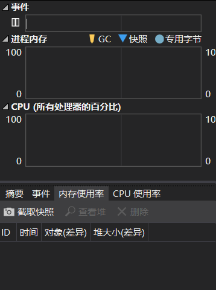
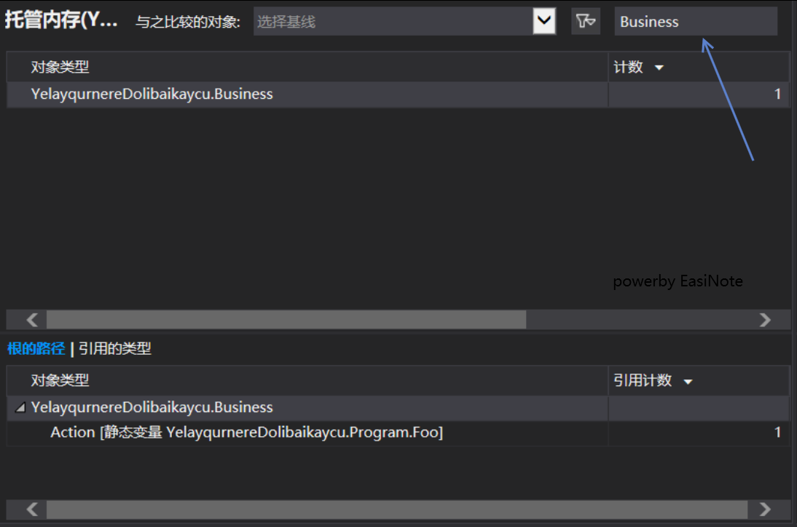
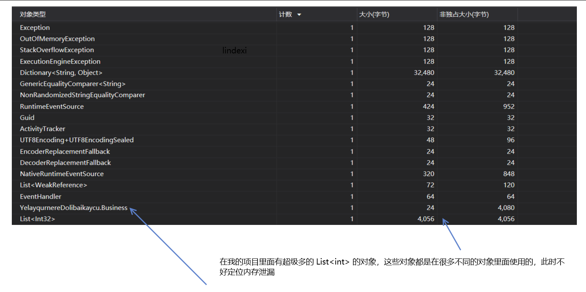

# VisualStudio 调试内存泄漏方法

虽然在写 .NET 程序，很难做到内存泄漏，但是一个软件做的很大时会发现还是有一点点的内存泄漏。本文告诉大家如何通过 VisualStudio 调试内存泄漏，这个方法适合进行日常优化

<!--more-->
<!-- CreateTime:2019/12/25 11:04:16 -->

<!-- 发布 -->

在调试内存泄漏时，最简单的方法时通过内存使用率进行调试。核心方法是查看内存中有哪些对象占用了大量内存，其次是查看内存中有哪些不用的对象还在内存

第一个方法，查看对象占用的方法我做了一个课件视频，点击下面图片就可以播放

<!--  -->

[](https://r302.cc/B0mV0z)

上面的方法适合在不了解任何业务时，同时软件存在明显的内存泄漏时的调试。当然，如果不是存在明显的内存泄漏，也很少有小伙伴会进行优化。但是如果现在想要进行更多的优化内存，请尝试使用核心方法二。必须要在进行方法一之后，发现还不满足需求时才进行方法二的优化，因为使用方法二查看内存中有哪些不用的对象还在内存，这个方法要求是了解业务，知道哪些对象已经被执行过了，不需要放在内存，在知道了这部分内存可以被释放之后还需要更改一些业务代码，如果此时的业务不够熟悉，可能有哪些地方是需要引用这个对象的，那么就会修改出坑，此时就有机会可以去和测试小姐姐聊聊天了

用一个简单的代码作为本文调试用的项目

```csharp
    class Program
    {
        static void Main(string[] args)
        {
            Do();

            // 其他业务
            for (int i = 0; i < int.MaxValue; i++)
            {
                Console.WriteLine("欢迎访问我博客 https://blog.lindexi.com 里面有大量 UWP WPF 博客");
                Task.Delay(TimeSpan.FromSeconds(10));
            }
        }

        private static void Do()
        {
            var business = new Business();
            business.Do();
        }

        public static event Action Foo;
    }

    class Business
    {
        public void Do()
        {
            Program.Foo += Do;
        }
    }
```

熟悉 C# 的小伙伴很快就发现了内存泄漏的代码 `Program.Foo += Do` 只要在 C# 中将对象加入到一个长时间生效的对象，也就是将一个生效时间比较短的对象加入到一个生效时间比较长的对象，那么这个对象将会直到生效时间最长的对象被释放时才可以被释放。而静态的对象的生效时间时整个应用到结束的时间，所以任何被静态对象引用的对象都不会被释放

在代码中，将 Do 方法加入到静态的 Foo 事件，此时 Program 对象将会引用 Business 对象，因为加入的是静态的事件，在应用程序退出或 AppDomain 卸载之前这个静态依然有效。于是 Business 对象需要等待 Program 的 Foo 对象释放才可以释放，但 Foo 不会释放，此时就算内存泄漏。但是需要注意此时说不定是业务需要这样做，也就是需要初始化这个模块进行监听事件，在进行优化之前请确定了解这部分的业务。假设业务上需要在执行 Business 的 Do 方法之后，就不再需要 Business 的任何代码，也就是 Business 现在也不需要在内存中存在，在知道这部分业务时，就可以在执行完成 Business 的业务完成之后添加断点。建议将断点放在离具体业务执行完成之后的比较后的时间，或者在业务执行完成之后，等待一会通过 VisualStudio 的全部中断进入断点，因为对象回收是依赖GC的，在业务执行完成之后立刻添加断点可能此时的对象没有任何引用但是没有被gc回收

第一步运行相应的业务，然后等待一下进入断点，进入断点的方法可以是业务执行之后的后面的逻辑添加断点或者 VisualStudio 点击全部中断

第二步是点击内存使用率，点击截取快照

<!--  -->


第三步是打开快照堆视图，尝试搜业务用到的类的名，看是否这些类还在内存中

<!--  -->


如果找到了对应的类还在内存中，通过查看是哪个对象引用了这个对象，一步步找到引用的代码。此时可以通过在对应的引用的代码的赋值里面添加断点，如果熟悉业务，那么就直接在业务执行完成之后进行清理，如果和本金鱼一样忘记了代码，通过断点可以找到是哪里设置进来的

基本的执行清理就是取消对象的引用，如事件可以使用 `-=` 方法，列表可以使用 Remove 方法，直接对象引用可以设置为 null 的方法

本文代码放在 [github](https://github.com/lindexi/lindexi_gd/blob/6ff4a837575e693034167440af4dd0e02e016676/YelayqurnereDolibaikaycu/) 欢迎小伙伴访问，尝试调试这个项目的内存泄漏

如果确实需要使用到静态的事件，但是不想要每次都手动释放，可以尝试弱事件，请看[.NET/C# 利用 Walterlv.WeakEvents 高性能地定义和使用弱事件 - walterlv](https://blog.walterlv.com/post/implement-custom-dotnet-weak-event.html)

而对象引用或列表引用，可以尝试使用弱引用[设计一个 .NET 可用的弱引用集合（可用来做缓存池使用） - walterlv](https://blog.walterlv.com/post/dotnet-weak-collection.html)

另外，在调试时可能会发现，内存中有很多诡异的数组占用了很多内存，而这部分数组或列表的组成都会很迷，如开始的课件视频说到的内容，请看下面代码

```csharp
    class Business
    {
        public Business()
        {
            NumberList = new List<int>(1000);
        }

        public void Do()
        {
            Program.Foo += Do;
        }

        public List<int> NumberList { get; }
    }
```

如果此时进行内存快照，可以在堆视图看到了存在`List<int>`对象，而这个对象占用了很多内存，但是 Business 对象的大小很小，但是非独占大小比较大。这就是在定义通用的类型的引用时，假设我定义了 100 个不同的类，这些类里面都会定义 `List<int>` 那么在堆视图可以看到 `List<int>` 的计数很多，同时占用的内存很多，但是很难直到这些对象是属于哪个模块，请看下图 

<!--  -->


尝试调试[这个版本的代码](https://github.com/lindexi/lindexi_gd/blob/82f407cd197753537e4b199f5b20dd81f33a08dd/YelayqurnereDolibaikaycu/)可以看到堆视图里面存在 `List<int>` 的对象，再尝试对比调试[这个版本的代码](https://github.com/lindexi/lindexi_gd/blob/1a79da53d0479df692feed40d6ae4ab9e5218855/YelayqurnereDolibaikaycu/) 在这个版本里面写了 BusinessNumber 类，也就是给 `List<int>` 元素命名，此时在堆视图里面可以看到是 `BusinessNumber` 对象的占用内存

<!--  -->


通过在代码给元素命名，也就是继承基础的数组等，这样可以在调试内存泄漏时，将不同的业务分开。解决在调试内存时看到大量的都是如 `List<int>` 的元素

更多调试方法请看 [dotnet 代码调试方法](https://blog.lindexi.com/post/dotnet-%E4%BB%A3%E7%A0%81%E8%B0%83%E8%AF%95%E6%96%B9%E6%B3%95.html)

特别感谢 [Dotnet9](https://dotnet9.com/ ) 小伙伴指出本文错误

<a rel="license" href="http://creativecommons.org/licenses/by-nc-sa/4.0/"></a><br />本作品采用<a rel="license" href="http://creativecommons.org/licenses/by-nc-sa/4.0/">知识共享署名-非商业性使用-相同方式共享 4.0 国际许可协议</a>进行许可。欢迎转载、使用、重新发布，但务必保留文章署名[林德熙](http://blog.csdn.net/lindexi_gd)(包含链接:http://blog.csdn.net/lindexi_gd )，不得用于商业目的，基于本文修改后的作品务必以相同的许可发布。如有任何疑问，请与我[联系](mailto:lindexi_gd@163.com)。
