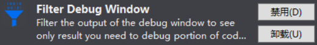
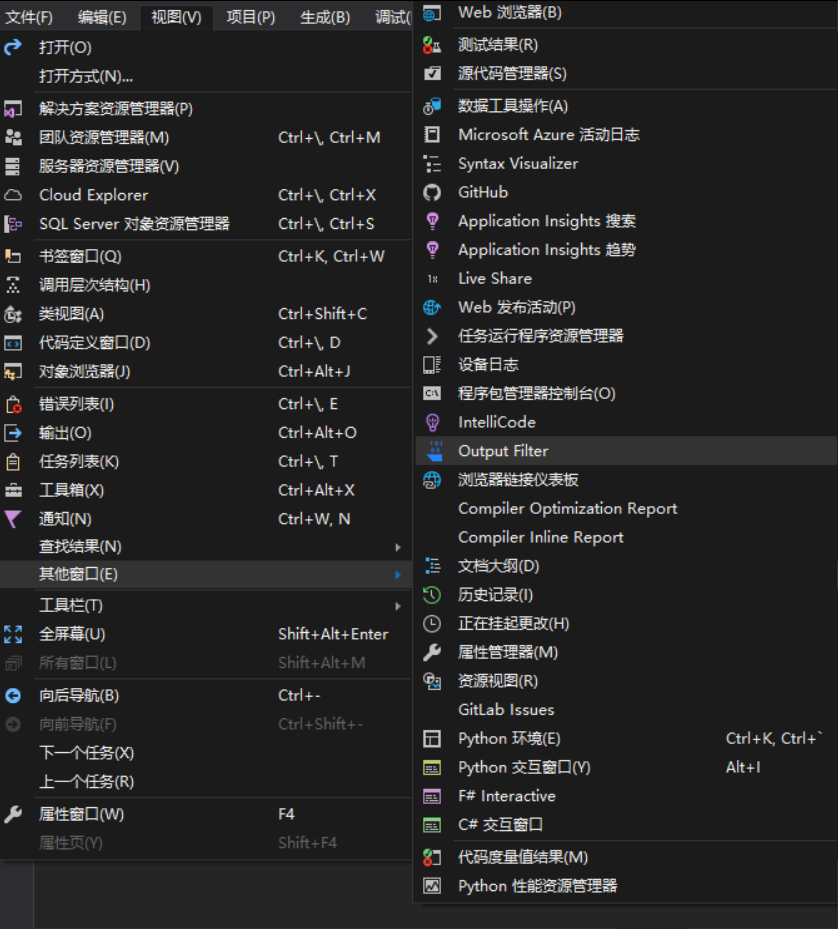
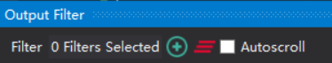
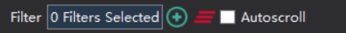
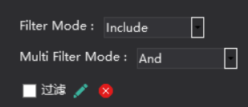

# VisualStudio 过滤输出窗口文本

如果一个项目是很多小伙伴开发，里面有一些逗比喜欢在输出窗口输出大量无意义的文本，那么很难通过输出窗口调试

本文告诉大家通过 VisualStudio 插件过滤输出窗口文本，让 VisualStudio 的输出只是自己需要的信息

<!--more-->
<!-- CreateTime:2019/2/24 11:10:07 -->

<!-- csdn -->

例如有两个逗比小伙伴都在使用输出，同时输出的都是无意义的文本

```csharp
        static void Main(string[] args)
        {
            Task.Run(async () =>
            {
                while (true)
                {
                    Debug.WriteLine("林德熙是逗比");
                    await Task.Delay(100);
                }
            });

            Task.Run(async () =>
            {
                while (true)
                {
                    Debug.WriteLine("walterlv是逗比");
                    await Task.Delay(100);
                }
            });

            Console.Read();
        }
```

对于 林德熙 小伙伴希望看到输出里面都是 林德熙是逗比 不想看到其他文本

但是实际的输出混合了两个逗比的输出


通过 VisualStudio 插件[Filter Debug Window](https://marketplace.visualstudio.com/items?itemName=nertilpoci.FilterDebugWindow ) 可以过滤输出窗口文本

<!--  -->


通过 [VisualStudio 插件网站](https://marketplace.visualstudio.com/items?itemName=nertilpoci.FilterDebugWindow ) 或直接在 VisualStudio 搜 Filter Debug Window 就可以下载

在安装之后从 VisualStudio 的视图的其他窗口的 OutputFilter 就可以打开过滤的页面

<!--  -->


这个页面默认会在输出页面旁边，这个插件是添加了一个新的页面用来做输出，这里的输出的文本和输出页面的文本相同，但是多了过滤的功能。点击加号可以添加过滤

<!--  -->


添加的过滤可以使用不同的条件过滤，如输出的内容包含某个字符串，或不包含某个字符串。输入过滤的内容，然后点击确定

<!--  -->


点击选择的过滤，也就是 0 Filters Selected 这个按钮

<!--  -->


选择刚才新建的过滤

<!--  -->


尝试再次运行代码，可以看到现在的输出只有 林德熙是逗比 通过这样的方法可以过滤自己不需要的信息


同时这个插件支持同时设置多个过滤，设置为或的关系，这样就可以同时看到异常和自己需要的信息

[Filter Debug Window](https://marketplace.visualstudio.com/items?itemName=nertilpoci.FilterDebugWindow )

这是一个开源的插件，欢迎小伙伴一起开发 [VisualStudio-Output-Filter-Extension](https://github.com/nertilpoci/VisualStudio-Output-Filter-Extension )

课件 [VisualStudio 过滤输出窗口文本](https://r302.cc/mXzan5?platform=enpc&channel=copylink )

<a rel="license" href="http://creativecommons.org/licenses/by-nc-sa/4.0/"></a><br />本作品采用<a rel="license" href="http://creativecommons.org/licenses/by-nc-sa/4.0/">知识共享署名-非商业性使用-相同方式共享 4.0 国际许可协议</a>进行许可。欢迎转载、使用、重新发布，但务必保留文章署名[林德熙](http://blog.csdn.net/lindexi_gd)(包含链接:http://blog.csdn.net/lindexi_gd )，不得用于商业目的，基于本文修改后的作品务必以相同的许可发布。如有任何疑问，请与我[联系](mailto:lindexi_gd@163.com)。