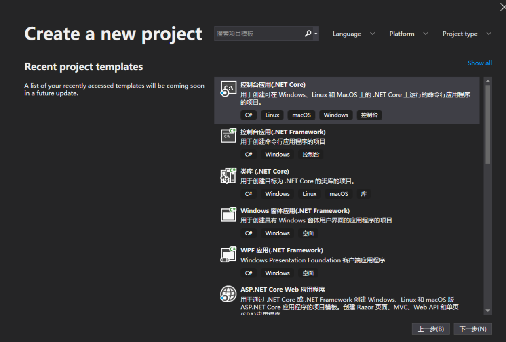
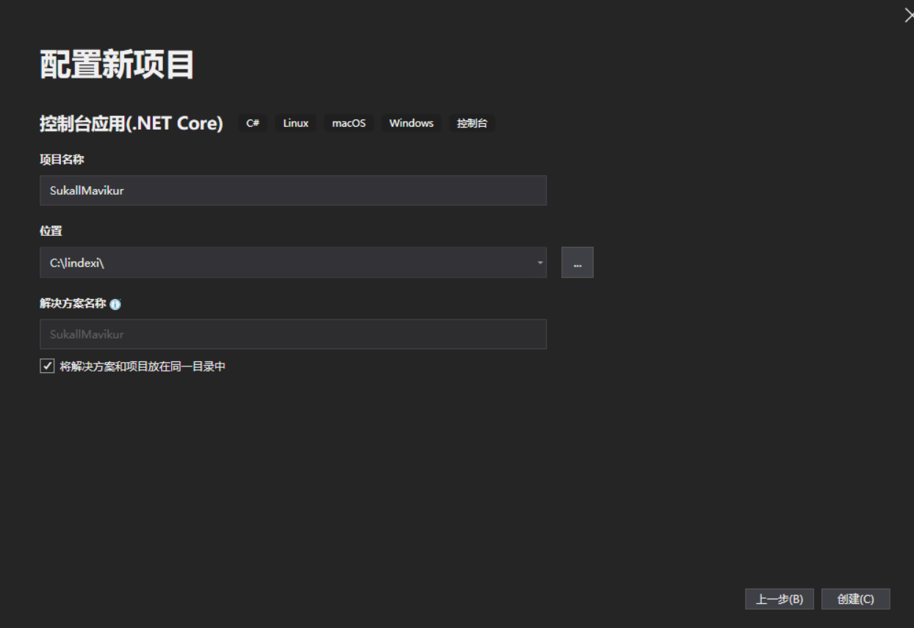
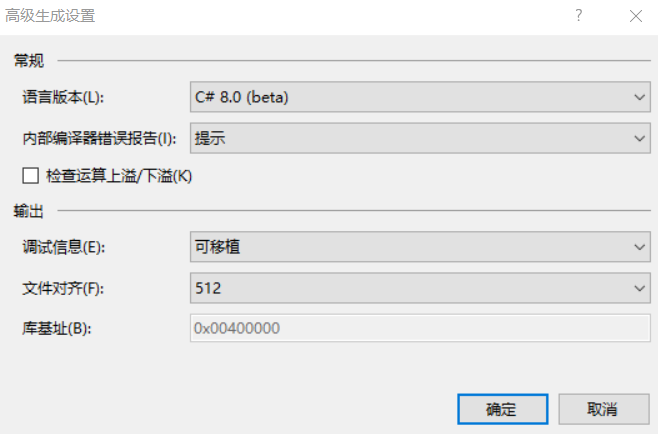
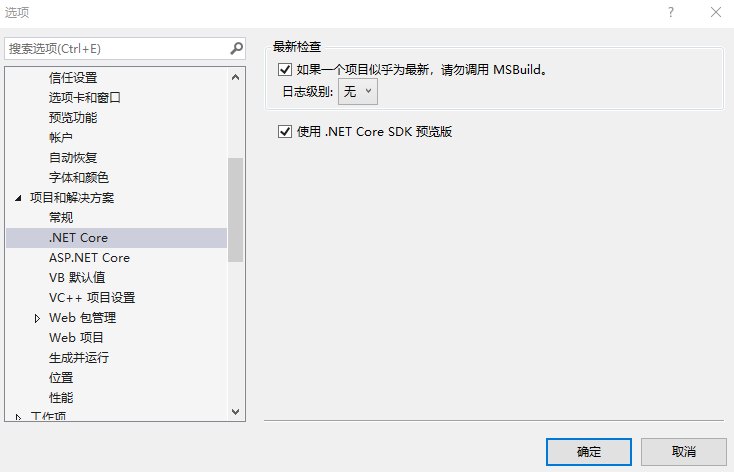
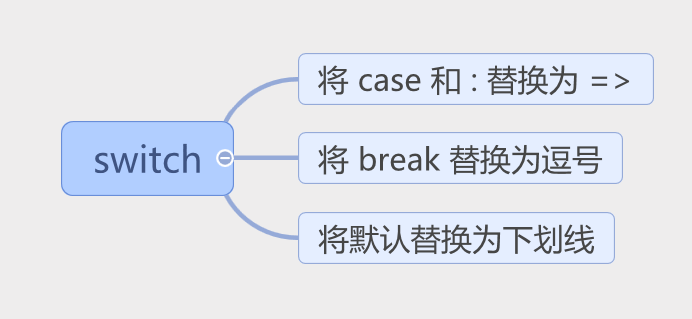

# VisualStudio 2019 尝试使用 C# 8.0 新的方式

在安装了几天之后，终于有了 VisualStudio 2019 于是再安装了 dotnet core 3.0 预览版，现在可以来尝试使用 C# 8.0 的新方式

<!--more-->


<!-- CreateTime:2019/11/29 8:41:20 -->

<!-- csdn -->

新的 VisualStudio 界面十分清真，此时可以通过标签找到自己可以创建的项目

<!--  -->


找到一个简单的控制台项目，创建的界面也很简单

<!--  -->


虽然界面不错，但是创建项目的速度没有加快，等了很久，终于看到和之前没有多少修改的界面。虽然开始是没有发现添加了什么功能，但是实际作为太阳系最强IDE还是提供了很多好玩的功能，请看[VisualStudio 2019 新特性](https://blog.lindexi.com/post/VisualStudio-2019-%E6%96%B0%E7%89%B9%E6%80%A7.html )

在按下调试的时候，发现有一些按钮的界面修改，如下一步的按钮

<!--  -->


当前，在使用之前需要做一些准备，首先是[下载](https://aka.ms/netcore3download) dotnet core 3.0 不然一些功能不能使用。如果官网无法下载，可以到[CSDN](https://download.csdn.net/download/lindexi_gd/11100712 )下载

右击项目，编辑一下 csproj 文件

```
 <Project Sdk="Microsoft.NET.Sdk">

  <PropertyGroup>
    <OutputType>Exe</OutputType>
    <TargetFramework>netcoreapp3.0</TargetFramework>
  </PropertyGroup>

</Project>
```

右击项目属性，在生成页面选择用最新语言

<!--  -->


正式版的 VisualStudio 2019 需要点击开启预览版

<!--  -->


## 可空类型

现在可以提示开发者写出可能为空的代码，如 string 默认可以设置为不可空

```csharp
        static void Main(string[] args)
        {
            string str = null;
            Console.WriteLine(str);
        }
```

以前这样写代码是可以的，但是现在，可以在 csproj 文件里面添加 NullableReferenceTypes 此时就会在设置 string 为空提示

现在的 csproj 需要添加 NullableReferenceTypes 请看下面

```
<Project Sdk="Microsoft.NET.Sdk">

  <PropertyGroup>
    <OutputType>Exe</OutputType>
    <TargetFramework>netcoreapp3.0</TargetFramework>
    <LangVersion>8.0</LangVersion>
    <NullableReferenceTypes>true</NullableReferenceTypes>
  </PropertyGroup>

</Project>
```

注意：

在VS2019正式版中，使用

```csharp
<NullableContextOptions>enable</NullableContextOptions>
```

而不是使用

```csharp
<NullableReferenceTypes>true</NullableReferenceTypes>
```

再次编译一下项目，虽然可以看到项目编译通过，但是可以看到下面的警告

<!--  -->


现在对于 string 是不可空的，但是为了兼容以前的代码，没有强制让编译不通过。同时提供了可空的字符串，也就是 `string?` 请看代码

```csharp
            string? str = null;
            Console.WriteLine(str);
```

那么原来的 `str[0]` 的这些写法需要怎么修改呢？

答案是可以不修改，直接写

```csharp
            string? str = null;
            var foo = str[0];
            Console.WriteLine(str);
```

但是编译的时候会出现下面的警告

```csharp
warning CS8602: Possible dereference of a null reference.
```

如果需要在 string 判断为空的时候不使用，可以使用下面的方法

```csharp
            string? str = null;
            var foo = str?[0];
            Console.WriteLine(str);
```

[C#8.0可空引用类型的使用注意要点 - 自来喵的野 - 博客园](https://www.cnblogs.com/zlmdy/p/10656793.html )

## Range

第二个好玩的是 Range 可以指定使用数组的哪些内容

```csharp
            var foo = new[] { "1 lindexi", "2 doubi", "3 csdn" };

            foreach(var temp in foo[0..1])
            {
                Console.WriteLine(temp);
            }
```

此时输出从第 0 元素到第 1 元素，不包括第 1 元素的值

```csharp
1 lindexi
```

如果修改为 `foo[0..2]` 就会输出 

```csharp
1 lindexi
2 doubi
```

如果需要从第 1 个元素到最后一个元素，可以这样写

```csharp
            var foo = new[] { "1 lindexi", "2 doubi", "3 csdn" };

            foreach(var temp in foo[1..])
            {
                Console.WriteLine(temp);
            }

            // 2 doubi
            // 3 csdn
```

如果想要从第 0 个元素输出到倒数第一个元素，不包括倒数第一个元素，可以这样写

```csharp
            var foo = new[] { "1 lindexi", "2 doubi", "3 csdn" };

            foreach(var temp in foo[1..^1])
            {
                Console.WriteLine(temp);
            }

            // 2 doubi
```

这里加上了 `^` 就是表示倒数，使用 `..` 分开开始的值和最后一个值

当然 `1..2` 这个只是一个语法糖，这是一个 Range 类

```csharp
            Range range = 1..2;

            foreach (var temp in foo[range])
            {
                Console.WriteLine(temp);
            }
```

关于 Range 请看[Range Type in C# 8 - .NET Core Tutorials](https://dotnetcoretutorials.com/2018/12/09/range-type-in-c-8/ )

[C# 8中的范围类型(Range Type) - LamondLu - 博客园](https://www.cnblogs.com/lwqlun/p/10095821.html )

## 异步的流

可以通过 async 修饰 yield 返回的方法

```csharp
            await foreach (var temp in Foo())
            {
                Console.WriteLine(temp);
            }

            async IAsyncEnumerable<string> Foo()
            {
                foreach(var temp in new[] { "1 lindexi", "2 doubi", "3 csdn" })
                {
                    await Task.Delay(100);
                    yield return temp;
                }
            }
```

这样就可以异步返回，异步返回的优点在于，之前的写法是先等待 Foo 方法运行完成才能做循环，现在是等待 Foo 方法完成一次就运行一次循环。可以更好做协程提高性能。

## 匹配优化

虽然在 C# 7.0 对 switch 做了一波优化，但是还是不够，现在可以写出小伙伴认为这不是 C# 的代码了

现在的 switch 支持表达式等方法

### switch expressions

表达式写起来的代码将会非常简单，如我定义了一个枚举

```csharp
        public enum Rainbow
        {
            Red,
            Orange,
            Yellow,
            Green,
            Blue,
        }
```

我需要判断这个枚举输出对应的值，原先的写法会存在大量的 case 和 break 看起来不好看，现在只需要很简单的代码

```csharp
        public static string FromRainbow(Rainbow colorBand) =>
            colorBand switch
        {
            Rainbow.Red    => "红",
            Rainbow.Orange => "橙",
            Rainbow.Yellow => "黄",
            Rainbow.Green  => "绿",
            Rainbow.Blue   => "蓝",
            _              => throw new ArgumentException(message: "invalid enum value", paramName: nameof(colorBand)),
        };
```

通过语法糖可以写出清真的代码，上面代码用到了两个科技，第一个是 C# 7.0 的时候的表达式方法体，也就是方法体不使用 `{}` 里面写代码，而是通过 `=>` 写一个表达式。更多 C# 7.0 请看 [C# 7.0](https://blog.lindexi.com/post/C-7.0.html )

第二个科技就是简洁的表达式判断

<!--  -->


### property pattern

属性匹配是一个好用的方法，可以判断一个输入的类里面的某个属性是否符合条件

```csharp
    internal class Foo
    {
        public string F { get; set; }
    }

        private static string LeafalljurearjehuNerawaljeeyinaryem(Foo foo)
        {
            var str = foo switch
            {
                { F: "林德熙" } => "林德熙是逗比",
                { F: "逗比" } => "逗比",
            };

            return str;
        }    
```

语法就是 类里面的某个属性加上冒号后面就是判断的属性的值

```csharp
            某个参数 switch
            {
                { 参数的某个属性: 用于判断的值 } => 表达式,
                { F: "逗比" } => "逗比",
            };
```

同样使用下划线表示默认

### Tuple patterns

在 C# 7.0 的元组让小伙伴都说好，在 switch 支持组合元组判断，如我写了一个方法传入了两个参数。可以通过下面的方法判断

```csharp
        private static string Foo(string first, string second)
        {
            var str = (first, second) switch
            {
                ("lin", "dexi") => "林德熙是逗比",
                (_, "dexi") => "没错，这就是逗比",
                (_, _) => "不认识",
            };

            return str;
        }
```

试试输入的下面代码

```csharp
            Console.WriteLine(Foo("lin", "dexi"));
            Console.WriteLine(Foo("逗比", "dexi"));
            Console.WriteLine(Foo(null, null));
```

运行的时候可以看到输出

<!--  -->


如果是一个类能否也隐私转换为元组可以的，现在微软让 C# 和 .NET 的关系没有之前那么紧密，很多功能都是通过只要一个类里面存在某个方法就可以使用的方式

其实这不是从 C# 8.0 才开始的，在开始 await 的时候就是这样，只需要一个类有 GetAwaiter 方法就可以

在 C# 8.0 只要一个类有 Deconstruct 方法就可以隐式转元组请看代码

```csharp
    public class Point
    {
        public int X { get; }
        public int Y { get; }

        public Point(int x, int y) => (X, Y) = (x, y);

        public void Deconstruct(out int x, out int y) =>
            (x, y) = (X, Y);
    }
```

我的 Point 没有继承任何的类，只是写了 Deconstruct 方法，现在我就可以转换了

```csharp
        private static string Foo(Point point)
        {
            var (x, y) = point;
            return $"{x},{y}";
        }
```

通过这个语法糖可以实现 Positional patterns 的方法

### Positional patterns

还是刚才的 Point 可以直接将他转换判断

```csharp
        private static string Foo(Point point) =>
            point switch
        {
            var (x, y) when x > 0 && y > 0 => "两个值都大于零",
            var (x, y) when x < 0 && y < 0 => "两个值都小于零",
            var (_, _) => "不合法的值",
            _ => throw new ArgumentException("point"),
        };
```

这里的默认值有两个，一个是 `var (_, _)` 不关注输入的是任何的值，只要在前面代码没有判断成功的，都进来。但是有一个例外的是连一个值都没有，如空就进入了最后的默认值，请看输入

```csharp
            Console.WriteLine(Foo(new Point(1, 1)));
            Console.WriteLine(Foo(new Point(1, 0)));
            Console.WriteLine(Foo(null));
```

运行代码会看到输出

<!--  -->


## using declarations

之前的 using 是需要带花括号的，这样有小伙伴写的代码需要一个直尺才能知道他是写什么，在 C# 8.0 支持不带花括号的 using 作用范围是一个方法

```csharp
        static void WriteLinesToFile(string str)
        {
            using var file = new System.IO.StreamWriter("lindexi.txt");

            file.WriteLine(str);
            // file 会在这里释放
        }
```

此时有小伙伴吐槽说，原本使用 using 可以做到在花括号之外可以让小伙伴不会使用到using的变量，但是微软的小伙伴说应该是方法尽可能短而不是在长的方法里面使用花括号

在有了局部方法之后，可以将一个非常小的代码放在一个方法里面，于是就可以用上这个科技。但是这个特性如果用不好确实会让本需要释放的变量在后面使用

## Static local functions

刚才还说到了局部方法，在使用局部方法的时候，默认是可以拿到局部方法之外的方法的变量的，于是就会出现一些闭包问题。同时如果因为使用了闭包，在一些时候的局部方法的方法指针会变化，于是加等事件的时候很难减等，虽然事件这个问题在编译层已经修复了很多，但是还是存在一些例外情况。于是微软就给了一个清真的方法，静态的局部方法。

静态的局部方法是只能使用传入的参数而不能拿到外部方法的局部变量，这个方法能做到固定方法指针同时请代码清真，因为看到一个变量的时候不需要去想是从哪一层方法传的，也不需要关注这个内部方法是什么时候调用。因为如果用到了上一层方法的局部变量，在不同的时候调用局部方法运行的逻辑也会不一样

将一个局部方法修改为静态的很简单，只需要加上 static 就可以

```csharp
        private static int Foo()
        {
            int y = 5;
            int x = 7;
            return Add(x, y);

            static int Add(int left, int right) => left + right;
        }
```

如果用了静态的局部方法，在局部方法内如果用到了上一层方法的局部方法就会出现提示静态本地函数不能包含对上一层方法的局部变量引用

<!--  -->


## Disposable ref structs

刚才也说到了微软让 C# 渐渐独立，只要某个类存在某些方法就可以用到指定的功能。在结构体是因为不能继承任何接口，所以也就无法实现 Dispose 的释放，但是有一些接口用到了不清真的代码需要释放。之前需要手动调用方法，现在可以通过在结构体里面添加 Dispose 的方法通过 using 释放

```csharp
    public ref struct Point
    {
        public int X { get; }
        public int Y { get; }

        public Point(int x, int y) => (X, Y) = (x, y);

        public void Dispose()
        {
        }
    }
```

对于引用的结构体，详细请看[C# 7.0](https://blog.lindexi.com/post/C-7.0.html ) 可以添加一个 Dispose 方法，不需要继承任何接口。所以现在的面试题或笔试题就需要更改了，如果要使用 using 释放需要继承什么接口，答案是可以不需要继承接口

释放这个 Point 可以通过 using 的方法，这样就和一个类继承了可释放是相同的

```csharp
        private static void Foo()
        {
            Point point = new Point();
            using (point)
            {
            }
        }
```

更多请看 [Building C# 8.0](https://blogs.msdn.microsoft.com/dotnet/2018/11/12/building-c-8-0/ )

参见：[Take C# 8.0 for a spin](https://blogs.msdn.microsoft.com/dotnet/2018/12/05/take-c-8-0-for-a-spin/ )

[[翻译]初试C# 8.0 - WAKU - 博客园](https://www.cnblogs.com/waku/p/10094691.html )

[VisualStudio 2019 新特性](https://blog.lindexi.com/post/VisualStudio-2019-%E6%96%B0%E7%89%B9%E6%80%A7.html )


<a rel="license" href="http://creativecommons.org/licenses/by-nc-sa/4.0/"></a><br />本作品采用<a rel="license" href="http://creativecommons.org/licenses/by-nc-sa/4.0/">知识共享署名-非商业性使用-相同方式共享 4.0 国际许可协议</a>进行许可。欢迎转载、使用、重新发布，但务必保留文章署名[林德熙](http://blog.csdn.net/lindexi_gd)(包含链接:http://blog.csdn.net/lindexi_gd )，不得用于商业目的，基于本文修改后的作品务必以相同的许可发布。如有任何疑问，请与我[联系](mailto:lindexi_gd@163.com)。