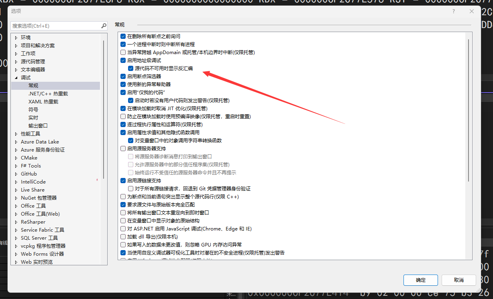
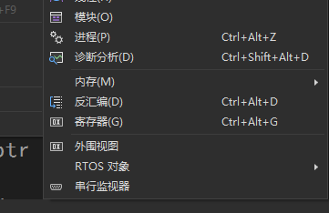

# VisualStudio 2022 找不到内存 反汇编 寄存器调试工具

本文将告诉大家如何解决在 VisualStudio 2022 的 调试-窗口 里面找不到内存、 反汇编、 寄存器这三个调试工具的问题

<!--more-->

<!-- 发布 -->
<!-- 博客 -->

找不到的原因是没有启用地址级调试

只需要在“工具”（或“调试”）>“选项”>“调试”中选择“启用地址级调试” 然后进行调试即可看到

<!--  -->

开启之后，即可在 调试-窗口 里面找到内存、 反汇编、 寄存器这三个调试工具

<!--  -->

参考文档：[在调试器中查看寄存器值 - Visual Studio (Windows) Microsoft Learn](https://learn.microsoft.com/zh-cn/visualstudio/debugger/how-to-use-the-registers-window?view=vs-2022 )

 本作品采用<a rel="license" href="http://creativecommons.org/licenses/by-nc-sa/4.0/">知识共享署名-非商业性使用-相同方式共享 4.0 国际许可协议</a>进行许可。欢迎转载、使用、重新发布，但务必保留文章署名[林德熙](http://blog.csdn.net/lindexi_gd)(包含链接:http://blog.csdn.net/lindexi_gd )，不得用于商业目的，基于本文修改后的作品务必以相同的许可发布。如有任何疑问，请与我[联系](mailto:lindexi_gd@163.com)。