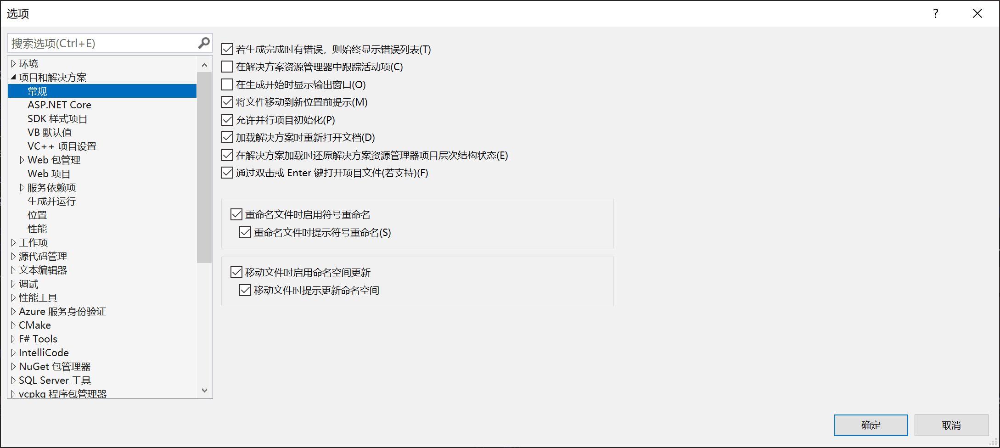
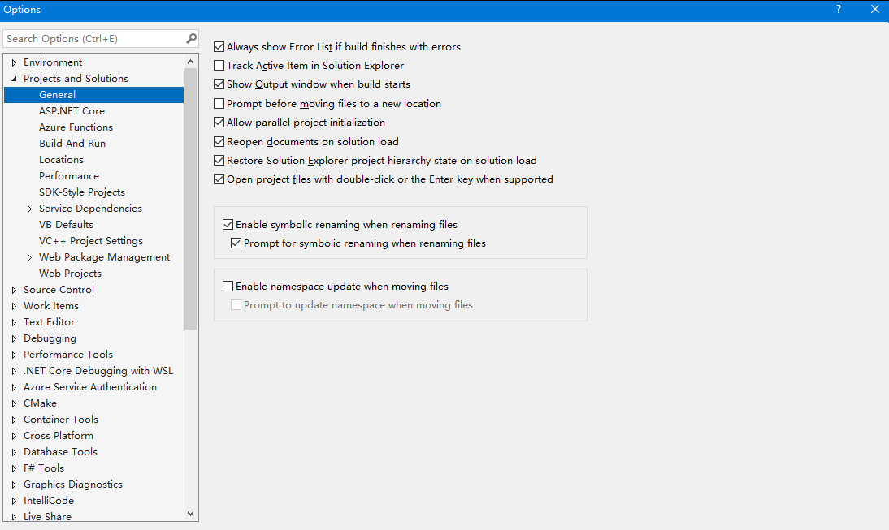

# VisualStudio 禁用移动文件到文件夹自动修改命名空间功能

在 VisualStudio 2022 里的某个版本开始，将会在移动文件到其他文件夹时，自动修改命名空间，使用匹配文件夹路径的命名空间。如果这个功能能顺手将其他引用此类型的全部符号同时变更，那自然是很好的功能，可惜没有，很多时候都只是修改了移动的文件里面的命名空间，没有更改其他相关引用的代码的逻辑，导致了移动一次文件需要重新将命名空间改回来修复构建，极大降低效率

<!--more-->

<!-- 发布 -->
<!-- 博客 -->

关闭此智能(zhang)的功能的方法是：进入 工具->选项 然后进入项目和解决方案选项卡里面的常规选项卡，去掉移动文件时启用命名空间更新选项即可。对应英文版本的是在 `Projects and Solutions`->`General` 的 `Enable namespace update when moving files` 选项

中文版：

<!--  -->

英文版：

<!--  -->

 本作品采用<a rel="license" href="http://creativecommons.org/licenses/by-nc-sa/4.0/">知识共享署名-非商业性使用-相同方式共享 4.0 国际许可协议</a>进行许可。欢迎转载、使用、重新发布，但务必保留文章署名[林德熙](http://blog.csdn.net/lindexi_gd)(包含链接:http://blog.csdn.net/lindexi_gd )，不得用于商业目的，基于本文修改后的作品务必以相同的许可发布。如有任何疑问，请与我[联系](mailto:lindexi_gd@163.com)。