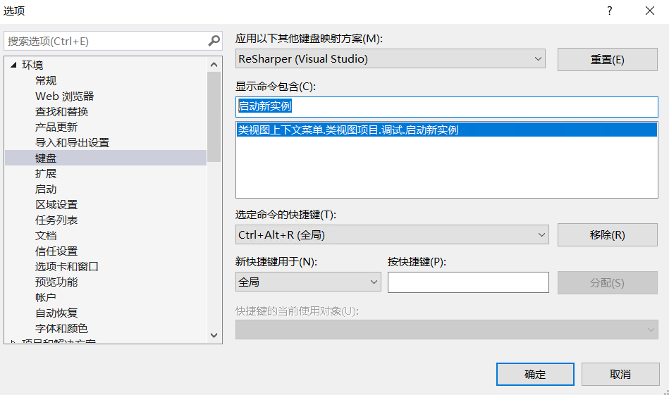

# VisualStudio 配置多进程调试快捷键启动项目

在使用 VisualStudio 进行多进程调试的时候，只有第一个设置为启动项目的进程可以通过按下 F5 进行调试，而其他的进程是需要在对应项目右击选择调试，点击启动新实例，这样的调试效率实在很低。本文告诉大家如何设置快捷键用来启动选中项目调试

<!--more-->

<!-- CreateTime:2019/10/11 15:33:32 -->

<!-- csdn -->
<!-- 标签：VisualStudio，调试 -->

如果只是单个启动项目，不使用多进程调试，可以使用 [VisualStudio 快速设置启动项目](https://blog.lindexi.com/post/VisualStudio-%E5%BF%AB%E9%80%9F%E8%AE%BE%E7%BD%AE%E5%90%AF%E5%8A%A8%E9%A1%B9%E7%9B%AE.html ) 方法快速设置某个项目作为启动项目

如果有多个项目，同时这些项目都是可以启动作为多进程调试的进程，在不进行配置的 VisualStudio 需要右击项目，选择调试，点击启动新实例，请看下图

<!--  -->

可以看到这样的调试效率实在很低，如果通过设置快捷键，选中项目然后按下快捷键启动项目，这样的调试效率比较高

点击工具-选项-键盘 在显示命令包含里面输入 启动新实例 如下图

<!--  -->

然后在按快捷键的输入里面点击一下，然后按下设置的快捷键，如我设置的是 `ctrl+alt+r` 也就是直接输入之后按下点击分配按钮

如果发现有其他命令占用了你的快捷键，那么请在显示命令包含里面输入对应的占用快捷键的命令，然后移除对应的快捷键分配

现在就可以在按下 F5 调试一个进程的时候，选择另一个项目按下快捷键启动调试

如果是英文版的 VisualStudio 在显示命令包含里面输入将 启动新实例 替换为输入 `StartNewInstance` 就可以

 本作品采用<a rel="license" href="http://creativecommons.org/licenses/by-nc-sa/4.0/">知识共享署名-非商业性使用-相同方式共享 4.0 国际许可协议</a>进行许可。欢迎转载、使用、重新发布，但务必保留文章署名[林德熙](http://blog.csdn.net/lindexi_gd)(包含链接:http://blog.csdn.net/lindexi_gd )，不得用于商业目的，基于本文修改后的作品务必以相同的许可发布。如有任何疑问，请与我[联系](mailto:lindexi_gd@163.com)。