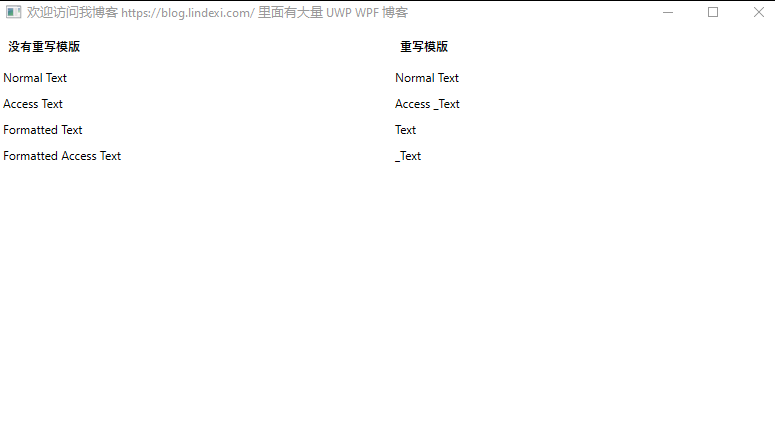

# WPF 为何不要重写默认 string 字符串的 DataTemplate 数据模版

在 WPF 中可以通过 DataTemplate 给任意的类型重写这个类型在界面显示的数据模版，我想要让小伙伴的界面都有相同的样式，此时我就尝试重写字符串的数据模版，但是我就踩到了一个坑

<!--more-->
<!-- CreateTime:4/10/2020 8:27:42 AM -->


重写默认样式的时候需要小心，我更多是建议小伙伴写样式，然后通过 Style 获取静态资源，而不是重写默认样式。补充一下细节，什么是默认样式？在 WPF 中，如果没有给对应的资源一个 Key 的值，那么将会做到某个指定类型的默认样式

将重写默认样式替换为重写默认数据模版也是相同的

对比下面两句代码就知道什么是默认数据模版

```xml
<!-- 下面是默认数据模版，对所有的字符串类型生效 -->
<DataTemplate DataType="{x:Type system:String}"><Grid/></DataTemplate>

<!-- 下面是数据模版静态资源，需要通过 key 获取 -->
<DataTemplate x:Key="DataTemplate" DataType="{x:Type system:String}"><Grid/></DataTemplate>
```

为什么说不要重写默认的字符串类型的数据模版？因为存在以下的坑，尝试添加下面的代码，运行代码就能看到下图效果

```xml
        <StackPanel>
            <StackPanel.Resources>
                <ResourceDictionary>
                    <DataTemplate DataType="{x:Type system:String}">
                        <TextBlock Text="{Binding}" />
                    </DataTemplate>
                </ResourceDictionary>
            </StackPanel.Resources>
            <TextBlock Margin="10,10,10,10" FontWeight="Bold" Text="重写模版" />
            <Label>Normal Text</Label>
            <Label>Access _Text</Label>
            <Label ContentStringFormat="Formatted {0}">Text</Label>
            <Label ContentStringFormat="Formatted Access {0}">_Text</Label>
        </StackPanel>
```

我在[代码](https://github.com/lindexi/lindexi_gd/tree/cd40375e63911a052d33a4d5160b4fbd4e103b85/BallkowhejallColalljaygairwair)中实际上是写了对比的两列，其中一列使用了默认数据模版，另一列没有，运行效果如下

<!--  -->


上面代码通过 `<DataTemplate DataType="{x:Type system:String}">` 的代码重写了默认的字符串样式，注意 `system:String` 在使用之前需要引用命名空间 `xmlns:system="clr-namespace:System;assembly=mscorlib"` 在 WPF 的资源定义里面，将会影响这个容器里面的所有元素。也就是这个容器里面的所有元素的默认的字符串的数据模版就是资源定义的内容，而这个定义会挖以下的坑

这个重写的数据模版将不会转换下划线的快捷键定义，在 WPF 中，在 Button 和 Label 等控件里面，如果在某个字符前面添加下划线，那么表示按下 alt 键的时候，对应的快捷键出发的元素，这是 Windows 的通用菜单快捷键定义。而重写的数据模版里面没有处理下划线转换快捷键，所以这个功能就没有了

在阅读 WPF 的开源的[代码](https://github.com/dotnet/wpf/blob/f033d043f3783d01b200456cadefc2d590eb5afc/src/Microsoft.DotNet.Wpf/src/PresentationFramework/System/Windows/Controls/ContentPresenter.cs#L886) 可以知道，在 WPF 中的 [ContentPresenter.cs](https://github.com/dotnet/wpf/blob/f033d043f3783d01b200456cadefc2d590eb5afc/src/Microsoft.DotNet.Wpf/src/PresentationFramework/System/Windows/Controls/ContentPresenter.cs#L886) 使用了 [AccessTextContentTemplate](https://github.com/dotnet/wpf/blob/f033d043f3783d01b200456cadefc2d590eb5afc/src/Microsoft.DotNet.Wpf/src/PresentationFramework/System/Windows/Controls/ContentPresenter.cs#L559) 和 [StringContentTemplate](https://github.com/dotnet/wpf/blob/f033d043f3783d01b200456cadefc2d590eb5afc/src/Microsoft.DotNet.Wpf/src/PresentationFramework/System/Windows/Controls/ContentPresenter.cs#L564) 和 [FormattingStringContentTemplate](https://github.com/dotnet/wpf/blob/f033d043f3783d01b200456cadefc2d590eb5afc/src/Microsoft.DotNet.Wpf/src/PresentationFramework/System/Windows/Controls/ContentPresenter.cs#L727) 等值用来处理不同的数据，重写数据模版将会干掉上面的功能

这也就是 ContentStringFormat 在重写字符串数据模版被干掉的原因

上面代码放在 [github](https://github.com/lindexi/lindexi_gd/tree/cd40375e63911a052d33a4d5160b4fbd4e103b85/BallkowhejallColalljaygairwair) 欢迎小伙伴访问

<a rel="license" href="http://creativecommons.org/licenses/by-nc-sa/4.0/"></a><br />本作品采用<a rel="license" href="http://creativecommons.org/licenses/by-nc-sa/4.0/">知识共享署名-非商业性使用-相同方式共享 4.0 国际许可协议</a>进行许可。欢迎转载、使用、重新发布，但务必保留文章署名[林德熙](http://blog.csdn.net/lindexi_gd)(包含链接:http://blog.csdn.net/lindexi_gd )，不得用于商业目的，基于本文修改后的作品务必以相同的许可发布。如有任何疑问，请与我[联系](mailto:lindexi_gd@163.com)。
