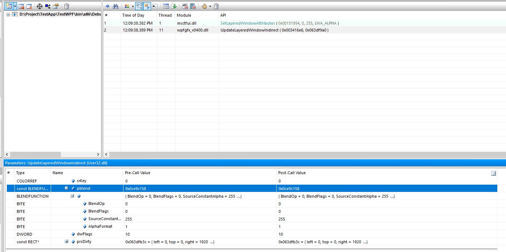

# WPF 从最底层源代码了解 AllowsTransparency 性能差的原因

当前的 WPF 的源代码完全开放，本文将从最底层的 WPF 代码告诉大家为什么设置了 AllowsTransparency 之后性能会变差，以及 WPF 透明的原理

<!--more-->
<!-- CreateTime:2020/10/30 19:28:50 -->

<!-- 标签：WPF，渲染,WPF源代码 -->


特别感谢 [少珺](https://blog.sdlsj.net/) 的研究，我只是将他告诉我的内容写出来，告诉大家

本文将会告诉大家 AllowsTransparency 设置为 true 之后，为什么整体渲染性能降低，将会占用更多 CPU 资源。以及在 4k 下使用更多内存的原因

本文代码基于 [WPF 官方开源仓库](https://github.com/dotnet/wpf/) 所了解，部分逻辑也许和 .NET Framework 不同版本有出入

在 WPF 的实现窗口透明逻辑中，可以在窗口设置 `AllowsTransparency = true` 让窗口设置透明笔刷的时候，可以看到窗口后面的内容。这个特性由 Windows 的底层 [UpdateLayeredWindow](https://docs.microsoft.com/en-us/windows/win32/api/winuser/nf-winuser-updatelayeredwindow?WT.mc_id=DX-MVP-5003606) 提供或 [UpdateLayeredWindowIndirect](https://docs.microsoft.com/en-us/previous-versions/windows/desktop/legacy/ms633557(v=vs.85)?WT.mc_id=DX-MVP-5003606) 提供

在 WPF 的窗口渲染底层的 WPF_GFX 库里面的入口是在 d3ddevice.cpp 的 Present 方法，方法签名如下

<!-- &WT.mc_id=DX-MVP-5003606 -->

```csharp
HRESULT
CD3DDeviceLevel1::Present(
    __in_ecount(1) CD3DSwapChain const *pD3DSwapChain,
    __in_ecount_opt(1) CMILSurfaceRect const *prcSource,
    __in_ecount_opt(1) CMILSurfaceRect const *prcDest,
    __in_ecount(1) CMILDeviceContext const *pMILDC,
    __in_ecount_opt(1) RGNDATA const * pDirtyRegion,
    DWORD dwD3DPresentFlags
    )


```

在这个方法里面的核心逻辑是通过 `pMILDC->PresentWithHAL()` 决定是否走 PresentWithD3D 还是走 PresentWithGDI 方法，如下面代码


```csharp
    if (pMILDC->PresentWithHAL())
    {
        PresentWithD3D(
            pD3DSwapChain->m_pD3DSwapChain,
            prcSource,
            prcDest,
            pMILDC,
            pDirtyRegion,
            dwD3DPresentFlags,
            &fPresentProcessed
            );
    }
    else
    {
        PresentWithGDI(
            pD3DSwapChain,
            prcSource,
            prcDest,
            pMILDC,
            pDirtyRegion,
            &fPresentProcessed
            );
    }
```

上面代码中的核心逻辑就是通过 PresentWithD3D 使用 D3D 的方法，或通过 PresentWithGDI 使用 GDI 的方法。有趣的是根据静态代码分析工具人 [少珺](https://blog.sdlsj.net/) 的研究，基本都是进入了 PresentWithGDI 方法，也就是实际上进行的是 GDI 渲染。以下代码是 PresentWithGDI 方法签名

```csharp
HRESULT
CD3DDeviceLevel1::PresentWithGDI(
    __in_ecount(1) CD3DSwapChain const *pD3DSwapChain,
    __in_ecount_opt(1) CMILSurfaceRect const * prcSource,
    __in_ecount_opt(1) CMILSurfaceRect const * prcDest,
    __in_ecount(1) CMILDeviceContext const * pMILDC,
    __in_ecount_opt(1) RGNDATA const * pDirtyRegion,
    __out_ecount(1) bool *pfPresentProcessed
    )
```

在这个函数里面的核心逻辑如下

```csharp
    HDC hdcBackBuffer = NULL;

    CD3DSurface *pBackBufferSurface = NULL;
    UINT uBufferWidth;
    UINT uBufferHeight;
    CMilRectU rcSource;

    IFC(pD3DSwapChain->GetBackBuffer(
        0,
        &pBackBufferSurface
        ));

    pBackBufferSurface->GetSurfaceSize(
        &uBufferWidth,
        &uBufferHeight
        );

    // 忽略代码，计算 rcSource 的值

    IFC(pD3DSwapChain->GetDC(
        0,
        rcSource,
        OUT &hdcBackBuffer
        ));

    if ((pMILDC->GetRTInitializationFlags() & MilRTInitialization::PresentUsingMask) == MilRTInitialization::PresentUsingUpdateLayeredWindow)
    {
        SIZE sz = { uBufferWidth, uBufferHeight };
        POINT ptSrc = { 0, 0 };
        HWND hWnd = pMILDC->GetHWND();

        hr = UpdateLayeredWindowEx(
            hWnd,
            NULL, // front buffer
            &pMILDC->GetPosition(),
            &sz,
            hdcBackBuffer,
            &ptSrc,
            pMILDC->GetColorKey(), // colorkey
            &pMILDC->GetBlendFunction(), // blendfunction
            pMILDC->GetULWFlags(), // flags
            prcSource
            );
       
    }
```

以上代码中的 IFC 只是一个宏而已，还请忽略。通过上面代码，就可以了解到为什么占用内存比较多的一个原因，那就是在内存中重新开辟了一段内存，内存的大小就是窗口的大小。因此可以回答本文的为什么在 4k 下将会占用更多的内存的问题，其实是需要在 4k 下进行全屏的窗口才会占用很多内存，因为在如上代码里面重新申请了一段内存，这个内存大小和窗口大小是关联的

在上面代码中申请的内存的用途是用来从 D3D 拷贝出来，用于后续做 GDI 渲染使用。实际的拷贝逻辑放在 `pD3DSwapChain->GetDC` 方法里面，通过这个方法获取了 hdcBackBuffer 对象。而这个方法的核心逻辑是放在 d3dswapchainwithswdc.cpp 类里面，代码大概如下

```csharp
//      Gets a DC that refers to a system memory bitmap.
//
//      The system memory bitmap is updated during this call. The dirty rect is
//      used to determine how much of it needs updating.
//

HRESULT
CD3DSwapChainWithSwDC::GetDC(
    /*__in_range(<, this->m_cBackBuffers)*/ UINT iBackBuffer,
    __in_ecount(1) const CMilRectU& rcDirty,
    __deref_out HDC *phdcBackBuffer
    ) const
{
    HRESULT hr = S_OK;

    ENTER_USE_CONTEXT_FOR_SCOPE(Device());

    Assert(iBackBuffer < m_cBackBuffers);

    D3DSURFACE_DESC const &surfDesc = m_rgBackBuffers[iBackBuffer]->Desc();

    UINT cbBufferInset =
          m_stride * rcDirty.top
        + D3DFormatSize(surfDesc.Format) * rcDirty.left;

    BYTE *pbBuffer = reinterpret_cast<BYTE*>(m_pBuffer) + cbBufferInset;

    IFC(m_rgBackBuffers[iBackBuffer]->ReadIntoSysMemBuffer(
        rcDirty,
        0,
        NULL,
        D3DFormatToPixelFormat(surfDesc.Format, TRUE),
        m_stride,
        DBG_ANALYSIS_PARAM_COMMA(m_cbBuffer - cbBufferInset)
        pbBuffer
        ));

    *phdcBackBuffer = m_hdcCopiedBackBuffer;

Cleanup:
    RRETURN(hr);
}
```

上面代码的核心逻辑是 ReadIntoSysMemBuffer 方法，从这里进行了内存的拷贝。这里也就能回答大家为什么会使用更多的 CPU 的原因了，此时存在了显存(这个说法不一定对)到内存的拷贝，进行一次 4k 的大图拷贝的效率还是很低的。当然了，对于没有显存的设备来说，依然也是需要 CPU 到 CPU 的拷贝

好在 WPF 还是加了一点优化的，只是拷贝 rcDirty 范围而已，这个变量的命名意思是 rect (rc) 矩形的 Dirty 需要重绘的范围

回到 `CD3DDeviceLevel1::PresentWithGDI` 方法，在拿到 hdcBackBuffer 之后，此时就可以使用 hdcBackBuffer 进行 GDI 渲染了。调用的核心方法是 UpdateLayeredWindowEx 方法。这里的 UpdateLayeredWindowEx 是放在 oscompat.cpp 文件里，这个代码是为了做系统兼容使用的，本质就是将会通过系统判断，调用 [UpdateLayeredWindow](https://docs.microsoft.com/en-us/windows/win32/api/winuser/nf-winuser-updatelayeredwindow?WT.mc_id=DX-MVP-5003606) 或 [UpdateLayeredWindowIndirect](https://docs.microsoft.com/en-us/previous-versions/windows/desktop/legacy/ms633557(v=vs.85)?WT.mc_id=DX-MVP-5003606) 方法，如下面代码

```csharp
//+----------------------------------------------------------------------------
//
//  Function:  UpdateLayeredWindowEx
//
//  Synopsis:  Call UpdateLayeredWindow or UpdateLayeredWindowIndirect as
//             required by parameters.  If UpdateLayeredWindowIndirect is
//             needed (ULW_EX_NORESIZE requested), but not available return
//             HRESULT_FROM_WIN32(ERROR_PROC_NOT_FOUND).  prcDirty is ignored
//             when UpdateLayeredWindowIndirect is not available.
//
//-----------------------------------------------------------------------------
HRESULT
UpdateLayeredWindowEx(
    __in HWND hWnd,
    __in_opt HDC hdcDst,
    __in_ecount_opt(1) CONST POINT *pptDst,
    __in_ecount_opt(1) CONST SIZE *psize,
    __in_opt HDC hdcSrc,
    __in_ecount_opt(1) CONST POINT *pptSrc,
    COLORREF crKey,
    __in_ecount_opt(1)CONST BLENDFUNCTION *pblend,
    DWORD dwFlags,
    __in_ecount_opt(1) CONST RECT *prcDirty
    )
```

而在 Windows 提供的 [UpdateLayeredWindow](https://docs.microsoft.com/en-us/windows/win32/api/winuser/nf-winuser-updatelayeredwindow?WT.mc_id=DX-MVP-5003606) 或 [UpdateLayeredWindowIndirect](https://docs.microsoft.com/en-us/previous-versions/windows/desktop/legacy/ms633557(v=vs.85)?WT.mc_id=DX-MVP-5003606) 方法将会支持传入 GDI 的绘图空间，根据给定的颜色设置透明。详细使用方法请看 [分层窗口UpdateLayeredWindowIndirect局部更新](https://www.cctry.com/thread-283521-1-1.html)

<!--  -->


也就是说整个 WPF 的 AllowsTransparency 设置透明的一个最底层核心逻辑就是调用 [UpdateLayeredWindow](https://docs.microsoft.com/en-us/windows/win32/api/winuser/nf-winuser-updatelayeredwindow?WT.mc_id=DX-MVP-5003606) 或 [UpdateLayeredWindowIndirect](https://docs.microsoft.com/en-us/previous-versions/windows/desktop/legacy/ms633557(v=vs.85)?WT.mc_id=DX-MVP-5003606) 方法实现

在调用过程中需要从 DX 将窗口渲染内容拷贝出来放在内存，然后使用 GDI 进行渲染。在拷贝内存过程中需要重新申请一段内存空间，将会在窗口比较大的时候占用更多的内存，同时拷贝需要使用更多的 CPU 计算。而通过 GDI 的再次渲染将会降低整个应用的渲染性能

说到这里，是否有方法可以提升性能？其实有的，详细请看 [WPF 制作高性能的透明背景异形窗口](https://blog.walterlv.com/post/wpf-transparent-window-without-allows-transparency.html)

当前的 WPF 在 [https://github.com/dotnet/wpf](https://github.com/dotnet/wpf) 完全开源，使用友好的 MIT 协议，意味着允许任何人任何组织和企业任意处置，包括使用，复制，修改，合并，发表，分发，再授权，或者销售。在仓库里面包含了完全的构建逻辑，只需要本地的网络足够好（因为需要下载一堆构建工具），即可进行本地构建

<a rel="license" href="http://creativecommons.org/licenses/by-nc-sa/4.0/"></a><br />本作品采用<a rel="license" href="http://creativecommons.org/licenses/by-nc-sa/4.0/">知识共享署名-非商业性使用-相同方式共享 4.0 国际许可协议</a>进行许可。欢迎转载、使用、重新发布，但务必保留文章署名[林德熙](http://blog.csdn.net/lindexi_gd)(包含链接:http://blog.csdn.net/lindexi_gd )，不得用于商业目的，基于本文修改后的作品务必以相同的许可发布。如有任何疑问，请与我[联系](mailto:lindexi_gd@163.com)。
