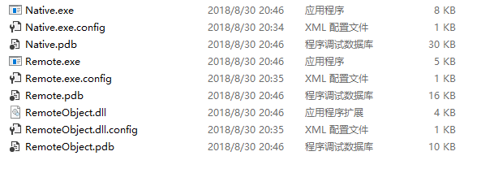
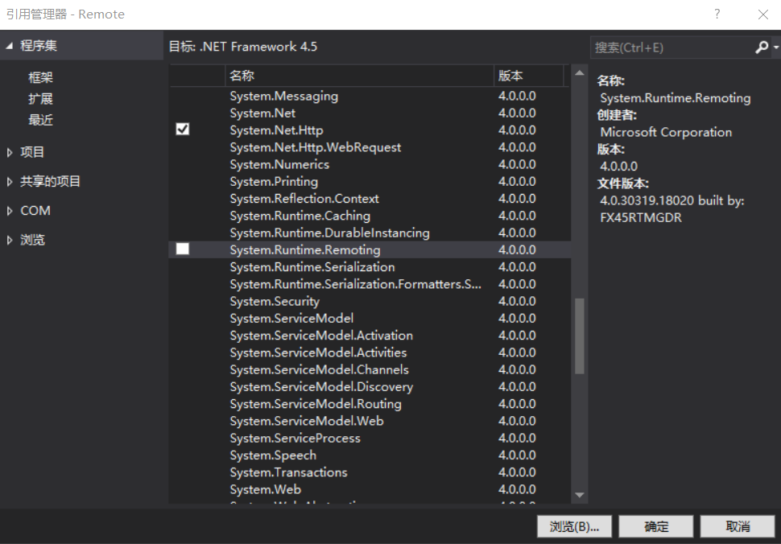
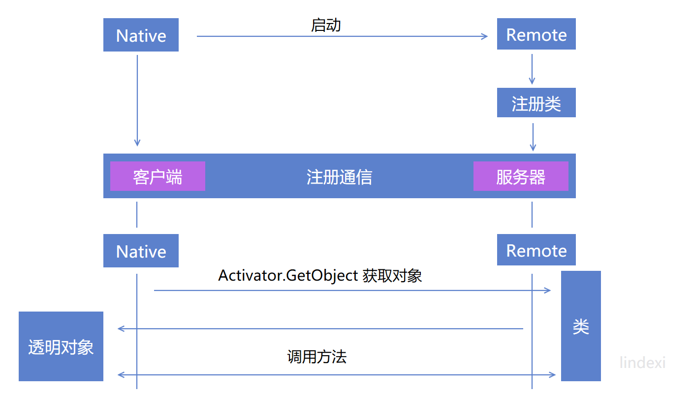

# WPF 从零开始开发 dotnet Remoting 程序

本文告诉大家如何不使用框架，从零开始开发一个 dotnet remoting 程序

<!--more-->
<!-- CreateTime:2019/3/1 9:30:45 -->


<div id="toc"></div>

在我的另一篇博客 [WPF 使用RPC调用其他进程](https://blog.csdn.net/lindexi_gd/article/details/80373135 ) 就大概告诉了大家如何在 WPF 使用 dotnet remoting 但是这篇博客是从大的方向告诉大家，所以本文就从代码上告诉大家如何写一个 dotnet remoting 做多进程框架。

首先需要创建几个项目，下面就是本文创建的项目

 - Native 

   WPF 程序

 - Remote 

   控制台项目

 - RemoteObject

   类库

## 引用项目

这里几个项目的应用关系是 Native 引用  Remote 和 RemoteObject 。在 Remote 项目引用 RemoteObject 项目。

这里的 Native 项目就是本地的 WPF 程序，而 Remote 控制台项目就是远程的进程，本文让 Native 作为主进程，让 Remote 进程做远程。

这里的 RemoteObject 就是放一些在 Native 和 Remote 都需要使用的类。

通过每个项目的用法就可以知道引用，因为我需要从 Native 启动 Remote ，在 VisualStudio 只要引用一个项目就可以让这个项目输出到项目所在的输出文件，所以就可以快速找到 Remote 进程。

现在尝试创建三个不同的项目，然后编译一下，这时就可以从 Native 的输出文件夹看到下面的文件

<!--  -->


<!-- v1.0.1 -->

## 启动软件

在 Native 启动 Remote 很简单，因为在相同的文件夹，所以使用下面的代码启动

因为 Remote 只是一个控制台项目，为了让用户可以看到 Remote 就需要在主函数添加一些代码

```csharp
        static void Main(string[] args)
        {
            Console.WriteLine("启动远程应用");

            while (true)
            {
                Console.Read();
            }
        }
```

然后在 Native 的主页面添加下面代码

```csharp
        public MainWindow()
        {
            InitializeComponent();

            var processStartInfo = new ProcessStartInfo(ProgressName);
            Process.Start(processStartInfo);
        }

        private const string ProgressName = "Remote.exe";
```

现在运行一下 Native 就可以看到 Remote 也运行

<!-- v1.0.2 -->

## 注册类

现在尝试在远程 Remote 注册一个类，然后在本地调用 Remote 的这个类

先创建一个类请看代码

```csharp
    [Serializable]
    public class Addition : MarshalByRefObject
    {
        public int Add(int a, int b)
        {
            return a + b;
        }
    }
```

这个类先放在 RemoteObject 这样就可以在 Native 和远程都知道这个类

注册一个类的方法有很多个，本文只告诉大家通过  RemotingServices.Marshal 的方式注册

因为在 Remote 的主函数是等待输入也就是这个线程是无法使用，所以需要新创建一个线程

```csharp
        static void Main(string[] args)
        {
            Console.WriteLine("启动远程应用");

            var thread = new Thread(() =>
            {
                var addition = new Addition();
                RemotingServices.Marshal(addition, "add");
            })
            {
                IsBackground = true,
            };

            thread.Start();

            while (true)
            {
                Console.Read();
            }
        }
```

现在就通过 RemotingServices.Marshal 注册了 Addition 类。

<!-- v1.0.3 -->

## 添加通道

为了让 Native 可以访问到 Remote 就需要 Remote 添加 Channel 让 Native 访问

在添加通道之前需要添加 .Net Remoting 的引用，右击三个项目添加引用，选择 `System.Runtime.Remoting` 和 `System.Runtime.Serialization` 第一个就是基础支持第二个是用来序列化

<!--  -->


使用下面的代码创建 TCPChannel 传入的参数就是端口

```csharp
        private static IChannel CreatChannel()
        {
            var tcpServerChannel = new TcpServerChannel(8086);
            return tcpServerChannel;
        }
```

在传入的时候需要本地不存在冲突端口，也就是现在的端口没有被其他程序使用

通过这个方法就可以创建，创建之后需要注册，使用 ChannelServices.RegisterChannel 方法就可以注册，这个方法第二个参数是要不要使用安全传输

```csharp
        static void Main(string[] args)
        {
            Console.WriteLine("启动远程应用");

            var thread = new Thread(() =>
            {
                var addition = new Addition();
                RemotingServices.Marshal(addition, "add");

                _channel = CreatChannel();
                ChannelServices.RegisterChannel(_channel, false);
            })
            {
                IsBackground = true,
            };

            thread.Start();

            while (true)
            {
                Console.Read();
            }
        }

        private static IChannel _channel;

        private static IChannel CreatChannel()
        {
            var tcpServerChannel = new TcpServerChannel(8086);
            return tcpServerChannel;
        }
```

现在就在 Remote 的准备完成了

在 Native 也需要注册通道才可以和 Remote 通信，在 Native 注册的 TCPChannel 是使用 TcpClientChannel 类，请看代码

```csharp
        public MainWindow()
        {
            InitializeComponent();

            var processStartInfo = new ProcessStartInfo(ProgressName);
            Process.Start(processStartInfo);

            var tcpClientChannel = new TcpClientChannel();
            ChannelServices.RegisterChannel(tcpClientChannel, false);

        }
```

现在就注册完成了，下面就是从 Native 调用远程的类

## 调用方法

在 Native 的界面添加一个按钮，在按钮按下的时候就触发 Remote 的类的函数

这里关于在 Native 的界面添加按钮和按钮事件本文就不说了，因为很简单。

在按钮按下的代码使用 `Activator.GetObject` 方法拿到远程的类

```csharp
        private void Button_OnClick(object sender, RoutedEventArgs e)
        {
            var addition = (Addition) Activator.GetObject(typeof(Addition), "tcp://localhost:8086/add");
            Debug.WriteLine(addition.Add(1, 2));
        }
```

这里通过 `8086` 端口拿到刚才注册的 Addition 类，需要重新告诉大家 Addition 是如何注册的

```csharp
                RemotingServices.Marshal(addition, "add");
```

在 RemotingServices 的 Marshal 第一个参数就是需要注册的类，第二个就是拿到这个类的链接

所以通过 `tcp://localhost:8086/add` 就可以拿到远程的类

现在点击按钮就可以看到输出 3 为了让大家知道是调用远程的方法，在 Addition 类添加输出

```csharp
        public int Add(int a, int b)
        {
            Console.WriteLine("   调用加法");
            return a + b;
        }
```

现在在 Native 按下按钮就可以看到 Native 的 VisualStudio 输出 3 同时 Remote 控制台输出 调用加法

上面就是最简单的使用 dotnet remoting 的例子，在接下来将会分为不同的细节来写很多篇博客。

先回忆一下，创建一个 .Net Remoting 需要经过哪些步骤

1. 让 Native 引用 Remote 这样就可以让 Native 启动 Remote

1. Remote 启动之后需要注册类，也就是给 Native 使用的类需要先注册

1. 为了让 Native 和 Remote 通信就需要注册通信

1. 通过 Activator.GetObject 拿到 Remote 的类返回透明代理

1. 在 Native 通过 透明代理调用 Remote 的方法

<!--  -->


在这个过程中几乎所有步骤都可以拿出来说

 - [使用事件](https://blog.lindexi.com/lindexi/post/.net-remoting-%E4%BD%BF%E7%94%A8%E4%BA%8B%E4%BB%B6.html )

 - [抛出异常](https://blog.csdn.net/lindexi_gd/article/details/82114730 )


如果不想了解太多细节，想快速使用，请看[WPF 封装 dotnet remoting 调用其他进程](https://blog.lindexi.com/post/WPF-%E5%B0%81%E8%A3%85-dotnet-remoting-%E8%B0%83%E7%94%A8%E5%85%B6%E4%BB%96%E8%BF%9B%E7%A8%8B.html )

参见：

[Microsoft .Net Remoting系列专题之三：Remoting事件处理全接触 - 张逸 - 博客园](https://www.cnblogs.com/wayfarer/articles/75213.html )

[Microsoft .Net Remoting系列专题之二：Marshal、Disconnect与生命周期以及跟踪服务 - 张逸 - 博客园](http://www.cnblogs.com/wayfarer/archive/2004/08/05/30437.html )

[In Depth .NET Remoting](http://www.diranieh.com/NETRemoting/InDepthRemoting.htm )

 Ingo Rammer，《Advanced .NET Remoting》

[.net remoting 抛出异常](https://blog.lindexi.com/lindexi/post/.net-remoting-%E6%8A%9B%E5%87%BA%E5%BC%82%E5%B8%B8.html )

《Professional C#》 第3版

[.NET Remoting程序开发入门篇-博客-云栖社区-阿里云](https://yq.aliyun.com/articles/365762 )

[.NET Remoting中的事件处理(.NET Framework 2.0)（一） - 大坏蛋 - 博客园](http://www.cnblogs.com/dahuaidan410/articles/31656.html )

[WPF 使用RPC调用其他进程](https://blog.csdn.net/lindexi_gd/article/details/80373135 ) 

<a rel="license" href="http://creativecommons.org/licenses/by-nc-sa/4.0/"></a><br />本作品采用<a rel="license" href="http://creativecommons.org/licenses/by-nc-sa/4.0/">知识共享署名-非商业性使用-相同方式共享 4.0 国际许可协议</a>进行许可。欢迎转载、使用、重新发布，但务必保留文章署名[林德熙](http://blog.csdn.net/lindexi_gd)(包含链接:http://blog.csdn.net/lindexi_gd )，不得用于商业目的，基于本文修改后的作品务必以相同的许可发布。如有任何疑问，请与我[联系](mailto:lindexi_gd@163.com)。

