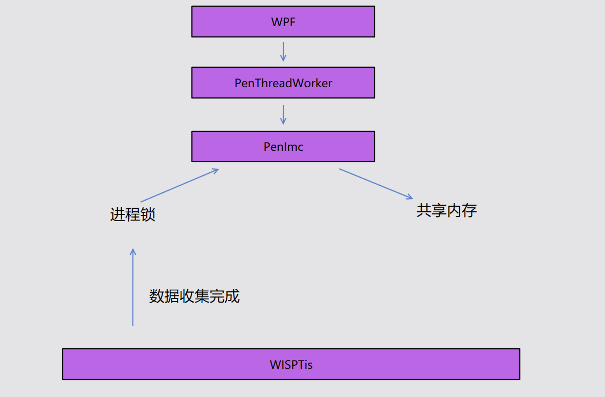
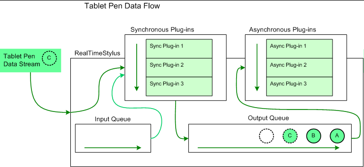
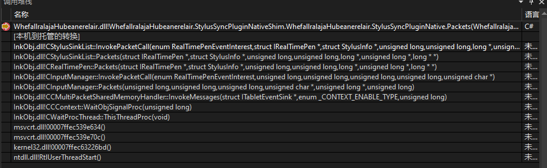
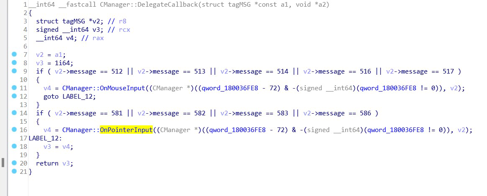

# WPF 从零自己实现从 RealTimeStylus 获取触摸信息

本文将告诉大家什么是 RealTimeStylus 以及如何从零开始不使用 WPF 框架提供的功能从 RealTimeStylus 获取到触摸信息

<!--more-->
<!-- CreateTime:2023/3/27 8:39:35 -->

<!-- 发布 -->
<!-- 博客 -->

开始之前先复习一下 Windows 的触摸演进。在上古 xp 时代，那会还没有约定好 `WM_Touch` 消息，但是那时就有了白板类应用笔迹书写的需求了。和鼠标的相对移动不相同的是，人类在触摸屏上进行书写的时候，如果书写的存在一点点延迟，大概是 50 毫秒以上，那么人类将可以明显感知到延迟。如果让每个软件开发厂商都和具体的硬件触摸厂商约定触摸需要传输的协议，自然是不靠谱的。而且也不见得每个软件厂商都能实现出比较高性能的触摸

在 XP 时代，就提出了 RealTimeStylus 实时触摸的概念。只不过那会还只是一个初始，因为那时许多触摸才起步，许多规范还没完全建立起来，或者说触摸框厂商还没学会触摸标准

在 win7 时代，引入了 `WM_Touch` 的概念，作为一个 Windows 消息，很难顶住 240Hz 以上的高刷触摸框，而且 Windows 消息本身会受到许多其他第三方应用的干扰以及业务本身的影响，导致了想要通过 `WM_Touch` 获取高性能的触摸数据，进而实现高性能书写是一个从原理上来说比较困难的事情。于是软的大佬们，又想起了 RealTimeStylus 实时触摸技术，继续完善 RealTimeStylus 机制。大概也就是从 Win7 开始，才是真正 RealTimeStylus 实时触摸强大起来的时候。因为在 XP 那会，还是有许许多多的应用都是靠私有 USB 或 HID 协议获取触摸点的，完全无法和 RealTimeStylus 对接，更不要说和 `WM_Touch` 对接

在 Win7 下，实时触摸是从一个名为 wisptis 的特殊进程，即 Windows Ink Services Platform Tablet Input Subsystem 进程进行分发的。通过微软的 Surface 触摸架构文档可以看到，这个 wisptis 特殊进程跑了一半是在内核态里面，一半在用户态里面。由于我在写这篇博客的时候，没有找出我之前看过的微软的 Surface 触摸架构文档，我怕误导大家，这里就还先跳过细节。只需要知道实时触摸是从 wisptis 的特殊进程过来的即可。这也就回答了 [为什么 WPF 软件在 win7 启动时会尝试调起 wisptis 进程](https://blog.lindexi.com/post/%E4%B8%BA%E4%BB%80%E4%B9%88-WPF-%E8%BD%AF%E4%BB%B6%E5%9C%A8-win7-%E5%90%AF%E5%8A%A8%E6%97%B6%E4%BC%9A%E5%B0%9D%E8%AF%95%E8%B0%83%E8%B5%B7-wisptis-%E8%BF%9B%E7%A8%8B.html) 这个问题

只不过 Win7 那会的触摸统一性也比较弱，在 Surface 触摸平板出来时，大家就遭遇了触摸问题。软软就推出了 Surface SDK 来拯救大家，更多请看 [Surface SDK 2.0 Targets Windows Touch Devices](https://www.infoq.com/news/2011/07/Surface-2/ )

在 Win10 下，这时整个触摸行业才算是完全统一了，大家都遵循标准触摸协议。软软也根据之前踩过的坑，重新设计了整个系统的触摸架构。同时野心很大的软软为了能够支持 VR 头盔等的视线输入等，将所有输入统一，引入了 `WM_Pointer` 概念。也就是无论是鼠标还是触摸，还是视线输入，都是 Pointer 消息

只不过 Pointer 消息也是一个 Windows 消息，依然也受到 Windows 消息的限制。这里需要特别说的是，快和慢是相对的，不能说 Windows 消息是高延迟的，也不能说 Windows 消息是慢的。仅仅只是在高性能笔迹书写的情况下，在妖魔的用户环境下，以及业务的成堆的诡异代码下，才会认为走 Windows 消息是不能做到低延迟的

这里也需要额外说一个题外话，那就是触摸的延迟不仅仅只是系统层也应用层说了算了，而是一个整体的问题，从硬件本身的设计开始到应用层每个模块都能影响。说到这里就需要提一下上古的，但是现在电竞依然还在采用的 PS/2 接口。对比采用轮询设备式运行的 USB 设备，采用系统中断的 PS/2 从原理层面来说能够实现更低的延迟，实际使用的反应更快。尽管 PS/2 接口的数据传输速度不能和 USB 打，但是从低时延方面上还是能够压过 USB 设备的。现在的大尺寸触摸屏幕行业上的触摸基本都是走 USB/HID 方式，也就是从此原理上来说延迟性就存在部分了。那是不是有人就要问了，让大尺寸触摸屏幕的触摸走 PS/2 是否可以？也许可以，但是你要做好了一条龙都需要自己实现的准备。但是在小尺寸的触摸屏上，早已有一些厂商采用 PS/2 接口方式。值得一提的是 PS/2 接口应该是不能传输触摸消息的，也就是这些触摸屏只能发鼠标消息

假设当前遇到的问题是一个大屏白板类软件的触摸延迟问题，然后再看到整体的硬件架构是触摸框将数据发送到安卓板卡，再由安卓转发到 PC 这边，而 PC 不是直接输出到屏幕，而是输出到安卓的一个应用，由安卓电视机方式输出到屏幕。而此过程里面，如果安卓处理触摸的延迟就是 50 毫秒。再加上屏幕输出要求是 4k 分辨率，给的 PC 的配置是 i3 5 代加 4 G 内存无独立显卡的。这时无论软件层使用哪个方式获取触摸消息都对大局没有影响，因为获取触摸消息的延迟在整体上的占比可以忽略。想要优化触摸的延迟到极致，仅软件来做是不够的，这是需要软件加硬件一起来的

在 Win10 改了触摸架构，但是我没有找到官方文档，同时也了解到 Win10 的 wisptis 是附加到进程的窗口，详细请看 [Win10 的 WPF 程序的 wisptis 服务是附加到进程的窗口](https://blog.lindexi.com/post/Win10-%E7%9A%84-WPF-%E7%A8%8B%E5%BA%8F%E7%9A%84-wisptis-%E6%9C%8D%E5%8A%A1%E6%98%AF%E9%99%84%E5%8A%A0%E5%88%B0%E8%BF%9B%E7%A8%8B%E7%9A%84%E7%AA%97%E5%8F%A3.html)

经过实际的测试发现在 Win10 依然还是可以通过 RealTimeStylus 获取低延迟的实时触摸。我拿到了大尺寸屏幕平蛙厂商的高精度触摸框进行实际测试发现走 RealTimeStylus 方式比 `WM_Touch` 和 `WM_Pointer` 的延迟更低，而 `WM_Touch` 比 `WM_Pointer` 的延迟稍微高一点，这个测试符合理论，我猜是对的。推荐大家自行进行测试，测试 `WM_Touch` 的 Demo 可以参阅 [WPF 编写一个测试 WM_TOUCH 触摸消息延迟的应用](https://blog.lindexi.com/post/WPF-%E7%BC%96%E5%86%99%E4%B8%80%E4%B8%AA%E6%B5%8B%E8%AF%95-WM_TOUCH-%E8%A7%A6%E6%91%B8%E6%B6%88%E6%81%AF%E5%BB%B6%E8%BF%9F%E7%9A%84%E5%BA%94%E7%94%A8.html ) 博客，测试 RealTimeStylus 的 Demo 可以参阅本文末尾给出的代码

在 WPF 框架里面，默认的触摸就是通过 WPF 的 PenImc 模块，从 RealTimeStylus 实时触摸里获取。在 WPF 里面选用 RealTimeStylus 实时触摸有两个原因，一个原因是为了更好的支持 XP 系统下的触摸，第二个是 WPF 内置了 InkCanvas 功能，默认就需要支持高性能笔迹书写。详细请看 [WPF 触摸底层 PenImc 是如何工作的](https://blog.lindexi.com/post/WPF-%E8%A7%A6%E6%91%B8%E5%BA%95%E5%B1%82-PenImc-%E6%98%AF%E5%A6%82%E4%BD%95%E5%B7%A5%E4%BD%9C%E7%9A%84.html)

为什么走 RealTimeStylus 实时触摸可以较低延迟获取到触摸信息？这是因为 RealTimeStylus 的触摸数据是由 wisptis 模块提供的（Win10下暂未确定）触摸数据，在每次触摸数据收集到时，将会释放进程锁让 RealTimeStylus 层读取共享内存里的触摸数据。也就是说从触摸进到 PC 到 RealTimeStylus 层获取，这个中间隔的中间商不多

<!--  -->


而 `WM_Touch` 和 `WM_Pointer` 走的是 Win32 消息机制，会受到许多第三方的干扰，再加上应用的主线程不一定能够及时处理消息。叠加上来的结果就是比 RealTimeStylus 实时触摸稍微慢一些。具体测试数据我放在本文末尾。但更推荐大家自行测试，预计不同的硬件设备和不同的系统下，会有一些差异

理论部分咱就先聊这里，接下来是开始从零写代码使用 RealTimeStylus 机制获取到触摸信息。通过此 Demo 不仅可以让大家了解这一套获取触摸的玩法，制作出来的 Demo 还可以让大家用来测试 RealTimeStylus 获取触摸时的延迟以及用来测试触摸失效的设备

新建一个基于 .NET 7 的 WPF 项目，新建完成之后，进入 App.xaml.cs 里将 WPF 自身的触摸模块关闭。如果没有关于 WPF 的触摸模块，那将会出现 RealTimeStylus 打架，导致自己写的 RealTimeStylus 对接代码无法工作

```csharp
        public App()
        {
            AppContext.SetSwitch("Switch.System.Windows.Input.Stylus.DisableStylusAndTouchSupport", true);
        }
```

通过设置 `Switch.System.Windows.Input.Stylus.DisableStylusAndTouchSupport` 即可禁用 WPF 的触摸模块，详细请参阅 [WPF 禁用实时触摸](https://blog.lindexi.com/post/WPF-%E7%A6%81%E7%94%A8%E5%AE%9E%E6%97%B6%E8%A7%A6%E6%91%B8.html )

接下来就是一大堆无聊的 COM 对接类型定义了，本文这里只给出其中核心的关键代码，在本文末尾可以找到所有代码的下载方法

最核心的 COM 接口就是 IRealTimeStylus 接口了，这是我在 Microsoft.Ink 程序集里面抄的。有删减的代码如下

```csharp
[Guid("C6C77F97-545E-4873-85F2-E0FEE550B2E9")]
[SuppressUnmanagedCodeSecurity]
[InterfaceType(ComInterfaceType.InterfaceIsIUnknown)]
internal interface IRealTimeStylus
{
    void Enable([MarshalAs(UnmanagedType.Bool), In] bool fEnable);

    void GetHWND(out IntPtr hWnd);

    void SetHWND([In] IntPtr hWnd);

    void AddStylusSyncPlugin([In] uint iIndex, [In] IntPtr RtpSink);

    void AddStylusAsyncPlugin([In] uint iIndex, [In] IntPtr RtpQueueSink);

    void GetWindowInputRect([MarshalAs(UnmanagedType.Struct)] out PenImcRect prcWndInputRect);

    void SetWindowInputRect([MarshalAs(UnmanagedType.Struct), In] ref PenImcRect prcWndInputRect);

    void MultiTouchEnable([MarshalAs(UnmanagedType.Bool), In] bool fEnable);
}
```

按照[官方文档](https://learn.microsoft.com/en-us/windows/win32/tablet/working-with-the-realtimestylus-class)提供的信息可以了解到，这个 C6C77F97-545E-4873-85F2-E0FEE550B2E9 的 IRealTimeStylus 接口是属于一个入口 API 接口，想要获取触摸消息，还需要更进一层的 IStylusPlugin 才能接收

<!--  -->


按照[官方文档](https://learn.microsoft.com/en-us/windows/win32/api/rtscom/nn-rtscom-irealtimestylus)如下的建议是更加推荐使用异步的接口，而不是同步的接口。但是由于异步的接口实现相对复杂一点点，本文使用同步的接口作为例子

> We recommend that you do not use the IStylusSyncPlugin interface implementations for CPU and time-intensive operations since this blocks the packet stream flow. These operations should be conducted in IStylusAsyncPlugin interface implementation classes which run on a different thread than the thread that maintains the packet stream flow.

走同步的 IStylusPlugin 接口获取触摸消息的思路是创建出 IStylusPlugin 然后调用 AddStylusSyncPlugin 方法插入到 IRealTimeStylus 插槽里面，如此在 RealTimeStylus 层收到触摸消息后，将会如[官方文档](https://learn.microsoft.com/en-us/windows/win32/tablet/working-with-the-realtimestylus-class)给出的上图描述，将触摸数据给到 IStylusPlugin 里

根据以上思路，第一步就是需要将 IRealTimeStylus 给获取或创建出来。本文这是是将其创建出来，创建出来时需要由于这个 COM 接口是需要传入 License 的，需要用到另一个 [IClassFactory2](https://learn.microsoft.com/en-us/windows/win32/api/ocidl/nn-ocidl-iclassfactory2) 接口用来辅助创建

先定义和创建 [IClassFactory2](https://learn.microsoft.com/en-us/windows/win32/api/ocidl/nn-ocidl-iclassfactory2) 接口

```csharp
[SuppressUnmanagedCodeSecurity]
internal static class UnsafeNativeMethods
{
    [DllImport("Ole32.dll", PreserveSig = false)]
    public static extern UnsafeNativeMethods.IClassFactory2 CoGetClassObject(
        ref Guid clsid,
        uint dwClsContext,
        IntPtr serverInfo,
        ref Guid iid);    

    [Guid("B196B28F-BAB4-101A-B69C-00AA00341D07")]
    [InterfaceType(ComInterfaceType.InterfaceIsIUnknown)]
    [SuppressUnmanagedCodeSecurity]
    [ComImport]
    internal interface IClassFactory2
    {
        void CreateInstance([In] IntPtr pUnkOuter, [In] ref Guid riid, [MarshalAs(UnmanagedType.IUnknown)] out object ppvObj);

        void LockServer([MarshalAs(UnmanagedType.Bool), In] bool fLock);

        void GetLicInfo(out IntPtr pLicInfo);

        void RequestLic([In] int dwReserved, [MarshalAs(UnmanagedType.BStr)] out string pBstrKey);

        void CreateInstanceLic(
            [In] IntPtr pUnkOuter,
            [In] IntPtr pUnkReserved,
            [In] ref Guid riid,
            [MarshalAs(UnmanagedType.BStr), In] string bstrKey,
            [MarshalAs(UnmanagedType.IUnknown)] out object ppvObj);
    }
}

            Guid clsid = new Guid("{DECBDC16-E824-436e-872D-14E8C7BF7D8B}");

            Guid guid = typeof(UnsafeNativeMethods.IClassFactory2).GUID;
            var classFactory2 = UnsafeNativeMethods.CoGetClassObject(ref clsid, 1U, IntPtr.Zero, ref guid);
```

接下来使用 IClassFactory2 创建出 IRealTimeStylus 接口，代码如下

```csharp
            Guid iid = new Guid("{C6C77F97-545E-4873-85F2-E0FEE550B2E9}");
            string licenseKey = "{CAAD7274-4004-44e0-8A17-D6F1919C443A}";

            classFactory2.CreateInstanceLic(IntPtr.Zero, IntPtr.Zero, ref iid, licenseKey, out var ppvObj);

            var realTimeStylus = (IRealTimeStylus) ppvObj;
```

如此即可拿到 IRealTimeStylus 接口

拿到 IRealTimeStylus 接口之后，想要让 RealTimeStylus 工作起来，需要做一些初始化配置，例如设置窗口的 HWND 以及调用 Enable 接口设置可用等，如以下代码

```csharp
            _nativeIRealTimeStylus = realTimeStylus；

            var windowInteropHelper = new WindowInteropHelper(this);
            var handle = windowInteropHelper.Handle;

            // 设置窗口，如此即可获取到窗口级的实时触摸数据
            _nativeIRealTimeStylus.SetHWND(handle);

            // 设置 RealTimeStylus 除了触摸消息外可以接收到鼠标消息
            // 但是即使设置为 true 也不代表可以同时收到触摸和鼠标消息
            // 默认下一旦有触摸消息将自动无视鼠标消息
            var useMouseForInput = true;
            _nativeIRealTimeStylus.SetAllTabletsMode(useMouseForInput);

            // 开启多点触摸，默认是单点触摸
            _nativeIRealTimeStylus.MultiTouchEnable(true);
            _nativeIRealTimeStylus.Enable(true);
```

接下来就是创建 IStylusSyncPlugin 插入到插槽里面。想要创建 IStylusSyncPlugin 接口，需要在 C# 层对其进行实现，这样即可让实现接口的方法被 COM 层外部服务调用

先看看有删减的 IStylusPluginNative 也就是 IStylusPlugin 接口定义代码

```csharp
// 这个代码是跑不起来的，因为被我删减了
[InterfaceType(ComInterfaceType.InterfaceIsIUnknown)]
[SuppressUnmanagedCodeSecurity]
[Guid("3A2CCD76-AFB5-41b9-A9E3-FC02BF5C4299")]
[ComImport]
internal interface IStylusPluginNative
{
   
}

[Guid("380D13B0-1992-49ea-9D80-32F3AF851132")]
[SuppressUnmanagedCodeSecurity]
[InterfaceType(ComInterfaceType.InterfaceIsIUnknown)]
[ComImport]
internal interface IStylusSyncPluginNative2 : IStylusPluginNative
{
    new void RtpEnabled([MarshalAs(UnmanagedType.Interface), In] IRealTimeStylus realTime, [In] uint cTcidCount, [MarshalAs(UnmanagedType.LPArray, SizeParamIndex = 1), In] uint[] tcidArray);

    new void RtpDisabled([MarshalAs(UnmanagedType.Interface), In] IRealTimeStylus realTime, [In] uint cTcidCount, [MarshalAs(UnmanagedType.LPArray, SizeParamIndex = 1), In] uint[] tcidArray);

    new void CursorNew([MarshalAs(UnmanagedType.Interface), In] IRealTimeStylus realTime, [In] uint tcid, [In] uint cid);

    new void CursorInRange([MarshalAs(UnmanagedType.Interface), In] IRealTimeStylus realTime, [In] uint tcid, [In] uint cid);

    new void CursorOutOfRange([MarshalAs(UnmanagedType.Interface), In] IRealTimeStylus realTime, [In] uint tcid, [In] uint cid);

    new void CursorDown(
        [MarshalAs(UnmanagedType.Interface), In] IRealTimeStylus realTime,
        [MarshalAs(UnmanagedType.LPStruct), In] StylusInfo stylusInfo,
        [In] uint propCountPerPkt,
        [MarshalAs(UnmanagedType.LPArray, SizeParamIndex = 2), In] int[] pktArray,
        [In, Out] ref IntPtr inOutPkt);

    new void CursorUp(
        [MarshalAs(UnmanagedType.Interface), In] IRealTimeStylus realTime,
        [MarshalAs(UnmanagedType.LPStruct), In] StylusInfo stylusInfo,
        [In] uint propCountPerPkt,
        [MarshalAs(UnmanagedType.LPArray, SizeParamIndex = 2), In] int[] pktArray,
        [In, Out] ref IntPtr inOutPkt);

    new void InAirPackets(
        [MarshalAs(UnmanagedType.Interface), In] IRealTimeStylus realTime,
        [MarshalAs(UnmanagedType.LPStruct), In] StylusInfo stylusInfo,
        [In] uint pktCount,
        [In] uint cPktBuffLength,
        [MarshalAs(UnmanagedType.LPArray, SizeParamIndex = 3), In] int[] pktArray,
        [In, Out] ref uint cInOutPkts,
        [In, Out] ref IntPtr inOutPkts);

    new void Packets(
        [MarshalAs(UnmanagedType.Interface), In] IRealTimeStylus realTime,
        [MarshalAs(UnmanagedType.LPStruct), In] StylusInfo stylusInfo,
        [In] uint pktCount,
        [In] uint cPktBuffLength,
        [MarshalAs(UnmanagedType.LPArray, SizeParamIndex = 3), In] int[] pktArray,
        [In, Out] ref uint cInOutPkts,
        [In, Out] ref IntPtr inOutPkts);

    new void StylusButtonUp(
        [MarshalAs(UnmanagedType.Interface), In] IRealTimeStylus realTime,
        [In] uint cid,
        [MarshalAs(UnmanagedType.LPStruct), In] Guid stylusButtonGuid,
        [In, Out] ref IntPtr pStylusPos);

    new void StylusButtonDown(
        [MarshalAs(UnmanagedType.Interface), In] IRealTimeStylus realTime,
        [In] uint cid,
        [MarshalAs(UnmanagedType.LPStruct), In] Guid stylusButtonGuid,
        [In, Out] ref IntPtr pStylusPos);

    new void SystemEvent(
        [MarshalAs(UnmanagedType.Interface), In] IRealTimeStylus realTime,
        [In] uint tcid,
        [In] uint cid,
        [In] ushort systemEvent,
        [MarshalAs(UnmanagedType.Struct), In] SystemEventData eventData);

    new void TabletAdded([MarshalAs(UnmanagedType.Interface), In] IRealTimeStylus realTime, [MarshalAs(UnmanagedType.Interface), In] IInkTablet tablet);

    new void TabletRemoved([MarshalAs(UnmanagedType.Interface), In] IRealTimeStylus realTime, [In] int iTabletIndex);

    new void CustomData([MarshalAs(UnmanagedType.Interface), In] IRealTimeStylus realTime, [MarshalAs(UnmanagedType.LPStruct), In] Guid guidId, [In] uint cbData, [In] IntPtr data);

    new void Error(
        [MarshalAs(UnmanagedType.Interface), In] IRealTimeStylus realTime,
        [In] IntPtr piEventSink,
        [In] RealTimeStylusDataInterest rtpei,
        [In] int hrErrorCode,
        [In, Out] ref IntPtr lptrKey);

    new void GetDataInterest(out RealTimeStylusDataInterest dataInterest);
}
```

实现的代码如下，这里只是做测试而已，没有真的获取这些触摸数据去干什么，仅仅只是输出到一个 TextBlock 在界面显示而已

```csharp
internal sealed class StylusSyncPluginNativeShim : IStylusSyncPluginNative2, IStylusPluginNative
{
    void IStylusPluginNative2.RtpEnabled(IRealTimeStylus realTime, uint cTcidCount, uint[] tcidArray)
    {
        LogMethod();
    }

    void IStylusSyncPluginNative2.RtpDisabled(IRealTimeStylus realTime, uint cTcidCount, uint[] tcidArray)
    {
        LogMethod();
    }

    void IStylusSyncPluginNative2.CursorNew(IRealTimeStylus realTime, uint tcid, uint cid)
    {
        LogMethod();
    }

    void IStylusSyncPluginNative2.CursorInRange(IRealTimeStylus realTime, uint tcid, uint cid)
    {
        LogMethod();
    }

    void IStylusSyncPluginNative2.CursorOutOfRange(IRealTimeStylus realTime, uint tcid, uint cid)
    {
        LogMethod();
    }

    void IStylusSyncPluginNative2.CursorDown(IRealTimeStylus realTime, StylusInfo stylusInfo, uint propCountPerPkt, int[] pktArray,
        ref nint InOutPkt)
    {
        LogMethod();
    }

    void IStylusSyncPluginNative2.CursorUp(IRealTimeStylus realTime, StylusInfo stylusInfo, uint propCountPerPkt, int[] pktArray,
        ref nint InOutPkt)
    {
        LogMethod();
    }

    void IStylusSyncPluginNative2.InAirPackets(IRealTimeStylus realTime, StylusInfo stylusInfo, uint pktCount, uint cPktBuffLength,
        int[] pktArray, ref uint cInOutPkts, ref nint InOutPkts)
    {
        LogMethod();
    }

    void IStylusSyncPluginNative2.Packets(IRealTimeStylus realTime, StylusInfo stylusInfo, uint pktCount, uint cPktBuffLength, int[] pktArray,
        ref uint cInOutPkts, ref nint InOutPkts)
    {
        // 这里将会进入
        var packetPropertyCount = (int) (cPktBuffLength / pktCount);
        var packetData = pktArray;

        var stringBuilder = new StringBuilder();

        stringBuilder.AppendLine($"--------- {stylusInfo.cid} {stylusInfo.tcid}");
        for (int i = 0; i < packetPropertyCount; i++)
        {
            stringBuilder.AppendLine($"[{i}]{packetData[i]}");
        }
        stringBuilder.AppendLine("---------");
        stringBuilder.AppendLine();

        Log(stringBuilder.ToString());
    }

    private void LogMethod([CallerMemberName] string name = null!)
    {
        Log(name + "\r\n");
    }

    private void Log(string message)
    {
        MainWindow.TextBlock.Dispatcher.InvokeAsync(() =>
        {
            MainWindow.TextBlock.Text += message;

            if (MainWindow.TextBlock.Text.Length > 10000)
            {
                MainWindow.TextBlock.Text = MainWindow.TextBlock.Text.Substring(5000);
            }
        });
    }
}
```

运行代码，触摸一下窗口，即可在窗口里看到从 `Packets` 里接收到的数据。大家可以通过此 Demo 来测试触摸延迟以及测试触摸失效问题

在 Packets 里打上断点，在 VisualStudio 里开启本机调试，即可通过调用堆栈了解到触摸数据是从哪里来的。我这里在 Win11 设备上进行调试，看到的调用堆栈如下

<!--  -->


```
    WhefallralajaHubeanerelair.dll!WhefallralajaHubeanerelair.StylusSyncPluginNativeShim.WhefallralajaHubeanerelair.StylusSyncPluginNative.Packets(WhefallralajaHubeanerelair.IRealTimeStylusNative realTime, WhefallralajaHubeanerelair.StylusInfo stylusInfo, uint pktCount, uint cPktBuffLength, int[] pktArray, ref uint cInOutPkts, ref nint InOutPkts)
    [本机到托管的转换]  
    InkObj.dll!CStylusSinkList::InvokePacketCall(enum RealTimePenEventInterest,struct IRealTimePen *,struct StylusInfo *,unsigned long,unsigned long,long *,unsigned long *,long * *)
    InkObj.dll!CStylusSinkList::Packets(struct IRealTimePen *,struct StylusInfo *,unsigned long,unsigned long,long *,unsigned long *,long * *)
    InkObj.dll!CRealTimePen::Packets(struct IRealTimePen *,struct StylusInfo *,unsigned long,unsigned long,long *,unsigned long *,long * *)
    InkObj.dll!CInputManager::InvokePacketCall(enum RealTimePenEventInterest,unsigned long,unsigned long,unsigned long,unsigned long,unsigned char *)
    InkObj.dll!CInputManager::Packets(unsigned long,unsigned long,unsigned long,unsigned char *,unsigned long *,unsigned long)
    InkObj.dll!CCMultiPacketSharedMemoryHandler::InvokeMessages(struct ITabletEventSink *,enum _CONTEXT_ENABLE_TYPE,unsigned long)
    InkObj.dll!CCContext::WaitObjSignalProc(unsigned long)
    InkObj.dll!CWaitProcThread::ThisThreadProc(void)
    msvcrt.dll!00007ffec539e634()
    msvcrt.dll!00007ffec539e70c()
    kernel32.dll!00007ffec63226bd()
    ntdll.dll!RtlUserThreadStart()
```

从以上调用堆栈可以看到，触摸数据底层是通过 `C:\Program Files\Common Files\microsoft shared\ink\InkObj.dll` 获取的。通过 InkObj 的调用堆栈也能够证明文档里面说的触摸获取方式是通过等待一个进程锁，在进程锁释放的时候读取共享内存的数据，从而获取到触摸数据。但是这也是一个坏消息，这就意味着咱是不知道系统层是在哪处理的触摸消息，只能知道在某个系统模块上处理了硬件发过来的触摸消息，然后写入到一段共享内存里面，接着释放 InkObj 里面的锁，让 InkObj 可以读取共享内存里的数据。而具体是哪个系统模块，这就不知道了。这样也就无法了解到从硬件触摸数据进入 PC 到 InkObj 接收到触摸消息中间经过了哪些层

但是在实际运行 WPF 应用的时候，大家会发现 WPF 空应用是没有加载 InkObj 组件的。这就有趣了，其实只是因为 WPF 用到了更有趣的接口而已。在 [WPF 触摸底层 PenImc 是如何工作的](https://blog.lindexi.com/post/WPF-%E8%A7%A6%E6%91%B8%E5%BA%95%E5%B1%82-PenImc-%E6%98%AF%E5%A6%82%E4%BD%95%E5%B7%A5%E4%BD%9C%E7%9A%84.html ) 博客里面记录了在 Win32 层，开了一些后门给 WPF 使用，详细请看 [COM API Used by Windows Presentation Foundation - Win32 apps Microsoft Learn](https://learn.microsoft.com/en-us/windows/win32/tablet/com-apis-used-by-windows-presentation-foundation ) 文档

另外在 WPF 源代码里面也提到了，在 PenImc 层也拷贝了 InkObj 的一些代码

```c++
void CPimcManager::LoadWisptis()
{
    // 删除一些代码

        // **********
        // NOTE:    PenIMC has duplicated the code for loading wisptis from InkObj.
        //          Whenever WIC team makes any changes, we should coordinate with them to work on fixes.
        // **********
}
```

本文代码放在[github](https://github.com/lindexi/lindexi_gd/tree/f9b86511284baf14b5579146736c121b6b571200/WhefallralajaHubeanerelair) 和 [gitee](https://gitee.com/lindexi/lindexi_gd/tree/f9b86511284baf14b5579146736c121b6b571200/WhefallralajaHubeanerelair) 欢迎访问

可以通过如下方式获取本文以上的源代码，先创建一个名为 WhefallralajaHubeanerelair 的空文件夹，接着使用命令行 cd 命令进入此空文件夹，在命令行里面输入以下代码，即可获取到本文的代码

```
git init
git remote add origin https://gitee.com/lindexi/lindexi_gd.git
git pull origin f9b86511284baf14b5579146736c121b6b571200
```

以上使用的是 gitee 的源，如果 gitee 不能访问，请替换为 github 的源。请在命令行继续输入以下代码

```
git remote remove origin
git remote add origin https://github.com/lindexi/lindexi_gd.git
git pull origin f9b86511284baf14b5579146736c121b6b571200
```

获取代码之后，进入 WhefallralajaHubeanerelair 文件夹

更多行为细节如下

开启 RealTimeStylus 之后，将不能从窗口消息里面收到 `WM_Pointer` 或 `WM_Touch` 消息

开启 `SetAllTabletsMode` 设置 `useMouseForInput` 参数为 true 即可接收鼠标消息。但是鼠标和触摸同时接收到的时候，只会收到触摸消息，将不会收到鼠标消息。这一点行为和 WM_Pointer 不相同

多个 RealTimeStylus 之间的 Enable 是互斥的，也就是自己代码开启之后，将会干扰 WPF 底层的，或者反过来被 WPF 的干扰。具体行为大概就是窗口失焦之后回来，会丢失触摸。或者是开启之后 WPF 接收不到 Touch 事件

在 WPF 里面，在不开启 Pointer 消息的前提下，将需要使用 Wisp.dll 组件作为触摸获取的底层，不需要用到 InkObj.dll 组件。但是本文的 Demo 是通过 InkObj.dll 组件作为触摸获取的底层。稍微有一些不相同

在 WPF 里面，接收触摸消息的底层调度是通过消息，但是此消息不等于消息队列的消息，而是从更底层过来的。如此可以减少走消息队列的损耗，且不在主线程调度

以下是反编译的代码，感谢 [lsj](https://blog.sdlsj.net) 大佬提供

<!--  -->


以上的 581 和 582 等就是对应的 `WM_Pointer` 消息号。只不过再底层是从哪里调过来的，就不知道了

根据上文内容，我编写了通过 `WM_Touch` 和 `WM_Pointer` 和 RealTimeStylus 获取触摸消息的延迟测试 Demo 代码

使用 RealTimeStylus 获取触摸消息的触摸延迟测试的 Demo 代码放在[github](https://github.com/lindexi/lindexi_gd/tree/a68cc7e9f101465b0f63c6398b9fc8e29684f17e/WhefallralajaHubeanerelair) 和 [gitee](https://gitee.com/lindexi/lindexi_gd/tree/a68cc7e9f101465b0f63c6398b9fc8e29684f17e/WhefallralajaHubeanerelair) 欢迎访问

可以通过如下方式获取源代码，先创建一个名为 WhefallralajaHubeanerelair 的空文件夹，接着使用命令行 cd 命令进入此空文件夹，在命令行里面输入以下代码，即可获取到本文的代码

```
git init
git remote add origin https://gitee.com/lindexi/lindexi_gd.git
git pull origin a68cc7e9f101465b0f63c6398b9fc8e29684f17e
```

以上使用的是 gitee 的源，如果 gitee 不能访问，请替换为 github 的源。请在命令行继续输入以下代码

```
git remote remove origin
git remote add origin https://github.com/lindexi/lindexi_gd.git
git pull origin a68cc7e9f101465b0f63c6398b9fc8e29684f17e
```

获取代码之后，进入 WhefallralajaHubeanerelair 文件夹

或者是在之前获取代码的 WhefallralajaHubeanerelair 文件夹基础上，使用 git 命令行输入以下代码更新

```
git pull origin a68cc7e9f101465b0f63c6398b9fc8e29684f17e
```

以上的触摸延迟测试的 Demo 的准确度一般，如果追求更加准确的结果，还请自行优化代码

可以将此和 `WM_Pointer` 消息的延迟对比，测试的 Demo 代码放在[github](https://github.com/lindexi/lindexi_gd/tree/7fac4c5bfbaa0c943a0924996fc85af1ec7376e6/HaijakifeFarwheekike) 和 [gitee](https://gitee.com/lindexi/lindexi_gd/tree/7fac4c5bfbaa0c943a0924996fc85af1ec7376e6/HaijakifeFarwheekike) 欢迎访问

可以通过如下方式获取源代码，先创建一个名为 HaijakifeFarwheekike 的空文件夹，接着使用命令行 cd 命令进入此空文件夹，在命令行里面输入以下代码，即可获取到本文的代码

```
git init
git remote add origin https://gitee.com/lindexi/lindexi_gd.git
git pull origin 7fac4c5bfbaa0c943a0924996fc85af1ec7376e6
```

以上使用的是 gitee 的源，如果 gitee 不能访问，请替换为 github 的源。请在命令行继续输入以下代码

```
git remote remove origin
git remote add origin https://github.com/lindexi/lindexi_gd.git
git pull origin 7fac4c5bfbaa0c943a0924996fc85af1ec7376e6
```

获取代码之后，进入 HaijakifeFarwheekike 文件夹

对比多个方式获取触摸消息的延迟，在不同的设备有不同的结果，我的测试结果大概如下

在大尺寸屏幕平蛙厂商的高精度触摸框，测试的延迟大概如下

`WM_Touch`: 12ms

RealTimeStylus: 5ms 准确来说是 4.6 左右

WM_Pointer: 6ms

以上都是采用 Demo 测试，在实际项目里面，会因为业务导致主线程繁忙，从而让 RealTimeStylus 能拉开更大的差距

更多触摸相关请看 [WPF 触摸相关](https://blog.lindexi.com/post/WPF-%E8%A7%A6%E6%91%B8%E7%9B%B8%E5%85%B3.html)
