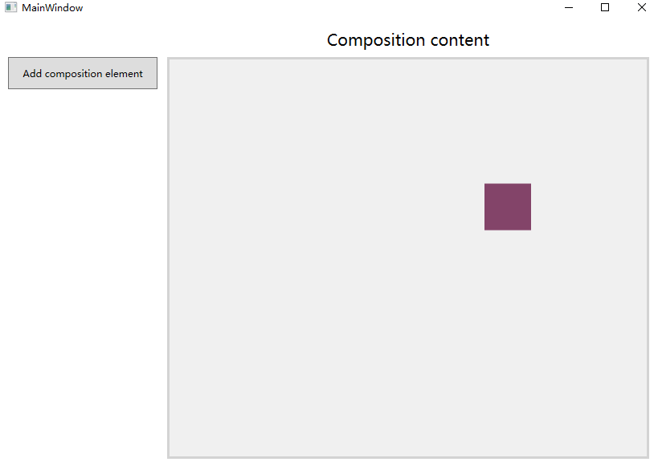

# WPF 使用 Composition API 做高性能渲染

在 WPF 中很多小伙伴都会遇到渲染性能的问题，虽然 WPF 的渲染可以甩浏览器渲染几条街，但是还是支持不了游戏级的渲染。在 WPF 使用的 DX 只是优化等级为 9 和 DX 9 差不多的性能，微软在很多开发者的提议开放了现代渲染方法 Composition API 这是 UI 应用的里程碑的技术

<!--more-->
<!-- CreateTime:2019/7/3 10:30:57 -->

<!-- 标签：WPF，渲染 -->

现在这个技术只是最小可用版本，但是还是可以玩一下。

先更新自己的系统到1803或以上，如果是想成为 Windows 开发者，就需要自己的系统是最新的

然后下载安装 VS 2019 最新版本，安装 .NET Core 3.0 预览版

官方下载链接 [VisualStudio 2019](https://visualstudio.microsoft.com/zh-hans/downloads/) [.NET Core](https://dotnet.microsoft.com/download/dotnet-core/3.0)

## 下载运行代码

从 [github](https://github.com/Microsoft/Windows.UI.Composition-Win32-Samples) 官方 [https://github.com/Microsoft/Windows.UI.Composition-Win32-Samples](https://github.com/Microsoft/Windows.UI.Composition-Win32-Samples) 下载最新代码，尝试编译运行

打开 `dotnet\WPF\HelloComposition` 里面的解决方案，注意使用 VisualStudio 2019 打开

通过 Nuget 还原两个库，一个是 [Microsoft.Windows.SDK.Contracts](https://www.nuget.org/packages/Microsoft.Windows.SDK.Contracts ) 这是一个包含在桌面使用的 Windows Runtime API 库和[System.Numerics.Vectors](https://www.nuget.org/packages/System.Numerics.Vectors ) 支持向量计算

这里的 HelloComposition 就是最简单的项目，可以通过这个项目了解使用方法

因为这个项目现在还是预览的，要做好使用命令行编译，在一开始发现了这个项目使用的是以前的 csproj 格式，同时也没法直接在 VisualStudio 2019 里面编译成功，于是我将这个项目格式修改为新的格式，通过命令行还原编译之后就可以在 VisualStudio 2019 调试了。

修改方法是使用下面代码替换 HelloComposition.csproj 文件，同时删除 `HelloComposition\Properties\AssemblyInfo.cs` 文件

```csharp
<Project Sdk="Microsoft.NET.Sdk.WindowsDesktop">
  <PropertyGroup>
    <OutputType>WinExe</OutputType>
    <TargetFramework>netcoreapp3.0</TargetFramework>
    <UseWPF>true</UseWPF>
  </PropertyGroup>
  <ItemGroup>
    <PackageReference Include="Microsoft.Windows.SDK.Contracts">
      <Version>10.0.17763.144-preview</Version>
    </PackageReference>
    <PackageReference Include="System.Numerics.Vectors">
      <Version>4.5.0</Version>
    </PackageReference>
  </ItemGroup>
</Project>
```

如果不想自己修改 csproj 文件可以[下载](https://github.com/lindexi/lindexi_gd/tree/a8d0df42142b4979807be154ba538b648dd27175/HelloComposition)我的修改的版本，先通过命令行还原编译

```csharp
// 先进入 HelloComposition.sln 所在的文件夹
dotnet restore 
// 还原可能失败，如果发现还原失败可以使用 [我收集的各种公有 NuGet 源](https://walterlv.com/post/public-nuget-sources.html )
dotnet build
```

如果编译成功，那么就可以在 VisualStudio 2019 点击运行调试。如果编译失败，欢迎加入[dotnet 职业技术学院](https://t.me/dotnet_campus)交流

运行可以看到下面图片

<!--  -->


## 项目主要代码

那么代码是如何写的？

可以看到主要的代码是 CompositionHostControl 这是一个很普通的 UserControl 控件，在这个控件的 Load 的时候，将自己的内容，也就是一个叫 CompositionHostElement 的 Border 的内容修改为 CompositionHost 的方法

这里的 CompositionHost 是一个自定义的 HwndHost 方法，通过 HwndHost 可以指定为 Host 一个句柄，通过这个方法让 WPF 使用两个不同的渲染方法。

在 CompositionHost 创建了一个新的窗口，然后将这个窗口使用 HwndHost 显示在 WPF 窗口之上，也就是使用 CompositionHost 的控件将会显示在其他任何 WPF 控件的上面，也就是在 CompositionHost 控件的 Bounds 范围内，是不能使用其他的 WPF 控件的。这和在 WPF 中使用其他渲染方法的窗口一样，这个技术也是在 WPF 中使用 WinForms 或 UWP 控件的技术

在 CompositionHost 的主要代码是 InitComposition 方法，在这里创建了 Composition 通过黑科技的方法，感觉这里的代码将会写在一个框架里面，同时也不是很清真，更大的原因是我也不了解这个黑科技是什么，所以就跳过了。

在跳过这个类，其他的代码是非常容易的，可以看到方法的接口和 UWP 的一样，在 `CompositionHostControl_Loaded` 方法返回了 Compositor 的字段，对他的使用就和 UWP 的使用一样

```csharp
        private void CompositionHostControl_Loaded(object sender, RoutedEventArgs e)
        {
            // If the user changes the DPI scale setting for the screen the app is on,
            // the CompositionHostControl is reloaded. Don't redo this set up if it's
            // already been done.
            if (compositionHost is null)
            {
                currentDpi = VisualTreeHelper.GetDpi(this);

                compositionHost = new CompositionHost(CompositionHostElement.ActualHeight, CompositionHostElement.ActualWidth);
                // 手动高亮，下面的代码就是将 CompositionHostElement 这个 Border 的内容修改为 CompositionHost 这个 HwndHost 通过 Host 一个窗口的方法
                CompositionHostElement.Child = compositionHost;

                // 手动高亮，下面的代码返回 Compositor 字段
                compositor = compositionHost.Compositor;
                // 手动高亮，下面的代码返回 ContainerVisual 字段
                containerVisual = compositor.CreateContainerVisual();
                compositionHost.Child = containerVisual;
            }
        }
```

在点击按钮的时候就创建一个 SpriteVisual 加入到 ContainerVisual 里面，然后做 Vector3KeyFrameAnimation 动画

这里面的代码接口和 UWP 相同，就不详细告诉大家如何使用

## 用到的黑科技

### 通过 HwndHost 方法拿到一个窗口的句柄

其实不是直接在 WPF 使用 Composition 而是在创建一个窗口使用 Composition 因为 WPF 的渲染和 Composition 的不相同

也是因为使用了这个技术，所以会存在一些坑，将会在本文下面告诉大家

### 通过 COM 等方法调用额外的系统相关的接口

如果只是创建一个空白的窗口是没法直接用到 Composition API 需要使用一些黑科技，这些代码都在 `CompositionHost` 因为我也看不懂，所以就跳过

如果想不开请看 [Using the Visual Layer with WPF](https://docs.microsoft.com/en-us/windows/uwp/composition/using-the-visual-layer-with-wpf#create-a-usercontrol-to-add-your-content-to-the-wpf-visual-tree )

### 将 Visual Layer 的内容封装在 WPF 的用户控件

在 CompositionHostControl 这个用户控件，使用的封装的 Visual Layer 在里面的代码和 UWP 的相同

如何使用可以看 UWP 的 [Visual Layer documentation](https://docs.microsoft.com/windows/uwp/composition/visual-layer)

## 预览代码

主要用到类有三个

### CompositionHost

连接 WPF 的渲染和 UWP 的 Visual Layer 也是这个呆魔的主要代码

官方建议是直接复制这个类里面的代码，在 [Create an HwndHost derived class to host composition elements](https://docs.microsoft.com/windows/uwp/composition/using-the-visual-layer-with-wpf#create-an-hwndhost-derived-class-to-host-composition-elements) 也只是告诉大家如何写

### CompositionHostControl

使用封装之后的方法，简单告诉大家如何添加 Visual 和动画

最后一个文件是主窗口，里面也就是放了一个按钮和 CompositionHostControl 代码很简单

## 不足

虽然可以在 WPF 用 Composition API 做出好看界面，但是因为主要技术是通过 HwndHost 方法，这个方法也还没有正式使用，存在下面的不足

- 特效依赖于 Win2d 但是现在 win2d 还没有支持桌面的 Nuget 库，需要编译[源代码](https://github.com/Microsoft/Win2D) 不过很快就可以直接通过 Nuget 的方法

- 如果需要交互命中测试需要在代码计算 Visual Layer 的 Bounds 没有和在 UWP 通过 xaml 的方法简单绑定对应的命中测试，不过很快也就有封装的方法

- 现在的 Visual Layer 还没有支持渲染文本，但是可以通过 SharpDX 的方法渲染，很快就可以原生支持

- 因为是 Host 的技术，不能自动在 DPI 修改的时候缩放，需要写很多代码适配

- 如果说上面几个坑都还是可以解决的，那么下面的坑就是原理的问题。因为使用了 HwndHost 用了两个渲染方法，在使用 UWP 渲染方法的范围会在窗口的最上也就是 WPF 无法在这个范围放任何的像素，同时也存在焦点等问题

[Using the Visual Layer with WPF](https://docs.microsoft.com/en-us/windows/uwp/composition/using-the-visual-layer-with-wpf#create-a-usercontrol-to-add-your-content-to-the-wpf-visual-tree )

[Visual Layer documentation](https://docs.microsoft.com/windows/uwp/composition/visual-layer)

[Windows.UI.Composition Namespace](https://docs.microsoft.com/en-us/uwp/api/windows.ui.composition )

[我收集的各种公有 NuGet 源](https://walterlv.com/post/public-nuget-sources.html )

[我修改的代码](https://github.com/lindexi/lindexi_gd/tree/a8d0df42142b4979807be154ba538b648dd27175/HelloComposition)

[官方代码](https://github.com/Microsoft/Windows.UI.Composition-Win32-Samples)

特别感谢

- [蓝火火](https://www.cnblogs.com/blue-fire) 告诉我通过 COM 方法不是通过 PInvoke 调用系统

<a rel="license" href="http://creativecommons.org/licenses/by-nc-sa/4.0/"></a><br />本作品采用<a rel="license" href="http://creativecommons.org/licenses/by-nc-sa/4.0/">知识共享署名-非商业性使用-相同方式共享 4.0 国际许可协议</a>进行许可。欢迎转载、使用、重新发布，但务必保留文章署名[林德熙](http://blog.csdn.net/lindexi_gd)(包含链接:http://blog.csdn.net/lindexi_gd )，不得用于商业目的，基于本文修改后的作品务必以相同的许可发布。如有任何疑问，请与我[联系](mailto:lindexi_gd@163.com)。  
