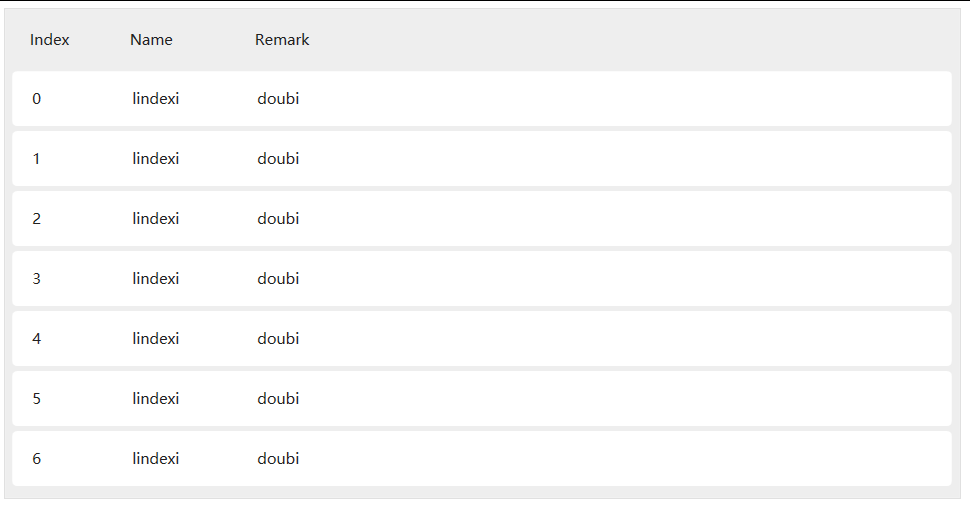

# WPF 使用 HandyControl 给 ListView 添加漂亮的表头效果

本文将来安利大家一个很好用的 UI 控件库，著名的 HandyControl 库。在想要给 ListView 添加一个表头，同时想要这个 ListView 在没有美工小姐姐的帮助下也能看起来比较好看，此时就特别适合使用 HandyControl 库

<!--more-->
<!-- 发布 -->

大概做出来的效果如下

<!--  -->


完成上面的效果很简单，让我一步步告诉大家如何做

第一步是通过 NuGet 安装 [HandyControl](https://www.nuget.org/packages/HandyControl) 库，这是一个在 [GitHub 完全开源](https://github.com/HandyOrg/HandyControl)的项目

```csharp
Install-Package HandyControl 
```

如果是 SDK Style 格式的 csproj 项目文件，可以添加下面代码安装

```xml
  <ItemGroup>
    <PackageReference Include="HandyControl" Version="2.5.0.2" />
  </ItemGroup>
```

安装完成之后打开 App.xaml 文件添加引用

```xml
    <Application.Resources>
        <ResourceDictionary>
            <ResourceDictionary.MergedDictionaries>
                <ResourceDictionary Source="pack://application:,,,/HandyControl;component/Themes/SkinDefault.xaml"/>
                <ResourceDictionary Source="pack://application:,,,/HandyControl;component/Themes/Theme.xaml"/>
            </ResourceDictionary.MergedDictionaries>
        </ResourceDictionary>
    </Application.Resources>
```

添加了上面代码将会给全局添加足够的样式，因此很多控件的默认的样式也就被更改了，如本文的 ListView 控件

完成了第一步的安装库了，下一步就是创建虚拟的数据

我想要在界面显示一个 ListView 加上内容，此时我就需要一些虚拟的数据用来做界面显示。如果小伙伴有自己的数据，那么这一步也可以跳过

先创建一个用来测试的类，如下面代码的 Foo 类

```csharp
    public class Foo
    {
        public int Index { get; set; }
        public string Name { get; set; }

        public string Remark { get; set; }
    }
```

接下来在 MainWindow 里面创建 `ObservableCollection<Foo>` 的一个属性

```csharp
        public ObservableCollection<Foo> DataList { get; } = new ObservableCollection<Foo>();
```

注意访问权限哦，想要在界面绑定可需要使用 `public` 等关键词而不能使用 `private` 哦

接着添加测试使用的数据，下面代码放在 MainWindow 的构造函数

```csharp
        public MainWindow()
        {
            InitializeComponent();

            for (int i = 0; i < 10; i++)
            {
                DataList.Add(new Foo()
                {
                    Index = i,
                    Name = "lindexi",
                    Remark = "doubi"
                });
            }

        }
```

添加测试数据的最后一步是设置 `DataContext` 为 MainWindow 自身，因为咱没有创建一个 ViewModel 而是在 MainWindow 里面创建一个属性。设置 `DataContext` 为 MainWindow 将可以绑定 MainWindow 定义的属性

```csharp
            DataContext = this;
```

最后一步就是界面啦

打开 MainWindow.xaml 文件，添加下面代码

```xml
        <ListView Margin="10,10,10,10" ItemsSource="{Binding DataList}">
            <ListView.View>
                <GridView>
                    <GridViewColumn Width="80" Header="Index" DisplayMemberBinding="{Binding Index}"/>
                    <GridViewColumn Width="100" Header="Name" DisplayMemberBinding="{Binding Name}"/>
                    <GridViewColumn Width="200" Header="Remark" DisplayMemberBinding="{Binding Remark}"/>
                </GridView>
            </ListView.View>
        </ListView>
```

此时可以尝试运行一下应用，如果和我写得一样，那么可以看到上图的界面

上面代码使用 GridView 和 GridViewColumn 的方式定义了 ListView 的表头

而 Header 里面的内容就是表头显示的文本，可以进行后台代码设置，也可以绑定等

而 DisplayMemberBinding 的值就是实际上期望绑定的元素的属性名

如果想要显示更复杂的内容， 那么仅使用 DisplayMemberBinding 是不够的，这个属性仅可以设置文本，复杂的内容需要用到 CellTemplate 属性。这部分请看 [WPF 控件【L】ListView(三) ListView+GridView+GridViewColumn+DisplayMemberBinding多列绑定数据的用法_xpj8888的博客-CSDN博客_wpf gridview](https://blog.csdn.net/xpj8888/article/details/83210669)

如果只是需要简单的定制，如修改颜色等，可以通过重写资源字典的方式更改

```xml
        <ListView Margin="10,10,10,10" ItemsSource="{Binding DataList}" Background="#565656">
            <ListView.Resources>
                <!-- 列表项颜色 -->
                <SolidColorBrush x:Key="RegionBrush" Color="#02A2A3"></SolidColorBrush>

                <!-- 列表文本颜色 -->
                <SolidColorBrush x:Key="PrimaryTextBrush" Color="White"></SolidColorBrush>

                <!-- 选中颜色 -->
                <SolidColorBrush x:Key="PrimaryBrush" Color="#A602A5"></SolidColorBrush>
            </ListView.Resources>
            <ListView.View >
                <GridView >
                    <GridViewColumn Width="80" Header="Index" DisplayMemberBinding="{Binding Index}" />
                    <GridViewColumn Width="100" Header="Name" DisplayMemberBinding="{Binding Name}"/>
                    <GridViewColumn Width="200" Header="Remark" DisplayMemberBinding="{Binding Remark}"/>
                </GridView>
            </ListView.View>
        </ListView>
```

在 ListView 定义资源名是 RegionBrush 就可以更改列表项的颜色，而通过定义 PrimaryTextBrush 就可以更改列表项目的文本颜色

上面代码我使用的是纯色的 SolidColorBrush 画刷，其实在 HC 里面支持任意的画刷，因此小伙伴可以定义为图片画刷

为什么这样定义就有效果？原因是使用了 WPF 的资源覆盖机制，越靠近控件的资源定义优先级越高，将会覆盖原先定义的资源。而在 HC 里面默认样式使用的资源的 Key 和在 ListView 里面定义的相同，此时将会被 ListView 定义的资源覆盖

简单的方法就是抄上面的代码，修改 Color 的值。或者将 SolidColorBrush 更换一下

关于 ListView 在 HC 控件里面的定义的代码，放在 `src\Shared\HandyControl_Shared\Themes\Styles\ListView.xaml` 这里，代码是完全开源的，小伙伴也可以自己去拷贝代码


这个项目所有代码放在 [github](https://github.com/lindexi/lindexi_gd/tree/6c56865e43a6621111586ced2c93ea3099b00ae2/WaicheardeaharjereCiyallyerekelhear) 欢迎小伙伴访问

<a rel="license" href="http://creativecommons.org/licenses/by-nc-sa/4.0/"></a><br />本作品采用<a rel="license" href="http://creativecommons.org/licenses/by-nc-sa/4.0/">知识共享署名-非商业性使用-相同方式共享 4.0 国际许可协议</a>进行许可。欢迎转载、使用、重新发布，但务必保留文章署名[林德熙](http://blog.csdn.net/lindexi_gd)(包含链接:http://blog.csdn.net/lindexi_gd )，不得用于商业目的，基于本文修改后的作品务必以相同的许可发布。如有任何疑问，请与我[联系](mailto:lindexi_gd@163.com)。
