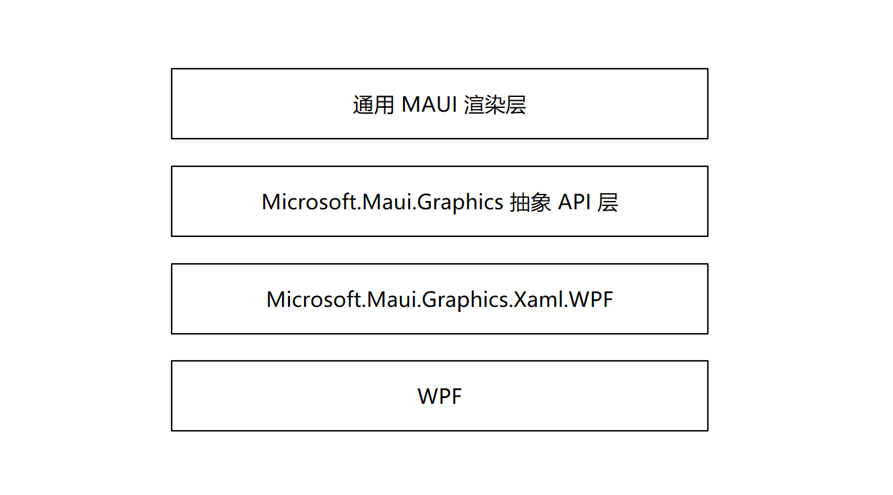

# WPF 使用 MAUI 的自绘制逻辑

这是一个当前还没开发完成的功能，准确来说连预览版也算不上的功能。我原本以为 MAUI 是无法在 WPF 上面跑的，然而在看完了 MAUI 整个大的设计，才了解到，原来 MAUI 是一个非常庞大的开发项目。在 MAUI 里面，虽然现在是正式发布的，但正式发布的版本里面只有采用原生控件进行绘制的方案。这和官方开始的宣传不符合，在阅读了 MAUI 相关文档才发现，实际上 MAUI 还有一个很大的部分，那就是自绘部分，还没完成，代码也分了仓库，这就是一开始没找到的原因。本文将告诉大家 MAUI 还没发布的这部分大杀器

<!--more-->
<!-- CreateTime:2022/6/13 8:04:47 -->

<!-- 标签：MAUI,WPF,MauiGraphics -->

<!-- 发布 -->

本文所涉及的全部都是绘制的渲染层，而众所周知，一个 UI 框架最重要的两个部分就是交互和渲染。本文仅仅只会涉及到渲染的一部分

<!--  -->


制作一个跨平台的 UI 框架有很多个方式，例如使用各个平台提供的原生控件，也就是说在 Windows 平台上，采用 WinUI 的按钮，在 iOS 平台上使用苹果提供的按钮，具体的按钮样式等等就需要取平台最小集以及开放定制性，最重要的代表就是原先的 Xamarin 的方式。采用各个平台的提供的原生控件的一个优势在于可以获取平台提供的功能，更加贴合具体平台的视觉和交互，缺点是不同的平台的视觉效果有所差异。另一个方式是做中间较底层的自绘，基本上各个平台都会提供自绘的能力，如 WPF 下的 DrawingContext 和 Win2D 等等，基于此方式做自绘，可以更加方便接入原有的平台，降低原有的应用接入的成本，而这就是本文的重点。最后一个方式是做底层的自绘，使用平台最底层的绘制逻辑，或者其他渲染框架的封装进行二次封装，如 Skia 或 GTK 等，对此进行渲染。使用底层的自绘逻辑可以做到更多的可控性，但缺点也在于可控性导致开发起来十分麻烦，与现有的应用接入也相对来说无法实现最好的性能

<!--  -->


很多的 UI 框架都会采用其中的一个方式。然而别忘了 MAUI 是某软主力做的，按照某软的想法，那就是都要。在 MAUI 里面，既可以使用平台提供的原生控件进行拼接制作界面，也可以使用基于的各个平台的独立 UI 框架提供的自绘能力绘制界面，也可以调用到底层的渲染逻辑进行渲染

但，这也不是免费的。如此大的一个项目，自然投入的成本，无论是人力还是开发周期，都是非常庞大的。尽管现在 MAUI 正式发布了，可惜还有很大部分的工作还没完成，甚至还没开始

在吸取了很多次失败的教训之后，某软决定拆分仓库，以解决如此大的一个项目的某些组件或部分的失败带来整体的失败。这是 dotnet runtime 组的成功的例子带来的组织形式的经验，在 dotnet runtime 里面，将不稳定的实验的功能放在 [.NET Runtime Lab](https://github.com/dotnet/runtimelab) 仓库里面。不稳定的功能，如果能成，那自然能大大提升 dotnet 的竞争力，如果不成也不应该影响到整个 dotnet 的发布

当前的 MAUI 也是这个管理方式，在 MAUI 里面，将渲染层拆出一个 [Microsoft.Maui.Graphics](https://github.com/dotnet/Microsoft.Maui.Graphics) 仓库，如 [MAUI 自定义绘图入门](https://blog.lindexi.com/post/MAUI-%E8%87%AA%E5%AE%9A%E4%B9%89%E7%BB%98%E5%9B%BE%E5%85%A5%E9%97%A8.html) 所提到的。其实 Microsoft.Maui.Graphics 是由原本的 [System.Graphics](https://github.com/dotnet/System.Graphics) 改名而来。这个 System.Graphics 项目初步完成时间比 MAUI 早很多，定位是做全平台的绘制封装层，提供了各个平台的绘制渲染的上层统一。包括了两个实现方式，一个是对各个平台提供的 UI 框架的自绘逻辑进行封装，从而对上层统一。另一个方式对各个底层绘制渲染逻辑包括 Skia 和 GTK 甚至是 DirectX 进行封装，从而提供给上层统一的逻辑，只需要简单的代码即可切换

<!--  -->


接下来是在有 [Microsoft.Maui.Graphics](https://github.com/dotnet/Microsoft.Maui.Graphics) 的基础上，也就是在能提供各个平台上层统一的绘制能力之后，进行实现各个基础控件。这就是 [Microsoft.Maui.Graphics.Controls](https://github.com/dotnet/Microsoft.Maui.Graphics.Controls) 仓库，这个仓库的需求就是制作自绘的控件。如此即可实现各个平台上像素级的统一，或者是更加方便接入原有的应用的 UI 框架

本文是在 2022.06 写的，以上的很多功能都只是能吹不能用。但是只是写一篇水文，那可不是我的风格。自然就是开始实际的写代码阶段

认识我的伙伴们都知道，我对渲染是比较熟悉的。我接下来将告诉大家，如何使用 Maui 提供的框架层，配合 WPF 提供具体的自绘逻辑，两个放在一起，从而实现 WPF 使用 MAUI 的自绘逻辑

<!--  -->


核心的实现方法是 WPF 提供画布功能，让 MAUI 可以在 WPF 上面画元素。在 MAUI 里面提供框架，以及具体的绘制指导，和上层 API 调用

本文以下部分将用到还没有发布，但是也差不多快完成的 `Microsoft.Maui.Graphics.Xaml.WPF` 提供的功能。这个库的代码放在 [Microsoft.Maui.Graphics](https://github.com/dotnet/Microsoft.Maui.Graphics) 仓库，这个库属于做中间较底层的自绘，利用 WPF 提供的丰富的绘图能力从而介入 MAUI 定义的抽象接口。由于此库还没完成，为了完成接入，我没有使用 DLL 引用，而是拷贝了这个库的代码到我的测试代码里面，然后再进行稍微的魔改，解决构建不通过

大概的对接方式如下，先在 WPF 里面放一个 Canvas 控件，这个控件将被作为 MAUI 的画布。如此也能解答一些伙伴的疑惑，那就是 MAUI 接入 WPF 的话，能作为控件的形式接入，而不作为类似 WindowsFormsHost 的方式接入。如本文下面的代码，只是提供一个 Canvas 控件，让 MAUI 将内容绘制在这个 Canvas 上。如此可见 MAUI 的大的方面的设计还是很好

```xml
        <Canvas x:Name="Canvas" />
```

在后台代码里面，将创建 XamlCanvas 类型的 `_canvas` 字段，同时将上面代码的 Canvas 传入

```csharp
public partial class MainWindow : Window
{
    public MainWindow()
    {
        InitializeComponent();

        _canvas.Canvas = Canvas;

        SizeChanged += (source, args) => Draw();
    }

    public IDrawable Drawable
    {
        get => _drawable;
        set
        {
            _drawable = value;
            Draw();
        }
    }

    private void Draw()
    {
        if (_drawable != null)
        {
            using (_canvas.CreateSession())
            {
                _drawable.Draw(_canvas, new RectF(0, 0, (float) Canvas.Width, (float) Canvas.Height));
            }
        }
    }

    private readonly XamlCanvas _canvas = new XamlCanvas();
    private IDrawable _drawable;
}
```

以上代码的 XamlCanvas 继承了 ICanvas 接口。在 MAUI 的自绘里面，最重要的就是 ICanvas 接口，这是一个表示画布的接口，在这个接口里面实现了具体的绘制的抽象 API 定义。换句话说，如果你想要接入自己想要的其他平台，那很重要的一点就是去实现 ICanvas 的功能

以上的 XamlCanvas 是属于库提供的功能，将通过传入的 Canvas 实现对接 MAUI 和 WPF 的逻辑

有了画布之后，想要在界面绘制内容，那还需要告诉框架层想要画出什么内容。这就是属于业务层的内容了，在业务层里面，将需要继承 IDrawable 接口，实现 Draw 方法。在 Draw 方法进行业务层的渲染

例如一个画线的业务功能，可以使用如下实现方式

```csharp
    class DrawLines : IDrawable
    {
        public void Draw(ICanvas canvas, RectF dirtyRect)
        {
            canvas.DrawLine(50, 20.5f, 200, 20.5f);

            canvas.DrawLine(50, 30.5f, 200, 30.5f);
        }
    }
```

将 DrawLines 的对象设置给 Drawable 属性，即可看到界面画出线

以上的 DrawLines 就是属于 `通用 MAUI 渲染层` 的逻辑，将这段代码拿出来，可以跑在使用其他底层渲染技术但是接入 Microsoft.Maui.Graphics 的渲染技术，例如底层换成是 Win2D 等。如此即可通过造上层的 通用 MAUI 渲染层的逻辑，从而搭建起界面效果的生态。更多自定义的绘图，请看 [MAUI 自定义绘图入门 - lindexi - 博客园](https://www.cnblogs.com/lindexi/p/16349535.html )

我十分推荐大家跑一下我的 demo 从而了解到当前的 MAUI 的实现进度

本文测试代码放在[github](https://github.com/lindexi/lindexi_gd/tree/8d4c37dbbde83e03a6daa4e3454a5d007c64dffe/RijoqicainejoHifolurqall) 和 [gitee](https://gitee.com/lindexi/lindexi_gd/tree/8d4c37dbbde83e03a6daa4e3454a5d007c64dffe/RijoqicainejoHifolurqall) 欢迎访问

可以通过如下方式获取本文的源代码，先创建一个空文件夹，接着使用命令行 cd 命令进入此空文件夹，在命令行里面输入以下代码，即可获取到本文的代码

```
git init
git remote add origin https://gitee.com/lindexi/lindexi_gd.git
git pull origin 8d4c37dbbde83e03a6daa4e3454a5d007c64dffe
```

以上使用的是 gitee 的源，如果 gitee 不能访问，请替换为 github 的源

```
git remote remove origin
git remote add origin https://github.com/lindexi/lindexi_gd.git
```

获取代码之后，进入 RijoqicainejoHifolurqall 文件夹

<a rel="license" href="http://creativecommons.org/licenses/by-nc-sa/4.0/"></a><br />本作品采用<a rel="license" href="http://creativecommons.org/licenses/by-nc-sa/4.0/">知识共享署名-非商业性使用-相同方式共享 4.0 国际许可协议</a>进行许可。欢迎转载、 使用、重新发布，但务必保留文章署名[林德熙](http://blog.csdn.net/lindexi_gd)(包含链接:http://blog.csdn.net/lindexi_gd )，不得用于商业目的，基于本文修改后的作品务必以相同的许可发布。如有任何疑问，请与我[联系](mailto:lindexi_gd@163.com)。  
