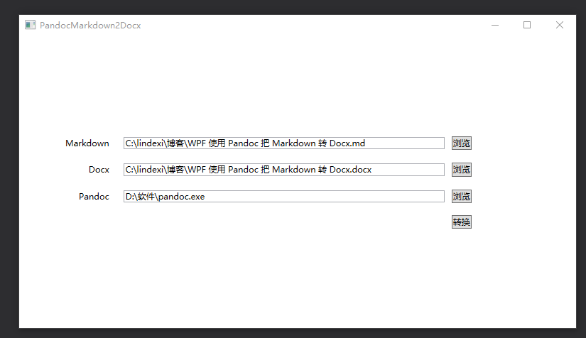

# WPF 使用 Pandoc 把 Markdown 转 Docx

本文告诉大家如何通过 WPF 使用 Pandoc 把 Markdown 转 Docx 文件

<!--more-->
<!-- CreateTime:2018/10/23 11:35:47 -->

<!-- csdn -->

<!-- 标签：WPF,Pandoc -->

在之前有文章[使用 Pandoc 把 Markdown 转 Docx](https://lindexi.gitee.io/post/%E4%BD%BF%E7%94%A8-Pandoc-%E6%8A%8A-Markdown-%E8%BD%AC-Docx.html )但是这里的方法需要每次都调用命令行，本文提供方法封装了命令行，有一个界面可以快速做转换

<!--  -->


界面很简单，就不告诉大家如何做出这样的界面了，现在是来解决一些坑

## 选择文件

从软件界面看到，可以让用户选择需要转换的文件，选择文件可以通过 OpenFileDialog 让用户选择文件

```csharp
            var pick = new OpenFileDialog
            {
                Multiselect = false,
                Filter = "Markdown文件|*.md"
            };

            if (pick.ShowDialog(this) is true)
            {
                // pick.FileName 是选择的文件
               
            }
```

这里的 Filter 的写法请看[openFileDialog的Filter属性设置 - 幕三少 - 博客园](https://www.cnblogs.com/smiler/p/4644610.html )

此外还有 Word 文件需要保存，保存文件可以使用 SaveFileDialog 进行选择

```csharp
            var pick = new SaveFileDialog()
            {
                Filter = "Word文件|*.docx"
            };

            if (pick.ShowDialog(this) is true)
            {
                // pick.FileName 是选择的文件
            }
```

这里 ShowDialog 传入的窗口是当前的窗口

## 获取文件的文件夹

为了方便用户，在用户输入需要转换的文件的时候就自动添加转换之后的 Word 文件

这里定义的 MVVM 是使用 lindexi.wpf.Framework 这个库，通过 Nuget 安装

定义了 ViewModel 类，这个类只有三个属性

```csharp
      public string Markdown
        {
            get => _markdown;
            set
            {
                _markdown = value;

                try
                {
                    Docx = Path.Combine(Path.GetDirectoryName(_markdown),
                        Path.GetFileNameWithoutExtension(_markdown) + ".docx");
                }
                catch (Exception e)
                {
                    Debug.WriteLine(e);
                }

                OnPropertyChanged();
            }
        }

        public string Docx
        {
            get => _docx;
            set
            {
                if (value == _docx)
                    return;
                _docx = value;
                OnPropertyChanged();
            }
        }

        public string Pandoc
        {
            get => _pandoc;
            set
            {
                if (value == _pandoc)
                    return;
                _pandoc = value;
                OnPropertyChanged();
            }
        }

        private string _markdown;
        private string _docx;
        private string _pandoc;
```

通过 `Path.GetDirectoryName(_markdown)` 可以拿到对应的文件的文件夹

## 使用资源管理器打开文件夹选择指定文件

在转换完成之后，让用户的资源管理器打开 Word 所在的文件夹，选择转换的 Word 需要用到下面代码

```csharp
            var argument = "/select, \"" + 文件名 + "\"";

            Process.Start("explorer.exe", argument);
```

我将软件放在 csdn 和 [github](https://github.com/lindexi/UWP/releases/tag/PandocMarkdown2Docx_1.0) 可以通过点击下面的网站下载

[使用 Pandoc 把 Markdown 转 Docx-CSDN下载](https://download.csdn.net/download/lindexi_gd/10738368 )

软件使用方式 解压缩软件到一个文件夹，双击运行 PandocMarkdown2Docx.exe 然后填写需要转换的文件，点击转换

代码 https://github.com/lindexi/UWP/tree/master/wpf/PandocMarkdown2Docx

如果发现代码里面存在任何你觉得需要修改的，请在 github 上新建讨论


<a rel="license" href="http://creativecommons.org/licenses/by-nc-sa/4.0/"></a><br />本作品采用<a rel="license" href="http://creativecommons.org/licenses/by-nc-sa/4.0/">知识共享署名-非商业性使用-相同方式共享 4.0 国际许可协议</a>进行许可。欢迎转载、使用、重新发布，但务必保留文章署名[林德熙](http://blog.csdn.net/lindexi_gd)(包含链接:http://blog.csdn.net/lindexi_gd )，不得用于商业目的，基于本文修改后的作品务必以相同的许可发布。如有任何疑问，请与我[联系](mailto:lindexi_gd@163.com)。  
