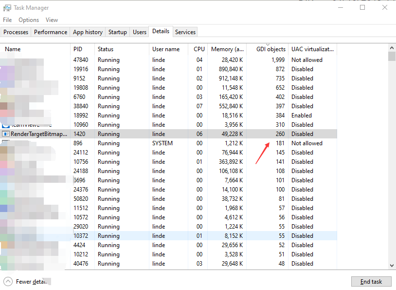

# WPF 使用 RenderTargetBitmap 快速截图出现 COMException 提示

本文告诉大家一个最简单步骤让 RenderTargetBitmap 出现 COMException 提示

<!--more-->
<!-- CreateTime:2019/1/10 14:58:43 -->

<!-- csdn -->

只需要在界面添加一个 ListView 绑定图片，然后在后台不断刷新列表就可以

```csharp
        <ListView Margin="10,10,10,10" ItemsSource="{Binding DeagernereDechuno}">
            <ListView.ItemTemplate>
                <DataTemplate>
                    <Grid Margin="10,10,10,10">
                        <Image Source="{Binding}"></Image>
                    </Grid>
                </DataTemplate>
            </ListView.ItemTemplate>
        </ListView>
```

在后台创建 DeagernereDechuno 列表

```csharp
        public ObservableCollection<ImageSource> DeagernereDechuno { get; set; }=new ObservableCollection<ImageSource>();

```

在 Load 之后调用函数 WarwairJorkasou 不断截图

```csharp
        public MainWindow()
        {
            InitializeComponent();
            DataContext = this;


            Loaded += (s, e) =>
            {
                 WarwairJorkasou();
            };
        }
```

在 WarwairJorkasou 调用循环进行截图，很快就可以看到下面提示

```csharp
 System.Runtime.InteropServices.COMException: MILERR_WIN32ERROR
``` 

异常堆栈

```csharp
System.Runtime.InteropServices.COMException (0x88980003): MILERR_WIN32ERROR (异常来自 HRESULT:0x88980003)
   在 System.Windows.Media.Imaging.RenderTargetBitmap.FinalizeCreation()
   在 System.Windows.Media.Imaging.RenderTargetBitmap..ctor(Int32 pixelWidth, Int32 pixelHeight, Double dpiX, Double dpiY, PixelFormat pixelFormat)
```

截图的代码

```csharp
        private async void WarwairJorkasou()
        {
            var ran = new Random();

            while (true)
            {
                await Task.Delay(10).ContinueWith(_ =>
                {
                    DeagernereDechuno.Clear();
                    var n = ran.Next(int.MaxValue / 10);
                    for (int i = n; i < n + 1000; i++)
                    {
                        try
                        {
                            DrawingVisual drawingVisual = new DrawingVisual();
                            DrawingContext drawingContext = drawingVisual.RenderOpen();

                            var text = new FormattedText(i.ToString(),
                                CultureInfo.GetCultureInfo("zh-cn"),
                                FlowDirection.LeftToRight,
                                new Typeface("Verdana"),
                                36, Brushes.Black);
                            drawingContext.DrawText(text,
                                new Point(0, 0));
                
                            drawingContext.Close();

                            var image = new RenderTargetBitmap((int) text.Width, (int) text.Height, 96, 96, PixelFormats.Pbgra32);
                            image.Render(drawingVisual);

                            DeagernereDechuno.Add(image);
                        }
                        catch (Exception e)
                        {
                            Console.WriteLine(e);
                        }
                    }
                }, TaskScheduler.FromCurrentSynchronizationContext());
            }
        }
```

运行程序大概在 300M 左右就会出现 COMException 提示

```csharp
System.Runtime.InteropServices.COMException (0x88980003): MILERR_WIN32ERROR (Exception from HRESULT: 0x88980003)
```

[RenderTargetBitmap throws COM exception when created too fast: MILERR_WIN32ERROR (Exception from HRESULT: 0x88980003)](https://social.msdn.microsoft.com/Forums/vstudio/en-US/5e9fb69b-7547-4f0b-ba06-ad4211be733d/rendertargetbitmap-throws-com-exception-when-created-too-fast-milerrwin32error-exception-from?forum=wpf )

代码请看 [https://github.com/dotnet-campus/wpf-issues/tree/master/RenderTargetBitmapThrowsCOMExceptionWhenCreatedTooFast](https://github.com/dotnet-campus/wpf-issues/tree/master/RenderTargetBitmapThrowsCOMExceptionWhenCreatedTooFast)

已经报告官方，请看 [Known issus: WPF will throw COM Exception when create RenderTargetBitmap too fast · Issue #3067 · dotnet/wpf](https://github.com/dotnet/wpf/issues/3067 )

在 WPF 里面炸掉的代码如下

```csharp
        internal override void FinalizeCreation()
        {
            try
            {
                using (FactoryMaker myFactory = new FactoryMaker())
                {
                    SafeMILHandle renderTargetBitmap = null;
                    HRESULT.Check(UnsafeNativeMethods.MILFactory2.CreateBitmapRenderTarget(
                        myFactory.FactoryPtr,
                        (uint)_pixelWidth,
                        (uint)_pixelHeight,
                        _format.Format,
                        (float)_dpiX,
                        (float)_dpiY,
                        MILRTInitializationFlags.MIL_RT_INITIALIZE_DEFAULT,
                        out renderTargetBitmap));

                    Debug.Assert(renderTargetBitmap != null && !renderTargetBitmap.IsInvalid);

                    BitmapSourceSafeMILHandle bitmapSource = null;
                    HRESULT.Check(MILRenderTargetBitmap.GetBitmap(
                        renderTargetBitmap,
                        out bitmapSource));
                    Debug.Assert(bitmapSource != null && !bitmapSource.IsInvalid);

                    lock (_syncObject)
                    {
                        _renderTargetBitmap = renderTargetBitmap;
                        bitmapSource.CalculateSize();
                        WicSourceHandle = bitmapSource;

                        // For the purpose of rendering a RenderTargetBitmap, we always treat it as if it's
                        // not cached.  This is to ensure we never render and write to the same bitmap source
                        // by the UCE thread and managed thread.
                        _isSourceCached = false;
                    }
                }

                CreationCompleted = true;
                UpdateCachedSettings();
            }
            catch
            {
                _bitmapInit.Reset();
                throw;
            }
        }
```

从上面代码可以看到是调用 COM 炸了，也就是修框架层还是解决不动

有小伙伴 [elyoh](https://github.com/elyoh) 告诉我，也许是 GDI 对象的问题，这个方法每次都需要申请一定量的 GDI 对象，但是这个方法没有立刻释放这些 GDI 资源。通过 [GDI Objects](https://docs.microsoft.com/en-us/windows/win32/sysinfo/gdi-objects ) 文档可以知道，限制每个会话能打开的 GDI 对象是 65535 个，在注册表中设置了每个进程可以注册 10,000 个，一个可以让程序跑得更远的方法是不断调用垃圾回收，尽管这个调用会降低性能

```csharp
GC.Collect();
GC.WaitForPendingFinalizers();
```

但实际上小伙伴说的内容不对，原因是这个进程没有使用那么多的 GDI 对象，通过任务管理器可以看到

<!--  -->


<a rel="license" href="http://creativecommons.org/licenses/by-nc-sa/4.0/"></a><br />本作品采用<a rel="license" href="http://creativecommons.org/licenses/by-nc-sa/4.0/">知识共享署名-非商业性使用-相同方式共享 4.0 国际许可协议</a>进行许可。欢迎转载、使用、重新发布，但务必保留文章署名[林德熙](http://blog.csdn.net/lindexi_gd)(包含链接:http://blog.csdn.net/lindexi_gd )，不得用于商业目的，基于本文修改后的作品务必以相同的许可发布。如有任何疑问，请与我[联系](mailto:lindexi_gd@163.com)。
