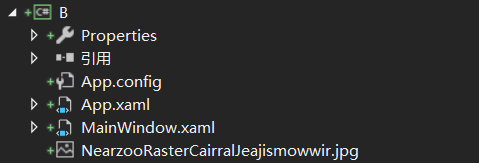
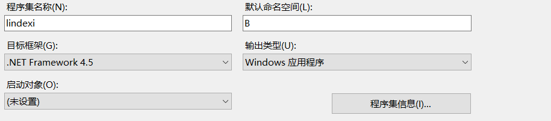

# WPF 使用 VisualStudio 2017 项目文件

本文告诉大家如何在 WPF 访问解决方案的文件

<!--more-->
<!-- CreateTime:2018/8/10 19:16:53 -->

<!-- csdn -->

在 WPF 如果需要访问项目的文件，如在项目文件放一张图片，需要在 xaml 或后台代码读取，这个就是需要用到本文的技术。

假如在 项目文件 放一张图片，首先新建一个项目，然后随意找一张图片，放在项目上

<!--  -->


注意需要查看图片的属性，如果图片的生成不是 Resources 那么在使用下面的代码还是找不到

最简单在 xaml 获取项目文件的方式是直接写相对 xaml 的路径，下面的代码写在主界面

```csharp
        <Image Source="22f0c4ae0afad5e2fd91a6dcff052f2b.jpg"></Image>
```

如果放在另一个文件夹的 xaml 相对于图片是下一级，就需要使用下面代码

```csharp
        <Image Source="../22f0c4ae0afad5e2fd91a6dcff052f2b.jpg"></Image>
```

因为很容易移动 xaml 文件所在的文件夹，如果移动了文件夹，那么刚才的路径就需要修改，所以建议写绝对路径。

绝对路径的写法是 `pack://application:,,,/` 后面添加解决方案的路径。

如在上图，解决方案里的 22f0c4ae0afad5e2fd91a6dcff052f2b.jpg 相对于解决方案是在根目录，所以可以这样写

```csharp
        <Image Source="pack://application:,,,/22f0c4ae0afad5e2fd91a6dcff052f2b.jpg"></Image>

```

如果需要跨程序集访问，如我再创建一个项目B，让刚才 A 项目引用 B 项目，在 B 项目放一张图片，然后在 A 项目引用B项目的图片 NearzooRasterCairralJeajismowwir.jpg 就需要在路径写上程序集

<!--  -->


现在需要访问 B 项目的 NearzooRasterCairralJeajismowwir.jpg 就需要使用`pack://application:,,,/B;component/NearzooRasterCairralJeajismowwir.jpg`，格式就是`pack://application:,,,/程序集;component/相对B项目的文件`，需要注意右击看文件是不是 Resources 如果不是还是无法找到

```csharp
        <Image Source="pack://application:,,,/B;component/NearzooRasterCairralJeajismowwir.jpg"></Image>
```

需要知道，程序集和项目的名字是可以不相同的，如刚才的 B 项目，实际上程序集和项目名字不相同，请看下图

<!--  -->


所以发现自己找不到资源，可能是项目名字和程序集不相同，需要右击查看程序集

```csharp
        <Image Source="pack://application:,,,/lindexi;component/NearzooRasterCairralJeajismowwir.jpg"></Image>
```

如果引用了相同程序集的不同版本，就需要在路径写上版本，格式是`pack://application:,,,/程序集;版本;component/文件相对根目录`，具体代码请看下面

```csharp
       <Image Source="pack://application:,,,/lindexi;v1.0.0.0;component/NearzooRasterCairralJeajismowwir.jpg"></Image>
```

在后台访问解决方案的文件和在 xaml 访问的方法差不多，也是需要用到路径，只是调用的方法不相同

```csharp
            var resourceStream = Application.GetResourceStream(new Uri("pack://application:,,,/lindexi;component/NearzooRasterCairralJeajismowwir.jpg"));

            if (resourceStream != null)
            {
                var stream = resourceStream.Stream;
            }
```

参见：[Pack URIs in WPF ](https://docs.microsoft.com/en-us/dotnet/framework/wpf/app-development/pack-uris-in-wpf )

[win10 uwp 访问解决方案文件](https://blog.csdn.net/lindexi_gd/article/details/52639803 )


<a rel="license" href="http://creativecommons.org/licenses/by-nc-sa/4.0/"></a><br />本作品采用<a rel="license" href="http://creativecommons.org/licenses/by-nc-sa/4.0/">知识共享署名-非商业性使用-相同方式共享 4.0 国际许可协议</a>进行许可。欢迎转载、使用、重新发布，但务必保留文章署名[林德熙](http://blog.csdn.net/lindexi_gd)(包含链接:http://blog.csdn.net/lindexi_gd )，不得用于商业目的，基于本文修改后的作品务必以相同的许可发布。如有任何疑问，请与我[联系](mailto:lindexi_gd@163.com)。
