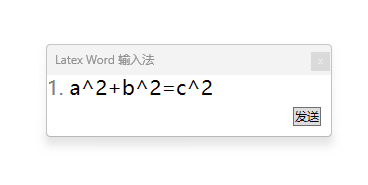
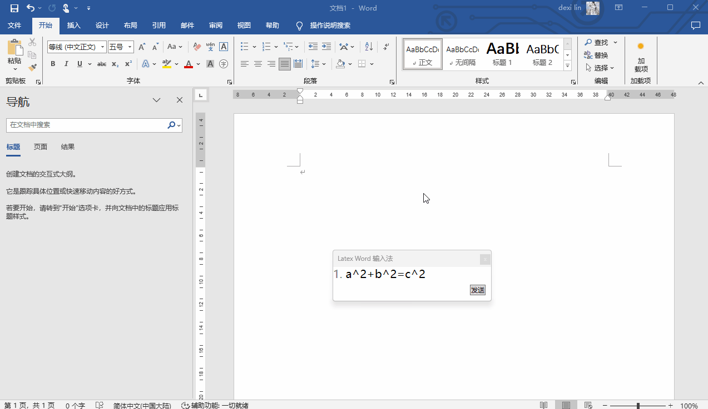

# WPF 使用快捷键方式制作简易的 Word 上的 Latex 输入法

本文将告诉大家如何在 WPF 里面编写一个简易输入法软件，让这个输入法软件支持插入 Latex 格式的公式到 Word 内。核心原理是使用 Word 的快捷键插入公式编辑器，再通过剪贴板输入 Latex 格式的公式内容，再输入回车作为 Word 公式

<!--more-->
<!-- CreateTime:2024/10/24 07:03:34 -->

<!-- 发布 -->
<!-- 博客 -->

软件的界面效果如下：

<!--  -->


运行效果如下：

<!--  -->


本文以下为演示应用，没有包含从用户输入生成 Latex 格式的公式，仅仅只包含核心的如何在 Word 插入公式部分

本文的核心实现逻辑是根据 [WPF 拼音输入法](https://blog.lindexi.com/post/WPF-%E6%8B%BC%E9%9F%B3%E8%BE%93%E5%85%A5%E6%B3%95.html ) 实现的，只是有所不同的是没有进行键盘钩子，而是代替为手动点击按钮

点击发送按钮将 Latex 公式输入到 Word 里作为 Word 公式，其核心的方法就是使用 Word 的快捷键插入公式编辑器，再通过剪贴板输入 Latex 格式的公式内容，再输入回车作为 Word 公式。按钮的点击的实现代码如下

```csharp
    private void SendButton_OnClick(object sender, RoutedEventArgs e)
    {
        SendKeys.SendWait("%="); // 发送 alt+= 让Word打开公式编辑器
        Clipboard.SetText("a^2+b^2=c^2"); // 将文本放入剪贴板
        SendKeys.SendWait("^v"); // 发送 ctrl+v 粘贴文本
        SendKeys.SendWait("{Enter}"); // 发送回车键让 Latex 公式成为 Word 公式
    }
```

上文这里固定发送的是 `a^2+b^2=c^2` 公式，大家可以根据需求自行替换为其他公式

以下为整个项目的详细实现方法

先创建一个 .NET 9 的 WPF 项目，创建之后记得勾选 WinForms 引用，如不知道在哪勾选，可以双击项目文件，将 csproj 项目文件替换为如下代码

```xml
<Project Sdk="Microsoft.NET.Sdk">

  <PropertyGroup>
    <OutputType>WinExe</OutputType>
    <TargetFramework>net9.0-windows</TargetFramework>
    <Nullable>enable</Nullable>
    <ImplicitUsings>enable</ImplicitUsings>
    <UseWindowsForms>True</UseWindowsForms>
    <UseWPF>true</UseWPF>
  </PropertyGroup>

</Project>
```

以上代码里面的 `<UseWindowsForms>True</UseWindowsForms>` 就是用来添加对 WinForms 的引用。如果大家看了以上配置还是不知道如何做，可以在本文末尾找到本文所有代码的下载方法

接着打开 MainWindow.xaml 文件，写一个固定且简单的输入法界面

```xml
    <Grid>
        <TextBlock HorizontalAlignment="Left" VerticalAlignment="Top"
                   FontSize="20">
            <Run Foreground="Gray" Text="1."/>
            <Run Foreground="Black" Text="a^2+b^2=c^2"></Run>
        </TextBlock>
        <Button x:Name="SendButton"
                Margin="10 10 10 10"
                HorizontalAlignment="Right" VerticalAlignment="Bottom"
                Click="SendButton_OnClick">发送</Button>
    </Grid>
```

以上界面固定了一个输入法候选公式，和一个按钮

继续编辑 MainWindow.xaml 文件，设置一些窗口属性

```xml
        WindowStyle="ToolWindow"
        Topmost="True"
        Title="Latex Word 输入法" Height="100" Width="300"
```

按钮点击的 `SendButton_OnClick` 方法的实现已经在上文告诉大家

作为一个输入法，不应该让窗口获取焦点，否则将会抢走应用的焦点。按照 [.NET/C# 使窗口永不激活（No Activate 永不获得焦点） - walterlv](https://blog.walterlv.com/post/no-activate-window.html ) 博客提供的方法，在 MainWindow.xaml.cs 配置让窗口不获取焦点

```csharp
    protected override void OnSourceInitialized(EventArgs e)
    {
        base.OnSourceInitialized(e);
        var windowInteropHelper = new WindowInteropHelper(this);
        Win32WindowHelper.SetNoActivate(windowInteropHelper.Handle);
    }

public static class Win32WindowHelper
{
    /// <summary>
    /// 使窗口永不激活
    /// </summary>
    /// <param name="hWnd"></param>
    /// [.NET/C# 使窗口永不激活（No Activate 永不获得焦点） - walterlv](https://blog.walterlv.com/post/no-activate-window.html )
    public static void SetNoActivate(IntPtr hWnd)
    {
        var exStyle = GetWindowLong(hWnd, GWL_EXSTYLE);
        SetWindowLong(hWnd, GWL_EXSTYLE, new IntPtr(exStyle.ToInt32() | WS_EX_NOACTIVATE));
    }

    private const int WS_EX_NOACTIVATE = 0x08000000;
    private const int GWL_EXSTYLE = -20;

    public static IntPtr GetWindowLong(IntPtr hWnd, int nIndex)
    {
        return Environment.Is64BitProcess
            ? GetWindowLong64(hWnd, nIndex)
            : GetWindowLong32(hWnd, nIndex);
    }

    public static IntPtr SetWindowLong(IntPtr hWnd, int nIndex, IntPtr dwNewLong)
    {
        return Environment.Is64BitProcess
            ? SetWindowLong64(hWnd, nIndex, dwNewLong)
            : SetWindowLong32(hWnd, nIndex, dwNewLong);
    }

    [DllImport("user32.dll", EntryPoint = "GetWindowLong")]
    private static extern IntPtr GetWindowLong32(IntPtr hWnd, int nIndex);

    [DllImport("user32.dll", EntryPoint = "GetWindowLongPtr")]
    private static extern IntPtr GetWindowLong64(IntPtr hWnd, int nIndex);

    [DllImport("user32.dll", EntryPoint = "SetWindowLong")]
    private static extern IntPtr SetWindowLong32(IntPtr hWnd, int nIndex, IntPtr dwNewLong);

    [DllImport("user32.dll", EntryPoint = "SetWindowLongPtr")]
    private static extern IntPtr SetWindowLong64(IntPtr hWnd, int nIndex, IntPtr dwNewLong);
}
```

整个 MainWindow.xaml.cs 的核心代码如下

```csharp
public partial class MainWindow : Window
{
    public MainWindow()
    {
        InitializeComponent();
    }

    protected override void OnSourceInitialized(EventArgs e)
    {
        base.OnSourceInitialized(e);
        var windowInteropHelper = new WindowInteropHelper(this);
        Win32WindowHelper.SetNoActivate(windowInteropHelper.Handle);
    }

    private void SendButton_OnClick(object sender, RoutedEventArgs e)
    {
        SendKeys.SendWait("%="); // 发送 alt+= 让Word打开公式编辑器
        Clipboard.SetText("a^2+b^2=c^2"); // 将文本放入剪贴板
        SendKeys.SendWait("^v"); // 发送 ctrl+v 粘贴文本
        SendKeys.SendWait("{Enter}"); // 发送回车键让 Latex 公式成为 Word 公式
    }
}

public static class Win32WindowHelper
{
    /// <summary>
    /// 使窗口永不激活
    /// </summary>
    /// <param name="hWnd"></param>
    /// [.NET/C# 使窗口永不激活（No Activate 永不获得焦点） - walterlv](https://blog.walterlv.com/post/no-activate-window.html )
    public static void SetNoActivate(IntPtr hWnd)
    {
        var exStyle = GetWindowLong(hWnd, GWL_EXSTYLE);
        SetWindowLong(hWnd, GWL_EXSTYLE, new IntPtr(exStyle.ToInt32() | WS_EX_NOACTIVATE));
    }

    private const int WS_EX_NOACTIVATE = 0x08000000;
    private const int GWL_EXSTYLE = -20;

    public static IntPtr GetWindowLong(IntPtr hWnd, int nIndex)
    {
        return Environment.Is64BitProcess
            ? GetWindowLong64(hWnd, nIndex)
            : GetWindowLong32(hWnd, nIndex);
    }

    public static IntPtr SetWindowLong(IntPtr hWnd, int nIndex, IntPtr dwNewLong)
    {
        return Environment.Is64BitProcess
            ? SetWindowLong64(hWnd, nIndex, dwNewLong)
            : SetWindowLong32(hWnd, nIndex, dwNewLong);
    }

    [DllImport("user32.dll", EntryPoint = "GetWindowLong")]
    private static extern IntPtr GetWindowLong32(IntPtr hWnd, int nIndex);

    [DllImport("user32.dll", EntryPoint = "GetWindowLongPtr")]
    private static extern IntPtr GetWindowLong64(IntPtr hWnd, int nIndex);

    [DllImport("user32.dll", EntryPoint = "SetWindowLong")]
    private static extern IntPtr SetWindowLong32(IntPtr hWnd, int nIndex, IntPtr dwNewLong);

    [DllImport("user32.dll", EntryPoint = "SetWindowLongPtr")]
    private static extern IntPtr SetWindowLong64(IntPtr hWnd, int nIndex, IntPtr dwNewLong);
}
```

本文代码放在 [github](https://github.com/lindexi/lindexi_gd/tree/18e21d7acfd12a55b04f554cbe5ce770e37518ef/WPFDemo/QarchananaFeweajeka) 和 [gitee](https://gitee.com/lindexi/lindexi_gd/tree/18e21d7acfd12a55b04f554cbe5ce770e37518ef/WPFDemo/QarchananaFeweajeka) 上，可以使用如下命令行拉取代码。我整个代码仓库比较庞大，使用以下命令行可以进行部分拉取，拉取速度比较快

先创建一个空文件夹，接着使用命令行 cd 命令进入此空文件夹，在命令行里面输入以下代码，即可获取到本文的代码

```
git init
git remote add origin https://gitee.com/lindexi/lindexi_gd.git
git pull origin 18e21d7acfd12a55b04f554cbe5ce770e37518ef
```

以上使用的是国内的 gitee 的源，如果 gitee 不能访问，请替换为 github 的源。请在命令行继续输入以下代码，将 gitee 源换成 github 源进行拉取代码。如果依然拉取不到代码，可以发邮件向我要代码

```
git remote remove origin
git remote add origin https://github.com/lindexi/lindexi_gd.git
git pull origin 18e21d7acfd12a55b04f554cbe5ce770e37518ef
```

获取代码之后，进入 WPFDemo/QarchananaFeweajeka 文件夹，即可获取到源代码

打开 QarchananaFeweajeka.sln 文件，理论上就可以按下 F5 让 VisualStudio 构建且运行。试试新建一个 Word 文档，进入输入状态，然后点击运行起来的输入法程序的发送按钮。预计就可以看到在 Word 输入了一段公式

更多技术博客，请参阅 [博客导航](https://blog.lindexi.com/post/%E5%8D%9A%E5%AE%A2%E5%AF%BC%E8%88%AA.html )

---

补充：

可以使用 MathML 加粘贴的方式实现，如以下的 MathML 代码

```xml
 <?xml version="1.0"?>
 <math xmlns="http://www.w3.org/1998/Math/MathML" xmlns:m="http://schemas.openxmlformats.org/officeDocument/2006/math">
     <mrow>
         <msup><mi>a</mi><mn>2</mn></msup>
         <mo>+</mo>
         <msup><mi>b</mi><mn>2</mn></msup>
         <mo>=</mo>
         <msup><mi>c</mi><mn>2</mn></msup>
     </mrow>
 </math>
```

具体实现方法是在本文代码的基础上，修改写入剪贴板的内容，也不再需要 alt 快捷键。但是其核心不同点在于需要先从 Latex 转换为 MathML 格式

替换之后的 SendButton_OnClick 代码如下

```csharp
    private void SendButton_OnClick(object sender, RoutedEventArgs e)
    {
        // lang=xml
        var mathML = """
                     <?xml version="1.0"?>
                     <math xmlns="http://www.w3.org/1998/Math/MathML" xmlns:m="http://schemas.openxmlformats.org/officeDocument/2006/math">
                         <mrow>
                             <msup><mi>a</mi><mn>2</mn></msup>
                             <mo>+</mo>
                             <msup><mi>b</mi><mn>2</mn></msup>
                             <mo>=</mo>
                             <msup><mi>c</mi><mn>2</mn></msup>
                         </mrow>
                     </math>
                     """;

        var dataObject = new DataObject();
        var buffer = Encoding.UTF8.GetBytes(mathML);
        var memoryStream = new MemoryStream(buffer);
        dataObject.SetData("MathML Presentation", memoryStream);
        Clipboard.SetDataObject(dataObject);

        SendKeys.SendWait("^v"); // 发送 ctrl+v 粘贴文本
    }
```

通过 <https://dpcarlisle.blogspot.com/2007/04/xhtml-and-mathml-from-office-20007.html> 博客可以知道，在 Word 2007 就已经可以支持这项功能了

本文更新之后的代码放在 [github](https://github.com/lindexi/lindexi_gd/tree/80a64d10ef3f3b0ac67654c6225fc6cd7a8e07a0/WPFDemo/HacereferehairJurchalanifacere) 和 [gitee](https://gitee.com/lindexi/lindexi_gd/tree/80a64d10ef3f3b0ac67654c6225fc6cd7a8e07a0/WPFDemo/HacereferehairJurchalanifacere) 上，可以使用如下命令行拉取代码。我整个代码仓库比较庞大，使用以下命令行可以进行部分拉取，拉取速度比较快

先创建一个空文件夹，接着使用命令行 cd 命令进入此空文件夹，在命令行里面输入以下代码，即可获取到本文的代码

```
git init
git remote add origin https://gitee.com/lindexi/lindexi_gd.git
git pull origin 80a64d10ef3f3b0ac67654c6225fc6cd7a8e07a0
```

以上使用的是国内的 gitee 的源，如果 gitee 不能访问，请替换为 github 的源。请在命令行继续输入以下代码，将 gitee 源换成 github 源进行拉取代码。如果依然拉取不到代码，可以发邮件向我要代码

```
git remote remove origin
git remote add origin https://github.com/lindexi/lindexi_gd.git
git pull origin 80a64d10ef3f3b0ac67654c6225fc6cd7a8e07a0
```

获取代码之后，进入 WPFDemo/HacereferehairJurchalanifacere 文件夹，即可获取到源代码

参考文档：

[用Word创建MathML公式插入HTML - 比特飞流 - 博客园](https://www.cnblogs.com/bytebull/articles/5619130.html )