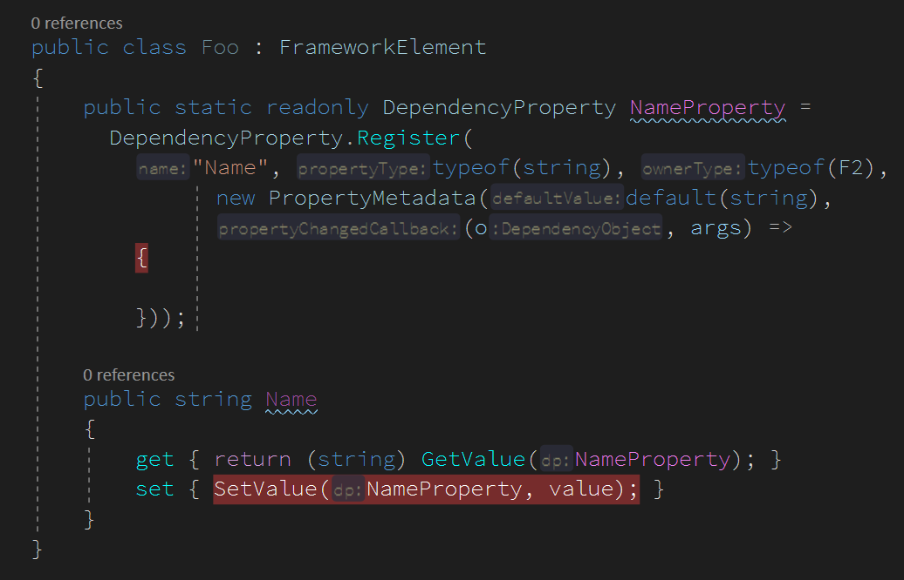
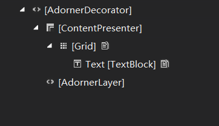
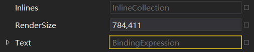
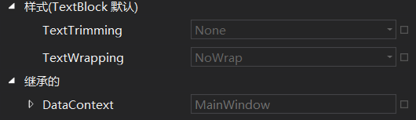

# WPF 依赖属性绑定不上调试方法

在写 WPF 程序的时候会遇到依赖属性绑定了，但是值没有更新或者没有绑定上的问题，本文告诉大家可以如何调试

<!--more-->
<!-- CreateTime:2019/11/29 8:46:33 -->

<!-- csdn -->

## 依赖属性不对应

在写依赖属性的时候，默认使用快捷键创建，但是如果是自己写的，需要注意引用的类以及属性名字符串是否对应

例如我在 Foo 类里面定义了 Name 属性，那么我应该确定注册的 Name 和 ower type 是对应的，如下代码

```csharp
        public static readonly DependencyProperty NameProperty = DependencyProperty.Register("Name", typeof(string),
            typeof(Foo), new PropertyMetadata(default(string)));
```

如果我逗比将 ower type 修改为其他类型，例如主窗口，那么此时绑定将会失效

```csharp
        public static readonly DependencyProperty NameProperty = DependencyProperty.Register("Name", typeof(string),
            typeof(MainWindow), new PropertyMetadata(default(string)));
```

如果我此时将 Name 写为其他字符串，例如下面代码写为 NameProperty 字符串，那么通过以下的绑定也是没有绑定到依赖属性

```csharp
        public static readonly DependencyProperty NameProperty = DependencyProperty.Register("NameProperty", typeof(string),
            typeof(MainWindow), new PropertyMetadata(default(string)));
```

在前台 XAML 绑定代码如下

```csharp
        <TextBlock x:Name="Text" Text="{Binding Name}"></TextBlock>
```

那么此时将绑定失败，而如果将前台代码做如下更改，也就是绑定的名字就是注释的时候写的属性名，那么将可以绑定成功

```csharp
        <TextBlock x:Name="Text" Text="{Binding NameProperty}"></TextBlock>
```

或者在后台代码通过下面代码绑定

```csharp
            var binding = new Binding()
            {
                Path = new PropertyPath("NameProperty")
            };
            BindingOperations.SetBinding(Text, TextBlock.TextProperty, binding);
```

不过这样的绑定方式是比较简单，很快就可以看出来的，但是有小伙伴问我的问题是在后台代码绑定的时候可以成功，但是将代码写在前台绑定的时候就失败，他的后台代码如下，此时绑定是反过来绑定的是，绑定也是对的

```csharp
            var binding = new Binding()
            {
                Path = new PropertyPath("Text"),
                Source = Text
            };
            BindingOperations.SetBinding(Foo, Foo.NameProperty, binding);

```

但是反过来写就没有注意到绑定的名字

```csharp
        <TextBlock x:Name="Text" Text="{Binding Name}"></TextBlock>
```

所以在发现没有绑定上的时候需要首先看是否定义没有写对

## 复制粘贴没改全

如果你的属性没有绑定上，而这个属性是从别的类复制过来的，此时你需要小心是不是没改全

表现：修改了值但是没有触发绑定变化，或者没有触发界面变化

调试方法：给属性添加一个 PropertyChangedCallback 添加断点，同时在 SetValue 里面同样添加断点。如下图

<!--  -->


如果能进入 SetValue 断点但是不能进去 PropertyChangedCallback 断点，那么证明定义没有写对。如上图写错的代码是将 `typeof(Foo)` 写成了 `typeof(F2)` 这个类写错了，就不会进入触发

如果不能进入 SetValue 那么证明要么弄错类，要么调错方法了

如果能进入 SetValue 也能进入 PropertyChangedCallback 断点，证明绑定被破坏，也就是绑定表达式被更改，如后台代码更改。或者绑定的对象不是修改的对象

## 使用 VisualStudio 调试

在 VisualStudio 2019 可以使用实时可视化树查看界面元素和元素的属性，其实这个功能在 VisualStudio 2017 就可以使用

点击调试->窗口->实时可视化树 就可以打开实时可视化树，从可视化树找到对应的需要调试的元素，然后右击就可以查看属性

<!--  -->


例如查看 TextBlock 的属性绑定，如果看到了是绑定表达式，那么证明至少绑定存在

<!--  -->


## 绑定属性被修改

使用绑定属性的时候，属性是表达式，而如果给属性赋值，那么属性将会是某个值

例如我在 xaml 绑定了 Name 属性

```csharp
        <TextBlock x:Name="Text" Text="{Binding Name}"></TextBlock>
```

但是在执行某个逻辑的时候将属性修改为 `123` 那么之后这个属性将没有再次和 Name 绑定

```csharp
            Text.Text = "123";
```

那么此时可以如何调试？可以通过监听依赖属性的修改拿到在哪个地方修改了值

通过 `DependencyPropertyDescriptor.FromProperty` 方法可以拿到依赖属性修改的方法，使用下面代码拿到文本属性被修改

```csharp
            DependencyPropertyDescriptor.FromProperty(TextBlock.TextProperty,typeof(TextBlock)).AddValueChanged(Text,
                (sender, args) =>
                {
                    Console.WriteLine("文本被修改");
                });
```

通过在 `Console.WriteLine` 这一行添加断点，在执行代码的时候发现进入断点，通过调用堆栈就可以知道是哪个业务修改了属性的值

如何使用调用堆栈和添加断点请看[dotnet 代码调试方法](https://blog.lindexi.com/post/dotnet-%E4%BB%A3%E7%A0%81%E8%B0%83%E8%AF%95%E6%96%B9%E6%B3%95.html)

## 没有找到绑定对象

另一个绑定没有上的原因是可能没有设置对的 DataContext 等，例如我没有设置一个元素的上下文然后进行绑定，如下面代码

```csharp
        <TextBlock x:Name="Text" Text="{Binding Name}"></TextBlock>
```

我期望的绑定到 Foo 属性的 Name 属性，但是实际上 Text 没有上下文，可以通过实时可视化树找到元素的上下文看绑定的是哪个类

如我看到了 TextBlock 的上下文实际上是主窗口而不是期望绑定的类，那么就知道为什么没有绑定上

<!--  -->


这个方法会用在列表里面的元素和用户控件绑定不上，因为在列表和用户控件里面的上下文可能不是上层元素的上下文而是被指定的，请看[WPF Frame 的 DataContext 不能被 Page 继承](https://blog.lindexi.com/post/wpf-frame-%E7%9A%84-datacontext-%E4%B8%8D%E8%83%BD%E8%A2%AB-page-%E7%BB%A7%E6%89%BF )

## 没有通知

如果绑定的是普通的 CLR 类，那么需要这个类继承 INotifyPropertyChanged 然后在每个需要通知的属性上面调用通知方法

以下是标准写法，在属性修改的时候调用事件通知

```csharp
        private string _name;

        public string Name
        {
            get => _name;
            set
            {
                if (value == _name) return;
                _name = value;
                OnPropertyChanged();
            }
        }

        public event PropertyChangedEventHandler PropertyChanged;

        [NotifyPropertyChangedInvocator]
        protected virtual void OnPropertyChanged([CallerMemberName] string propertyName = null)
        {
            PropertyChanged?.Invoke(this, new PropertyChangedEventArgs(propertyName));
        }
```

而此时如果只是给类继承 INotifyPropertyChanged 接口而没有给属性修改得到时候调用事件，那么绑定是不会修改

[为啥在Code Behind进行RelativeSource的binding会丢失](https://huangtengxiao.gitee.io/post/%E4%B8%BA%E5%95%A5%E5%9C%A8Code-Behind%E8%BF%9B%E8%A1%8CRelativeSource%E7%9A%84binding%E4%BC%9A%E4%B8%A2%E5%A4%B1.html )

[WPF 如何调试 binding](https://blog.lindexi.com/post/WPF-%E5%A6%82%E4%BD%95%E8%B0%83%E8%AF%95-binding.html )

<a rel="license" href="http://creativecommons.org/licenses/by-nc-sa/4.0/"></a><br />本作品采用<a rel="license" href="http://creativecommons.org/licenses/by-nc-sa/4.0/">知识共享署名-非商业性使用-相同方式共享 4.0 国际许可协议</a>进行许可。欢迎转载、使用、重新发布，但务必保留文章署名[林德熙](http://blog.csdn.net/lindexi_gd)(包含链接:http://blog.csdn.net/lindexi_gd )，不得用于商业目的，基于本文修改后的作品务必以相同的许可发布。如有任何疑问，请与我[联系](mailto:lindexi_gd@163.com)。 
