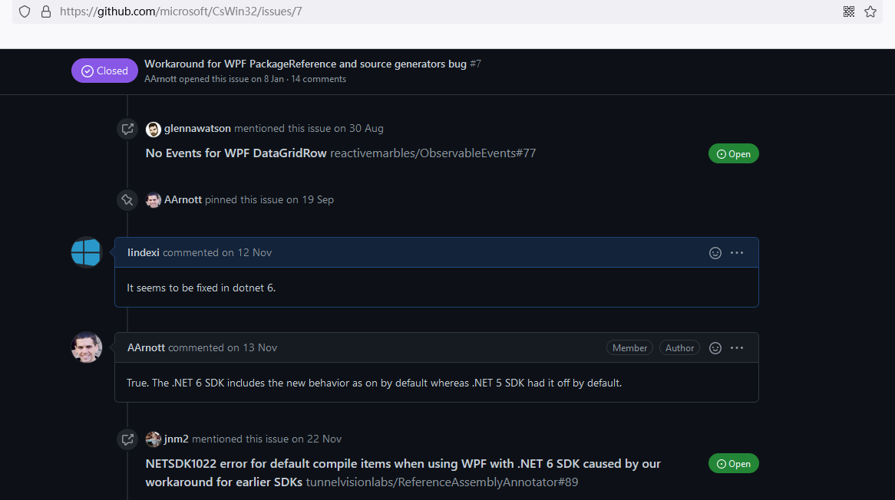

# WPF 修复 dotnet 6 与源代码包冲突

在 dotnet 6 时，官方为了适配好 Source Generators 功能，于是默认就将 WPF 的 XAML 构建过程中，引入第三方库的 cs 文件，这个功能默认设置为开启。刚好源代码包为了修复在使用 dotnet 6 SDK 之前，在 WPF 的构建 XAML 过程中，不包含第三方库的代码文件，从而使用黑科技将源代码包加入到 WPF 构建 XAML 中。在 VisualStudio 升级到 2022 版本，或者是升级 dotnet sdk 到 dotnet 6 版本，将会更新构建调度，让源代码包里的代码文件被加入两次，从而构建失败

<!--more-->
<!-- CreateTime:2021/12/29 15:23:10 -->

<!-- 发布 -->

构建失败的提示如下

```
C:\Program Files\dotnet\sdk\6.0.101\Sdks\Microsoft.NET.Sdk\targets\Microsoft.NET.Sdk.DefaultItems.Shared.targets(190,5): error NETSDK1022: 包含了重复的“Compile”项。.NET SDK 默认包含你项目目录中的“Compile”项。可从项目文件中删除这些项；如果希望将其显式包含在项目文件中，可将“EnableDefaultCompileItems”属性设置为“false”。有关详细信息，请参阅 https://aka.ms/sdkimplicititems。重复项为: 
```

重复的原因是 WPF 在 .NET SDK 里修复了在 XAML 构建过程中，没有引用 NuGet 包里面的文件。而源代码包许多都是在此修复之前打出来的，源代码包为了修复在 XAML 里面没有引用文件，就强行加上修复逻辑引用文件。而在 dotnet 6 修复了之后，自然就会导致引用了多次

关于 WPF 在旧版本 .NET SDK 里的问题，请参阅： [制作通过 NuGet 分发的源代码包时，如果目标项目是 WPF 则会出现一些问题（探索篇，含解决方案） - walterlv](https://blog.walterlv.com/post/issues-of-nuget-package-import-for-wpf-projects.html )

更多关于 WPF 构建，请参阅 [WPF 程序的编译过程 - walterlv](https://blog.walterlv.com/post/how-wpf-assemblies-are-compiled )

修复方法很简单，在不更改源代码包的前提下，可以在 csproj 项目文件里加入以下代码

```xml
    <IncludePackageReferencesDuringMarkupCompilation>False</IncludePackageReferencesDuringMarkupCompilation>
```

更改之后的 csproj 代码如下

```xml
<Project Sdk="Microsoft.NET.Sdk">

  <PropertyGroup>
    <OutputType>WinExe</OutputType>
    <TargetFramework>net6.0-windows</TargetFramework>
    <UseWPF>true</UseWPF>
    <IncludePackageReferencesDuringMarkupCompilation>False</IncludePackageReferencesDuringMarkupCompilation>
  </PropertyGroup>

</Project>
```

此影响不仅包含 TargetFramework 为 net6.0-windows 的 WPF 应用，而是任何使用 SDK 风格的 WPF 项目。其原因是 dotnet 6 此更改是在 dotnet sdk 更改构建调度过程，和具体应用的框架无关，只影响构建本身

<!--  -->


加上 IncludePackageReferencesDuringMarkupCompilation 之后将会导致 WPF 项目可能使用 Source Generators 功能时提示找不到某些类型

如果不想加上 IncludePackageReferencesDuringMarkupCompilation 也修复问题，那就需要去修复源代码包了
