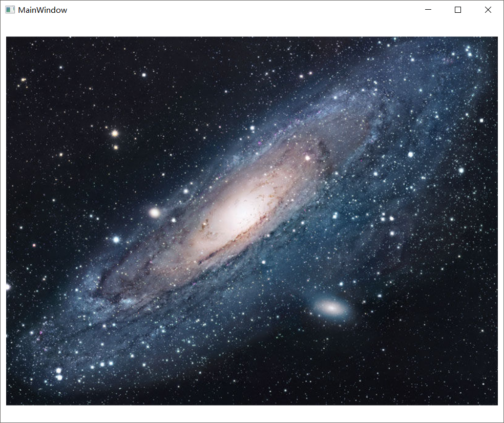
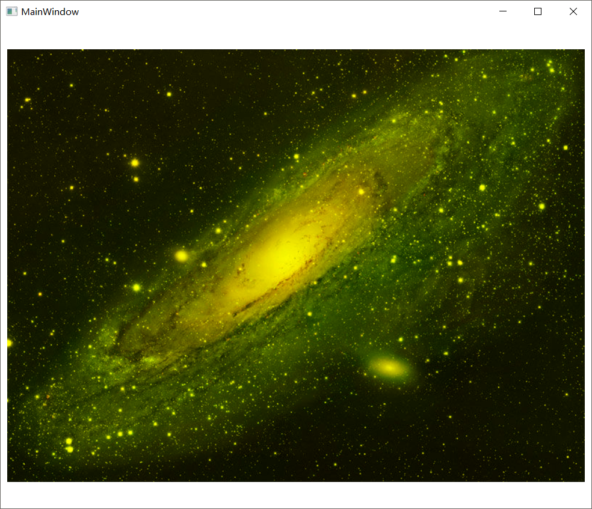
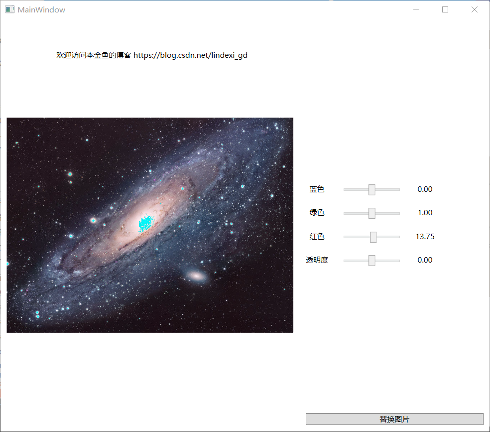

# WPF 修改图片颜色

本文告诉大家如何修改图片的颜色，如去掉图片的蓝色

<!-- 标签：WPF，图片处理 -->

<!--more-->
<!-- CreateTime:2018/8/10 19:16:53 -->

<!-- csdn -->

在 WPF 可以使用很多图片处理的方法，本文告诉大家的是一个图片处理，可以把处理的图片保存在文件。

在阅读本文，我假设大家是熟悉 WPF 的，至少了解 C# ，也知道图片的格式。

在 WPF 可以使用 ARBG 数组表示图片，本文修改图片颜色的方法就是使用 ARBG 数组的方法修改，修改里面的元素的值。

如我需要去掉图片的蓝色，就可以通过修改 ARBG 数组的元素，设置所有蓝色为 0 ，去掉蓝色。

## 读取图片

首先找到一张好看的图片，放在解决方案

<!--  -->


读取解决方案的图片

```csharp
            var stream = Application.GetResourceStream(new Uri("pack://application:,,,/1.jpg")).Stream;
```

如果找不到图片，就是没有设置图片生成是 Resource 

## 解析文件

创建 WriteableBitmap 需要使用 ImageSource 所以需要先解析

```csharp
// 其他忽略代码
            var bitmapImage = new BitmapImage();
            bitmapImage.BeginInit();
            bitmapImage.StreamSource = stream;
            bitmapImage.EndInit();
```

使用 BitmapImage 解析文件

## 创建图片

在读取图片之后就可以创建图片

```csharp
            var writeableBitmap = new WriteableBitmap(bitmapImage);

```

## 转换图片格式

如果读取到的图片不是 BGRA 的格式，就需要转换图片格式

```csharp
            var formatConvertedBitmap = new FormatConvertedBitmap();

            formatConvertedBitmap.BeginInit();

            formatConvertedBitmap.Source = bitmapImage;

            formatConvertedBitmap.DestinationFormat = PixelFormats.Bgra32;

            formatConvertedBitmap.EndInit();
```

使用这个代码可以把格式转为`PixelFormats.Bgra32`，需要重新创建图片

```csharp
            var stream = Application.GetResourceStream(new Uri("pack://application:,,,/1.jpg")).Stream;

            var bitmapImage = new BitmapImage();
            bitmapImage.BeginInit();
            bitmapImage.StreamSource = stream;
            bitmapImage.EndInit();

            var formatConvertedBitmap = new FormatConvertedBitmap();

            formatConvertedBitmap.BeginInit();

            formatConvertedBitmap.Source = bitmapImage;

            formatConvertedBitmap.DestinationFormat = PixelFormats.Bgra32;

            formatConvertedBitmap.EndInit();

            var writeableBitmap = new WriteableBitmap(formatConvertedBitmap);
```

尝试显示图片，可以看到图片还是很好看

<!--  -->


## 读取数组

在图片可以看到图片是使用 BGRA 的格式数组，所以只需要读取图片数组就可以修改图片

读取图片需要使用不安全代码，需要右击项目属性，点击生成，允许不安全代码。

在修改图片之前需要使用 Lock 函数，读取图片的数组长度可以使用这个代码

```csharp
            var length = writeableBitmap.PixelWidth * writeableBitmap.PixelHeight *
                         writeableBitmap.Format.BitsPerPixel / 8;
```

这里知道使用的是 BGRA 也就是一个像素使用 4 个 byte ，一个图片的像素就是`writeableBitmap.PixelWidth * writeableBitmap.PixelHeight` 。这里 `writeableBitmap.Format.BitsPerPixel` 就是拿到一个像素的 bit 数。

转换数组

```csharp
            var backBuffer = (byte*) writeableBitmap.BackBuffer;

```

读取颜色就是从数组拿到值

```csharp
            for (int i = 0; i + 4 < length; i = i + 4)
            {
                var blue = backBuffer[i];
                var green = backBuffer[i + 1];
                var red = backBuffer[i + 2];
                var alpha = backBuffer[i + 3];
            }
```

修改颜色就是修改对应的值然后设置数组，如设置蓝色是 0 去掉蓝色

```csharp
            for (int i = 0; i + 4 < length; i = i + 4)
            {
                var blue = backBuffer[i];
                var green = backBuffer[i + 1];
                var red = backBuffer[i + 2];
                var alpha = backBuffer[i + 3];

                blue = 0;

                backBuffer[i] = blue;
                backBuffer[i + 1] = green;
                backBuffer[i + 2] = red;
                backBuffer[i + 3] = alpha;
            }
```

设置之后需要设置图片显示

```csharp

            writeableBitmap.AddDirtyRect(new Int32Rect(0, 0, writeableBitmap.PixelWidth, writeableBitmap.PixelHeight));
            writeableBitmap.Unlock();
```

所以去掉图片的蓝色可以使用 RemoveBlue 函数，设置蓝色为 0 的方法就是读取蓝色然后修改数组

```csharp
        private unsafe void RemoveBlue(WriteableBitmap writeableBitmap)
        {
            writeableBitmap.Lock();

            var length = writeableBitmap.PixelWidth * writeableBitmap.PixelHeight *
                         writeableBitmap.Format.BitsPerPixel / 8;

            var backBuffer = (byte*) writeableBitmap.BackBuffer;

            for (int i = 0; i + 4 < length; i = i + 4)
            {
                var blue = backBuffer[i];
                var green = backBuffer[i + 1];
                var red = backBuffer[i + 2];
                var alpha = backBuffer[i + 3];

                blue = 0;

                backBuffer[i] = blue;
                backBuffer[i + 1] = green;
                backBuffer[i + 2] = red;
                backBuffer[i + 3] = alpha;
            }

            writeableBitmap.AddDirtyRect(new Int32Rect(0, 0, writeableBitmap.PixelWidth, writeableBitmap.PixelHeight));
            writeableBitmap.Unlock();
        }

```

去掉蓝色的图片

<!--  -->


代码：[WPF 修改图片颜色 1.2-CSDN下载](https://download.csdn.net/download/lindexi_gd/10517437 )

现在的程序看起来还不能使用，尝试添加几个依赖属性，用来修改图片的颜色

<!--  -->


可以点击这里下载程序

[WPF 修改图片](http://image.acmx.xyz/WallmadeJexawoPejakairkas.exe)

首先在 xaml 添加几个控件

```csharp
    <Grid>
        <Grid.ColumnDefinitions>
            <ColumnDefinition Width="485*" />
            <ColumnDefinition Width="308*" />
        </Grid.ColumnDefinitions>
        <Image x:Name="Image" />
        <Grid Grid.Column="1">
            <Grid VerticalAlignment="Center">
                <FrameworkElement.Resources>
                    <Style TargetType="Slider">
                        <Setter Property="Width" Value="100" />
                        <Setter Property="HorizontalAlignment" Value="Center" />
                        <Setter Property="Margin" Value="10,10,10,10" />
                        <Setter Property="Minimum" Value="-255" />
                        <Setter Property="Maximum" Value="255" />
                    </Style>

                    <Style TargetType="TextBlock">
                        <Setter Property="Margin" Value="10,10,10,10" />
                        <Setter Property="HorizontalAlignment" Value="Center" />
                    </Style>

                    <local:DoubleConvert x:Key="DoubleConvert" />
                </FrameworkElement.Resources>

                <Grid.ColumnDefinitions>
                    <ColumnDefinition Width="Auto" />
                    <ColumnDefinition Width="Auto" />
                    <ColumnDefinition Width="Auto" />
                </Grid.ColumnDefinitions>
                <Grid.RowDefinitions>
                    <RowDefinition Height="Auto" />
                    <RowDefinition Height="Auto" />
                    <RowDefinition Height="Auto" />
                    <RowDefinition Height="Auto" />
                </Grid.RowDefinitions>
                <TextBlock>蓝色</TextBlock>
                <TextBlock Grid.Row="1" Grid.Column="0">绿色</TextBlock>
                <TextBlock Grid.Row="2" Grid.Column="0">红色</TextBlock>
                <TextBlock Grid.Row="3" Grid.Column="0">透明度</TextBlock>

                <!-- 蓝色 -->
                <Slider Grid.Row="0" Grid.Column="1" Value="{Binding Path=Blue,Mode=TwoWay}" />
                <!-- 绿色 -->
                <Slider Grid.Row="1" Grid.Column="1" Value="{Binding Path=Green,Mode=TwoWay}" />
                <!-- 红色 -->
                <Slider Grid.Row="2" Grid.Column="1" Value="{Binding Path=Red,Mode=TwoWay}" />
                <!-- 透明度 -->
                <Slider Grid.Row="3" Grid.Column="1" Value="{Binding Path=Alpha,Mode=TwoWay}" />

                <!-- 蓝色 -->
                <TextBlock Grid.Row="0" Grid.Column="2"
                           Text="{Binding Path=Blue,Mode=OneWay,Converter={StaticResource DoubleConvert}}" />
                <!-- 绿色 -->
                <TextBlock Grid.Row="1" Grid.Column="2"
                           Text="{Binding Path=Green,Mode=OneWay,Converter={StaticResource DoubleConvert}}" />
                <!-- 红色 -->
                <TextBlock Grid.Row="2" Grid.Column="2"
                           Text="{Binding Path=Red,Mode=OneWay,Converter={StaticResource DoubleConvert}}" />
                <!-- 透明度 -->
                <TextBlock Grid.Row="3" Grid.Column="2"
                           Text="{Binding Path=Alpha,Mode=OneWay,Converter={StaticResource DoubleConvert}}" />
            </Grid>
            <Grid VerticalAlignment="Bottom">
                <Button Margin="10,10,10,10" Content="替换图片" Click="Button_OnClick" />
            </Grid>
        </Grid>
    </Grid>

```

注意在页面设置数据

```xml
DataContext="{Binding RelativeSource={RelativeSource Self}}"
```

然后打开 cs 添加代码

```csharp
      private WriteableBitmap _writeableBitmap;

        public MainWindow()
        {
            InitializeComponent();

            Image.Margin = new Thickness(10, 10, 10, 10);

            var stream = Application.GetResourceStream(new Uri("pack://application:,,,/1.jpg")).Stream;

            ChangeImage(stream);

            DataContext = this;
        }

        public static readonly DependencyProperty BlueProperty = DependencyProperty.Register(
            "Blue", typeof(double), typeof(MainWindow),
            new PropertyMetadata(default(double), (s, e) => ((MainWindow) s).ChangeArray()));

        public double Blue
        {
            get { return (double) GetValue(BlueProperty); }
            set { SetValue(BlueProperty, value); }
        }

        public static readonly DependencyProperty GreenProperty = DependencyProperty.Register(
            "Green", typeof(double), typeof(MainWindow),
            new PropertyMetadata(default(double), (s, e) => ((MainWindow) s).ChangeArray()));

        public double Green
        {
            get { return (double) GetValue(GreenProperty); }
            set { SetValue(GreenProperty, value); }
        }

        public static readonly DependencyProperty RedProperty = DependencyProperty.Register(
            "Red", typeof(double), typeof(MainWindow),
            new PropertyMetadata(default(double), (s, e) => ((MainWindow) s).ChangeArray()));

        public double Red
        {
            get { return (double) GetValue(RedProperty); }
            set { SetValue(RedProperty, value); }
        }

        public static readonly DependencyProperty AlphaProperty = DependencyProperty.Register(
            "Alpha", typeof(double), typeof(MainWindow),
            new PropertyMetadata(default(double), (s, e) => ((MainWindow) s).ChangeArray()));

        public double Alpha
        {
            get { return (double) GetValue(AlphaProperty); }
            set { SetValue(AlphaProperty, value); }
        }

        private void ChangeImage(Stream stream)
        {
            var bitmapImage = new BitmapImage();
            bitmapImage.BeginInit();
            bitmapImage.StreamSource = stream;
            bitmapImage.EndInit();

            var formatConvertedBitmap = new FormatConvertedBitmap();

            formatConvertedBitmap.BeginInit();

            formatConvertedBitmap.Source = bitmapImage;

            formatConvertedBitmap.DestinationFormat = PixelFormats.Bgra32;

            formatConvertedBitmap.EndInit();

            _writeableBitmap = new WriteableBitmap(formatConvertedBitmap);

            ChangeArray();
        }

        private unsafe void ChangeArray()
        {
            var writeableBitmap = _writeableBitmap;

            if (writeableBitmap == null)
            {
                return;
            }

            writeableBitmap.Lock();

            var length = writeableBitmap.PixelWidth * writeableBitmap.PixelHeight *
                         writeableBitmap.Format.BitsPerPixel / 8;

            var backBuffer = (byte*) writeableBitmap.BackBuffer;

            var byteList = new byte[length];

            for (int i = 0; i + 4 < length; i = i + 4)
            {
                var blue = backBuffer[i];
                var green = backBuffer[i + 1];
                var red = backBuffer[i + 2];
                var alpha = backBuffer[i + 3];

                blue += (byte) Blue;
                green += (byte) Green;
                red += (byte) Red;
                alpha += (byte) Alpha;

                byteList[i] = blue;
                byteList[i + 1] = green;
                byteList[i + 2] = red;
                byteList[i + 3] = alpha;
            }

            writeableBitmap.Unlock();


            writeableBitmap = new WriteableBitmap(writeableBitmap.PixelWidth, writeableBitmap.PixelHeight, 96, 96,
                writeableBitmap.Format, writeableBitmap.Palette);

            writeableBitmap.Lock();

            writeableBitmap.WritePixels(new Int32Rect(0, 0, writeableBitmap.PixelWidth, writeableBitmap.PixelHeight),
                byteList, writeableBitmap.BackBufferStride, 0);

            writeableBitmap.AddDirtyRect(new Int32Rect(0, 0, writeableBitmap.PixelWidth, writeableBitmap.PixelHeight));
            writeableBitmap.Unlock();

            Image.Source = writeableBitmap;
        }


        private void Button_OnClick(object sender, RoutedEventArgs e)
        {
            var openFileDialog = new OpenFileDialog();
            openFileDialog.Filter = "jpg(*.jpg)|*.jpg";

            if (openFileDialog.ShowDialog() == true)
            {
                var stream = openFileDialog.OpenFile();
                ChangeImage(stream);
            }
        }

    public class DoubleConvert : IValueConverter
    {
        /// <inheritdoc />
        public object Convert(object value, Type targetType, object parameter, CultureInfo culture)
        {
            if (value is double n)
            {
                return n.ToString("0.00");
            }

            return DependencyProperty.UnsetValue;
        }

        /// <inheritdoc />
        public object ConvertBack(object value, Type targetType, object parameter, CultureInfo culture)
        {
            return null;
        }
    }
```

代码：[WPF 修改图片颜色 2.5-CSDN下载](https://download.csdn.net/download/lindexi_gd/10519934 )

参见：

[How to: Convert a BitmapSource to a Different PixelFormat](https://docs.microsoft.com/en-us/dotnet/framework/wpf/graphics-multimedia/how-to-convert-a-bitmapsource-to-a-different-pixelformat )

<a rel="license" href="http://creativecommons.org/licenses/by-nc-sa/4.0/"></a><br />本作品采用<a rel="license" href="http://creativecommons.org/licenses/by-nc-sa/4.0/">知识共享署名-非商业性使用-相同方式共享 4.0 国际许可协议</a>进行许可。欢迎转载、使用、重新发布，但务必保留文章署名[林德熙](http://blog.csdn.net/lindexi_gd)(包含链接:http://blog.csdn.net/lindexi_gd )，不得用于商业目的，基于本文修改后的作品务必以相同的许可发布。如有任何疑问，请与我[联系](mailto:lindexi_gd@163.com)。
