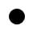

# WPF 元素裁剪 Clip 属性

本文介绍如何在 WPF 使用 Clip 裁剪元素

<!--more-->
<!-- CreateTime:2019/11/29 8:24:24 -->


在 WPF 的 UIElement 提供了 Clip 属性，这个属性默认是空，但是如果设置了这个属性就会对元素进行裁剪

这个属性是一个 Geometry 属性，设置的值表示裁剪之后剩下的部分，如写一个简单的类继承 UIElement 然后对他进行裁剪

```csharp
    class SisdecereYipuVayderyecallMawqere : UIElement
    {
        /// <inheritdoc />
        public SisdecereYipuVayderyecallMawqere()
        {
        }

        /// <inheritdoc />
        protected override void OnRender(DrawingContext drawingContext)
        {
            drawingContext.DrawRectangle(Brushes.Black,null,new Rect(10,10,100,100));
        }
    }
```

现在这个类会在 10,10 的坐标画出大小是 100 的矩形

<!--  -->


对他裁剪，设置裁剪的是矩形裁剪

```csharp
        public SisdecereYipuVayderyecallMawqere()
        {
            Clip = new RectangleGeometry(new Rect(30, 30, 50, 50));
        }
```

<!--  -->


从图片很难看出来不同，只是可以看到两个矩形，第一个矩形比较大

对他进行圆形裁剪


```csharp
        public SisdecereYipuVayderyecallMawqere()
        {
            Clip = new EllipseGeometry(new Point(30, 30), 10, 10);
        }
```

<!--  -->


可以看到显示的是圆形

因为设置 Clip 属性是一个裁剪的窗口，只有在裁剪区域之内才可以显示

因为 Geometry 是可以做到不连续的，所以可以做出部分的透明，如裁剪两个矩形

```csharp
        public SisdecereYipuVayderyecallMawqere()
        {
            Geometry geometry = new RectangleGeometry(new Rect(10,10,10,10));
            geometry = Geometry.Combine(geometry, new RectangleGeometry(new Rect(30, 30, 10, 10)),
                GeometryCombineMode.Union, null);

            Clip = geometry;
        }
```

<!--  -->


上面代码使用 Geometry.Combine 合并两个图形

[WPF 通过 DrawingContext DrawImage 绘制图片](https://lindexi.gitee.io/post/WPF-%E9%80%9A%E8%BF%87-DrawingContext-DrawImage-%E7%BB%98%E5%88%B6%E5%9B%BE%E7%89%87.html )

<a rel="license" href="http://creativecommons.org/licenses/by-nc-sa/4.0/"></a><br />本作品采用<a rel="license" href="http://creativecommons.org/licenses/by-nc-sa/4.0/">知识共享署名-非商业性使用-相同方式共享 4.0 国际许可协议</a>进行许可。欢迎转载、使用、重新发布，但务必保留文章署名[林德熙](http://blog.csdn.net/lindexi_gd)(包含链接:http://blog.csdn.net/lindexi_gd )，不得用于商业目的，基于本文修改后的作品务必以相同的许可发布。如有任何疑问，请与我[联系](mailto:lindexi_gd@163.com)。  
