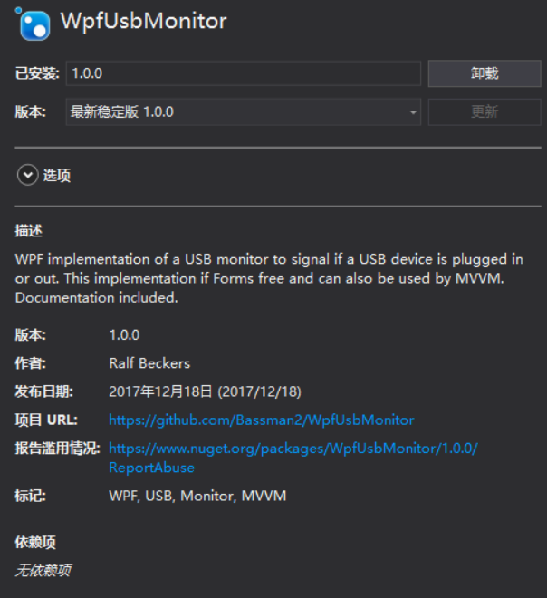

# WPF 判断USB插拔

本文告诉大家如何在 WPF 在用户插拔 USB 收到消息

<!--more-->
<!-- CreateTime:2018/8/10 19:16:53 -->

<!-- csdn -->

首先需要在一个窗口重写`OnSourceInitialized`，在这里可以拿到窗口的指针

```csharp
        protected override void OnSourceInitialized(EventArgs e)
        {
            base.OnSourceInitialized(e);

            var hwndSource = PresentationSource.FromVisual(this) as HwndSource;
            hwndSource?.AddHook(new HwndSourceHook(WndProc));
        }
```

在 USB 插拔可以收到 DEVICECHANGE 消息

```csharp
        private IntPtr WndProc(IntPtr hwnd, int msg, IntPtr wparam, IntPtr lparam, ref bool handled)
        {
            if (msg == (int) WM.DEVICECHANGE)
            {
                Debug.WriteLine(DateTime.Now.ToString() + " " + "设备发生插拔\r\n");
            }
            return IntPtr.Zero;
        }
```

这里的 WM.DEVICECHANGE 就是 537 ，关于其他的消息请看[win 消息](https://lindexi.gitee.io/post/win-%E6%B6%88%E6%81%AF.html )

如果需要获得更多的 USB 信息就建议安装 WpfUsbMonitor 通过这个可以简单知道 USB 是否插入

<!--  -->


使用这个的方法很简单，请看下面代码

```csharp
        public MainWindow()
        {
            InitializeComponent();

            var usbMonitor = new UsbMonitor(this);
            usbMonitor.UsbUpdate += UsbMonitor_UsbUpdate;
        }

        private void UsbMonitor_UsbUpdate(object sender, UsbEventArgs e)
        {
           Debug.WriteLine($@"
USB    { e.Action.ToString()}
USB 名 {e.Name}
USB 类别{e.Class}
USB GUID{e.ClassGuid}");
        }
```

如果不想安装库，只是需要知道是插入还是拔出，可以使用 WMI 的方法，需要安装 System.Management 更多关于这方面请看 [WPF 读取硬件序列号](https://lindexi.oschina.io/lindexi/post/WPF-%E8%AF%BB%E5%8F%96%E7%A1%AC%E4%BB%B6%E5%BA%8F%E5%88%97%E5%8F%B7.html )

```csharp
       public MainWindow()
        {
            InitializeComponent();

            ManagementEventWatcher watcher = new ManagementEventWatcher();
            WqlEventQuery query = new WqlEventQuery("SELECT * FROM Win32_VolumeChangeEvent WHERE EventType = 2 or EventType = 3");

            watcher.EventArrived += (s, e) =>
            {
                string driveName = e.NewEvent.Properties["DriveName"].Value.ToString();
                EventType eventType = (EventType) (Convert.ToInt16(e.NewEvent.Properties["EventType"].Value));

                string eventName = Enum.GetName(typeof(EventType), eventType);

                Console.WriteLine("{0}: {1} {2}", DateTime.Now, driveName, eventName);
            };

            watcher.Query = query;
            watcher.Start();
        }

        public enum EventType
        {
            Inserted = 2,
            Removed = 3
        }

```

如果需要知道是哪个设备进行插拔，可以使用下面方法

```csharp
     public MainWindow()
        {
            InitializeComponent();

            WqlEventQuery insertQuery = new WqlEventQuery("SELECT * FROM __InstanceCreationEvent WITHIN 2 WHERE TargetInstance ISA 'Win32_USBHub'");

            ManagementEventWatcher insertWatcher = new ManagementEventWatcher(insertQuery);
            insertWatcher.EventArrived += (s, e) =>
            {
                Console.WriteLine("插入设备");

                var instance = (ManagementBaseObject) e.NewEvent["TargetInstance"];
                var description = instance.Properties["Description"];

                Console.WriteLine(description.Name + " = " + description.Value);

                var deviceId = instance.Properties["DeviceID"];
                Console.WriteLine(deviceId.Name + " = " + deviceId.Value);
            
            };
            insertWatcher.Start();

            WqlEventQuery removeQuery = new WqlEventQuery("SELECT * FROM __InstanceDeletionEvent WITHIN 2 WHERE TargetInstance ISA 'Win32_USBHub'");
            ManagementEventWatcher removeWatcher = new ManagementEventWatcher(removeQuery);
            removeWatcher.EventArrived += (s, e) =>
            {
                Console.WriteLine("移除设备");

                var instance = (ManagementBaseObject) e.NewEvent["TargetInstance"];
                var description = instance.Properties["Description"];

                Console.WriteLine(description.Name + " = " + description.Value);

                var deviceId = instance.Properties["DeviceID"];
                Console.WriteLine(deviceId.Name + " = " + deviceId.Value);
            };
            removeWatcher.Start();
        }
```

<a rel="license" href="http://creativecommons.org/licenses/by-nc-sa/4.0/"></a><br />本作品采用<a rel="license" href="http://creativecommons.org/licenses/by-nc-sa/4.0/">知识共享署名-非商业性使用-相同方式共享 4.0 国际许可协议</a>进行许可。欢迎转载、使用、重新发布，但务必保留文章署名[林德熙](http://blog.csdn.net/lindexi_gd)(包含链接:http://blog.csdn.net/lindexi_gd )，不得用于商业目的，基于本文修改后的作品务必以相同的许可发布。如有任何疑问，请与我[联系](mailto:lindexi_gd@163.com)。
