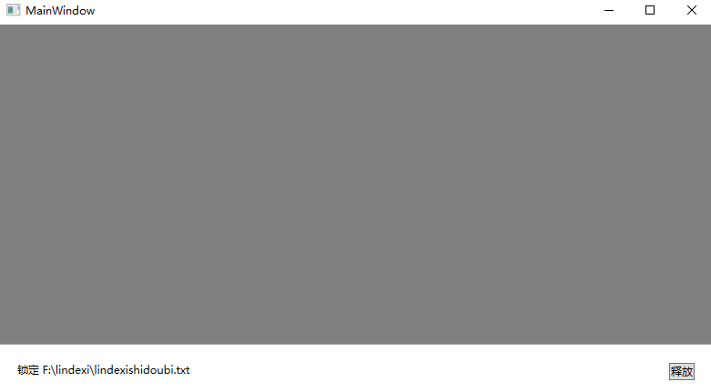
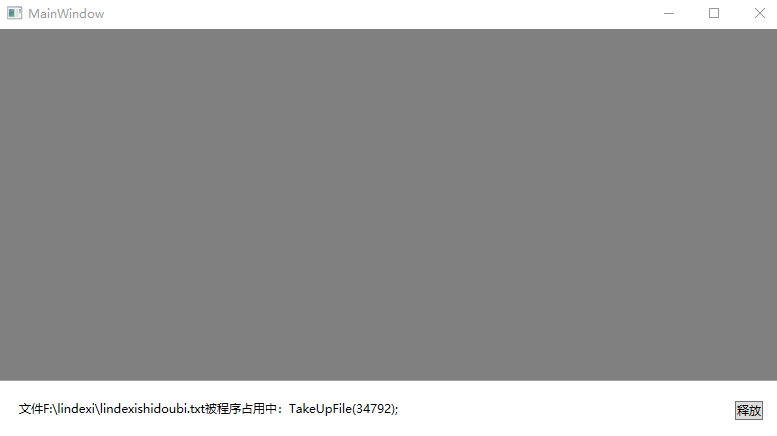

# WPF 制作一个占用文件的测试工具

我在开发软件进行测试时，需要测试拖入的文件被占用时软件的行为，于是就做了一个文件占用工具，此工具可以将某个文件进行占用，以及获取某个文件被哪个进程占用

<!--more-->
<!-- 发布 -->
<!-- 博客 -->

先给大家看一下效果：

<!--  -->


以上是拖入文件到灰色部分，将会让此文件被占用。点击释放按钮即可释放对此文件的占用

如果拖入的文件已被占用了，将会显示占用文件的进程

<!--  -->


此工具的制作十分简单，先看看界面部分，代码如下

```xml
<Window x:Class="TakeUpFile.MainWindow"
        xmlns="http://schemas.microsoft.com/winfx/2006/xaml/presentation"
        xmlns:x="http://schemas.microsoft.com/winfx/2006/xaml"
        xmlns:d="http://schemas.microsoft.com/expression/blend/2008"
        xmlns:mc="http://schemas.openxmlformats.org/markup-compatibility/2006"
        xmlns:local="clr-namespace:TakeUpFile"
        mc:Ignorable="d"
        Title="MainWindow" Height="450" Width="800">
    <Grid>
        <Grid.RowDefinitions>
            <RowDefinition/>
            <RowDefinition Height="Auto"/>
        </Grid.RowDefinitions>
        <Grid Background="Gray" AllowDrop="true" Drop="Grid_Drop">
            
        </Grid>
        <Grid Grid.Row="1" Margin="10,10,10,10">
            <TextBlock x:Name="TracerTextBlock" Margin="10,10,10,10" />
            <Button HorizontalAlignment="Right" Margin="10,10,10,10" Click="Button_Click">释放</Button>
        </Grid>
    </Grid>
</Window>
```

在 Grid_Drop 里面，将使用 FileStream 打开传入的文件，打开方式的设置不共享，也就是占用文件。如果打开失败，使用 [WPF 获取是哪个进程占用了文件](https://blog.lindexi.com/post/WPF-%E8%8E%B7%E5%8F%96%E6%98%AF%E5%93%AA%E4%B8%AA%E8%BF%9B%E7%A8%8B%E5%8D%A0%E7%94%A8%E4%BA%86%E6%96%87%E4%BB%B6.html ) 的方法拿到占用文件进程

```csharp
        private void Grid_Drop(object sender, DragEventArgs e)
        {
            Release();

            var fileList = e.Data.GetData(DataFormats.FileDrop) as string[];
            if (fileList is not null)
            {
                var file = fileList.FirstOrDefault();
                if (file != null)
                {
                    if (File.Exists(file))
                    {
                        try
                        {
                            CurrentFileStream = new FileStream(file, FileMode.Open, FileAccess.ReadWrite, FileShare.None);
                        }
                        catch (IOException ioException)
                        {
                            if (ioException.HResult == unchecked((int)0x80070020))
                            {
                                var processList = FileUtil.WhoIsLocking(file);
                                if (processList != null)
                                {
                                    var message = $"文件{file}被程序占用中：";
                                    foreach (var item in processList)
                                    {
                                        message += $"{item.ProcessName}({item.Id});";
                                    }

                                    TracerTextBlock.Text = message;
                                    return;
                                }
                            }
                        }

                        TracerTextBlock.Text = $"锁定 {file}";
                    }
                }
            }
        }
```

上面的 Release 方法是释放占用

```csharp
        private void Release()
        {
            try
            {
                CurrentFileStream?.Dispose();
            }
            catch
            {
                // 忽略
            }
        }
```

本文代码放在 [github](https://github.com/lindexi/lindexi_gd/tree/7093026adf0907469f39ea69dc67eea10c3a6d4c/TakeUpFile) 和 [gitee](https://gitee.com/lindexi/lindexi_gd/tree/7093026adf0907469f39ea69dc67eea10c3a6d4c/TakeUpFile) 欢迎访问

<a rel="license" href="http://creativecommons.org/licenses/by-nc-sa/4.0/"></a><br />本作品采用<a rel="license" href="http://creativecommons.org/licenses/by-nc-sa/4.0/">知识共享署名-非商业性使用-相同方式共享 4.0 国际许可协议</a>进行许可。欢迎转载、使用、重新发布，但务必保留文章署名[林德熙](http://blog.csdn.net/lindexi_gd)(包含链接:http://blog.csdn.net/lindexi_gd )，不得用于商业目的，基于本文修改后的作品务必以相同的许可发布。如有任何疑问，请与我[联系](mailto:lindexi_gd@163.com)。
