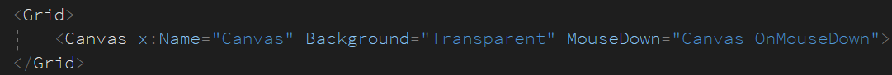

# WPF 动画实战 点击时显示圆圈淡出效果

本文告诉大家一个有趣的动画，在鼠标点击的时候，在点击所在的点显示一个圆圈，然后这个圆圈做动画变大，但是颜色变淡的效果。本文的控件可以让大家将对应的容器放在自己应用里面就能实现这个效果

<!--more-->
<!-- 发布 -->

这个效果特别简单，属于入门级的动画，代码也很少，请看效果

<!--  -->


本文的控件只是一个简单的 Canvas 控件，可以将本文的这个控件替换为你自己需要的控件。或者复制本文的代码，放在你自己的项目里面，只需要让你的项目里面有一个 Canvas 同时这个 Canvas 能接收鼠标事件就能作出本文效果

先在界面放一个 Canvas 控件

<!--  -->


上面代码有一个细节是 `Background="Transparent"` 默认的 Canvas 的背景是 null 也就是不接收命中测试，也就是设置 MouseDown 没有反映。什么是命中测试？就是点击的时候，看命中到哪个元素，如果容器没有设置背景，那么这个容器就不能接收命中测试，也就是点击的时候不会判断点击到这个容器

在后台代码添加鼠标点击的代码

如何在 WPF 中显示一个圆圈？ 在 WPF 可以通过 Ellipse 控件显示椭圆，如果设置他的宽度和高度相同，那么就是一个圆，添加一个 Ellipse 的代码请看下面

```csharp
            var currentSize = 10;

            var ellipse = new Ellipse()
            {
                Width = currentSize,
                Height = currentSize,
                Fill = Brushes.Gray
            };
```

上面代码的 Fill 是设置填充颜色，而要设置圆圈的边框颜色可以使用 Stroke 属性，设置边框粗细使用 StrokeThickness 属性

如何在鼠标点击的地方显示一个圆圈？ 在 WPF 中，可以通过 GetPosition 方法拿到鼠标相对于某个元素的坐标，或者说鼠标点击到某个元素的坐标。通过 TranslateTransform 的方法可以设置某个元素的坐标

获取鼠标相对于 Canvas 的坐标的方法如下

```csharp
    var point = e.GetPosition(Canvas);
```

为什么需要有鼠标获取的时候，是相对于某个控件？原因是不同的控件的坐标是不同的，鼠标点击的绝对坐标是屏幕，但是应用的控件一般都是相对于上一层容器，如窗口等。假设此时的鼠标点击屏幕坐标是 (100,100) 而应用窗口坐标是 (10,10) 那么窗口里面的 x 元素想要知道此时鼠标点击在哪，难道还需要 x 控件自己去拿到当前窗口坐标在哪，然后换算出鼠标点击到 x 空控件的哪里？这样的做法太渣了，所以 WPF 框架就提供了 GetPosition 拿到相对于某个元素的鼠标点击

在拿到鼠标点击到 Canvas 的坐标时如何设置刚才创建的圆圈的坐标，可以通过 TranslateTransform 方法，请看代码

```csharp
            var translateTransform = new TranslateTransform(point.X, point.Y);
            ellipse.RenderTransform = translateTransform;
```

注意 TranslateTransform 的作用是设置水平和垂直平移，需要设置到对应元素的 RenderTransform 里面。这些变换的方法包括了缩放和旋转等。用变换的方法做动画的效率相对会比较高

接下来就是动画的部分了，在 WPF 中的动画需要通过 Storyboard 故事板触发，而通过具体的 Animation 执行对不同的属性的更改。也就是一个 Storyboard 里面包含多个不同的动画，而每个动画都对特定的某个对象的某个属性的更改，通过更改属性的方式做到让某个对象做动画

本文需要做的动画包括让圆圈变大，修改圆圈透明度

让圆圈变大的方法就是修改 Ellipse 的宽度和高度，可以试试下面的方法

```csharp
            var storyboard = new Storyboard();
            var widthAnimation = new DoubleAnimation(toValue: toSize, new Duration(TimeSpan.FromSeconds(1)));
            Storyboard.SetTargetProperty(widthAnimation, new PropertyPath("Width"));
            Storyboard.SetTarget(widthAnimation, ellipse);
            storyboard.Children.Add(widthAnimation);

            var heightAnimation = new DoubleAnimation(toValue: toSize, new Duration(TimeSpan.FromSeconds(1)));
            Storyboard.SetTargetProperty(heightAnimation, new PropertyPath("Height"));
            Storyboard.SetTarget(heightAnimation, ellipse);
            storyboard.Children.Add(heightAnimation);

            storyboard.Begin();
```

上面代码使用 DoubleAnimation 作出连续的动画，在使用 DoubleAnimation 时将会从对应属性的当前值修改到指定值，修改的速度可以通过速度函数设置，默认使用匀速动画。动画的时间通过 Duration 设置

设置完成之后通过 Storyboard.SetTargetProperty 这个静态方法，将 Animation 和对应的元素的属性路径关联起来，也就是 PropertyPath 的作用。关联的时候需要关联属性路径和作用的元素，也就是下面两句代码

```csharp
            Storyboard.SetTargetProperty(widthAnimation, new PropertyPath("Width"));
            Storyboard.SetTarget(widthAnimation, ellipse);
```

将 Animation 添加到 storyboard 才能在 storyboard 开始的时候执行

通过相同的方法设置高度，然后尝试开启动画

```csharp
            storyboard.Begin();
```

此时点击 Canvas 容器的时候，就可以看到在鼠标点击显示圆圈，然后圆圈不断变大

当然，还有下一步就是让圆圈变淡，在 WPF 中可以通过修改圆圈的透明度做动画，请看代码

```csharp
            var opacityAnimation = new DoubleAnimation(toValue: 0, new Duration(TimeSpan.FromSeconds(1)));
            Storyboard.SetTargetProperty(opacityAnimation, new PropertyPath("Opacity"));
            Storyboard.SetTarget(opacityAnimation, ellipse);
            storyboard.Children.Add(opacityAnimation);
```

在 WPF 中使用 Opacity 表示透明度，准确说是不透明度，使用 1 表示完全不透明，使用 0 表示全透明。小伙伴都知道，如果是全透明，也就是看不见

在 Animation 类提供了两个属性，一个是 From 另一个是 To 分别表示让属性从哪里什么值开始修改到哪个值。而 From 属性不设置的话就是从当前值开始

注意上面代码需要放在 `storyboard.Begin();` 前面，不要在动画开始之后再添加 Animation 不然动画没有执行

此时运行代码大概可以看到本文的效果，但是还有一点细节是，刚才只是修改元素的大小，但是元素的左上角不变，也就是在做元素变大的动画时候，其实可以看到不是通过圆心开始变大的

一个优化的方法是在元素做变大的动画的时候，同时修改元素的左上角的坐标，修改左上角移动多少？可以修改移动变大的一半，如从 10 到 15 也就是移动 2.5 单位。在 WPF 中的单位不一定是像素，因为 WPF 和屏幕具体分辨率等有很复杂的关系，详细请看本文最后的参考文档

还记得刚才是如何修改元素的坐标？通过 TranslateTransform 方法修改圆圈的坐标，也就是动画也可以通过修改 TranslateTransform 的 X 和 Y 属性做动画

和上面代码相同，设置 DoubleAnimation 设置 X 和 Y 属性的值。只是这里的属性不是一级的，因为是通过 TranslateTransform 放到 RenderTransform 里面，此时的属性路径相对就长一点

```csharp
            // ( ToWidth(15) - CurrentWidth(10) ) / 2 = 2.5
            var translateTransformX = translateTransform.X - (toSize - currentSize) / 2;
            var xAnimation = new DoubleAnimation(toValue: translateTransformX, new Duration(TimeSpan.FromSeconds(1)));
            Storyboard.SetTargetProperty(xAnimation,
                new PropertyPath("(UIElement.RenderTransform).(TranslateTransform.X)"));
            Storyboard.SetTarget(xAnimation, ellipse);
            storyboard.Children.Add(xAnimation);
```

如上文说的，设置 translateTransformX 的坐标为放大的宽度减去原先的一半，也就是从原先的 10 修改为 15 的一半

而PropertyPath的就是拿到对应的 RenderTransform 属性的值，强行转换为 TranslateTransform 然后拿到 X 属性

对另一个属性也做相同的动画

```csharp
            var translateTransformY = translateTransform.Y - (toSize - currentSize) / 2;
            var yAnimation = new DoubleAnimation(toValue: translateTransformY, new Duration(TimeSpan.FromSeconds(1)));
            Storyboard.SetTargetProperty(yAnimation,
                new PropertyPath("(UIElement.RenderTransform).(TranslateTransform.Y)"));
            Storyboard.SetTarget(yAnimation, ellipse);
```

此时运行代码就能看到本文的效果了

但是点击了很多次之后，会在实时可视化树里面看到 Canvas 存在很多看不到的圆圈元素，原因是这些元素只是透明度是 0 看不到，但是依然在视觉树上面，可以在动画播放完成之后，删除这个元素，请看代码

```csharp
            storyboard.Completed += (o, args) => { Canvas.Children.Remove(ellipse); };
```

本文鼠标点击的代码如下

```csharp
        private void Canvas_OnMouseDown(object sender, MouseButtonEventArgs e)
        {
            var toSize = 15;
            var currentSize = 10;

            var ellipse = new Ellipse()
            {
                Width = currentSize,
                Height = currentSize,
                Fill = Brushes.Gray
            };

            var point = e.GetPosition(Canvas);
            var translateTransform = new TranslateTransform(point.X, point.Y);
            ellipse.RenderTransform = translateTransform;
            Canvas.Children.Add(ellipse);

            var storyboard = new Storyboard();
            var widthAnimation = new DoubleAnimation(toValue: toSize, new Duration(TimeSpan.FromSeconds(1)));
            Storyboard.SetTargetProperty(widthAnimation, new PropertyPath("Width"));
            Storyboard.SetTarget(widthAnimation, ellipse);
            storyboard.Children.Add(widthAnimation);

            var heightAnimation = new DoubleAnimation(toValue: toSize, new Duration(TimeSpan.FromSeconds(1)));
            Storyboard.SetTargetProperty(heightAnimation, new PropertyPath("Height"));
            Storyboard.SetTarget(heightAnimation, ellipse);
            storyboard.Children.Add(heightAnimation);

            var opacityAnimation = new DoubleAnimation(toValue: 0, new Duration(TimeSpan.FromSeconds(1)));
            Storyboard.SetTargetProperty(opacityAnimation, new PropertyPath("Opacity"));
            Storyboard.SetTarget(opacityAnimation, ellipse);
            storyboard.Children.Add(opacityAnimation);

            // ( ToWidth(15) - CurrentWidth(10) ) / 2 = 2.5
            var translateTransformX = translateTransform.X - (toSize - currentSize) / 2;
            var xAnimation = new DoubleAnimation(toValue: translateTransformX, new Duration(TimeSpan.FromSeconds(1)));
            Storyboard.SetTargetProperty(xAnimation,
                new PropertyPath("(UIElement.RenderTransform).(TranslateTransform.X)"));
            Storyboard.SetTarget(xAnimation, ellipse);
            storyboard.Children.Add(xAnimation);

            var translateTransformY = translateTransform.Y - (toSize - currentSize) / 2;
            var yAnimation = new DoubleAnimation(toValue: translateTransformY, new Duration(TimeSpan.FromSeconds(1)));
            Storyboard.SetTargetProperty(yAnimation,
                new PropertyPath("(UIElement.RenderTransform).(TranslateTransform.Y)"));
            Storyboard.SetTarget(yAnimation, ellipse);
            storyboard.Children.Add(yAnimation);

            storyboard.Completed += (o, args) => { Canvas.Children.Remove(ellipse); };
            storyboard.Begin();
        }

```

如果有看不懂的，欢迎在下方评论

本文的全部代码放在[github](https://github.com/lindexi/lindexi_gd/tree/fb053ebb8ab917e5d6f453842e5d4109dd150185/BallkowhejallColalljaygairwair)欢迎小伙伴访问

[将 UWP 的有效像素（Effective Pixels）引入 WPF - 云+社区 - 腾讯云](https://cloud.tencent.com/developer/article/1341500 )

[支持 Windows 10 最新 PerMonitorV2 特性的 WPF 多屏高 DPI 应用开发 - walterlv](https://blog.walterlv.com/post/windows-high-dpi-development-for-wpf.html )

<a rel="license" href="http://creativecommons.org/licenses/by-nc-sa/4.0/"></a><br />本作品采用<a rel="license" href="http://creativecommons.org/licenses/by-nc-sa/4.0/">知识共享署名-非商业性使用-相同方式共享 4.0 国际许可协议</a>进行许可。欢迎转载、使用、重新发布，但务必保留文章署名[林德熙](http://blog.csdn.net/lindexi_gd)(包含链接:http://blog.csdn.net/lindexi_gd )，不得用于商业目的，基于本文修改后的作品务必以相同的许可发布。如有任何疑问，请与我[联系](mailto:lindexi_gd@163.com)。
