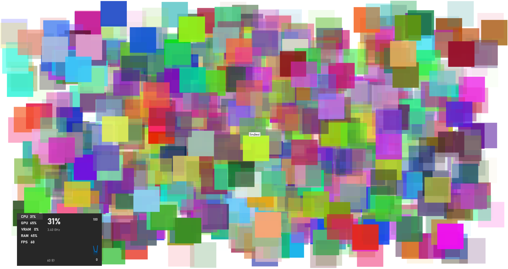

# WPF 动画性能测试应用 一千个半透明矩形做动画

在很多性能测试开始之前，都需要测试一下自己的期望优化的设备的性能上限是多少。我每次都是重新写一个测试应用，因为每次需要优化的方向都不相同。本文将记录一个我写的一个简单的测试应用，这里面包含了一千个半透明的矩形，且矩形都在做动画。可以测试自己的电脑的性能，看看是否一千个带动画的半透明矩形就带不动

<!--more-->
<!-- 发布 -->
<!-- 博客 -->

本文的实现过程非新手友好，但是如果只是想测试一下性能，那只需获取代码跑起来即可，没有什么难度。到本文末尾可以获取全部的可构建运行的代码，按照本文提供的方式可以获取到所有源代码

开始之前，先看一下运行效果

<!--  -->


接下来将告诉大家这个测试应用是如何做的

为了将关注点在于渲染性能或者是动画性能本身，减少其他业务逻辑的干扰，包括业务逻辑间接触发 WPF 的框架逻辑的干扰。比如修改布局层的属性，如元素的宽度高度等，导致布局系统重新布局，耗时在布局上，或者是布局触发的事件被业务监听，额外执行了业务逻辑。本次的测试应用将尽可能减少这部分的干扰，使用比较基础的方式编写

在 MainWindow 的 Loaded 事件里编写实现逻辑，如此可以规避 Win32 窗口创建时的故事，也方便大家进行性能测量

```csharp
    public MainWindow()
    {
        InitializeComponent();

        Loaded += MainWindow_Loaded;
    }

    private void MainWindow_Loaded(object sender, RoutedEventArgs e)
    {
        // 在这里编写代码
    }
```

<!-- 为了规避命中测试的干扰，这里决定作为一个画刷绘制到窗口的背景。如此将可以减少命中测试的影响 -->

为了规避布局的干扰，这里决定作为一个画刷绘制到窗口的背景。如此将可以无视布局逻辑

```csharp
    private void MainWindow_Loaded(object sender, RoutedEventArgs e)
    {
        var drawingGroup = new DrawingGroup();
        using (var drawingContext = drawingGroup.Open())
        {
            // 编写绘制逻辑
        }

        var drawingBrush = new DrawingBrush();
        drawingBrush.Drawing = drawingGroup;

        Background = drawingBrush;
    }
```

获取到 DrawingContext 即可开始绘制带动画的半透明矩形。在 2d 渲染上，矩形是占用资源极低的。再配合纯色画刷，减少了其他类型的画刷带来的其他逻辑的性能影响。加上半透明，如此可以让整个图层的渲染压力极大

开始之前，先画一下底色，选用白色作为底色。绘制底色是为了让 DrawingBrush 不会因为尺寸和窗口的尺寸不匹配导致需要进行缩放

```csharp
        using (var drawingContext = drawingGroup.Open())
        {
            drawingContext.DrawRectangle(Brushes.White, null, new Rect(0, 0, ActualWidth, ActualHeight));
        }
```

接着设置将要绘制的矩形的尺寸，以及在循环里面绘制多少次

```csharp
                    var size = new Size(100, 100);

                    for (int i = 0; i < 1000; i++)
                    {
                        // 添加绘制逻辑
                    }
```


在循环里面添加带动画的半透明矩形。添加矩形需要设置矩形的起点，以及动画的终点，如此界面才会比较复杂

```csharp
                var startPoint = new Point(Random.Shared.Next((int) (ActualWidth - size.Width)),
                    Random.Shared.Next((int) (ActualHeight - size.Height)));
                var endPoint = new Point(Random.Shared.Next((int) (ActualWidth - size.Width)),
                    Random.Shared.Next((int) (ActualHeight - size.Height)));
```

使用随机数生成矩形的起点和终点，不要超过画布的大小，如此将不会导致画布缩放

```csharp
                var startPoint = new Point(Random.Shared.Next((int) (ActualWidth - size.Width)),
                    Random.Shared.Next((int) (ActualHeight - size.Height)));
                var endPoint = new Point(Random.Shared.Next((int) (ActualWidth - size.Width)),
                    Random.Shared.Next((int) (ActualHeight - size.Height)));
```

接着添加随机的颜色的纯色画刷，采用随机颜色减少画刷被重复利用。创建纯色画刷本身不需要多少资源，请看 [dotnet 读 WPF 源代码笔记 创建 SolidColorBrush 性能没有想象那么差](https://blog.lindexi.com/post/dotnet-%E8%AF%BB-WPF-%E6%BA%90%E4%BB%A3%E7%A0%81%E7%AC%94%E8%AE%B0-%E5%88%9B%E5%BB%BA-SolidColorBrush-%E6%80%A7%E8%83%BD%E6%B2%A1%E6%9C%89%E6%83%B3%E8%B1%A1%E9%82%A3%E4%B9%88%E5%B7%AE.html )

但是使用画刷是需要一些资源的

```csharp
                var random = new byte[3];
                Random.Shared.NextBytes(random);
                var brush = new SolidColorBrush(Color.FromRgb(random[0], random[1], random[2]))
                {
                    Opacity = Random.Shared.NextDouble()
                };
```

再给画刷加上半透明，对于绘制来说，半透明和非半透明的性能差距是非常大的。因为半透明需要对背景进行采样，而背景又是其他的元素，自身由是其他的元素的背景，于是渲染需要的资源会非常大

接着继续添加动画

```csharp
                IEasingFunction? easingFunction = Random.Shared.Next(10) switch
                {
                    1 => new CubicEase(),
                    2 => new BounceEase(),
                    3 => new CircleEase(),
                    //4 => new ElasticEase(),
                    5 => new ExponentialEase(),
                    6 => new PowerEase(),
                    7 => new QuadraticEase(),
                    8 => new QuarticEase(),
                    9 => new SineEase(),
                    _ => null,
                };

                var rectAnimation = new RectAnimation(new Rect(startPoint, size), new Rect(endPoint, size),
                    new Duration(TimeSpan.FromSeconds(Random.Shared.Next(1, 100))))
                {
                    RepeatBehavior = RepeatBehavior.Forever,
                    AutoReverse = true,
                    EasingFunction = easingFunction,
                };

                var animationClock = rectAnimation.CreateClock();
```

每个动画都是不相同的

将此矩形添加绘制

```csharp
                drawingContext.DrawRectangle(brush, null, new Rect(startPoint, size), animationClock);
```

敲黑板，调用 DrawingContext 的各个方法，不是立即开启渲染，而是将渲染的指导数据写入到 WPF 框架。在 WPF 框架里面，将通过渲染调度逻辑将渲染的指导数据调度到 WPF 的 GFX 层。在 GFX 层再将具体的渲染指导数据写入到 DirectX 层，最后由 DirectX 层进行实际的渲染

以上就是所有的逻辑，可以尝试跑一下，看看在自己的机器上的效果

另外，再试试在 Debug 和 Release 下分别执行，以及调试下和非调试下执行的性能

本文的代码放在[github](https://github.com/lindexi/lindexi_gd/tree/3fdee3ab25c576016c2c756b3ec79cbe15158b72/JarqiwhaywherBuwailaryahefairha) 和 [gitee](https://gitee.com/lindexi/lindexi_gd/tree/3fdee3ab25c576016c2c756b3ec79cbe15158b72/JarqiwhaywherBuwailaryahefairha) 欢迎访问

可以通过如下方式获取本文的源代码，先创建一个空文件夹，接着使用命令行 cd 命令进入此空文件夹，在命令行里面输入以下代码，即可获取到本文的代码

```
git init
git remote add origin https://gitee.com/lindexi/lindexi_gd.git
git pull origin 3fdee3ab25c576016c2c756b3ec79cbe15158b72
```

以上使用的是 gitee 的源，如果 gitee 不能访问，请替换为 github 的源。请在命令行继续输入以下代码

```
git remote remove origin
git remote add origin https://github.com/lindexi/lindexi_gd.git
git pull origin 3fdee3ab25c576016c2c756b3ec79cbe15158b72
```

获取代码之后，进入 JarqiwhaywherBuwailaryahefairha 文件夹

更多渲染相关，更多 WPF 底层相关，更多性能测试相关，请参阅 [博客导航](https://blog.lindexi.com/post/%E5%8D%9A%E5%AE%A2%E5%AF%BC%E8%88%AA.html )