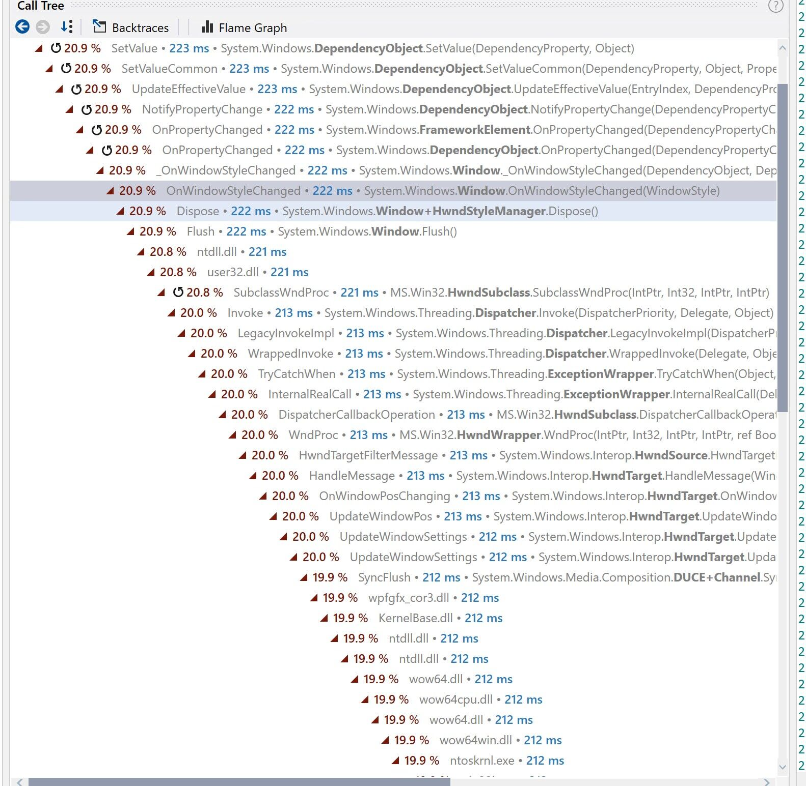
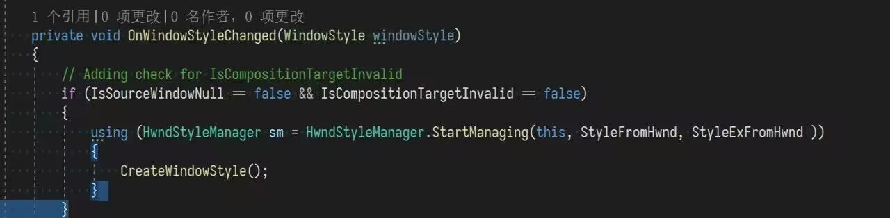

# WPF 启动性能优化 在 EnsureHandle 之前设置 WindowStyle 提升性能

本文将记录一个在 WPF 应用程序启动过程中的性能优化点。如果一个窗口需要设置 WindowStyle 属性，那么在窗口 EnsureHandle 之前，设置 WindowStyle 属性将会比在 EnsureHandle 之后设置快不少

<!--more-->
<!-- CreateTime:2023/8/19 16:13:03 -->
<!-- 标题： WPF 优化 EnsureHandle 启动性能 -->
<!-- 发布 -->
<!-- 博客 -->

在 dotTrace 里的一次测量在窗口 EnsureHandle 之后设置 WindowStyle 属性的时间大概是 200 毫秒，这个时间在启动过程中可以被认为是非常长的时间，而且这还是一个在 UI 线程上的时间。以下是 dotTrace 测量结果

<!--  -->

可以看到在窗口 EnsureHandle 之后设置 WindowStyle 属性，需要等待 Win32 窗口的响应。再阅读 WPF 源代码，可以看到在窗口 EnsureHandle 之后设置 WindowStyle 属性，就需要等待 HwndStyleManager 的 Dispose 方法。以下是 WPF 的源代码

<!--  -->

看起来这是非常合理的耗时，在 Win32 窗口创建出来之后，也就是对应 EnsureHandle 拿到窗口句柄之后，这时如果设置 WindowStyle 属性，就需要同步给到 Win32 窗口。为了同步设置给到 Win32 窗口，自然就需要等待 Win32 窗口处理了，对应的就是以上代码的等待渲染线程挂载窗口的一次渲染逻辑。这里需要说明的是上文说的等待渲染线程挂载窗口的一次渲染逻辑是我的猜测，根据 wpfgfx_cor3.dll 以及 SyncFlush 方法进行猜测的

在 EnsureHandle 之前设置 WindowStyle 则可以规避以上路径从而提升性能。提升性能的原因是在 EnsureHandle 之前，也就是 Win32 窗口创建之前，对 WindowStyle 的赋值走的是一个简单的属性赋值，毫无性能损耗。在真正创建窗口时，才读取 WindowStyle 属性，根据属性去创建 Win32 窗口。由于 WPF 应用本来就需要创建 Win32 窗口，也就是此时对 WindowStyle 的设置本身是不影响 Win32 窗口的创建的，换句话说就是在 Win32 窗口创建之前设置 WindowStyle 约等于免费

那在启动完成之后，窗口渲染完成之后设置 WindowStyle 呢？此时基本上不需要等待渲染，设置 WindowStyle 也就是一个 Win32 函数调用的损耗，大概测量时间在 30ms 左右。也就是说只有在启动过程中，想要做性能优化，才需要关注 EnsureHandle 之前设置 WindowStyle 属性。本文以上测试由 [lsj](https://blog.sdlsj.net/ ) 提供