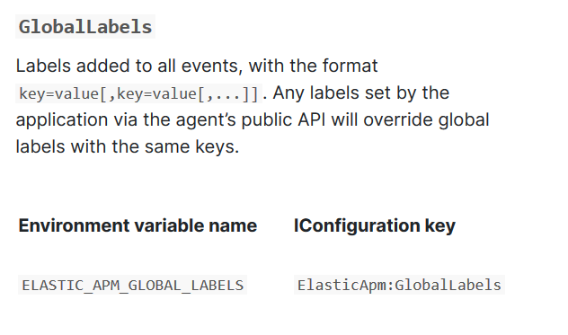

# WPF 和 ASP.NET Core 通过 elastic APM 上报信息

我的运维小伙伴搭建了 elastic 平台，我有一个 ASP.NET Core 后台和一个 WPF 客户端，我想要让这两个应用的数据都上报，可以使用 Elastic.Apm 库上报

<!--more-->
<!-- 发布 -->

先使用 ASP.NET Core 为例子，本文不包含任何 elastic 服务器搭建

只需要安装一个 NuGet 库加上10行代码就能完成

通过 NuGet 安装 [Elastic.Apm.NetCoreAll](https://www.nuget.org/packages/Elastic.Apm.NetCoreAll) 库

打开 appsettings.json 文件，添加以下配置

```csharp
{
  "Logging": 
  {
    "LogLevel": 
    {
      "Default": "Information",
      "Microsoft": "Warning",
      "Microsoft.Hosting.Lifetime": "Information",
      "Elastic.Apm": "Debug"
    }
  },
  "AllowedHosts": "*",

  "ElasticApm":
   {
      "ServerUrls":  "http://es-apm.lindexi.com",
      "SecretToken":  "",
      "ServiceName": "lindexishidoubi",
      "TransactionSampleRate": 1.0
    }
}

```

其中包括在 Logging 里面的 `"Elastic.Apm": "Debug"` 和 `"ElasticApm"` 的值，一般的 ServerUrls 等值是不需要修改的，多个应用使用相同的值

需要自定义的值有两个，第一个是 "Elastic.Apm": "Debug" 请根据自己的需求填写，可以选的值是 Critical, Error, Warning, Info, Debug, Trace第二个是 "ServiceName": "lindexishidoubi", 请替换为你的应用名

接下来打开 Startup.cs 代码文件，添加命名空间

using Elastic.Apm.NetCoreAll;

然后在 Configure 添加下面代码


```csharp
public void Configure(IApplicationBuilder app, IWebHostEnvironment env)
{
          app.UseAllElasticApm(Configuration);
          // 忽略代码
}
```

上报的数据将会自动包含链路数据以及接口耗时

如果有自定义的信息，如主机信息，自定义信息上报可以通过 GlobalLabels 上报，所有加在这个列表里面的值每次都会上传

<!--  -->


如果是 WPF 接入，基本上用来上报异常信息，可以通过下面代码上报

```csharp
var transaction = Elastic.Apm.Agent
        .Tracer.StartTransaction("lindexi", ApiConstants.TypeRequest);
try
{
    
}
catch (Exception e)
{
    transaction.CaptureException(e);
    throw;
}
finally
{
    transaction.End();
}
```

在 WPF 使用需要先安装 [Elastic.Apm](https://www.nuget.org/packages/Elastic.Apm) 库

<a rel="license" href="http://creativecommons.org/licenses/by-nc-sa/4.0/"></a><br />本作品采用<a rel="license" href="http://creativecommons.org/licenses/by-nc-sa/4.0/">知识共享署名-非商业性使用-相同方式共享 4.0 国际许可协议</a>进行许可。欢迎转载、使用、重新发布，但务必保留文章署名[林德熙](http://blog.csdn.net/lindexi_gd)(包含链接:http://blog.csdn.net/lindexi_gd )，不得用于商业目的，基于本文修改后的作品务必以相同的许可发布。如有任何疑问，请与我[联系](mailto:lindexi_gd@163.com)。
