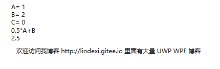
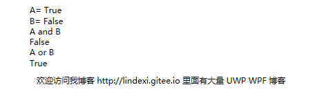

# WPF 在绑定表达式添加计算

很多时候一些简单的使用绑定需要对绑定的源做处理就需要通过转换器，这样的代码写起来不好看

本文告诉大家通过一个简单的库可以实现在界面绑定的时候通过表达式不需要转换

<!--more-->
<!-- CreateTime:2018/12/22 16:12:56 -->

<!-- csdn -->

首先通过 Nuget 安装 CalcBinding 库，注意 Nuget 的地址是 [https://api.nuget.org/v3/index.json](https://api.nuget.org/v3/index.json) 如果没有找到这个库就请复制链接点击更新，再输入 `CalcBinding` 寻找 

<!--  -->


在使用这个库之前需要引用命名空间，打开 MainWindow.xaml 文件，添加命名空间

```csharp
xmlns:c="clr-namespace:CalcBinding;assembly=CalcBinding"
```

然后创建一个数据用来绑定

```csharp
    public class ViewModel : INotifyPropertyChanged
    {
        public double A
        {
            get => _a;
            set
            {
                if (value.Equals(_a)) return;
                _a = value;
                OnPropertyChanged();
            }
        }

        public double B
        {
            get => _b;
            set
            {
                if (value.Equals(_b)) return;
                _b = value;
                OnPropertyChanged();
            }
        }

        public double C
        {
            get => _c;
            set
            {
                if (value.Equals(_c)) return;
                _c = value;
                OnPropertyChanged();
            }
        }

        public event PropertyChangedEventHandler PropertyChanged;
        private double _a = 1;
        private double _b = 2;
        private double _c;

        [NotifyPropertyChangedInvocator]
        private void OnPropertyChanged([CallerMemberName] string propertyName = null)
        {
            PropertyChanged?.Invoke(this, new PropertyChangedEventArgs(propertyName));
        }
    }

```

这时在界面如果需要创建一个 TextBlock 绑定三个值 A + B + C 就可以通过下面的方法

```xml
        <TextBlock Text="{c:Binding A+B+C}" HorizontalAlignment="Center" VerticalAlignment="Center"></TextBlock>

```

通过直接写表达式的方式就可以，十分简单

那如果需要加上一些常量怎么做，如计算 `0.5*A+B` 可以怎么写？

```xml
<TextBlock Text="{c:Binding 0.5*A+B}" />
```

修改一下界面然后运行

```xml
            <StackPanel>
                <TextBlock>
                    <Run Text="A=" />
                    <Run Text="{Binding A}" />
                </TextBlock>
                <TextBlock>
                    <Run Text="B=" />
                    <Run Text="{Binding B}" />
                </TextBlock>
                <TextBlock>
                    <Run Text="C=" />
                    <Run Text="{Binding C}" />
                </TextBlock>
                <TextBlock Text="0.5*A+B" />
                <TextBlock Text="{c:Binding 0.5*A+B}" />
            </StackPanel>
```

<!--  -->


如果此时的还有一些布尔量怎么办？打开 ViewModel 类添加下面代码

```csharp
        public bool BoolA
        {
            get => _boolA;
            set
            {
                if (value == _boolA) return;
                _boolA = value;
                OnPropertyChanged();
            }
        }

        public bool BoolB
        {
            get => _boolB;
            set
            {
                if (value == _boolB) return;
                _boolB = value;
                OnPropertyChanged();
            }
        }

        private bool _boolB;
        private bool _boolA = true;
```

如果需要绑定 A 和 B 可以这样写

```
<TextBlock Text="{c:Binding BoolA and BoolB}" />
<TextBlock Text="{c:Binding BoolA or BoolB}" />
<TextBlock Text="{c:Binding BoolA and BoolB or BoolB}" />
```

修改一下界面

```
            <StackPanel>
                <TextBlock>
                    <Run Text="A=" />
                    <Run Text="{Binding BoolA}" />
                </TextBlock>
                <TextBlock>
                    <Run Text="B=" />
                    <Run Text="{Binding BoolB}" />
                </TextBlock>
                <TextBlock Text="A and B" />
                <TextBlock Text="{c:Binding BoolA and BoolB}" />
                <TextBlock Text="A or B" />
                <TextBlock Text="{c:Binding BoolA or BoolB}" />
            </StackPanel>

```

<!--  -->


其他可以写的是表达式

```csharp
<TextBox Text="{c:Binding A+B+C}"/>
<TextBox Text="{c:Binding A-B-C}"/>
<TextBox Text="{c:Binding A*(B+C)}"/>
<TextBox Text="{c:Binding 2*A-B*0.5}"/>
<TextBox Text="{c:Binding A/B, StringFormat={}{0:n2} --StringFormat is used}"/> {with string format}
<TextBox Text="{c:Binding A%B}"/>
<TextBox Text="{c:Binding '(A == 1) ? 10 : 20'}"/> {ternary operator}
```

判断布尔

```csharp
<CheckBox Content="!IsChecked" IsChecked="{c:Binding !IsChecked}"/>
<TextBox Text="{c:Binding 'IsChecked and IsFull'}"/> {'and' is equvalent of '&&'}
<TextBox Text="{c:Binding '!IsChecked or (A > B)'}"/> {'or' is equvalent of '||', but you can leave '||'}
<TextBox Text="{c:Binding '(A == 1) and (B less= 5)'}"/> {'less=' is equvalent of '<='}
<TextBox Text="{c:Binding (IsChecked || !IsFull)}"/>
```

因为在 xaml 不能使用 `&&` `||` `<=` 所以需要使用 and or 'less=' 替换

另外对于 `:` 之前需要添加空格，如下面代码

```csharp
<TextBox Text="{c:Binding '(A == 2)?IsChecked : IsFull}"/> <!-- right -->
<TextBox Text="{c:Binding '(A == 2)?IsChecked :!IsFull}"/> <!-- right -->
<TextBox Text="{c:Binding '(A == 2) ? IsChecked :4 + IsFull}"/> <!-- right -->
```

这些都是对的，但是下面的代码是无法运行

```csharp
<TextBox Text="{c:Binding '(A == 2)?IsChecked:IsFull}"/> <!-- wrong -->
```

可以绑定静态的值，静态的值的写法 `xmlNamespace:Class.StaticProperty.NestedProperty` 命名空间下的类的静态属性的属性

对于经常计算值这里也可以简单使用，如 Math 里面的方法

```csharp
<TextBox Text="{c:Binding Math.Sin(A*Math.PI/180), StringFormat={}{0:n5} }"/>
<TextBox Text="{c:Binding A*Math.PI}" />
```

枚举值也可以点命名空间的枚举的值，可以用来判断 `xmlNamespace:EnumClass.Value` 如在 Foo 枚举里面有 A 这个值

```csharp
<CheckBox IsChecked="{c:Binding 'Foo==local:Foo.A'}" />
```

经常会将 bool 转换为 Visibility 这个库也有简单的方法

```csharp
<Button Content="TargetButton" Visibility="{c:Binding HasPrivileges, FalseToVisibility=Collapsed}"/>
or just
<Button Content="TargetButton" Visibility="{c:Binding !HasPrivileges}"/>

<Button Content="TargetButton" Visibility="{c:Binding !HasPrivileges, FalseToVisibility=Hidden}"/>
```

如果需要在样式使用，需要通过 RelativeSource 找到方法

```csharp
<Button Content="Button" Width="100">
    <Button.Template>
        <ControlTemplate>
            <TextBox Width="{c:Binding Width+10, RelativeSource={RelativeSource TemplatedParent} }"/>
        </ControlTemplate>
    </Button.Template>
</Button> 
```

[Alex141/CalcBinding: Advanced WPF Binding which supports expressions in Path property and other features](https://github.com/Alex141/CalcBinding )

<a rel="license" href="http://creativecommons.org/licenses/by-nc-sa/4.0/"></a><br />本作品采用<a rel="license" href="http://creativecommons.org/licenses/by-nc-sa/4.0/">知识共享署名-非商业性使用-相同方式共享 4.0 国际许可协议</a>进行许可。欢迎转载、使用、重新发布，但务必保留文章署名[林德熙](http://blog.csdn.net/lindexi_gd)(包含链接:http://blog.csdn.net/lindexi_gd )，不得用于商业目的，基于本文修改后的作品务必以相同的许可发布。如有任何疑问，请与我[联系](mailto:lindexi_gd@163.com)。
