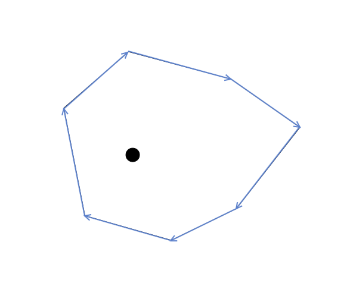
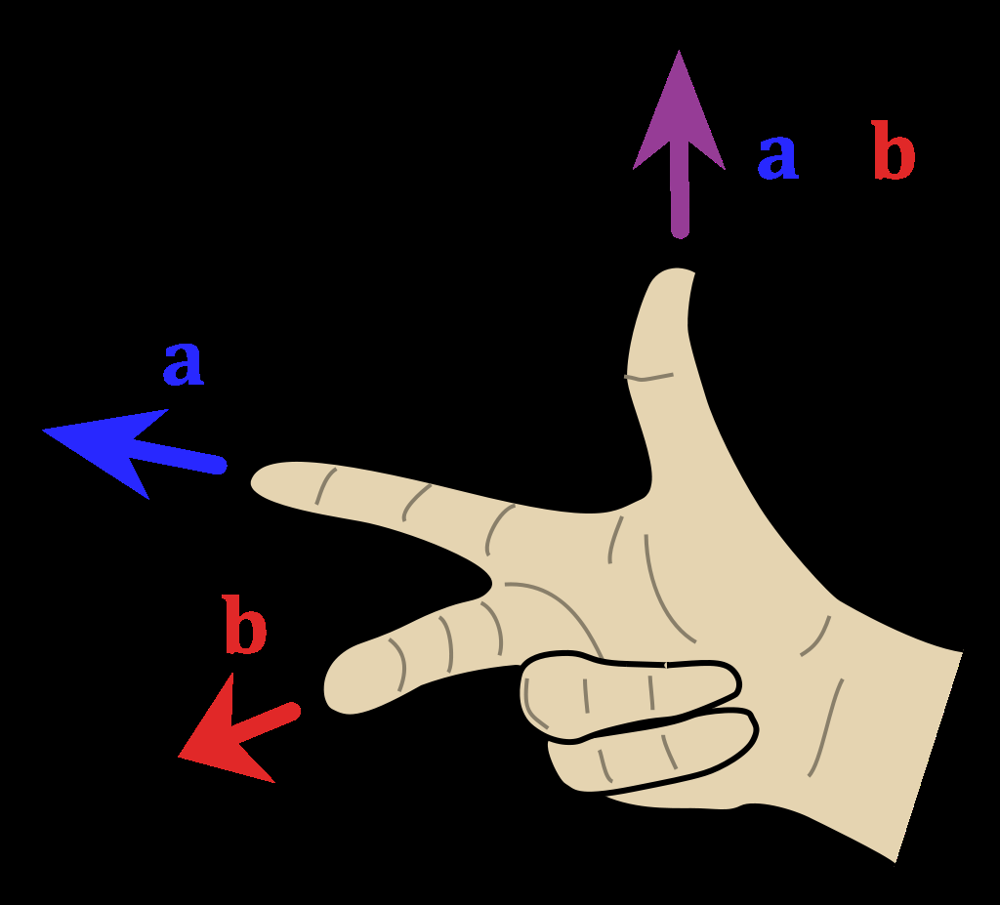
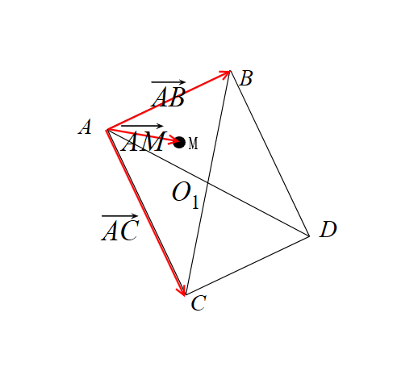
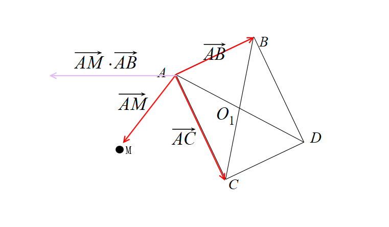
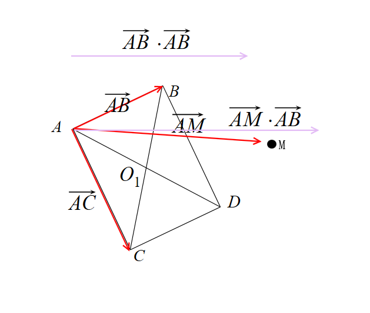

# WPF 基础 2D 图形学知识 判断点是否在任意几何内部方法

对于任意的几何图形，如四边形，已知几何的顶点，求给定的一个点是否在几何之内的方法有多个，有 WPF 专用部分以及通用算法部分，有通用算法部分在 UWP 和 Xamarin 等上可用的方法

<!--more-->
<!-- 发布 -->

如果在 WPF 中，可以使用 Geometry 表示几何，在这个类里面有提供特别的方法用来判断点是否在几何内

## 判断点在几何内

这个做法也叫命中测试，输入是一个 Geometry 和一个点，输出是判断点是否在闭合的 Geometry 几何内。方法是通过 WPF 的 Geometry 的 FillContains 方法，这个方法可以传入点也可以传入另一个 Geometry 用来判断是否在几何内

```csharp
Geometry.FillContains(position)
```

和 FillContains 相对的是 StrokeContains 方法，和 Fill 方法不相同的是，调用 StrokeContains 判断的是在几何的线上，而不是在几何内

我写了一点测试的逻辑，如果鼠标在几何内，那么几何显示灰色

<!--  -->


以上代码放在 [github](https://github.com/lindexi/lindexi_gd/tree/5f804a35/LeajemhurhoCaiwhemqurhahawwhaw ) 和 [gitee](https://gitee.com/lindexi/lindexi_gd/tree/5f804a35/LeajemhurhoCaiwhemqurhahawwhaw ) 欢迎小伙伴访问

这是一个 WPF 专用的方法，这个方法是 WPF 给通用的几何图形的方法。而大家都知道，如果一个算法是通用的算法，就意味着性能肯定不如特别优化的算法。而在几何图形里面，有很多特殊的几何图形，如凸多边形和三角形，矩形等，这些几何图形可以采用特别优化的算法，可以用来提升性能

## 求点是否在任意凸多边形之内的算法

对于凸多边形，可以有特别的算法优化。这是一个通用的算法，意味着可以不依赖 WPF 在任意的 dotnet 平台下的框架运行

大家可以在网上搜一道 ACM 的题目 hdu1756 用来找到更多解决方法。题目的表述是 丘比特的箭，点是否在面内，对于点A是否在多边形P内的判定算法。可以找到网上有很多算法用于解决此问题，不仅仅是凸多边形，对于凹多边形也有计算方法

本文以下仅仅只提供了凸多边形的使用向量方式进行计算的方法，这是我自己用过的算法

已知有多边形和点如下

<!--  -->


按照任意方向将几何的相邻的点连接作为向量，此时可以发现如果点在几何内，那么点就在这些向量的相同的一边

<!--  -->

对于二维的向量，点和向量只有三个关系，要么在向量的方向上，要么就在向量的两边。如下图，用不同的颜色表示三个不同的关系

<!--  -->


当然了，向量自己本身就有方向，如下图，两个方向相反的向量，此时的点对于两个向量来说都在相同的方向

<!--  -->


其实看到下面的动态图片就能更好的理解，如果绕点进行旋转让这两个向量方向相同，此时可以看到对于两个向量来说，点都在相同的方向

<!--  -->


如何判断点在向量的某个方向？其实相当于判断两个向量的夹角，如下图，同时取几何相邻点以及与需要判断的点分别做两个向量，可以求出两个向量之间的夹角

<!--  -->


而咱为了性能考虑，不会真的求向量的夹角的值来判断。因为向量的夹角的值，可以看到有两个方向的值，一个是小于 180 度的，另一个是大于 180 度的

<!--  -->


咱可以根据向量的一个特性，也就是通过向量的叉积来判断，判断方法如下图，取几何边上的点，任意选择顺时针或逆时针方向，将该点于相邻的下一个点连接组成向量，接着将该点于要判断的点组成向量，求这两个向量的叉积的值。如果所有的向量的叉积都在相同的方向，也就是说点在所有的几何邻边组成的线段集的相同一侧，也就是点在几何内部。而判断向量的叉积都在相同的方向，可以通过叉积的数值是否大于零判断，所有的叉积的数值都是大于零的或者都是小于零的，那么就证明点在几何内部。如果有叉积的数值等于零那么证明点在几何的某个边上

<!--  -->


那么为什么使用叉积的数值可以用来判断点在向量的方向？原因在于叉积的几何意义。在数学上叉积又称为外积，假定有两个向量是 **a** 和 **b** 而且这两个都是二维向量。那么求 **a** 和 **b** 的叉积的意义就是获取垂直于 **a** 和 **b** 的 **c** 向量，其方向由右手定则决定，模长等于以两个向量为边的平行四边形的面积。也就是说叉积其实算出来的是一个新的向量。而咱在上面判断的算法就仅仅用到了判断 **c** 向量的方向，而用不到模长。请看以下动态图片可以加深对向量叉积的理解，下面图片来自维基百科

<!--  -->


如果在几何上的所有顶点作出的两个向量，分别求出的叉积拿到的新向量，如果这些新向量的方向都相同，那么证明点在几何上的所有顶点分别连接的向量与要判断的点都在相同的方向。如下图，如果几何所有的顶点与相邻顶点和要判断的点分别相连的向量的方向都是向上的，或者都是向下的，那么就能证明要判断的点都在 几何所有的顶点和相邻顶点

<!--  -->


下面就到了编写代码了，要求传入要判断的点，以及将几何的顶点按照顺时针或逆时针方向存放的数组。返回的就是点是否在几何内，包含在几何的边上

```csharp
    internal static partial class Geometry2DHelper
    {
        public static bool 求点是否在任意凸多边形内部算法(Point 点, Point[] 多边形的顶点集)
        {
            // 如果是 true 表示大于零方向，否则是小于零方向
            bool? sign = null;

            for (var i = 0; i < 多边形的顶点集.Length; i++)
            {
                var next = i + 1;
                if (i == 多边形的顶点集.Length - 1)
                {
                    next = 0;
                }

                var currentPoint = 多边形的顶点集[i];
                var nextPoint = 多边形的顶点集[next];

                var v = nextPoint - currentPoint;
                var p = 点;
                var vp = p - currentPoint;

                var n = Vector.CrossProduct(v, vp);
                if (n > 0)
                {
                    if (sign == null)
                    {
                        // 如果这是第一次设置，那么给定值
                        sign = true;
                    }
                    else if (sign == false)
                    {
                        // 如果原先的其他点都是小于零的方向，而这个点是大于零的方向，那么点不在内
                        return false;
                    }
                }
                else if (n < 0)
                {
                    if (sign == null)
                    {
                        sign = false;
                    }
                    else if (sign == true)
                    {
                        // 如果原先的其他点都是大于零的方向，而这个点是小于零的方向，那么就存在不相同的方向
                        return false;
                    }
                }
                else
                {
                    // n == 0
                    // 可以忽略，点在线上
                }
            }

            return true;
        }
    }
```

以上代码放在 [github](https://github.com/lindexi/lindexi_gd/tree/560206be/笔迹 ) 和 [gitee](https://gitee.com/lindexi/lindexi_gd/tree/560206be/笔迹 ) 欢迎小伙伴访问

更多阅读

[File:Cross product.gif - 维基百科，自由的百科全书](https://zh.wikipedia.org/wiki/File:Cross_product.gif )

[叉积 - 维基百科，自由的百科全书](https://zh.wikipedia.org/wiki/%E5%8F%89%E7%A7%AF )

[向量点乘（内积）和叉乘（外积、向量积）概念及几何意义解读_牧野的博客-CSDN博客_向量点乘](https://blog.csdn.net/dcrmg/article/details/52416832 )

[二维向量的叉积是标量还是向量？ - RunningSnail - 博客园](https://www.cnblogs.com/tgycoder/p/4901600.html )

[二维向量加减法、模、点乘、叉乘以及坐标系旋转平移 - 简书](https://www.jianshu.com/p/ca048c46dee6 )

[关于向量叉乘意义的思考 越学越执着](https://jevonsc1.github.io/2019/11/27/%E5%85%B3%E4%BA%8E%E5%90%91%E9%87%8F%E5%8F%89%E4%B9%98%E6%84%8F%E4%B9%89%E7%9A%84%E6%80%9D%E8%80%83/ )

[详谈判断点在多边形内的七种方法（最全面） hdu1756 hrbust1429 为例_WilliamSun0122的博客-CSDN博客](https://blog.csdn.net/WilliamSun0122/article/details/77994526 )

[丘比特的箭（点是否在面内）- HDU 1756 - 云+社区 - 腾讯云](https://cloud.tencent.com/developer/article/1179775 )

[HDU 1756 Cupid's Arrow(判定点在多边形内)](https://blog.csdn.net/u013480600/article/details/39993561 )

[ACM-计算几何之Cupid's Arrow——hdu1756继续激情，继续奋斗](https://blog.csdn.net/lttree/article/details/24301607 )


## 求旋转矩形命中测试

这是纯数学计算，给定一个旋转矩形，已知这个旋转矩形的各个顶点坐标。以及一个点，求这个点是否在旋转矩形内

定义给定的点是 M 点，而旋转矩形顶点是 A B C D 点。在旋转矩形没有经过旋转的顶点如下

<!--  -->


其实在不在 WPF 中，影响都不大，如何判断一个点在旋转后的矩形中，只需要根据公式计算就可以

根据公式可以求出点是否在旋转矩形

```
 (0<AM⋅AB<AB⋅AB)∧(0<AM⋅AC<AC⋅AC)
```

以上逻辑中的 AM 等表示的是向量。在 WPF 中可以使用两个点相减拿到向量。求 AM 的向量就是使用 A 点减去 M 点

```csharp
   var am = A - m;
```

判断代码

```csharp
        /// <summary>
        /// 判断点是否在旋转矩形内
        /// </summary>
        /// <param name="point"></param>
        /// <returns></returns>
        public bool Contains(Point point)
        {
            // https://math.stackexchange.com/a/190373/440577
            // (0<AM⋅AB<AB⋅AB)∧(0<AM⋅AC<AC⋅AC)
            var am = point - A;
            var ab = B - A;
            var am_ab = am * ab;
            var ab_ab = ab * ab;

            var ac = C - A;
            var am_ac = am * ac;
            var ac_ac = ac * ac;

            if (am_ab > 0 && am_ab < ab_ab /*(0<AM⋅AB<AB⋅AB)*/
                          && am_ac > 0 && am_ac < ac_ac)
            {
                return true;
            }

            return false;
        }
```

以上数学的证明大概如下，有旋转矩形如下，有点 M 如下

<!--  -->


定义的向量如下

<!--  -->


简单来说的向量的点乘的含义就是降向量维度，如上面的二维向量的点乘可以拿到一维的标量的值

```csharp
            double am_ab = am * ab;
            double ab_ab = ab * ab;

            double am_ac = am * ac;
            double ac_ac = ac * ac;
```

<!--  -->


从图片可以看到所有的向量都从 A 点出发，此时可以将 A 点设置为原点，如果此时的 M 是在矩形外，如认为是在如下图的左边，那么此时向量相乘的值就会是负数，因为相对于 A 作为原点

<!--  -->


因此小于零的就不在矩形内，这就是旋转之前水平方向的判断 `0<AM⋅AB` 的依据

而如果 `AB⋅AB` 就表示 AB 的向量长度，也就是说如果 AM 的距离实际上大于 AB 的距离，如点在矩形的右边，那么点也不在矩形内

<!--  -->


因此旋转之前的水平方向需要满足 `0<AM⋅AB<AB⋅AB` 才可以。而垂直方向也同理，只是将 AB 修改为 AC 两点

以上代码放在 [github](https://github.com/lindexi/lindexi_gd/tree/12324b85/LeajemhurhoCaiwhemqurhahawwhaw ) 和 [gitee](https://gitee.com/lindexi/lindexi_gd/tree/12324b85/LeajemhurhoCaiwhemqurhahawwhaw ) 欢迎小伙伴访问


更多请看 [WPF 基础 2D 图形学知识](https://blog.lindexi.com/post/WPF-%E5%9F%BA%E7%A1%80-2D-%E5%9B%BE%E5%BD%A2%E5%AD%A6%E7%9F%A5%E8%AF%86.html )

<a rel="license" href="http://creativecommons.org/licenses/by-nc-sa/4.0/"></a><br />本作品采用<a rel="license" href="http://creativecommons.org/licenses/by-nc-sa/4.0/">知识共享署名-非商业性使用-相同方式共享 4.0 国际许可协议</a>进行许可。欢迎转载、使用、重新发布，但务必保留文章署名[林德熙](http://blog.csdn.net/lindexi_gd)(包含链接:http://blog.csdn.net/lindexi_gd )，不得用于商业目的，基于本文修改后的作品务必以相同的许可发布。如有任何疑问，请与我[联系](mailto:lindexi_gd@163.com)。
