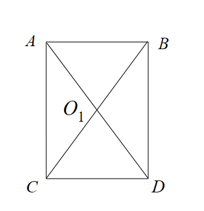

# WPF 基础 2D 图形学知识

本文收集一些基础的知识，本文的逻辑是在 WPF 框架下实现，有包含了默认的坐标系以及默认类型定义。对于 WPF 系的包括 Xamarin 和 UWP 都适合

<!--more-->
<!-- CreateTime:2021/1/27 19:18:15 -->


## 运行代码

本文的代码都放在 GitHub 或 Gitee 上，代码都可以下载进行运行。基本的代码都可以使用一句 `dotnet run` 跑起来，当然，前提是你的 dotnet 版本需要足够新

本文代码协议基于 MIT 协议，请放心抄代码

## 根据点集求外接矩形

先看图片，通过给定的点的集合，求这些点的外接矩形

<!--  -->


传入的是 `List<Point> pointList` 要求传出的是 Rect 类，实现代码如下

<!--  -->


在新建矩形的时候，采用了第一个点创建，如果没有传入点，将使用默认的原点

```csharp
        private Rect CreateRect(List<Point> pointList)
        {
            var rect = new Rect(pointList[0], new Size(0, 0));

            for (var i = 1; i < pointList.Count; i++)
            {
                rect.Union(pointList[i]);
            }

            return rect;
        }
```

以上代码放在 [github](https://github.com/lindexi/lindexi_gd/tree/df873f1e/LeajemhurhoCaiwhemqurhahawwhaw ) 和 [gitee](https://gitee.com/lindexi/lindexi_gd/tree/df873f1e/LeajemhurhoCaiwhemqurhahawwhaw ) 欢迎小伙伴访问

## 绘制闭合折线

通过 Polygon 可以根据点集绘制闭合折线

```csharp
            var polygon = new Polygon()
            {
                Points = new PointCollection(PointList),
                Stroke = Brushes.Red,
            };
```

<!--  -->


以上代码放在 [github](https://github.com/lindexi/lindexi_gd/tree/0d947fe2/LeajemhurhoCaiwhemqurhahawwhaw ) 和 [gitee](https://gitee.com/lindexi/lindexi_gd/tree/0d947fe2/LeajemhurhoCaiwhemqurhahawwhaw ) 欢迎小伙伴访问


## 判断点在几何内

这个做法也叫命中测试，输入是一个 Geometry 和一个点，输出是判断点是否在闭合的 Geometry 几何内。方法是通过 WPF 的 Geometry 的 FillContains 方法，这个方法可以传入点也可以传入另一个 Geometry 用来判断是否在几何内

```csharp
Geometry.FillContains(position)
```

和 FillContains 相对的是 StrokeContains 方法，和 Fill 方法不相同的是，调用 StrokeContains 判断的是在几何的线上，而不是在几何内

我写了一点测试的逻辑，如果鼠标在几何内，那么几何显示灰色

<!--  -->


以上代码放在 [github](https://github.com/lindexi/lindexi_gd/tree/5f804a35/LeajemhurhoCaiwhemqurhahawwhaw ) 和 [gitee](https://gitee.com/lindexi/lindexi_gd/tree/5f804a35/LeajemhurhoCaiwhemqurhahawwhaw ) 欢迎小伙伴访问

更多请看 [WPF 基础 2D 图形学知识 判断点是否在任意几何内部方法](https://blog.lindexi.com/post/WPF-%E5%9F%BA%E7%A1%80-2D-%E5%9B%BE%E5%BD%A2%E5%AD%A6%E7%9F%A5%E8%AF%86-%E5%88%A4%E6%96%AD%E7%82%B9%E6%98%AF%E5%90%A6%E5%9C%A8%E4%BB%BB%E6%84%8F%E5%87%A0%E4%BD%95%E5%86%85%E9%83%A8%E6%96%B9%E6%B3%95.html )

以上文档包含了求旋转矩形命中测试，给定一个旋转矩形，已知这个旋转矩形的各个顶点坐标。以及一个点，求这个点是否在旋转矩形内的算法

## 给定中心点和宽度高度旋转角度求旋转矩形顶点坐标

如有定义旋转矩形的顶点分别是 A B C D 四个点，在没有进行旋转之前如图

<!--  -->


给定中心点 O1 和宽度高度，以及使用弧度表示的旋转角度可以创建旋转矩形，代码逻辑如下

```csharp
    class 旋转矩形
    {
        public 旋转矩形(Point a, Point b, Point c, Point d)
        {
            /*
             *A    B
             *------
             *|    |
             *|    |
             *------
             *C    D
             */
            // 顺序需要是一个逆时针，因此就是 A C D B 的传入

            Polygon = new Point[4]
            {
                a, c, d, b
            };

            A = a;
            B = b;
            C = c;
            D = d;
        }

        public static 旋转矩形 Create旋转矩形(Point position, double width, double height, double rotation)
        {
            var w = width;
            var h = height;

            var ax = -w / 2;
            var ay = -h / 2;
            var bx = w / 2;
            var by = ay;
            var cx = ax;
            var cy = h / 2;
            var dx = bx;
            var dy = cy;

            var a = 已知未旋转的相对矩形中心点的坐标求旋转后的相对于零点的坐标(ax, ay, position, rotation);
            var b = 已知未旋转的相对矩形中心点的坐标求旋转后的相对于零点的坐标(bx, by, position, rotation);
            var c = 已知未旋转的相对矩形中心点的坐标求旋转后的相对于零点的坐标(cx, cy, position, rotation);
            var d = 已知未旋转的相对矩形中心点的坐标求旋转后的相对于零点的坐标(dx, dy, position, rotation);
            return new 旋转矩形(a, b, c, d);
        }

        /// <summary>
        /// 根据未旋转的相对圆角矩形 中心点 的坐标计算旋转后的相对于零点的坐标。
        /// </summary>
        /// <returns>旋转后的相对于零点的坐标</returns>
        private static Point 已知未旋转的相对矩形中心点的坐标求旋转后的相对于零点的坐标(double x, double y, Point position, double 旋转弧度)
        {
            var x0 = position.X;
            var y0 = position.Y;
            var θ = 旋转弧度;
            return new Point(x * Math.Cos(θ) - y * Math.Sin(θ) + x0, x * Math.Sin(θ) + y * Math.Cos(θ) + y0);
        }

        public Point A { get; }
        public Point B { get; }
        public Point C { get; }
        public Point D { get; }

        public Point[] Polygon { get; }
    }
```

上面代码的 Polygon 仅仅只是用来给界面显示

以上代码放在 [github](https://github.com/lindexi/lindexi_gd/tree/12324b85/LeajemhurhoCaiwhemqurhahawwhaw ) 和 [gitee](https://gitee.com/lindexi/lindexi_gd/tree/12324b85/LeajemhurhoCaiwhemqurhahawwhaw ) 欢迎小伙伴访问

在命名上，使用 Rotation 指的是旋转，包含了角度和旋转中心点。而 Angle 表示的是旋转的角度，默认咱使用的是弧度表示

## 向量的获取方法

有两个点分别是 A 和 B 两点，求向量 AB 的值

```csharp
AB = B - A;
```

向量里面，采用的点的相减可以获取向量。如上面代码表示向量 AB 以 A 为起点，以 B 为终点的向量

<!--  -->


## [求向量旋转角度](https://blog.lindexi.com/post/WPF-%E5%9F%BA%E7%A1%80-2D-%E5%9B%BE%E5%BD%A2%E5%AD%A6%E7%9F%A5%E8%AF%86-%E6%B1%82%E5%90%91%E9%87%8F%E6%97%8B%E8%BD%AC%E8%A7%92%E5%BA%A6.html )

求向量的三角函数 sin 或 cos 的值。或已知两个点，求两点相连线段角度

请看 [WPF 基础 2D 图形学知识 求向量旋转角度](https://blog.lindexi.com/post/WPF-%E5%9F%BA%E7%A1%80-2D-%E5%9B%BE%E5%BD%A2%E5%AD%A6%E7%9F%A5%E8%AF%86-%E6%B1%82%E5%90%91%E9%87%8F%E6%97%8B%E8%BD%AC%E8%A7%92%E5%BA%A6.html )

## 角度弧度

使用 Math 的三角函数计算返回值使用的是弧度单位，如下面代码

```csharp
        /// <summary>
        /// 获取向量的 cos（θ）值
        /// </summary>
        /// <param name="vector"></param>
        /// <returns></returns>
        public static double GetCos(this Vector vector)
            => vector.Y / vector.Length;
```

在 C# 中将弧度转换为角度可以使用如下代码

```csharp
var 角度 = 弧度 / Math.PI * 180;
```

## 最简代码绘制 Geometry 几何

使用 Path 元素

```
      <Path x:Name="DrawElement" Stroke="Red" StrokeThickness="1" HorizontalAlignment="Left" VerticalAlignment="Top"></Path>

      DrawElement.Data = geometry;
```


## 参考

《人教版初中数学》

《程序员的数学 线性代数》

《同济线性代数教材》

<a rel="license" href="http://creativecommons.org/licenses/by-nc-sa/4.0/"></a><br />本作品采用<a rel="license" href="http://creativecommons.org/licenses/by-nc-sa/4.0/">知识共享署名-非商业性使用-相同方式共享 4.0 国际许可协议</a>进行许可。欢迎转载、使用、重新发布，但务必保留文章署名[林德熙](http://blog.csdn.net/lindexi_gd)(包含链接:http://blog.csdn.net/lindexi_gd )，不得用于商业目的，基于本文修改后的作品务必以相同的许可发布。如有任何疑问，请与我[联系](mailto:lindexi_gd@163.com)。
