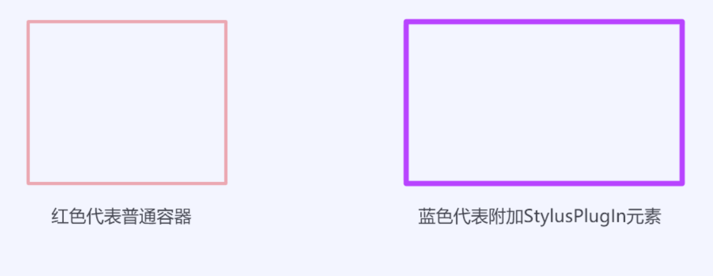
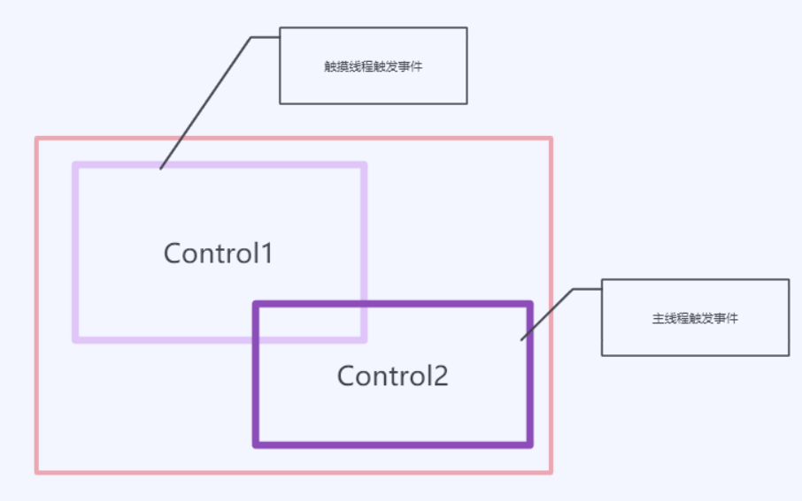
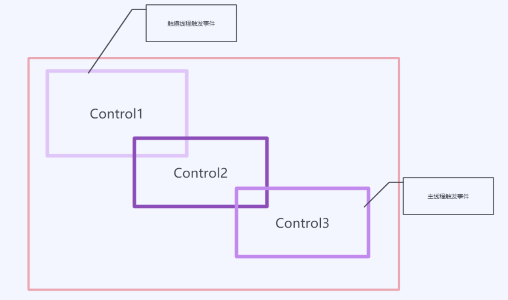
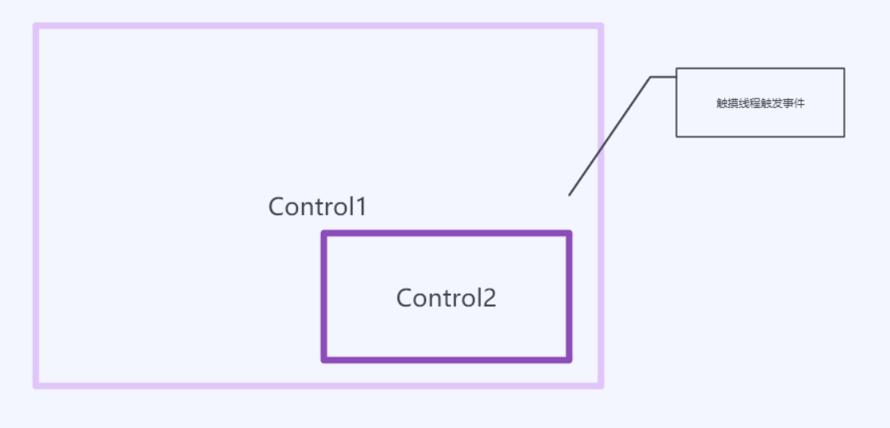

# WPF 多个 StylusPlugIn 的事件触发顺序

如果在 WPF 使用 StylusPlugIn 同时在同一个界面用多个元素都加上 StylusPlugIn 那么事件触发的顺序将会很乱

我建议是不要让 StylusPlugIn 有重叠，在没有理解 StylusPlugIn 之前请不要写出让 StylusPlugIn 有重叠的代码。因为可能有小伙伴移动了一个元素就让你的代码的行为和之前写的不一样

<!--more-->
<!-- CreateTime:2019/11/29 10:20:41 -->

<!-- csdn -->
<div id="toc"></div>

如果多个 StylusPlugIn 附加的元素没有重叠，那么所有元素的工作都会符合预期。也就是点到哪个元素，将会触发对应元素的 StylusPlugIn 方法

因为本文比较复杂，主要是很无聊的原理，所以只想了解现象的小伙伴只看下面图片就可以

我将会使用两个不同的框代表不同的元素，红色的框代表的是普通的容器，而蓝色代表附加StylusPlugIn元素

<!--  -->


对同容器内两个重叠元素，将会同时触发两个元素的 StylusPlugIn 事件，不同的是在最底层的元素将会在触摸线程触发，而在最上层的元素将会是主线程触发

<!--  -->


对同容器内多个重叠元素，将知道最上层和最底层的元素会触发事件，不同的是在最底层的元素将会在触摸线程触发，而在最上层的元素将会是主线程触发

<!--  -->


如果是一个附加 StylusPlugIn 的容器，包含一个附加 StylusPlugIn 的元素，那么只有元素会触发在触摸线程触发事件

<!--  -->


代码放在 github 建议下载代码测试

- [点击查看同容器内两个重叠元素例子](https://github.com/lindexi/lindexi_gd/tree/cab38b1073ee81caa50284ae6ed9920c7f6a275e/HoqawkuwemwajaJalerjanicear)
- [点击查看同容器内多个重叠元素例子](https://github.com/lindexi/lindexi_gd/tree/20228402e681006a1ec7fa592fe4a18e916812c1/HoqawkuwemwajaJalerjanicear)
- [点击查看容器和包含一个元素例子](https://github.com/lindexi/lindexi_gd/blob/803ed917efcdffbe4ad2655c17e3d399bb0f17c8/HoqawkuwemwajaJalerjanicear/MainWindow.xaml)

如果不想了解原理，请关闭页面

在阅读本文之前，请先看[WPF 高速书写 StylusPlugIn 原理](https://blog.lindexi.com/post/WPF-%E9%AB%98%E9%80%9F%E4%B9%A6%E5%86%99-StylusPlugIn-%E5%8E%9F%E7%90%86.html)

如果多个元素有重叠，那么就需要分为以下不同的重叠方法

## 同容器内两个重叠元素

先定义一个自定义控件和一个 StylusPlugIn1 类

```csharp
    public class CustomControl : Grid
    {
        public CustomControl()
        {
            Background = Brushes.White;
        }

        public StylusPlugInCollection StylusPlugInCollection => StylusPlugIns;
    }

    public class StylusPlugIn1 : StylusPlugIn
    {
        public StylusPlugIn1()
        {
        }

        public string Name { set; get; }

        protected override void OnStylusDown(RawStylusInput rawStylusInput)
        {
            Debug.WriteLine($"{Name} Down 当前线程{Thread.CurrentThread.Name} id={Thread.CurrentThread.ManagedThreadId}");
            base.OnStylusDown(rawStylusInput);
        }

        public override string ToString()
        {
            return $"{Name}";
        }
    }
```

在界面创建两个 CustomControl 元素加入到相同一个 Grid 作为元素

```xml
    <Grid>
        <local:CustomControl x:Name="Control1">
            <local:CustomControl.StylusPlugInCollection>
                <local:StylusPlugIn1 Name="Stylus 1"></local:StylusPlugIn1>
            </local:CustomControl.StylusPlugInCollection>
        </local:CustomControl>
        <local:CustomControl x:Name="Control2" >
            <local:CustomControl.StylusPlugInCollection>
                <local:StylusPlugIn1 Name="Stylus 2"></local:StylusPlugIn1>
            </local:CustomControl.StylusPlugInCollection>
        </local:CustomControl>
    </Grid>
```

此时尝试触摸一下屏幕，可以看到下面输出

```csharp
Stylus 1 Down 当前线程Stylus Input id=3
Stylus 2 Down 当前线程 id=1
```

也就是传入的 `Stylus 1` 和 `Stylus 2` 都收到了 Down 但是分别是通过不同的线程传入

这里有一点疑惑是为什么 Control2 的界面层级比 Control1 的高，但是为什么反而是 `Stylus 1` 先收到按下

在[WPF 高速书写 StylusPlugIn 原理](https://blog.lindexi.com/post/WPF-%E9%AB%98%E9%80%9F%E4%B9%A6%E5%86%99-StylusPlugIn-%E5%8E%9F%E7%90%86.html)有说到一点原理，但是在这篇博客我不想在这个方面讲细节，所以将细节放在这篇博客

在 PenContexts.HittestPlugInCollection 方法，将会返回一个 StylusPlugInCollection 用于决定处理 StylusInput 线程的逻辑，而这个方法的代码如下

```csharp
		private StylusPlugInCollection HittestPlugInCollection(Point pt)
		{
			foreach (StylusPlugInCollection stylusPlugInCollection in this._plugInCollectionList)
			{
				if (stylusPlugInCollection.IsHit(pt))
				{
					return stylusPlugInCollection;
				}
			}
			return null;
		}
```

这里的 `_plugInCollectionList` 就是全局添加到元素的 StylusPlugInCollection 列表，从上面代码可以看到没有做任何的排序，也就是拿到第一个可以命中的元素就返回。而这个字段的添加是依赖于视觉树添加的顺序，这也就是本文开始告诉大家的，不要做出重叠的原因

关于 `_plugInCollectionList` 字段是如何添加的，将会在下文说到，现在回到开始的问题

在触摸线程 StylusInput 线程拿到的 StylusPlugInCollection 是第一个满足条件的，而刚好按照视觉树是 Control1 先添加到视觉树，所以返回的就是第一个元素

在第一个元素返回之后，触发了 Down 就完成了触摸线程的逻辑了。而 Control2 是如何触发的？

请看 Control2 的调用堆栈

```csharp
 	PresentationCore.dll!System.Windows.Input.StylusPlugIns.StylusPlugInCollection.FireRawStylusInput.AnonymousMethod__0()
 	PresentationCore.dll!System.Windows.Input.StylusPlugIns.StylusPlugInCollection.ExecuteWithPotentialLock(System.Action action)
 	PresentationCore.dll!System.Windows.Input.StylusPlugIns.StylusPlugInCollection.FireRawStylusInput(System.Windows.Input.StylusPlugIns.RawStylusInput args)
 	PresentationCore.dll!System.Windows.Input.StylusWisp.WispLogic.VerifyStylusPlugInCollectionTarget(System.Windows.Input.RawStylusInputReport rawStylusInputReport)
 	PresentationCore.dll!System.Windows.Input.StylusWisp.WispLogic.PreNotifyInput(object sender, System.Windows.Input.NotifyInputEventArgs e)
 	PresentationCore.dll!System.Windows.Input.InputManager.ProcessStagingArea()
 	PresentationCore.dll!System.Windows.Input.InputManager.ProcessInput(System.Windows.Input.InputEventArgs input)
 	PresentationCore.dll!System.Windows.Input.StylusWisp.WispLogic.InputManagerProcessInput(object oInput)
```

可以从上面堆栈看到这是主线程的调用堆栈，通过上面的输出可以看到这个方法是在主线程触发

在 [WispLogic.VerifyStylusPlugInCollectionTarget](https://github.com/dotnet/wpf/blob/ac9d1b7a6b0ee7c44fd2875a1174b820b3940619/src/Microsoft.DotNet.Wpf/src/PresentationCore/System/Windows/Input/Stylus/Wisp/WispLogic.cs#L2620) 方法将调用触摸命中的元素的方法

```csharp
            UIElement newTarget = InputElement.GetContainingUIElement(rawStylusInputReport.StylusDevice.DirectlyOver as DependencyObject) as UIElement;
            if (newTarget != null)
            {
                targetPIC = rawStylusInputReport.PenContext.Contexts.FindPlugInCollection(newTarget);
            }
```

现在 WPF 开放源代码了，以上代码在 [WispLogic.cs#L2638](https://github.com/dotnet/wpf/blob/ac9d1b7a6b0ee7c44fd2875a1174b820b3940619/src/Microsoft.DotNet.Wpf/src/PresentationCore/System/Windows/Input/Stylus/Wisp/WispLogic.cs#L2638) 可以看到在找到 newTarget 的时候将会调用 FindPlugInCollection 方法寻找

而 targetPIC 的定义如下

```csharp
            // See if we have a plugin for the target of this input.
            StylusPlugInCollection targetPIC = null;
```

也就是在当前命中的是元素，同时在这个元素可以找到 StylusPlugInCollection 那么将给这个变量赋值

调用代码请看代码

```csharp
               // Now fire RawStylusInput if needed to the right plugincollection.
                if (sendRawStylusInput)
                {
                    // We are on the pen thread, just call directly.
                    targetPIC.FireRawStylusInput(rawStylusInputReport.RawStylusInput);
                    updateEventPoints = (updateEventPoints || rawStylusInputReport.RawStylusInput.StylusPointsModified);

                    // Indicate we've used a stylus plugin
                    Statistics.FeaturesUsed |= StylusTraceLogger.FeatureFlags.StylusPluginsUsed;
                }
```

所以将会看到有 `Stylus 1` 和 `Stylus 2` 的 Down 都被调用，但是不同的是 `Stylus 2` 是在主线程调用

## 同容器内多个重叠元素

在上面告诉大家同容器内两个重叠元素将会都触发事件

但是千万不要认为多个重叠的元素都会被触发，其实只有最先加入视觉树的元素和命中到的元素会触发，如下面代码

```xml
       <local:CustomControl x:Name="Control1">
            <local:CustomControl.StylusPlugInCollection>
                <local:StylusPlugIn1 Name="Stylus 1"></local:StylusPlugIn1>
            </local:CustomControl.StylusPlugInCollection>
        </local:CustomControl>
        <local:CustomControl x:Name="Control2" >
            <local:CustomControl.StylusPlugInCollection>
                <local:StylusPlugIn1 Name="Stylus 2"></local:StylusPlugIn1>
            </local:CustomControl.StylusPlugInCollection>
        </local:CustomControl>
        <local:CustomControl x:Name="Control3" >
            <local:CustomControl.StylusPlugInCollection>
                <local:StylusPlugIn1 Name="Stylus 3"></local:StylusPlugIn1>
            </local:CustomControl.StylusPlugInCollection>
        </local:CustomControl>
```

如果理解了上面的逻辑可以知道，第一个元素将会在触摸线程调用，而最后一个元素在主线程命中测试找到也会被调用，那么第二个元素呢

其实第二个元素因为没有在主线程命中测试找到，所以就不会被调用，上面代码在触摸屏幕可以看到下面代码

```csharp
Stylus 1 Down 当前线程Stylus Input id=3
Stylus 3 Down 当前线程 id=1
```

## 容器和包含一个元素

如果容器本身就附加了 StylusPlugIn 同时容器里面也包含一个附加的元素，如下面代码，那么触发效果是什么

```xml
        <local:CustomControl x:Name="Control1">
            <local:CustomControl.StylusPlugInCollection>
                <local:StylusPlugIn1 Name="Stylus 1" />
            </local:CustomControl.StylusPlugInCollection>
            <local:CustomControl.Children>
                <local:CustomControl x:Name="Control2">
                    <local:CustomControl.StylusPlugInCollection>
                        <local:StylusPlugIn1 Name="Stylus 2" />
                    </local:CustomControl.StylusPlugInCollection>
                </local:CustomControl>
            </local:CustomControl.Children>
        </local:CustomControl>
```

通过运行代码可以看到输出的只有 Control2 事件

在 `PenContexts.AddStylusPlugInCollection` 方法会将当前元素的 StylusPlugIn 添加到全局的字段，而添加的时候会调用 `PenContexts.FindZOrderIndex` 方法，在这个方法将会决定添加的 StylusPlugIn 所在字段的顺序，因为在通过命中测试获取点击到的元素是按照字段列表的顺序获取，返回第一个满足的元素。在字段列表的顺序将会决定哪个元素响应

在 FindZOrderIndex 将会让 Control2 添加到最前，也就是在触摸线程命中测试将会返回 Control2 触发，而在主线程命中测试也是返回第二个控件

所以第一个控件没有被触发事件

<a rel="license" href="http://creativecommons.org/licenses/by-nc-sa/4.0/"></a><br />本作品采用<a rel="license" href="http://creativecommons.org/licenses/by-nc-sa/4.0/">知识共享署名-非商业性使用-相同方式共享 4.0 国际许可协议</a>进行许可。欢迎转载、使用、重新发布，但务必保留文章署名[林德熙](http://blog.csdn.net/lindexi_gd)(包含链接:http://blog.csdn.net/lindexi_gd )，不得用于商业目的，基于本文修改后的作品务必以相同的许可发布。如有任何疑问，请与我[联系](mailto:lindexi_gd@163.com)。
