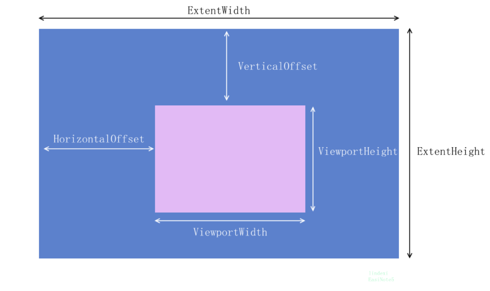
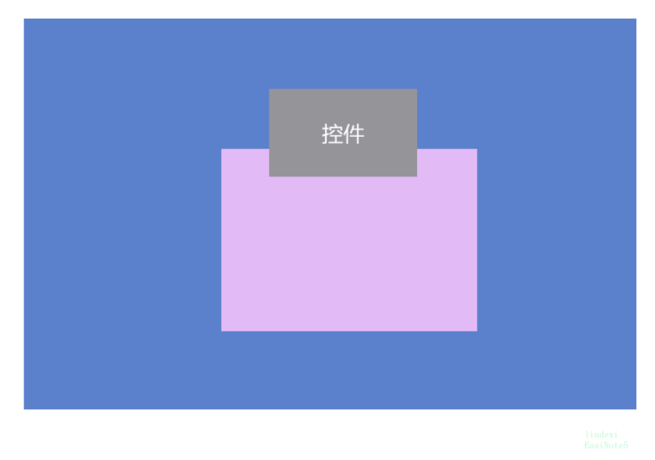

# WPF 如何判断一个控件在滚动条的里面是用户可见

我有一个控件，这个控件放在滚动条里面，如果在滚动条滚动到这个控件可以被用户看见的时候，我能知道这个事件，或从什么时机可以拿到用户可以看见的范围修改？

<!--more-->
<!-- CreateTime:2019/4/29 9:42:02 -->

<!-- csdn -->

昨天[星期八再娶你](https://www.cnblogs.com/hupo376787) 大佬问我如何判断在滚动条内可以看到某个元素，他需要在滚动条里面放一个视频播放器，在用户看不到这个播放器的时候自动停下这个播放器

在 WPF 可以通过 ScrollChanged 拿到当前的滚动到哪同时拿到滚动条可见的宽度和高度

在 ScrollChangedEventArgs 提供了多个属性用于拿到当前的滚动条的可见的宽度和高度，滚动条的水平移动和垂直的移动，具体请看下图

<!--  -->


在用户修改外层控件的宽度或高度让滚动条的高度或宽度进行修改的时候，可以从 ViewportWidthChange 和 ViewportHeightChange 属性知道滚动条的可视宽度和高度修改了多少

在用户修改滚动条里面的控件的宽度或高度的时候，可以从 ExtentWidthChange 等属性知道用户修改了多少

那么如果判断某个控件在滚动条可见内就可以拿到某个控件的外接矩形和滚动条可见大小进行矩形判断，请看下图

<!--  -->


那么如何拿到一个控件的外接矩形？首先需要知道这个控件在外层的垂直或水平偏移，也就是这个控件在外层控件的左上角坐标是多少，然后还需要知道这个控件的宽度和高度，这样就可以知道这个控件的外接矩形，拿到一个元素在外层控件的左上角坐标可以通过拿到这个控件的`(0,0)` 坐标转换到外层控件，计算出这个坐标是相对外层控件的大小

例如我有一个控件是 control 他的外层控件是 StackPanel 通过下面代码就可以看到控件的左上角的大小

```csharp
            var top = control.TranslatePoint(new Point(), StackPanel);
```

我拿到了左上角还需要拿到控件的宽度和高度才能计算出矩形，可以使用下面代码

```csharp
            // 控件的宽度和高度
            var controlBounds = new Rect(top, control.DesiredSize);
```

此时计算滚动条的用户可见的大小，通过滚动条的水平和垂直移动加上宽度和高度，请看代码

```csharp
    var viewBounds = new Rect(new Point(e.HorizontalOffset, e.VerticalOffset), new Size(e.ViewportWidth, e.ViewportHeight));
```

判断 controlBounds 和 viewBounds 是否相交就可以知道用户是否可以看到这个控件，当然如果是想要判断用户可以完全看到这个控件，就是判断滚动条是否完全显示里面的控件

```csharp
            if (viewBounds.Contains(controlBounds))
            {
                Debug.WriteLine("控件完全显示");
            }
            else if (viewBounds.IntersectsWith(controlBounds))
            {
                Debug.WriteLine("用户可以看到控件");
            }
```

下面是我实际写的代码

我在滚动添加了一个控件，在里面添加了很多文本，其中有一个是歪楼的文本

```csharp
        <ScrollViewer ScrollChanged="ScrollViewer_OnScrollChanged">
            <StackPanel x:Name="StackPanel">
                <TextBlock Text="123"></TextBlock>
                <TextBlock Text="123"></TextBlock>
                <TextBlock Text="123"></TextBlock>
                <TextBlock Text="123"></TextBlock>
                <TextBlock Text="123"></TextBlock>
                <TextBlock Text="123"></TextBlock>
                <TextBlock Text="123"></TextBlock>
                <TextBlock Text="123"></TextBlock>
                <TextBlock Text="123"></TextBlock>
                <TextBlock Text="123"></TextBlock>
                <TextBlock Text="123"></TextBlock>
                <TextBlock Text="123"></TextBlock>
                <TextBlock Text="123"></TextBlock>
                <TextBlock Text="123"></TextBlock>
                <TextBlock Text="123"></TextBlock>
                <TextBlock Text="123"></TextBlock>
                <TextBlock Text="123"></TextBlock>
                <TextBlock Text="123"></TextBlock>
                <TextBlock Text="123"></TextBlock>
                <TextBlock Text="123"></TextBlock>
                <TextBlock Text="123"></TextBlock>
                <TextBlock Text="123"></TextBlock>
                <TextBlock Text="123"></TextBlock>
                <TextBlock Text="123"></TextBlock>
                <TextBlock Text="123"></TextBlock>
                <TextBlock Text="123"></TextBlock>
                <TextBlock Text="123"></TextBlock>
                <TextBlock Text="123"></TextBlock>
                <TextBlock Text="123"></TextBlock>
                <TextBlock Text="123"></TextBlock>
                <TextBlock Text="123"></TextBlock>
                <TextBlock Text="123"></TextBlock>
                <TextBlock Text="123"></TextBlock>
                <TextBlock Text="123"></TextBlock>
                <TextBlock Text="123"></TextBlock>
                <TextBlock Text="123"></TextBlock>
                <TextBlock Text="123"></TextBlock>
                <TextBlock Text="123"></TextBlock>
                <TextBlock Text="123"></TextBlock>
                <TextBlock Text="123"></TextBlock>
                <TextBlock x:Name="TextBlock" Text="歪楼"></TextBlock>
                <TextBlock Text="123"></TextBlock>
                <TextBlock Text="123"></TextBlock>
                <TextBlock Text="123"></TextBlock>
                <TextBlock Text="123"></TextBlock>
                <TextBlock Text="123"></TextBlock>
            </StackPanel>
        </ScrollViewer>

```

我需要在歪楼的文本被用户看到的时候输出，于是我就在后台代码通过本文上面提供的方法拿到这个元素的矩形判断

```csharp
        private void ScrollViewer_OnScrollChanged(object sender, ScrollChangedEventArgs e)
        {
            UIElement control = TextBlock;

            var top = control.TranslatePoint(new Point(), StackPanel);
            // 控件的宽度和高度
            var controlBounds = new Rect(top, control.DesiredSize);

            // 用户可以看到的大小
            var viewBounds = new Rect(new Point(e.HorizontalOffset, e.VerticalOffset),
                new Size(e.ViewportWidth, e.ViewportHeight));

            if (viewBounds.IntersectsWith(controlBounds))
            {
                Debug.WriteLine("歪楼");
            }
            else
            {
                Debug.WriteLine("不歪楼");
            }
        }

```

代码放在[github](https://github.com/lindexi/lindexi_gd/tree/d7dcb508e81184a76441834113159761646de5d9/BallkowhejallColalljaygairwair)


<a rel="license" href="http://creativecommons.org/licenses/by-nc-sa/4.0/"></a><br />本作品采用<a rel="license" href="http://creativecommons.org/licenses/by-nc-sa/4.0/">知识共享署名-非商业性使用-相同方式共享 4.0 国际许可协议</a>进行许可。欢迎转载、使用、重新发布，但务必保留文章署名[林德熙](http://blog.csdn.net/lindexi_gd)(包含链接:http://blog.csdn.net/lindexi_gd )，不得用于商业目的，基于本文修改后的作品务必以相同的许可发布。如有任何疑问，请与我[联系](mailto:lindexi_gd@163.com)。  
