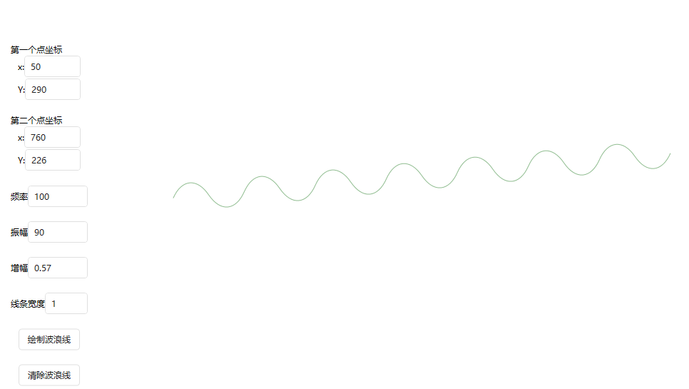
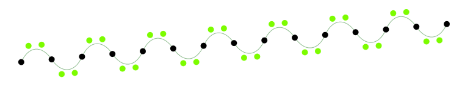
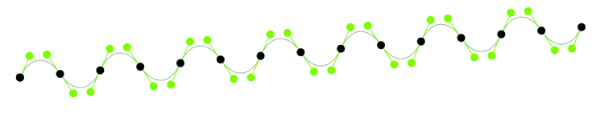
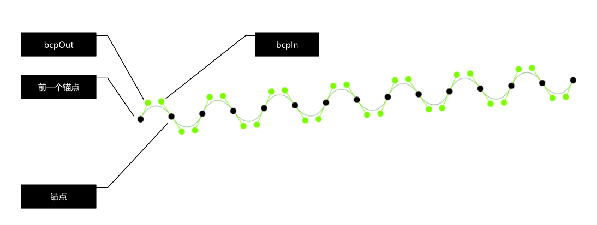
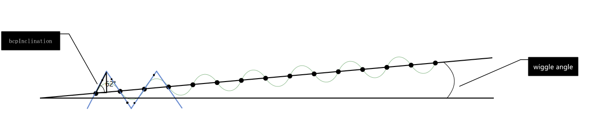
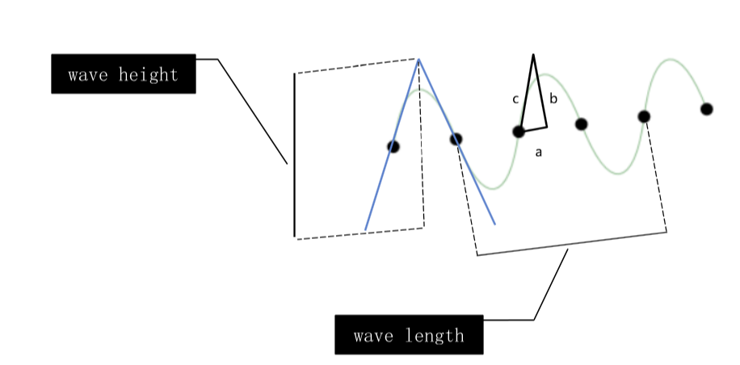
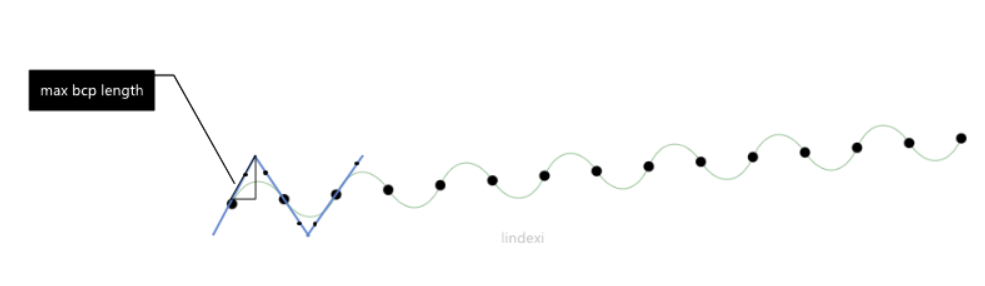
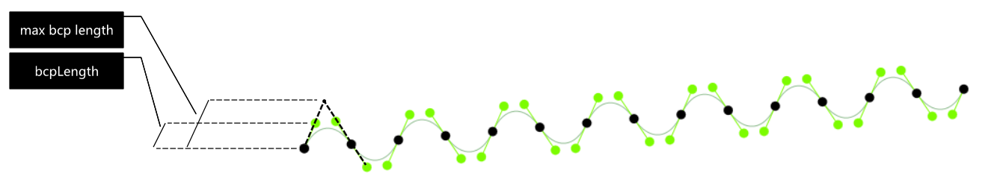
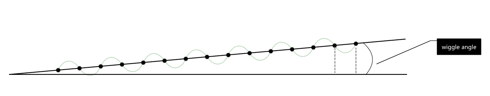
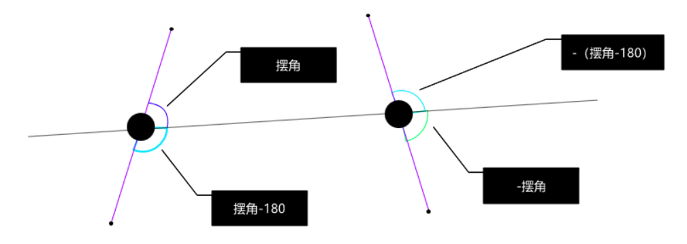

# WPF 如何给定两个点画出一条波浪线

在知道两个点可以连一条线段，那么将线段修改为波浪线可以如何做？

<!--more-->
<!-- CreateTime:2019/6/27 10:17:06 -->

<!-- csdn -->

在知道两个点 p1 和 p2 的时候，按照这两个点画出一条波浪线要求波浪线的中间就在两个点连接的线段

我做了一个程序用于显示效果，这个程序的界面用到很好用的 [HandyControl](https://github.com/HandyOrg/HandyControl ) 库

<!--  -->


可以尝试设置一些参数画出好看的线，这个程序全部开源，可以在[github](https://github.com/lindexi/lindexi_gd/tree/b332e647a9ac55cb3134f5a2b25934e877d76ad5/WaveLineDemo)下载全部源代码，核心源代码将会放在本文后面

下面告诉大家如何在知道两个点的时候画出一条波浪线

在开始之前需要小伙伴熟悉贝塞尔的概念如果使用控制点画出贝塞尔，使用本文的方法画出的波浪线会比直接连出线段的投影长度短一点，但是看起来几乎相同

贝塞尔曲线可以通过两个点和一个锚点控制一段曲线，我将两个点连接一段线段在这段线段上均匀放置一些锚点，在线段的上下方分别放控制点，通过一个锚点和两个控制点可以绘制出一段贝塞尔线。请看图绿色的点是控制点，黑色的点是锚点刚好所有的锚点都在一条线段上，通过锚点和控制点就可以画出曲线

<!--  -->


将控制点和锚点链接作为贝塞尔的效果如下图

<!--  -->


这里用到了两个控制点和一个锚点画贝塞尔，这里需要用到 Path 绘制的特性。在 Path 绘制的时候将会不断记住上一个点的值，也就是我输入的点其实会影响到上一条绘制命令的点如在我已经知道了两个控制点和一个锚点组成的数组。我每次调用 `streamGeometryContext.BezierTo` 的时候都需要传入三个点，第一个点控制点用来控制前一个命令的锚点而第二个点也是控制点用于控制本次调用方法里面的锚点也就是第三个点

<!--  -->


从上面可以知道绘制曲线会受到很多常量的影响，这些常量建议作为用户定义。为了让大家能和代码关联起来，先定义一些变量，如增幅和频率等，可以下载我的[代码](https://github.com/lindexi/lindexi_gd/tree/b332e647a9ac55cb3134f5a2b25934e877d76ad5/WaveLineDemo)运行一下，自己修改这些值


知道了曲线是如何画的，现在的问题就是如何求出这两个控制点和一个锚点的值

本文将会用到 bcp 算法，在说到用两个点绘制波浪线的时候，小伙伴最先想到的是使用水平线，但实际上任意两个点很少是水平的，也就是需要将波浪线绘制在一个协办上，于是如下图定义了摆角和斜角

<!--  -->


这里的 bcpInclination 是摆角表示波形的高度，这个值配合频率可以决定波形的高度，反过来知道频率和高度就可以计算出这个值

另外还可以了斜角 wiggle angle 表示给出的两点连出的线段与水平的夹角

现在尝试计算一下摆角的值，在计算摆角的值之前需要先拿到频率和高度

<!--  -->


从图片可以看到三角形 abc 的两个值，如 a 的值就是四分之一的频率，三角形的 b 的值就是波形的高度的一半

```csharp
a = wave length / 4
b = wave height / 2
```

这里的频率其实和波形长度是相同的，计算方法是在输入两个点的时候，计算出线段的长度

```csharp
var distance = (p1 - p2).Length;
```

通过波形的长度计算出这段长度有多少个波形

```csharp
            var waveLength = WaveLength;
            var howManyWaves = distance / waveLength;
```

于是反过来计算波形的频率

```csharp
var waveInterval = distance / howManyWaves;
```

此时简化数学计算，可以知道 waveInterval 就是波形的长度

于是按照向量的计算方法可以知道摆角的值可以使用下面代码计算

```csharp
            var bcpInclination = CalculateAngle(new Point(0, 0), new Point(a, b));
```

上图的三角形的 c 边就是定义的 max bcp length 的值，表示在当波形是三角形时的长度

<!--  -->


用三角形的计算方法，在知道 a 和 b 的时候求 c 边的长度可以使用下面方法

```csharp
var maxBcpLength =
                Math.Sqrt(waveInterval / 4.0 * (waveInterval / 4.0) + waveHeight / 2.0 * (waveHeight / 2.0));
```

其实上面的代码只是模拟计算而已，代码可以继续优化

在知道了 maxBcpLength 可以通过一个常量知道控制点距离锚点的距离

<!--  -->


如上图可以知道 bcpLength 的值就是控制点距离锚点的距离

刚好 bcpLength 就是最大长度的某个比例，可以通过下面代码计算

```csharp
            var bcpLength = maxBcpLength * curveSquaring;
```

上面代码的 curveSquaring 是一个常量可以给用户定义，用于控制波形实际高度与给定高度的关系

在知道了控制点距离锚点的长度，需要求当前控制点的坐标需要再知道两个值，一个是某个端点的坐标另一个是线段的切斜角度

刚好控制点的一个端点就是锚点，也就是链接锚点和控制点成为的线段刚好就是控制点距离锚点的长度，那么先求锚点对应的值

求锚点的值可以转换为求某线段上，均匀分多个点，求这些点的坐标的计算方法

如果这条线段是水平线段，那么很好求，于是先假设线段是水平的求出均匀的点，通过知道三角形的两个角度和一条边可以计算出另一条边的长度，请看图和代码这部分比较简单

<!--  -->


```csharp
var flexPt = new Point(prevFlexPt.X + Math.Cos(angle) * waveInterval / 2.0,
            prevFlexPt.Y + Math.Sin(angle) * waveInterval / 2.0);
```

上面代码的 prevFlexPt 就是上一个锚点的坐标，而 flexPt 就是当前锚点的坐标，第一个锚点就是线段的一个端点

现在第二个计算是倾斜角，请看下图可以知道控制点的倾斜角

<!--  -->


可以知道倾斜角和摆角相关，在知道锚点的坐标和距离和倾斜角就可以计算出控制点的坐标，在知道控制点和锚点就可以画出曲线

这是核心代码

```csharp
            var p1 = startPoint;
            var p2 = endPoint;

            var distance = (p1 - p2).Length;

            var angle = CalculateAngle(p1, p2);
            var waveLength = WaveLength;
            var waveHeight = WaveHeight;
            var howManyWaves = distance / waveLength;
            var waveInterval = distance / howManyWaves;
            var maxBcpLength =
                Math.Sqrt(waveInterval / 4.0 * (waveInterval / 4.0) + waveHeight / 2.0 * (waveHeight / 2.0));

            var curveSquaring = CurveSquaring;
            var bcpLength = maxBcpLength * curveSquaring;
            var bcpInclination = CalculateAngle(new Point(0, 0), new Point(waveInterval / 4.0, waveHeight / 2.0));

            var wigglePoints = new List<(Point bcpOut, Point bcpIn, Point anchor)>();
            var prevFlexPt = p1;
            var polarity = 1;

            for (var waveIndex = 0; waveIndex < howManyWaves * 2; waveIndex++)
            {
                var bcpOutAngle = angle + bcpInclination * polarity;
                var bcpOut = new Point(prevFlexPt.X + Math.Cos(bcpOutAngle) * bcpLength,
                    prevFlexPt.Y + Math.Sin(bcpOutAngle) * bcpLength);
                var flexPt = new Point(prevFlexPt.X + Math.Cos(angle) * waveInterval / 2.0,
                    prevFlexPt.Y + Math.Sin(angle) * waveInterval / 2.0);
                var bcpInAngle = angle + (Math.PI - bcpInclination) * polarity;
                var bcpIn = new Point(flexPt.X + Math.Cos(bcpInAngle) * bcpLength,
                    flexPt.Y + Math.Sin(bcpInAngle) * bcpLength);

                wigglePoints.Add((bcpOut, bcpIn, flexPt));

                polarity *= -1;
                prevFlexPt = flexPt;
            }

            var streamGeometry = new StreamGeometry();
            using (var streamGeometryContext = streamGeometry.Open())
            {
                streamGeometryContext.BeginFigure(wigglePoints[0].anchor, true, false);

                for (var i = 1; i < wigglePoints.Count; i += 1)
                {
                    var (bcpOut, bcpIn, anchor) = wigglePoints[i];

                    streamGeometryContext.BezierTo(bcpOut, bcpIn, anchor, true, false);
                }
            }

        private static double CalculateAngle(Point p1, Point p2)
        {
            return Math.Atan2(p2.Y - p1.Y, p2.X - p1.X);
        }
        
```

上面代码用到一些属性

```csharp
        public double WaveLength { get; set; } = 4;
        public double WaveHeight { get; set; } = 5;

        public double CurveSquaring { get; set; } = 0.57;
```

这个类的代码在 [WaveLine.cs](https://github.com/lindexi/lindexi_gd/blob/b332e647a9ac55cb3134f5a2b25934e877d76ad5/WaveLineDemo/WaveLineDemo/WaveLine.cs )

本文参考了 [How to draw a wiggle between two points with Python and Drawbot - Medium](https://medium.com/@roberto_arista/how-to-draw-a-wiggle-between-two-points-with-python-and-drawbot-788006c18fb0 )

<a rel="license" href="http://creativecommons.org/licenses/by-nc-sa/4.0/"></a><br />本作品采用<a rel="license" href="http://creativecommons.org/licenses/by-nc-sa/4.0/">知识共享署名-非商业性使用-相同方式共享 4.0 国际许可协议</a>进行许可。欢迎转载、使用、重新发布，但务必保留文章署名[林德熙](http://blog.csdn.net/lindexi_gd)(包含链接:http://blog.csdn.net/lindexi_gd )，不得用于商业目的，基于本文修改后的作品务必以相同的许可发布。如有任何疑问，请与我[联系](mailto:lindexi_gd@163.com)。
