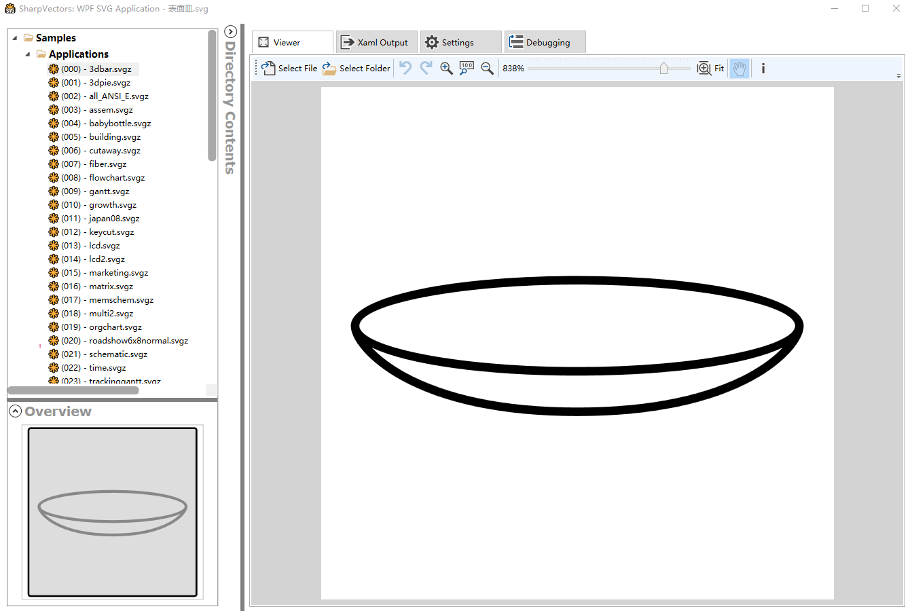
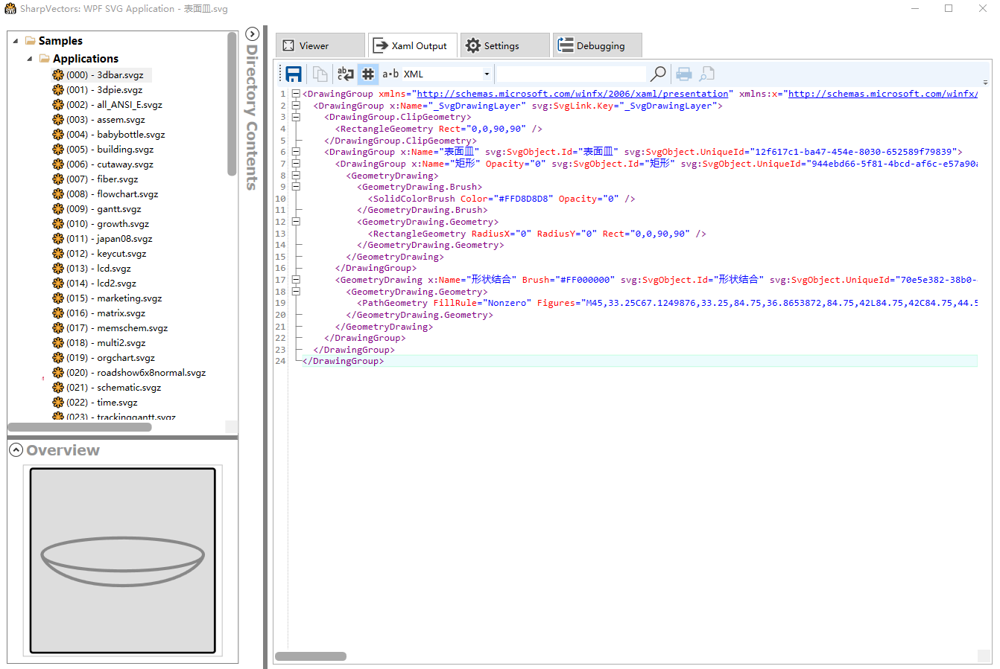
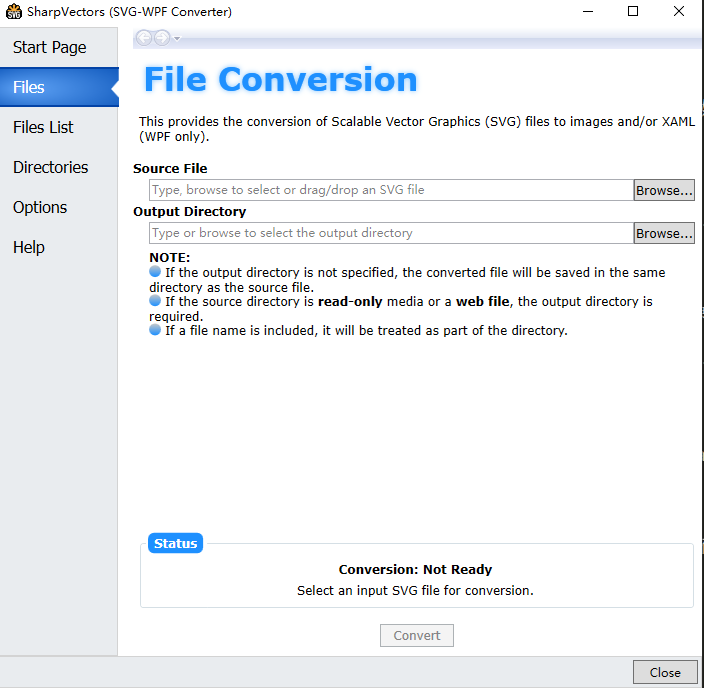
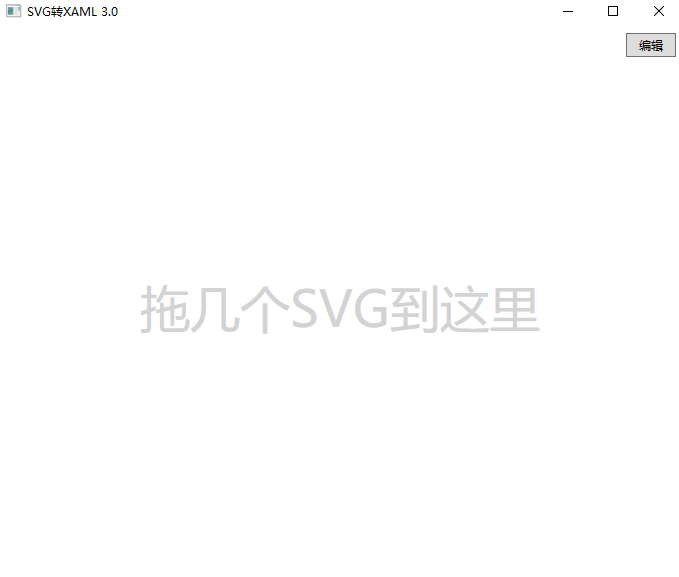

# WPF 将 SVG 转 XAML 的工具

团队的设计师喜欢输出 SVG 格式的图片，而咱如果想要在 WPF 中高性能呈现出来，最好还是转换为 XAML 代码。本文来安利大家一些 SVG 转 XAML 的工具

<!--more-->
<!-- 发布 -->

本文将按照推荐的顺序，最前面的是最推荐的，来告诉大家一些工具

## SharpVectors

这是名气很大的工具，当然这也是一个库。通过这个库可以在 dotnet 系的客户端应用，如 WPF 和 UWP 等呈现 SVG 内容，这个库里面不单包含了 SVG 的呈现，还包括了转换逻辑。其中的一个 demo 就是 SVG 转换 XAML 的工具

以下是工具的界面，可以拖入 SVG 格式的图片

<!--  -->


可以在设置中勾选 Show Output File 打开 XAML 输出界面，可以看到的 XAML 输出界面如下

<!--  -->


这个工具可以通过开源的 SharpVectors 仓库 [https://github.com/ElinamLLC/SharpVectors](https://github.com/ElinamLLC/SharpVectors) 里面的 WpfTestSvgSample 测试项目构建获取

这个工具生成的 XAML 文件里面，会包含一些在 SharpVectors 仓库提供的附加属性用来提供更多的功能，如果不想要在生成的时候带上这部分信息，请在设置里面，去掉 Include support for SharpVectors Runtime library 选项就可以，此时生成的就是纯 Geometry 的 Path 内容。当然也会丢失一些 SVG 的功能

## SharpVectors-SvgXaml

这也是 SharpVectors 系列的工具，同样在 GitHub 上完全开源，请看 [https://github.com/ElinamLLC/SharpVectors-SvgXaml](https://github.com/ElinamLLC/SharpVectors-SvgXaml)

提供批量的 SVG 转换功能，如下图

<!--  -->


这个工具适合在设计师给一堆图片的时候，批量转换为 XAML 文件

这个工具需要你自己去下载开源代码然后自己构建

## Svg2XamlTool

这是 dotnetCampus.Svg2XamlTool 工具，这个工具对比上面的工具毫无优势，唯一会列出来的原因是因为这是自己团队内的工具。这是由驸马爷开发，工具人林德熙帮忙开源发布的工具

这个工具通过 dotnet tool 发布，可以使用如下命令进行安装

```
dotnet tool install -g dotnetCampus.Svg2XamlTool
```

使用如下命令即可打开使用

```
Svg2Xaml
```

我推荐新建一个 bat 文件，里面放如下代码，这样就可以通过双击 bat 文件自动更新打开工具

```
@echo off
cd %~dp0
cd ..
@echo App starting... Please waiting. Code: https://github.com/dotnet-campus/dotnetCampus.Svg2XamlTool

dotnet tool update -g dotnetCampus.Svg2XamlTool

Svg2Xaml
```

工具界面如下，可以拖入 SVG 文件，自动转换为 XAML 文件打开

<!--  -->


这个工具在 GitHub 上完全开源，请看 [https://github.com/dotnet-campus/dotnetCampus.Svg2XamlTool](https://github.com/dotnet-campus/dotnetCampus.Svg2XamlTool)

另外，这个工具有编辑 XAML 的 Geometry 的 Path 显示的功能，但是这部分编辑功能很弱

如果对此工具有任何的想法或者建议，都欢迎在 GitHub 上讨论

这个工具的核心是依赖 [https://github.com/ElinamLLC/SharpVectors](https://github.com/ElinamLLC/SharpVectors) 提供的功能，因此和使用 [https://github.com/ElinamLLC/SharpVectors](https://github.com/ElinamLLC/SharpVectors) 没有什么解析上的差别

额外，在 Blend 的旧版本还提供了转换的工具，但是在新版本干掉了这个功能

在 WPF 里面，如果不转换为 XAML 而通过 [https://github.com/ElinamLLC/SharpVectors](https://github.com/ElinamLLC/SharpVectors) 库也可以渲染 SVG 图片

<a rel="license" href="http://creativecommons.org/licenses/by-nc-sa/4.0/"></a><br />本作品采用<a rel="license" href="http://creativecommons.org/licenses/by-nc-sa/4.0/">知识共享署名-非商业性使用-相同方式共享 4.0 国际许可协议</a>进行许可。欢迎转载、使用、重新发布，但务必保留文章署名[林德熙](http://blog.csdn.net/lindexi_gd)(包含链接:http://blog.csdn.net/lindexi_gd )，不得用于商业目的，基于本文修改后的作品务必以相同的许可发布。如有任何疑问，请与我[联系](mailto:lindexi_gd@163.com)。
