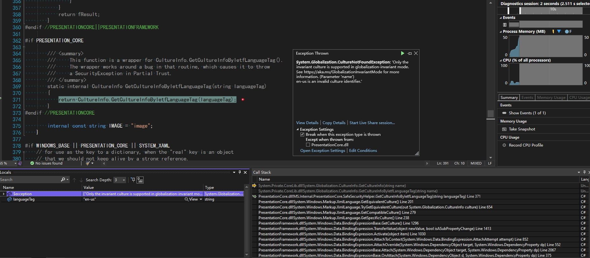

# WPF 已知问题 dotnet 6 设置 InvariantGlobalization 之后将丢失默认绑定转换导致 XAML 抛出异常

在设置了 InvariantGlobalization 为 true 之后，将会发现原本能正常工作的 XAML 可能就会抛出异常。本文将告诉大家此问题的原因

<!--more-->
<!-- CreateTime:2022/11/3 18:31:40 -->


<!-- 发布 -->

这是有开发者在 WPF 仓库上给我报告的 bug 我才找到的问题。问题的现象是 XAML 抛出异常，步骤有些复杂：

1. 升级到 dotnet 6 版本。 因为此问题是在 dotnet 6 下才能复现，在 dotnet 6 以下，如 dotnet 5 和 dotnet core 3.1 是没有问题的
2. 要求设置 InvariantGlobalization 为 true 的值
3. 在 XAML 绑定静态的非字符串类型的属性，例如 int 类型的属性，如以下代码

这是 `MainWindow.xaml.cs` 的代码：

```csharp
using System.Windows;

namespace repro
{
    /// <summary>
    /// Interaction logic for MainWindow.xaml
    /// </summary>
    public partial class MainWindow : Window
    {
        public MainWindow()
        {
            InitializeComponent();
        }
        public static string IWillNotCauseException { get; set; }
        public static int IWillCauseException { get; set; }
    }
}
```

这是在 XAML 的代码

```xml
<Window x:Class="repro.MainWindow"
        xmlns="http://schemas.microsoft.com/winfx/2006/xaml/presentation"
        xmlns:x="http://schemas.microsoft.com/winfx/2006/xaml"
        xmlns:d="http://schemas.microsoft.com/expression/blend/2008"
        xmlns:mc="http://schemas.openxmlformats.org/markup-compatibility/2006"
        xmlns:local="clr-namespace:repro"
        mc:Ignorable="d"
        Title="MainWindow" Height="450" Width="800">
    <Grid>
        <TextBlock Text="{Binding Source={x:Static local:MainWindow.IWillNotCauseException}}" />
        <TextBlock Text="{Binding Source={x:Static local:MainWindow.IWillCauseException}}" />
    </Grid>
</Window>
```

运行之后，将会看到 XAML 抛出异常。详细请看 [https://github.com/dotnet/wpf/issues/6477](https://github.com/dotnet/wpf/issues/6477)

抛出的异常包含以下信息

```
System.Globalization.CultureNotFoundException: 'Only the invariant culture is supported in globalization-invariant mode. See https://aka.ms/GlobalizationInvariantMode for more information. (Parameter 'name')
```

原因是在 dotnet 6 设置了 InvariantGlobalization 为 true 之后，在调用 `CultureInfo.GetCultureInfoByIetfLanguageTag` 方法时，将抛出异常，如下图

<!--  -->


这是符合 [官方文档](https://github.com/dotnet/runtime/blob/64b3ee4d35f9ba6a0bf66a0c5b41d2c8873cd89f/docs/design/features/globalization-invariant-mode.md) 描述的

如 [Breaking change: Culture creation and case mapping in globalization-invariant mode](https://learn.microsoft.com/en-us/dotnet/core/compatibility/globalization/6.0/culture-creation-invariant-mode ) 文档所述：

```
Starting in .NET 6 when globalization-invariant mode is enabled:

    If an app attempts to create a culture that's not the invariant culture, a CultureNotFoundException exception is thrown.
```

因此这个问题其实是 dotnet 6 的符合预期的行为，也不是 WPF 的问题

附设置 InvariantGlobalization 为 true 的方法如下

编辑 csproj 项目文件，添加 `<InvariantGlobalization>true</InvariantGlobalization>` 到 PropertyGroup 里面，如以下代码

```xml
<PropertyGroup>
    <InvariantGlobalization>true</InvariantGlobalization>
</PropertyGroup>
```

或者是编辑 runtimeconfig.json 文件，添加如下代码

```json
{
    "runtimeOptions": 
    {
        "configProperties": 
        {
            "System.Globalization.Invariant": true
        }
    }
}
```

参考文档：

[Breaking change: Culture creation and case mapping in globalization-invariant mode](https://learn.microsoft.com/en-us/dotnet/core/compatibility/globalization/6.0/culture-creation-invariant-mode )

[runtime/globalization-invariant-mode.md at main · dotnet/runtime · GitHub](https://github.com/dotnet/runtime/blob/64b3ee4d35f9ba6a0bf66a0c5b41d2c8873cd89f/docs/design/features/globalization-invariant-mode.md)