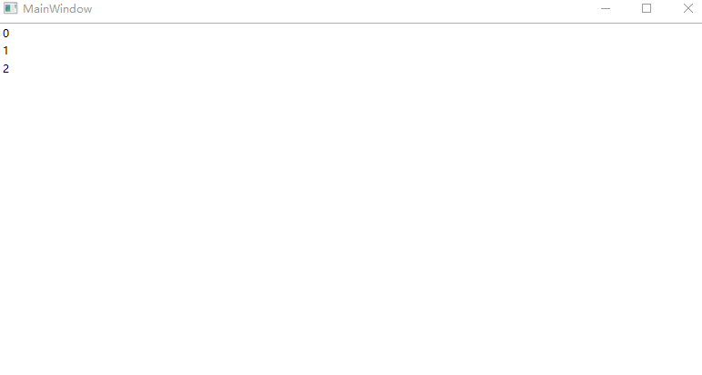
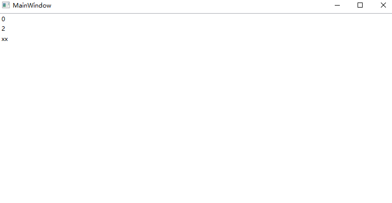

# WPF 已知问题 在 ObservableCollection 的 CollectionChanged 修改集合内容将让 UI 显示错误

本文记录一个 WPF 已知问题，在 ObservableCollection 的 CollectionChanged 事件里面，绕过 ObservableCollection 的异常判断逻辑，强行修改集合内容，修改之后的 UI 层将不能符合预期。本文将告诉大家此问题的复现方法和修复方法

<!--more-->
<!-- 发布 -->
<!-- 博客 -->

在 UI 绑定的 ObservableCollection 修改时，给此集合列表添加新的项目，此时 UI 绑定的数据是对的但是界面显示错误。简单的复现方法如下

先在后台代码定义好绑定模型 Model 类，代码如下

```csharp
public class Model
{
    public string? Name { get; set; }

    public override string? ToString() => Name;
}
```

接着在 MainWindow 里添加一个 `ObservableCollection<Model>` 属性用于让 XAML 绑定，这里不加入一个 ViewModel 只是为了让代码简单

```csharp
    public ObservableCollection<Model> List { get; } = new ObservableCollection<Model>();
```

在 XAML 里代码如下

```xml
<Window x:Class="BekuhalnoKawairlunee.MainWindow"
        xmlns="http://schemas.microsoft.com/winfx/2006/xaml/presentation"
        xmlns:x="http://schemas.microsoft.com/winfx/2006/xaml"
        xmlns:d="http://schemas.microsoft.com/expression/blend/2008"
        xmlns:mc="http://schemas.openxmlformats.org/markup-compatibility/2006"
        xmlns:local="clr-namespace:BekuhalnoKawairlunee"
        mc:Ignorable="d"
        x:Name="Root"
        Title="MainWindow" Height="450" Width="800">
    <Grid>
        <ListBox x:Name="ListBox" ItemsSource="{Binding ElementName=Root,Path=List}">
            <ListBox.ItemTemplate>
                <DataTemplate>
                    <TextBlock Text="{Binding Name}"></TextBlock>
                </DataTemplate>
            </ListBox.ItemTemplate>
        </ListBox>
    </Grid>
</Window>
```

在 MainWindow 构造函数给 List 加上测试内容

```csharp
    public MainWindow()
    {
        for (int i = 0; i < 3; i++)
        {
            var model = new Model()
            {
                Name = i.ToString()
            };

            List.Add(model);
        }

        List.CollectionChanged += List_CollectionChanged;

        InitializeComponent();

        Loaded += MainWindow_Loaded;
    }
```

以上的代码的 `List.CollectionChanged += List_CollectionChanged;` 是为了在集合变更时加入一项用来修改集合。监听 Loaded 用来模拟删除 ObservableCollection 的内容，用来触发 CollectionChanged 事件

先不要实现 `List_CollectionChanged` 和 `MainWindow_Loaded` 方法的内容，先看看此时界面显示，修复构建运行代码可以看到如下图

<!--  -->


在 Loaded 事件里面，将 List 的第 1 项删除，代码如下

```csharp
    private async void MainWindow_Loaded(object sender, RoutedEventArgs e)
    {
        await Task.Delay(100);

        List.RemoveAt(1);
    }
```

删除之后将会进入 `List_CollectionChanged` 方法，在 `List_CollectionChanged` 方法里面，如果直接修改 List 的内容，如以下代码，将会抛出 InvalidOperationException 异常

```csharp
    private void List_CollectionChanged(object? sender, System.Collections.Specialized.NotifyCollectionChangedEventArgs e)
    {
        //List.CollectionChanged -= List_CollectionChanged;

        List.Add(new Model()
        {
            Name = "xx"
        });
    }
```

抛出的异常如下

```csharp
System.InvalidOperationException:“Cannot change ObservableCollection during a CollectionChanged event.”
```

一个绕过的方法是在进入 `List_CollectionChanged` 减等事件，但是绕过是存在坑的，原本预期的列表顺序应该是 `0` `2` `xx` 的顺序，然而实际的界面显示如下

<!--  -->


以上就是最简单的方法让大家了解到问题

修复的方法有两个：

第一个方法是推荐的，使用 `Dispatcher.InvokeAsync` 延迟执行，修改 `List_CollectionChanged` 代码如下

```csharp
    private void List_CollectionChanged(object? sender, System.Collections.Specialized.NotifyCollectionChangedEventArgs e)
    {
        if (_changed)
        {
            return;
        }
        _changed = true;

        Dispatcher.InvokeAsync(() =>
        {
            List.Add(new Model()
            {
                Name = "xx"
            });
        });
    }

    private bool _changed;
```

以上的 `_changed` 字段只是让代码不会多次进入而已，因为添加元素也会触发集合变更事件，如果在集合变更事件里面再次添加元素，那就无限进入集合变更

可以看到界面显示符合预期

<!--  -->


第二个方法是强行刷 ItemsSource 内容，强行刷不能在 `List_CollectionChanged` 立即调用，否则将会抛出 InvalidOperationException 异常

```csharp
    private void List_CollectionChanged(object? sender, System.Collections.Specialized.NotifyCollectionChangedEventArgs e)
    {
        List.CollectionChanged -= List_CollectionChanged;

        List.Add(new Model()
        {
            Name = "xx"
        });

        ListBox.ItemsSource = null;
        ListBox.ItemsSource = List;
    }
```

抛出的异常代码如下

```
System.InvalidOperationException:“某个 ItemsControl 与它的项源不一致。\n请参见内部异常以获取更多信息。”

Exception: 针对开发人员的信息(使用文本可视化工具来阅读此内容):
引发此异常的原因是名为“ListBox”的控件“System.Windows.Controls.ListBox Items.Count:3”的生成器已接收到一个 CollectionChanged 事件序列，这些事件与 Items 集合的当前状态不符。  检测到以下差异:
  累积计数 2 与实际计数 3 不相同。[累积计数的计算方式为: 上次重置时的计数 + 添加数 - 自上次重置后的删除数。]

以下的一个或多个源可能已引发错误事件:
     System.Windows.Controls.ItemContainerGenerator
      System.Windows.Controls.ItemCollection
       System.Windows.Data.ListCollectionView
  *     System.Collections.ObjectModel.ObservableCollection`1[[BekuhalnoKawairlunee.Model, BekuhalnoKawairlunee, Version=1.0.0.0, Culture=neutral, PublicKeyToken=null]]
(标有星号的源被认为更有可能是问题的根源。)

最常见的原因有: (a)在未引发相应事件的情况下更改了集合或集合的计数，(b)引发的事件使用了错误的索引或项参数。

异常的堆栈跟踪将描述不一致情况是如何检测到的，而不是描述不一致情况是如何发生的。  要获得更及时的异常，应将生成器上附加的属性“PresentationTraceSources.TraceLevel”设置为值“High”，然后重新运行该方案。  完成此操作的一个方法是，在“即时”窗口中运行与下面的命令类似的命令:\n   System.Diagnostics.PresentationTraceSources.SetTraceLevel(myItemsControl.ItemContainerGenerator, System.Diagnostics.PresentationTraceLevel.High)
。这会使得在发生每个 CollectionChanged 事件之后运行检测逻辑，因此，这将减慢应用程序的运行速度。
```

通过以上的异常信息也可以了解到为什么 WPF 存在此已知问题，因为原本预期就是开发者不能在集合变更时修改集合，如果在每个集合变更里都需要重新处理状态，将会让 WPF 的性能很差。因此这个问题也是不会在 WPF 里面修复的，只能开发者自己修复

强行刷只能放在其他的时机，例如在界面添加一个按钮，点击按钮强行刷

```csharp
    private void Button_OnClick(object sender, RoutedEventArgs e)
    {
        ListBox.ItemsSource = null;
        ListBox.ItemsSource = List;
    }
```

运行程序，可以看到开始界面显示错误，在点击按钮之后，界面就符合预期

本文的代码放在[github](https://github.com/lindexi/lindexi_gd/tree/f6c0785629f2f73ee190b97cf14699daf8746699/BekuhalnoKawairlunee) 和 [gitee](https://gitee.com/lindexi/lindexi_gd/tree/f6c0785629f2f73ee190b97cf14699daf8746699/BekuhalnoKawairlunee) 欢迎访问

可以通过如下方式获取本文的源代码，先创建一个空文件夹，接着使用命令行 cd 命令进入此空文件夹，在命令行里面输入以下代码，即可获取到本文的代码

```
git init
git remote add origin https://gitee.com/lindexi/lindexi_gd.git
git pull origin f6c0785629f2f73ee190b97cf14699daf8746699
```

以上使用的是 gitee 的源，如果 gitee 不能访问，请替换为 github 的源。请在命令行继续输入以下代码

```
git remote remove origin
git remote add origin https://github.com/lindexi/lindexi_gd.git
git pull origin f6c0785629f2f73ee190b97cf14699daf8746699
```

获取代码之后，进入 BekuhalnoKawairlunee 文件夹

更多博客，请参阅我的 [博客导航](https://blog.lindexi.com/post/%E5%8D%9A%E5%AE%A2%E5%AF%BC%E8%88%AA.html )

