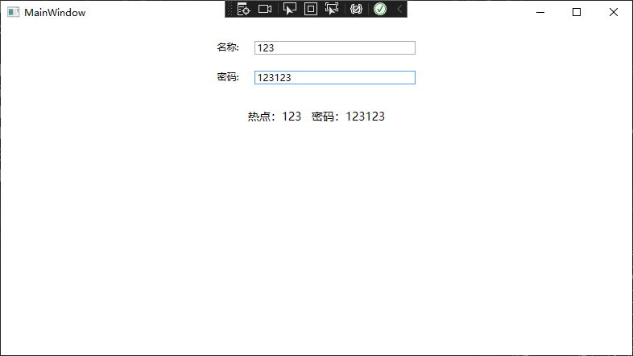
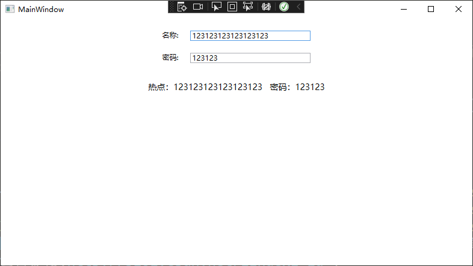
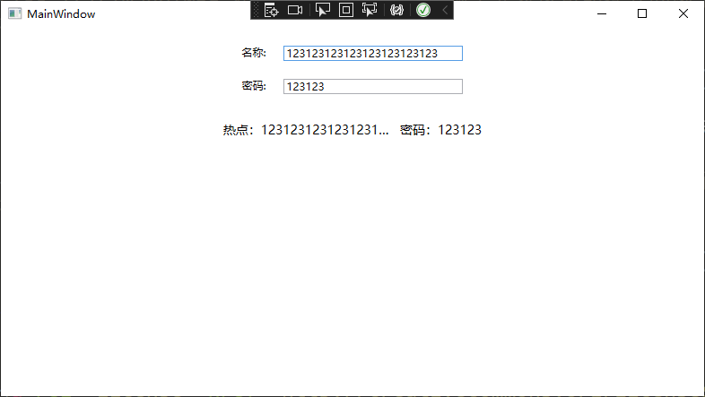
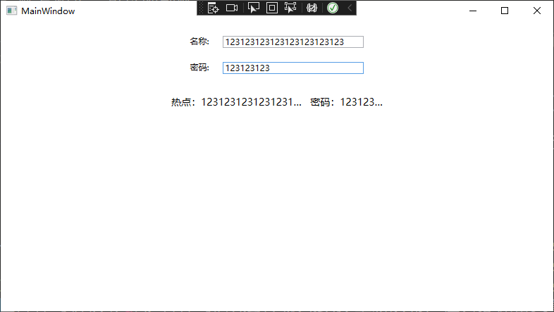
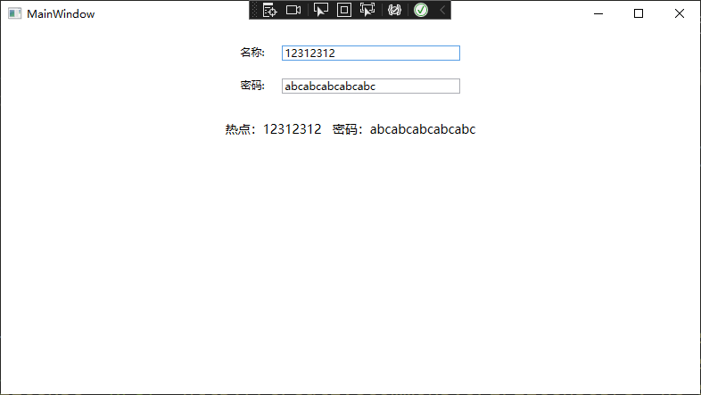
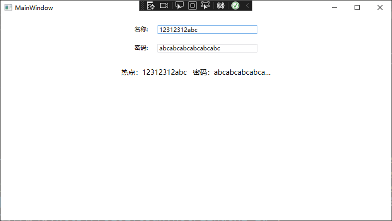

# WPF 布局 在有限空间内让两个元素尽可能撑开的例子

我在尝试写一个显示本机 WIFI 热点的账号和密码的控件，要求此控件在有限的空间内显示。但是尽可能显示出热点的账号和密码。而热点的账号和密码是用户配置的，也许长度很长。我的需求是在假如账号的长度较短的时候，将剩余的空间尽可能给到密码的显示。反过来，在密码长度比较短的时候，将剩余的空间给到账号的显示。如果两者的长度都比较长，那么同时限制两者的最大尺寸

<!--more-->

<!-- 发布 -->

有以下的不同的情况的需求

- 账号和密码的长度都较短，可以完全显示

<!--  -->


- 账号较长，密码较短，但合起来的长度小于最大尺寸。期望能完全显示出来

<!--  -->


- 账号超长，可以限制账号显示的最大长度

<!--  -->


- 账号超长，密码较长，将会因为限制最大尺寸，而裁剪账号和密码显示内容

<!--  -->


- 账号较短，密码较长，可以让密码占用更多的空间

<!--  -->


- 如果账号还没达到限制的最大宽度，密码超长，那么裁剪密码内容

<!--  -->


也就是说需要相当于在 Grid 里面造两个可以撑开的 `*` 长度的，但是限制最大尺寸的布局。不过本文将用另一个方法，采用 StackPanel 加上转换器来实现

先给 StackPanel 设置最大的宽度尺寸，接着设置 StackPanel 采用水平布局的方式。当然了本文的方法对于垂直布局也是生效的，只需要大家将对应的水平布局修改为垂直布局即可

```xml
   <StackPanel x:Name="OuterStackPanel" MaxWidth="300" Orientation="Horizontal">
   </StackPanel>
```

在 StackPanel 里面放入必要的控件，其中对于账号的内容显示，只需要设置 MaxWidth 最大宽度即可。因为总的宽度计算是依靠 StackPanel 进行限制，而账号内容显示的控件的尺寸，是依靠后面的密码显示控件控制的

```xml
    <StackPanel x:Name="OuterStackPanel" MaxWidth="300" Orientation="Horizontal">
            <TextBlock x:Name="SSIDTextBlock" d:Text="热点：" Text="热点：" FontSize="14" />
            <TextBlock x:Name="SSIDContentTextBlock" d:Text="SSID" Text="{Binding ElementName=NameTextBox,Path=Text}" FontSize="14" MaxWidth="150" TextTrimming="CharacterEllipsis" />
            <TextBlock x:Name="SpaceTextBlock" Text="   " FontSize="14" />
   </StackPanel>
```

通过 SpaceTextBlock 控件，用来分割距离

接着就是加上，密码显示模块。在密码显示里面，传入 OuterStackPanel 里面，除了 SSIDContentTextBlock 绑定账号内容的空间外的其他控件的尺寸，用来计算剩余给 账号内容显示控件 和 密码内容显示控件 的总空间。再通过设置自身的最大空间占用值，即可在 账号内容显示控件 没有占用较多空间时，尽可能撑开 密码内容显示控件 大小

```xml
            <TextBlock x:Name="PasswordTextBlock" d:Text="密码：" Text="密码：" FontSize="14" />
            <TextBlock x:Name="PasswordContentTextBlock" Grid.Column="4"  d:Text="Password" Text="{Binding ElementName=KeyTextBox,Path=Text}" FontSize="14" TextTrimming="CharacterEllipsis">
                <TextBlock.MaxWidth>
                    <MultiBinding Converter="{StaticResource MirrorPopupContentPasswordMaxWidthConverter}">
                        <Binding ElementName="OuterStackPanel" Path="MaxWidth"/>
                        <Binding ElementName="SSIDTextBlock" Path="ActualWidth"/>
                        <Binding ElementName="SSIDContentTextBlock" Path="ActualWidth"/>
                        <Binding ElementName="SpaceTextBlock" Path="ActualWidth"/>
                        <Binding ElementName="PasswordTextBlock" Path="ActualWidth"/>
                    </MultiBinding>
                </TextBlock.MaxWidth>
            </TextBlock>
```

以上的 MirrorPopupContentPasswordMaxWidthConverter 的代码定义如下

```csharp

    public class MirrorPopupContentPasswordMaxWidthConverter : IMultiValueConverter
    {
        public object Convert(object[] values, Type targetType, object parameter, CultureInfo culture)
        {
            if (values[0] is double total)
            {
            	// 一下的 Skip 传入 1 表示的是跳过第 1 个控件的宽度计算
            	// 第 1 个控件是账号内容显示控件
                foreach (var val in values.OfType<double>().Skip(1))
                {
                    total -= val;
                }

                return total > 0 ? total : 0;
            }
            return DependencyProperty.UnsetValue;
        }

        public object[] ConvertBack(object value, Type[] targetTypes, object parameter, CultureInfo culture)
        {
            throw new NotImplementedException();
        }
    }
```

通过此方式即可实现在有限的空间内，让两个元素尽可能撑开

特别感谢 [lsj](https://blog.sdlsj.net) 提供的方法

本文以上的代码放在[github](https://github.com/lindexi/lindexi_gd/tree/87fb070b57a1d4364f7c460d7f33c20545974dd0/NawhejefurWheekaijerehu) 和 [gitee](https://gitee.com/lindexi/lindexi_gd/tree/87fb070b57a1d4364f7c460d7f33c20545974dd0/NawhejefurWheekaijerehu) 欢迎访问

可以通过如下方式获取本文的源代码，先创建一个空文件夹，接着使用命令行 cd 命令进入此空文件夹，在命令行里面输入以下代码，即可获取到本文的代码

```
git init
git remote add origin https://gitee.com/lindexi/lindexi_gd.git
git pull origin 87fb070b57a1d4364f7c460d7f33c20545974dd0
```

以上使用的是 gitee 的源，如果 gitee 不能访问，请替换为 github 的源

```
git remote remove origin
git remote add origin https://github.com/lindexi/lindexi_gd.git
```

获取代码之后，进入 NawhejefurWheekaijerehu 文件夹

<a rel="license" href="http://creativecommons.org/licenses/by-nc-sa/4.0/"></a><br />本作品采用<a rel="license" href="http://creativecommons.org/licenses/by-nc-sa/4.0/">知识共享署名-非商业性使用-相同方式共享 4.0 国际许可协议</a>进行许可。欢迎转载、使用、重新发布，但务必保留文章署名[林德熙](http://blog.csdn.net/lindexi_gd)(包含链接:http://blog.csdn.net/lindexi_gd )，不得用于商业目的，基于本文修改后的作品务必以相同的许可发布。如有任何疑问，请与我[联系](mailto:lindexi_gd@163.com)。
