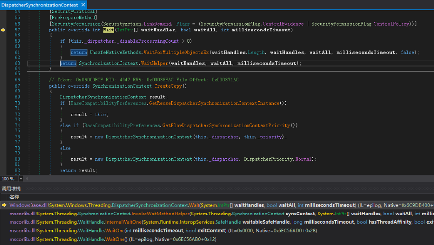
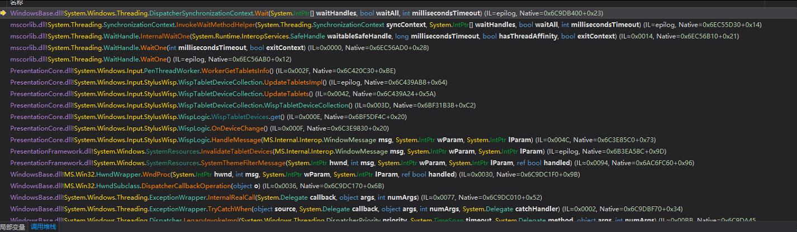
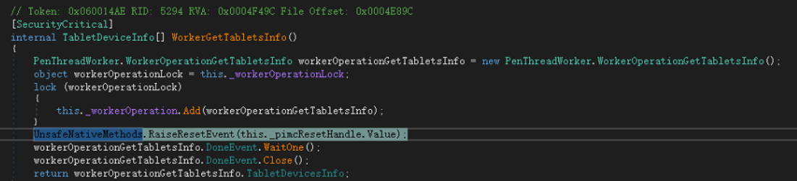
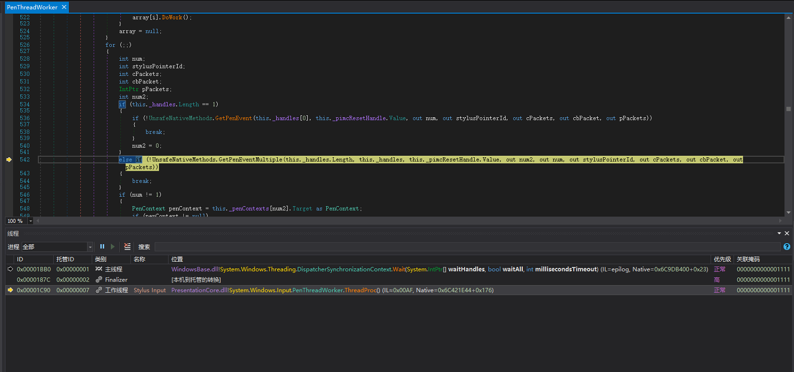

# WPF 开机启动因为触摸初始化锁住界面显示

现象是设置 WPF 开机启动的时候，概率界面不显示，进程已经起来，同时占用内存极小。通过 dump 或附加调试可以看到主进程带等待触摸线程的回应

<!--more-->
<!-- CreateTime:6/16/2020 11:29:15 AM -->


在我的某个有趣的设备上，这个设备开机启动的时候将会比较慢初始化完成 USB 设备，或者说是 HID 触摸屏设备

此时测试小伙伴告诉我说测试了几百次，会发现有一次某个开机启动的 WPF 应用起不来了

我使用 dnspy 附加调试看到了主线程其实执行了，但是在一个锁里面等待，如下图

<!--  -->


实际上的进入锁的代码是没有意义的，需要看是业务上哪里进入了锁

从调用堆栈里面，如下图，可以看到是 PenThreadWorker.WorkerGetTabletsInfo 方法在等待锁

<!--  -->


通过 [WPF 触摸到事件](https://blog.lindexi.com/post/WPF-%E8%A7%A6%E6%91%B8%E5%88%B0%E4%BA%8B%E4%BB%B6.html ) 可以了解到这是在等待触摸线程执行

<!--  -->


这是在 dnspy 断点不够准，实际的代码是 [getTablets.DoneEvent.WaitOne();](https://github.com/dotnet/wpf/blob/08dc7bcdecb27ab25d279d0b9d05f35393852ae9/src/Microsoft.DotNet.Wpf/src/PresentationCore/System/Windows/Input/Stylus/Wisp/PenThreadWorker.cs#L588)

也就是这个是在等待一个锁，这个会在什么时候释放，会在 Stylus Input 线程执行完成之后释放，那么 Stylus Input 线程在做什么呢

<!--  -->


这个 Stylus Input 线程在等待触摸消息，这就有趣了。主线程在等待触摸线程执行获取 Tablet 信息，而触摸线程在等待主线程初始化完成之后可以获取触摸消息

因此主线程等不到触摸线程执行获取触摸信息完成，也就是主线程被锁住

那为什么刚好主线程需要等待触摸获取信息？原因是刚好在开机的时候收到了 OnDeviceChange 消息，因此就会需要调用 WispLogic 的 `WispTabletDevices` 属性的获取，从本文下方的详细的主线程堆栈可以看到

因此解决方法是禁用 WPF 启动的时候初始化触摸，禁用方法 [通过 AppSwitch 禁用 WPF 内置的触摸让 WPF 程序可以处理 Windows 触摸消息 - walterlv](https://blog.walterlv.com/post/wpf-disable-stylus-and-touch-support.html )

这个解决方法的缺点是会干掉多指触摸，不过没关系，咱可以使用消息解决这个问题。通过监听 Windows 触摸消息加上 [WPF 模拟触摸设备](https://blog.lindexi.com/post/WPF-%E6%A8%A1%E6%8B%9F%E8%A7%A6%E6%91%B8%E8%AE%BE%E5%A4%87.html ) 就能继续做多指触摸了

更多触摸相关请看 [WPF 触摸相关](https://blog.lindexi.com/post/WPF-%E8%A7%A6%E6%91%B8%E7%9B%B8%E5%85%B3.html )

更多请看 [.NET 4.7 - WPF - Touch Enabled Devices Crash Applications · Issue #480 · microsoft/dotnet](https://github.com/Microsoft/dotnet/issues/480 )

此问题已报告官方，请看 [The main thread of the WPF application that starts automatically at boot will forever wait for the touch thread to execute · Issue #3147 · dotnet/wpf](https://github.com/dotnet/wpf/issues/3147 ) 求点赞

详细的主线程堆栈

```
 	WindowsBase.dll!System.Windows.Threading.DispatcherSynchronizationContext.Wait(System.IntPtr[] waitHandles, bool waitAll, int millisecondsTimeout) (IL=epilog, Native=0x6C9DB400+0x23)
 	mscorlib.dll!System.Threading.SynchronizationContext.InvokeWaitMethodHelper(System.Threading.SynchronizationContext syncContext, System.IntPtr[] waitHandles, bool waitAll, int millisecondsTimeout) (IL=epilog, Native=0x6EC55D30+0x14)
 	mscorlib.dll!System.Threading.WaitHandle.InternalWaitOne(System.Runtime.InteropServices.SafeHandle waitableSafeHandle, long millisecondsTimeout, bool hasThreadAffinity, bool exitContext) (IL≈0x0014, Native=0x6EC56B10+0x21)
 	mscorlib.dll!System.Threading.WaitHandle.WaitOne(int millisecondsTimeout, bool exitContext) (IL≈0x0000, Native=0x6EC56AD0+0x28)
 	mscorlib.dll!System.Threading.WaitHandle.WaitOne() (IL=epilog, Native=0x6EC56AB0+0x12)
 	PresentationCore.dll!System.Windows.Input.PenThreadWorker.WorkerGetTabletsInfo() (IL≈0x002F, Native=0x6C420C30+0xBE)
 	PresentationCore.dll!System.Windows.Input.StylusWisp.WispTabletDeviceCollection.UpdateTabletsImpl() (IL=epilog, Native=0x6C439AB8+0x64)
 	PresentationCore.dll!System.Windows.Input.StylusWisp.WispTabletDeviceCollection.UpdateTablets() (IL=0x0042, Native=0x6C439A24+0x5A)
 	PresentationCore.dll!System.Windows.Input.StylusWisp.WispTabletDeviceCollection.WispTabletDeviceCollection() (IL≈0x003D, Native=0x6BF31B38+0xC2)
 	PresentationCore.dll!System.Windows.Input.StylusWisp.WispLogic.WispTabletDevices.get() (IL=0x000E, Native=0x6BF5DF4C+0x20)
 	PresentationCore.dll!System.Windows.Input.StylusWisp.WispLogic.OnDeviceChange() (IL≈0x000F, Native=0x6C3E9830+0x20)
 	PresentationCore.dll!System.Windows.Input.StylusWisp.WispLogic.HandleMessage(MS.Internal.Interop.WindowMessage msg, System.IntPtr wParam, System.IntPtr lParam) (IL=0x004C, Native=0x6C3E85C0+0x73)
 	PresentationFramework.dll!System.Windows.SystemResources.InvalidateTabletDevices(MS.Internal.Interop.WindowMessage msg, System.IntPtr wParam, System.IntPtr lParam) (IL=epilog, Native=0x6B3EA58C+0x9D)
 	PresentationFramework.dll!System.Windows.SystemResources.SystemThemeFilterMessage(System.IntPtr hwnd, int msg, System.IntPtr wParam, System.IntPtr lParam, ref bool handled) (IL≈0x0094, Native=0x6AC6FC60+0x96)
 	WindowsBase.dll!MS.Win32.HwndWrapper.WndProc(System.IntPtr hwnd, int msg, System.IntPtr wParam, System.IntPtr lParam, ref bool handled) (IL≈0x0030, Native=0x6C9DC1F0+0x9B)
 	WindowsBase.dll!MS.Win32.HwndSubclass.DispatcherCallbackOperation(object o) (IL≈0x0036, Native=0x6C9DC170+0x6B)
 	WindowsBase.dll!System.Windows.Threading.ExceptionWrapper.InternalRealCall(System.Delegate callback, object args, int numArgs) (IL≈0x0077, Native=0x6C9DC010+0x52)
 	WindowsBase.dll!System.Windows.Threading.ExceptionWrapper.TryCatchWhen(object source, System.Delegate callback, object args, int numArgs, System.Delegate catchHandler) (IL≈0x0002, Native=0x6C9DBF70+0x34)
 	WindowsBase.dll!System.Windows.Threading.Dispatcher.LegacyInvokeImpl(System.Windows.Threading.DispatcherPriority priority, System.TimeSpan timeout, System.Delegate method, object args, int numArgs) (IL≈0x00BB, Native=0x6C9DA450+0x131)
 	WindowsBase.dll!MS.Win32.HwndSubclass.SubclassWndProc(System.IntPtr hwnd, int msg, System.IntPtr wParam, System.IntPtr lParam) (IL=0x0130, Native=0x6C9DB9C0+0xEE)
 	WindowsBase.dll!System.Windows.Threading.DispatcherSynchronizationContext.Wait(System.IntPtr[] waitHandles, bool waitAll, int millisecondsTimeout) (IL=epilog, Native=0x6C9DB400+0x23)
 	mscorlib.dll!System.Threading.SynchronizationContext.InvokeWaitMethodHelper(System.Threading.SynchronizationContext syncContext, System.IntPtr[] waitHandles, bool waitAll, int millisecondsTimeout) (IL=epilog, Native=0x6EC55D30+0x14)
 	mscorlib.dll!System.Threading.WaitHandle.InternalWaitOne(System.Runtime.InteropServices.SafeHandle waitableSafeHandle, long millisecondsTimeout, bool hasThreadAffinity, bool exitContext) (IL≈0x0014, Native=0x6EC56B10+0x21)
 	mscorlib.dll!System.Threading.WaitHandle.WaitOne(int millisecondsTimeout, bool exitContext) (IL≈0x0000, Native=0x6EC56AD0+0x28)
 	mscorlib.dll!System.Threading.WaitHandle.WaitOne() (IL=epilog, Native=0x6EC56AB0+0x12)
 	PresentationCore.dll!System.Windows.Input.PenThreadWorker.WorkerGetTabletsInfo() (IL≈0x002F, Native=0x6C420C30+0xBE)
 	PresentationCore.dll!System.Windows.Input.StylusWisp.WispTabletDeviceCollection.UpdateTabletsImpl() (IL=epilog, Native=0x6C439AB8+0x64)
 	PresentationCore.dll!System.Windows.Input.StylusWisp.WispTabletDeviceCollection.UpdateTablets() (IL=0x0042, Native=0x6C439A24+0x5A)
 	PresentationCore.dll!System.Windows.Input.StylusWisp.WispTabletDeviceCollection.WispTabletDeviceCollection() (IL≈0x003D, Native=0x6BF31B38+0xC2)
 	PresentationCore.dll!System.Windows.Input.StylusWisp.WispLogic.WispTabletDevices.get() (IL=0x000E, Native=0x6BF5DF4C+0x20)
 	PresentationCore.dll!System.Windows.Input.StylusWisp.WispLogic.OnDeviceChange() (IL≈0x000F, Native=0x6C3E9830+0x20)
 	PresentationCore.dll!System.Windows.Input.StylusWisp.WispLogic.HandleMessage(MS.Internal.Interop.WindowMessage msg, System.IntPtr wParam, System.IntPtr lParam) (IL=0x004C, Native=0x6C3E85C0+0x73)
 	PresentationFramework.dll!System.Windows.SystemResources.InvalidateTabletDevices(MS.Internal.Interop.WindowMessage msg, System.IntPtr wParam, System.IntPtr lParam) (IL=epilog, Native=0x6B3EA58C+0x9D)
 	PresentationFramework.dll!System.Windows.SystemResources.SystemThemeFilterMessage(System.IntPtr hwnd, int msg, System.IntPtr wParam, System.IntPtr lParam, ref bool handled) (IL≈0x0094, Native=0x6AC6FC60+0x96)
 	WindowsBase.dll!MS.Win32.HwndWrapper.WndProc(System.IntPtr hwnd, int msg, System.IntPtr wParam, System.IntPtr lParam, ref bool handled) (IL≈0x0030, Native=0x6C9DC1F0+0x9B)
 	WindowsBase.dll!MS.Win32.HwndSubclass.DispatcherCallbackOperation(object o) (IL≈0x0036, Native=0x6C9DC170+0x6B)
 	WindowsBase.dll!System.Windows.Threading.ExceptionWrapper.InternalRealCall(System.Delegate callback, object args, int numArgs) (IL≈0x0077, Native=0x6C9DC010+0x52)
 	WindowsBase.dll!System.Windows.Threading.ExceptionWrapper.TryCatchWhen(object source, System.Delegate callback, object args, int numArgs, System.Delegate catchHandler) (IL≈0x0002, Native=0x6C9DBF70+0x34)
 	WindowsBase.dll!System.Windows.Threading.Dispatcher.LegacyInvokeImpl(System.Windows.Threading.DispatcherPriority priority, System.TimeSpan timeout, System.Delegate method, object args, int numArgs) (IL≈0x00BB, Native=0x6C9DA450+0x131)
 	WindowsBase.dll!MS.Win32.HwndSubclass.SubclassWndProc(System.IntPtr hwnd, int msg, System.IntPtr wParam, System.IntPtr lParam) (IL=0x0130, Native=0x6C9DB9C0+0xEE)
 	WindowsBase.dll!System.Windows.Threading.DispatcherSynchronizationContext.Wait(System.IntPtr[] waitHandles, bool waitAll, int millisecondsTimeout) (IL=epilog, Native=0x6C9DB400+0x23)
 	mscorlib.dll!System.Threading.SynchronizationContext.InvokeWaitMethodHelper(System.Threading.SynchronizationContext syncContext, System.IntPtr[] waitHandles, bool waitAll, int millisecondsTimeout) (IL=epilog, Native=0x6EC55D30+0x14)
 	mscorlib.dll!System.Threading.WaitHandle.InternalWaitOne(System.Runtime.InteropServices.SafeHandle waitableSafeHandle, long millisecondsTimeout, bool hasThreadAffinity, bool exitContext) (IL≈0x0014, Native=0x6EC56B10+0x21)
 	mscorlib.dll!System.Threading.WaitHandle.WaitOne(int millisecondsTimeout, bool exitContext) (IL≈0x0000, Native=0x6EC56AD0+0x28)
 	mscorlib.dll!System.Threading.WaitHandle.WaitOne() (IL=epilog, Native=0x6EC56AB0+0x12)
 	PresentationCore.dll!System.Windows.Input.PenThreadWorker.WorkerGetTabletsInfo() (IL≈0x002F, Native=0x6C420C30+0xBE)
 	PresentationCore.dll!System.Windows.Input.StylusWisp.WispTabletDeviceCollection.UpdateTabletsImpl() (IL=epilog, Native=0x6C439AB8+0x64)
 	PresentationCore.dll!System.Windows.Input.StylusWisp.WispTabletDeviceCollection.UpdateTablets() (IL=0x0042, Native=0x6C439A24+0x5A)
 	PresentationCore.dll!System.Windows.Input.StylusWisp.WispTabletDeviceCollection.WispTabletDeviceCollection() (IL≈0x003D, Native=0x6BF31B38+0xC2)
 	PresentationCore.dll!System.Windows.Input.StylusWisp.WispLogic.WispTabletDevices.get() (IL=0x000E, Native=0x6BF5DF4C+0x20)
 	PresentationCore.dll!System.Windows.Input.StylusWisp.WispLogic.OnDeviceChange() (IL≈0x000F, Native=0x6C3E9830+0x20)
 	PresentationCore.dll!System.Windows.Input.StylusWisp.WispLogic.HandleMessage(MS.Internal.Interop.WindowMessage msg, System.IntPtr wParam, System.IntPtr lParam) (IL=0x004C, Native=0x6C3E85C0+0x73)
 	PresentationFramework.dll!System.Windows.SystemResources.InvalidateTabletDevices(MS.Internal.Interop.WindowMessage msg, System.IntPtr wParam, System.IntPtr lParam) (IL=epilog, Native=0x6B3EA58C+0x9D)
 	PresentationFramework.dll!System.Windows.SystemResources.SystemThemeFilterMessage(System.IntPtr hwnd, int msg, System.IntPtr wParam, System.IntPtr lParam, ref bool handled) (IL≈0x0094, Native=0x6AC6FC60+0x96)
 	WindowsBase.dll!MS.Win32.HwndWrapper.WndProc(System.IntPtr hwnd, int msg, System.IntPtr wParam, System.IntPtr lParam, ref bool handled) (IL≈0x0030, Native=0x6C9DC1F0+0x9B)
 	WindowsBase.dll!MS.Win32.HwndSubclass.DispatcherCallbackOperation(object o) (IL≈0x0036, Native=0x6C9DC170+0x6B)
 	WindowsBase.dll!System.Windows.Threading.ExceptionWrapper.InternalRealCall(System.Delegate callback, object args, int numArgs) (IL≈0x0077, Native=0x6C9DC010+0x52)
 	WindowsBase.dll!System.Windows.Threading.ExceptionWrapper.TryCatchWhen(object source, System.Delegate callback, object args, int numArgs, System.Delegate catchHandler) (IL≈0x0002, Native=0x6C9DBF70+0x34)
 	WindowsBase.dll!System.Windows.Threading.Dispatcher.LegacyInvokeImpl(System.Windows.Threading.DispatcherPriority priority, System.TimeSpan timeout, System.Delegate method, object args, int numArgs) (IL≈0x00BB, Native=0x6C9DA450+0x131)
 	WindowsBase.dll!MS.Win32.HwndSubclass.SubclassWndProc(System.IntPtr hwnd, int msg, System.IntPtr wParam, System.IntPtr lParam) (IL=0x0130, Native=0x6C9DB9C0+0xEE)
 	WindowsBase.dll!System.Windows.Threading.DispatcherSynchronizationContext.Wait(System.IntPtr[] waitHandles, bool waitAll, int millisecondsTimeout) (IL=epilog, Native=0x6C9DB400+0x23)
 	mscorlib.dll!System.Threading.SynchronizationContext.InvokeWaitMethodHelper(System.Threading.SynchronizationContext syncContext, System.IntPtr[] waitHandles, bool waitAll, int millisecondsTimeout) (IL=epilog, Native=0x6EC55D30+0x14)
 	mscorlib.dll!System.Threading.WaitHandle.InternalWaitOne(System.Runtime.InteropServices.SafeHandle waitableSafeHandle, long millisecondsTimeout, bool hasThreadAffinity, bool exitContext) (IL≈0x0014, Native=0x6EC56B10+0x21)
 	mscorlib.dll!System.Threading.WaitHandle.WaitOne(int millisecondsTimeout, bool exitContext) (IL≈0x0000, Native=0x6EC56AD0+0x28)
 	mscorlib.dll!System.Threading.WaitHandle.WaitOne() (IL=epilog, Native=0x6EC56AB0+0x12)
 	PresentationCore.dll!System.Windows.Input.PenThreadWorker.WorkerGetTabletsInfo() (IL≈0x002F, Native=0x6C420C30+0xBE)
 	PresentationCore.dll!System.Windows.Input.StylusWisp.WispTabletDeviceCollection.UpdateTabletsImpl() (IL=epilog, Native=0x6C439AB8+0x64)
 	PresentationCore.dll!System.Windows.Input.StylusWisp.WispTabletDeviceCollection.UpdateTablets() (IL=0x0042, Native=0x6C439A24+0x5A)
 	PresentationCore.dll!System.Windows.Input.StylusWisp.WispTabletDeviceCollection.WispTabletDeviceCollection() (IL≈0x003D, Native=0x6BF31B38+0xC2)
 	PresentationCore.dll!System.Windows.Input.StylusWisp.WispLogic.WispTabletDevices.get() (IL=0x000E, Native=0x6BF5DF4C+0x20)
 	PresentationCore.dll!System.Windows.Input.StylusWisp.WispLogic.OnDeviceChange() (IL≈0x000F, Native=0x6C3E9830+0x20)
 	PresentationCore.dll!System.Windows.Input.StylusWisp.WispLogic.HandleMessage(MS.Internal.Interop.WindowMessage msg, System.IntPtr wParam, System.IntPtr lParam) (IL=0x004C, Native=0x6C3E85C0+0x73)
 	PresentationFramework.dll!System.Windows.SystemResources.InvalidateTabletDevices(MS.Internal.Interop.WindowMessage msg, System.IntPtr wParam, System.IntPtr lParam) (IL=epilog, Native=0x6B3EA58C+0x9D)
 	PresentationFramework.dll!System.Windows.SystemResources.SystemThemeFilterMessage(System.IntPtr hwnd, int msg, System.IntPtr wParam, System.IntPtr lParam, ref bool handled) (IL≈0x0094, Native=0x6AC6FC60+0x96)
 	WindowsBase.dll!MS.Win32.HwndWrapper.WndProc(System.IntPtr hwnd, int msg, System.IntPtr wParam, System.IntPtr lParam, ref bool handled) (IL≈0x0030, Native=0x6C9DC1F0+0x9B)
 	WindowsBase.dll!MS.Win32.HwndSubclass.DispatcherCallbackOperation(object o) (IL≈0x0036, Native=0x6C9DC170+0x6B)
 	WindowsBase.dll!System.Windows.Threading.ExceptionWrapper.InternalRealCall(System.Delegate callback, object args, int numArgs) (IL≈0x0077, Native=0x6C9DC010+0x52)
 	WindowsBase.dll!System.Windows.Threading.ExceptionWrapper.TryCatchWhen(object source, System.Delegate callback, object args, int numArgs, System.Delegate catchHandler) (IL≈0x0002, Native=0x6C9DBF70+0x34)
 	WindowsBase.dll!System.Windows.Threading.Dispatcher.LegacyInvokeImpl(System.Windows.Threading.DispatcherPriority priority, System.TimeSpan timeout, System.Delegate method, object args, int numArgs) (IL≈0x00BB, Native=0x6C9DA450+0x131)
 	WindowsBase.dll!MS.Win32.HwndSubclass.SubclassWndProc(System.IntPtr hwnd, int msg, System.IntPtr wParam, System.IntPtr lParam) (IL=0x0130, Native=0x6C9DB9C0+0xEE)
 	WindowsBase.dll!System.Windows.Threading.DispatcherSynchronizationContext.Wait(System.IntPtr[] waitHandles, bool waitAll, int millisecondsTimeout) (IL=epilog, Native=0x6C9DB400+0x23)
 	mscorlib.dll!System.Threading.SynchronizationContext.InvokeWaitMethodHelper(System.Threading.SynchronizationContext syncContext, System.IntPtr[] waitHandles, bool waitAll, int millisecondsTimeout) (IL=epilog, Native=0x6EC55D30+0x14)
 	mscorlib.dll!System.Threading.WaitHandle.InternalWaitOne(System.Runtime.InteropServices.SafeHandle waitableSafeHandle, long millisecondsTimeout, bool hasThreadAffinity, bool exitContext) (IL≈0x0014, Native=0x6EC56B10+0x21)
 	mscorlib.dll!System.Threading.WaitHandle.WaitOne(int millisecondsTimeout, bool exitContext) (IL≈0x0000, Native=0x6EC56AD0+0x28)
 	mscorlib.dll!System.Threading.WaitHandle.WaitOne() (IL=epilog, Native=0x6EC56AB0+0x12)
 	PresentationCore.dll!System.Windows.Input.PenThreadWorker.WorkerGetTabletsInfo() (IL≈0x002F, Native=0x6C420C30+0xBE)
 	PresentationCore.dll!System.Windows.Input.StylusWisp.WispTabletDeviceCollection.UpdateTabletsImpl() (IL=epilog, Native=0x6C439AB8+0x64)
 	PresentationCore.dll!System.Windows.Input.StylusWisp.WispTabletDeviceCollection.UpdateTablets() (IL=0x0042, Native=0x6C439A24+0x5A)
 	PresentationCore.dll!System.Windows.Input.StylusWisp.WispTabletDeviceCollection.WispTabletDeviceCollection() (IL≈0x003D, Native=0x6BF31B38+0xC2)
 	PresentationCore.dll!System.Windows.Input.StylusWisp.WispLogic.WispTabletDevices.get() (IL=0x000E, Native=0x6BF5DF4C+0x20)
 	PresentationCore.dll!System.Windows.Input.StylusWisp.WispLogic.OnDeviceChange() (IL≈0x000F, Native=0x6C3E9830+0x20)
 	PresentationCore.dll!System.Windows.Input.StylusWisp.WispLogic.HandleMessage(MS.Internal.Interop.WindowMessage msg, System.IntPtr wParam, System.IntPtr lParam) (IL=0x004C, Native=0x6C3E85C0+0x73)
 	PresentationFramework.dll!System.Windows.SystemResources.InvalidateTabletDevices(MS.Internal.Interop.WindowMessage msg, System.IntPtr wParam, System.IntPtr lParam) (IL=epilog, Native=0x6B3EA58C+0x9D)
 	PresentationFramework.dll!System.Windows.SystemResources.SystemThemeFilterMessage(System.IntPtr hwnd, int msg, System.IntPtr wParam, System.IntPtr lParam, ref bool handled) (IL≈0x0094, Native=0x6AC6FC60+0x96)
 	WindowsBase.dll!MS.Win32.HwndWrapper.WndProc(System.IntPtr hwnd, int msg, System.IntPtr wParam, System.IntPtr lParam, ref bool handled) (IL≈0x0030, Native=0x6C9DC1F0+0x9B)
 	WindowsBase.dll!MS.Win32.HwndSubclass.DispatcherCallbackOperation(object o) (IL≈0x0036, Native=0x6C9DC170+0x6B)
 	WindowsBase.dll!System.Windows.Threading.ExceptionWrapper.InternalRealCall(System.Delegate callback, object args, int numArgs) (IL≈0x0077, Native=0x6C9DC010+0x52)
 	WindowsBase.dll!System.Windows.Threading.ExceptionWrapper.TryCatchWhen(object source, System.Delegate callback, object args, int numArgs, System.Delegate catchHandler) (IL≈0x0002, Native=0x6C9DBF70+0x34)
 	WindowsBase.dll!System.Windows.Threading.Dispatcher.LegacyInvokeImpl(System.Windows.Threading.DispatcherPriority priority, System.TimeSpan timeout, System.Delegate method, object args, int numArgs) (IL≈0x00BB, Native=0x6C9DA450+0x131)
 	WindowsBase.dll!MS.Win32.HwndSubclass.SubclassWndProc(System.IntPtr hwnd, int msg, System.IntPtr wParam, System.IntPtr lParam) (IL=0x0130, Native=0x6C9DB9C0+0xEE)
 	WindowsBase.dll!System.Windows.Threading.DispatcherSynchronizationContext.Wait(System.IntPtr[] waitHandles, bool waitAll, int millisecondsTimeout) (IL=epilog, Native=0x6C9DB400+0x23)
 	mscorlib.dll!System.Threading.SynchronizationContext.InvokeWaitMethodHelper(System.Threading.SynchronizationContext syncContext, System.IntPtr[] waitHandles, bool waitAll, int millisecondsTimeout) (IL=epilog, Native=0x6EC55D30+0x14)
 	mscorlib.dll!System.Threading.WaitHandle.InternalWaitOne(System.Runtime.InteropServices.SafeHandle waitableSafeHandle, long millisecondsTimeout, bool hasThreadAffinity, bool exitContext) (IL≈0x0014, Native=0x6EC56B10+0x21)
 	mscorlib.dll!System.Threading.WaitHandle.WaitOne(int millisecondsTimeout, bool exitContext) (IL≈0x0000, Native=0x6EC56AD0+0x28)
 	mscorlib.dll!System.Threading.WaitHandle.WaitOne() (IL=epilog, Native=0x6EC56AB0+0x12)
 	PresentationCore.dll!System.Windows.Input.PenThreadWorker.WorkerGetTabletsInfo() (IL≈0x002F, Native=0x6C420C30+0xBE)
 	PresentationCore.dll!System.Windows.Input.StylusWisp.WispTabletDeviceCollection.UpdateTabletsImpl() (IL=epilog, Native=0x6C439AB8+0x64)
 	PresentationCore.dll!System.Windows.Input.StylusWisp.WispTabletDeviceCollection.UpdateTablets() (IL=0x0042, Native=0x6C439A24+0x5A)
 	PresentationCore.dll!System.Windows.Input.StylusWisp.WispTabletDeviceCollection.WispTabletDeviceCollection() (IL≈0x003D, Native=0x6BF31B38+0xC2)
 	PresentationCore.dll!System.Windows.Input.StylusWisp.WispLogic.WispTabletDevices.get() (IL=0x000E, Native=0x6BF5DF4C+0x20)
 	PresentationCore.dll!System.Windows.Input.StylusWisp.WispLogic.OnDeviceChange() (IL≈0x000F, Native=0x6C3E9830+0x20)
 	PresentationCore.dll!System.Windows.Input.StylusWisp.WispLogic.HandleMessage(MS.Internal.Interop.WindowMessage msg, System.IntPtr wParam, System.IntPtr lParam) (IL=0x004C, Native=0x6C3E85C0+0x73)
 	PresentationFramework.dll!System.Windows.SystemResources.InvalidateTabletDevices(MS.Internal.Interop.WindowMessage msg, System.IntPtr wParam, System.IntPtr lParam) (IL=epilog, Native=0x6B3EA58C+0x9D)
 	PresentationFramework.dll!System.Windows.SystemResources.SystemThemeFilterMessage(System.IntPtr hwnd, int msg, System.IntPtr wParam, System.IntPtr lParam, ref bool handled) (IL≈0x0094, Native=0x6AC6FC60+0x96)
 	WindowsBase.dll!MS.Win32.HwndWrapper.WndProc(System.IntPtr hwnd, int msg, System.IntPtr wParam, System.IntPtr lParam, ref bool handled) (IL≈0x0030, Native=0x6C9DC1F0+0x9B)
 	WindowsBase.dll!MS.Win32.HwndSubclass.DispatcherCallbackOperation(object o) (IL≈0x0036, Native=0x6C9DC170+0x6B)
 	WindowsBase.dll!System.Windows.Threading.ExceptionWrapper.InternalRealCall(System.Delegate callback, object args, int numArgs) (IL≈0x0077, Native=0x6C9DC010+0x52)
 	WindowsBase.dll!System.Windows.Threading.ExceptionWrapper.TryCatchWhen(object source, System.Delegate callback, object args, int numArgs, System.Delegate catchHandler) (IL≈0x0002, Native=0x6C9DBF70+0x34)
 	WindowsBase.dll!System.Windows.Threading.Dispatcher.LegacyInvokeImpl(System.Windows.Threading.DispatcherPriority priority, System.TimeSpan timeout, System.Delegate method, object args, int numArgs) (IL≈0x00BB, Native=0x6C9DA450+0x131)
 	WindowsBase.dll!MS.Win32.HwndSubclass.SubclassWndProc(System.IntPtr hwnd, int msg, System.IntPtr wParam, System.IntPtr lParam) (IL=0x0130, Native=0x6C9DB9C0+0xEE)
 	WindowsBase.dll!System.Windows.Threading.DispatcherSynchronizationContext.Wait(System.IntPtr[] waitHandles, bool waitAll, int millisecondsTimeout) (IL=epilog, Native=0x6C9DB400+0x23)
 	mscorlib.dll!System.Threading.SynchronizationContext.InvokeWaitMethodHelper(System.Threading.SynchronizationContext syncContext, System.IntPtr[] waitHandles, bool waitAll, int millisecondsTimeout) (IL=epilog, Native=0x6EC55D30+0x14)
 	mscorlib.dll!System.Threading.WaitHandle.InternalWaitOne(System.Runtime.InteropServices.SafeHandle waitableSafeHandle, long millisecondsTimeout, bool hasThreadAffinity, bool exitContext) (IL≈0x0014, Native=0x6EC56B10+0x21)
 	mscorlib.dll!System.Threading.WaitHandle.WaitOne(int millisecondsTimeout, bool exitContext) (IL≈0x0000, Native=0x6EC56AD0+0x28)
 	mscorlib.dll!System.Threading.WaitHandle.WaitOne() (IL=epilog, Native=0x6EC56AB0+0x12)
 	PresentationCore.dll!System.Windows.Input.PenThreadWorker.WorkerGetTabletsInfo() (IL≈0x002F, Native=0x6C420C30+0xBE)
 	PresentationCore.dll!System.Windows.Input.StylusWisp.WispTabletDeviceCollection.UpdateTabletsImpl() (IL=epilog, Native=0x6C439AB8+0x64)
 	PresentationCore.dll!System.Windows.Input.StylusWisp.WispTabletDeviceCollection.UpdateTablets() (IL=0x0042, Native=0x6C439A24+0x5A)
 	PresentationCore.dll!System.Windows.Input.StylusWisp.WispTabletDeviceCollection.WispTabletDeviceCollection() (IL≈0x003D, Native=0x6BF31B38+0xC2)
 	PresentationCore.dll!System.Windows.Input.StylusWisp.WispLogic.WispTabletDevices.get() (IL=0x000E, Native=0x6BF5DF4C+0x20)
 	PresentationCore.dll!System.Windows.Input.StylusWisp.WispLogic.OnDeviceChange() (IL≈0x000F, Native=0x6C3E9830+0x20)
 	PresentationCore.dll!System.Windows.Input.StylusWisp.WispLogic.HandleMessage(MS.Internal.Interop.WindowMessage msg, System.IntPtr wParam, System.IntPtr lParam) (IL=0x004C, Native=0x6C3E85C0+0x73)
 	PresentationFramework.dll!System.Windows.SystemResources.InvalidateTabletDevices(MS.Internal.Interop.WindowMessage msg, System.IntPtr wParam, System.IntPtr lParam) (IL=epilog, Native=0x6B3EA58C+0x9D)
 	PresentationFramework.dll!System.Windows.SystemResources.SystemThemeFilterMessage(System.IntPtr hwnd, int msg, System.IntPtr wParam, System.IntPtr lParam, ref bool handled) (IL≈0x0094, Native=0x6AC6FC60+0x96)
 	WindowsBase.dll!MS.Win32.HwndWrapper.WndProc(System.IntPtr hwnd, int msg, System.IntPtr wParam, System.IntPtr lParam, ref bool handled) (IL≈0x0030, Native=0x6C9DC1F0+0x9B)
 	WindowsBase.dll!MS.Win32.HwndSubclass.DispatcherCallbackOperation(object o) (IL≈0x0036, Native=0x6C9DC170+0x6B)
 	WindowsBase.dll!System.Windows.Threading.ExceptionWrapper.InternalRealCall(System.Delegate callback, object args, int numArgs) (IL≈0x0077, Native=0x6C9DC010+0x52)
 	WindowsBase.dll!System.Windows.Threading.ExceptionWrapper.TryCatchWhen(object source, System.Delegate callback, object args, int numArgs, System.Delegate catchHandler) (IL≈0x0002, Native=0x6C9DBF70+0x34)
 	WindowsBase.dll!System.Windows.Threading.Dispatcher.LegacyInvokeImpl(System.Windows.Threading.DispatcherPriority priority, System.TimeSpan timeout, System.Delegate method, object args, int numArgs) (IL≈0x00BB, Native=0x6C9DA450+0x131)
 	WindowsBase.dll!MS.Win32.HwndSubclass.SubclassWndProc(System.IntPtr hwnd, int msg, System.IntPtr wParam, System.IntPtr lParam) (IL=0x0130, Native=0x6C9DB9C0+0xEE)
 	WindowsBase.dll!System.Windows.Threading.DispatcherSynchronizationContext.Wait(System.IntPtr[] waitHandles, bool waitAll, int millisecondsTimeout) (IL=epilog, Native=0x6C9DB400+0x23)
 	mscorlib.dll!System.Threading.SynchronizationContext.InvokeWaitMethodHelper(System.Threading.SynchronizationContext syncContext, System.IntPtr[] waitHandles, bool waitAll, int millisecondsTimeout) (IL=epilog, Native=0x6EC55D30+0x14)
 	mscorlib.dll!System.Threading.WaitHandle.InternalWaitOne(System.Runtime.InteropServices.SafeHandle waitableSafeHandle, long millisecondsTimeout, bool hasThreadAffinity, bool exitContext) (IL≈0x0014, Native=0x6EC56B10+0x21)
 	mscorlib.dll!System.Threading.WaitHandle.WaitOne(int millisecondsTimeout, bool exitContext) (IL≈0x0000, Native=0x6EC56AD0+0x28)
 	mscorlib.dll!System.Threading.WaitHandle.WaitOne() (IL=epilog, Native=0x6EC56AB0+0x12)
 	PresentationCore.dll!System.Windows.Input.PenThreadWorker.WorkerGetTabletsInfo() (IL≈0x002F, Native=0x6C420C30+0xBE)
 	PresentationCore.dll!System.Windows.Input.StylusWisp.WispTabletDeviceCollection.UpdateTabletsImpl() (IL=epilog, Native=0x6C439AB8+0x64)
 	PresentationCore.dll!System.Windows.Input.StylusWisp.WispTabletDeviceCollection.UpdateTablets() (IL=0x0042, Native=0x6C439A24+0x5A)
 	PresentationCore.dll!System.Windows.Input.StylusWisp.WispTabletDeviceCollection.WispTabletDeviceCollection() (IL≈0x003D, Native=0x6BF31B38+0xC2)
 	PresentationCore.dll!System.Windows.Input.StylusWisp.WispLogic.WispTabletDevices.get() (IL=0x000E, Native=0x6BF5DF4C+0x20)
 	PresentationCore.dll!System.Windows.Input.StylusWisp.WispLogic.OnDeviceChange() (IL≈0x000F, Native=0x6C3E9830+0x20)
 	PresentationCore.dll!System.Windows.Input.StylusWisp.WispLogic.HandleMessage(MS.Internal.Interop.WindowMessage msg, System.IntPtr wParam, System.IntPtr lParam) (IL=0x004C, Native=0x6C3E85C0+0x73)
 	PresentationFramework.dll!System.Windows.SystemResources.InvalidateTabletDevices(MS.Internal.Interop.WindowMessage msg, System.IntPtr wParam, System.IntPtr lParam) (IL=epilog, Native=0x6B3EA58C+0x9D)
 	PresentationFramework.dll!System.Windows.SystemResources.SystemThemeFilterMessage(System.IntPtr hwnd, int msg, System.IntPtr wParam, System.IntPtr lParam, ref bool handled) (IL≈0x0094, Native=0x6AC6FC60+0x96)
 	WindowsBase.dll!MS.Win32.HwndWrapper.WndProc(System.IntPtr hwnd, int msg, System.IntPtr wParam, System.IntPtr lParam, ref bool handled) (IL≈0x0030, Native=0x6C9DC1F0+0x9B)
 	WindowsBase.dll!MS.Win32.HwndSubclass.DispatcherCallbackOperation(object o) (IL≈0x0036, Native=0x6C9DC170+0x6B)
 	WindowsBase.dll!System.Windows.Threading.ExceptionWrapper.InternalRealCall(System.Delegate callback, object args, int numArgs) (IL≈0x0077, Native=0x6C9DC010+0x52)
 	WindowsBase.dll!System.Windows.Threading.ExceptionWrapper.TryCatchWhen(object source, System.Delegate callback, object args, int numArgs, System.Delegate catchHandler) (IL≈0x0002, Native=0x6C9DBF70+0x34)
 	WindowsBase.dll!System.Windows.Threading.Dispatcher.LegacyInvokeImpl(System.Windows.Threading.DispatcherPriority priority, System.TimeSpan timeout, System.Delegate method, object args, int numArgs) (IL≈0x00BB, Native=0x6C9DA450+0x131)
 	WindowsBase.dll!MS.Win32.HwndSubclass.SubclassWndProc(System.IntPtr hwnd, int msg, System.IntPtr wParam, System.IntPtr lParam) (IL=0x0130, Native=0x6C9DB9C0+0xEE)
 	WindowsBase.dll!System.Windows.Threading.DispatcherSynchronizationContext.Wait(System.IntPtr[] waitHandles, bool waitAll, int millisecondsTimeout) (IL=epilog, Native=0x6C9DB400+0x23)
 	mscorlib.dll!System.Threading.SynchronizationContext.InvokeWaitMethodHelper(System.Threading.SynchronizationContext syncContext, System.IntPtr[] waitHandles, bool waitAll, int millisecondsTimeout) (IL=epilog, Native=0x6EC55D30+0x14)
 	mscorlib.dll!System.Threading.WaitHandle.InternalWaitOne(System.Runtime.InteropServices.SafeHandle waitableSafeHandle, long millisecondsTimeout, bool hasThreadAffinity, bool exitContext) (IL≈0x0014, Native=0x6EC56B10+0x21)
 	mscorlib.dll!System.Threading.WaitHandle.WaitOne(int millisecondsTimeout, bool exitContext) (IL≈0x0000, Native=0x6EC56AD0+0x28)
 	mscorlib.dll!System.Threading.WaitHandle.WaitOne() (IL=epilog, Native=0x6EC56AB0+0x12)
 	PresentationCore.dll!System.Windows.Input.PenThreadWorker.WorkerGetTabletsInfo() (IL≈0x002F, Native=0x6C420C30+0xBE)
 	PresentationCore.dll!System.Windows.Input.StylusWisp.WispTabletDeviceCollection.UpdateTabletsImpl() (IL=epilog, Native=0x6C439AB8+0x64)
 	PresentationCore.dll!System.Windows.Input.StylusWisp.WispTabletDeviceCollection.UpdateTablets() (IL=0x0042, Native=0x6C439A24+0x5A)
 	PresentationCore.dll!System.Windows.Input.StylusWisp.WispTabletDeviceCollection.WispTabletDeviceCollection() (IL≈0x003D, Native=0x6BF31B38+0xC2)
 	PresentationCore.dll!System.Windows.Input.StylusWisp.WispLogic.WispTabletDevices.get() (IL=0x000E, Native=0x6BF5DF4C+0x20)
 	PresentationCore.dll!System.Windows.Input.StylusWisp.WispLogic.OnDeviceChange() (IL≈0x000F, Native=0x6C3E9830+0x20)
 	PresentationCore.dll!System.Windows.Input.StylusWisp.WispLogic.HandleMessage(MS.Internal.Interop.WindowMessage msg, System.IntPtr wParam, System.IntPtr lParam) (IL=0x004C, Native=0x6C3E85C0+0x73)
 	PresentationFramework.dll!System.Windows.SystemResources.InvalidateTabletDevices(MS.Internal.Interop.WindowMessage msg, System.IntPtr wParam, System.IntPtr lParam) (IL=epilog, Native=0x6B3EA58C+0x9D)
 	PresentationFramework.dll!System.Windows.SystemResources.SystemThemeFilterMessage(System.IntPtr hwnd, int msg, System.IntPtr wParam, System.IntPtr lParam, ref bool handled) (IL≈0x0094, Native=0x6AC6FC60+0x96)
 	WindowsBase.dll!MS.Win32.HwndWrapper.WndProc(System.IntPtr hwnd, int msg, System.IntPtr wParam, System.IntPtr lParam, ref bool handled) (IL≈0x0030, Native=0x6C9DC1F0+0x9B)
 	WindowsBase.dll!MS.Win32.HwndSubclass.DispatcherCallbackOperation(object o) (IL≈0x0036, Native=0x6C9DC170+0x6B)
 	WindowsBase.dll!System.Windows.Threading.ExceptionWrapper.InternalRealCall(System.Delegate callback, object args, int numArgs) (IL≈0x0077, Native=0x6C9DC010+0x52)
 	WindowsBase.dll!System.Windows.Threading.ExceptionWrapper.TryCatchWhen(object source, System.Delegate callback, object args, int numArgs, System.Delegate catchHandler) (IL≈0x0002, Native=0x6C9DBF70+0x34)
 	WindowsBase.dll!System.Windows.Threading.Dispatcher.LegacyInvokeImpl(System.Windows.Threading.DispatcherPriority priority, System.TimeSpan timeout, System.Delegate method, object args, int numArgs) (IL≈0x00BB, Native=0x6C9DA450+0x131)
 	WindowsBase.dll!MS.Win32.HwndSubclass.SubclassWndProc(System.IntPtr hwnd, int msg, System.IntPtr wParam, System.IntPtr lParam) (IL=0x0130, Native=0x6C9DB9C0+0xEE)
 	WindowsBase.dll!System.Windows.Threading.DispatcherSynchronizationContext.Wait(System.IntPtr[] waitHandles, bool waitAll, int millisecondsTimeout) (IL=epilog, Native=0x6C9DB400+0x23)
 	mscorlib.dll!System.Threading.SynchronizationContext.InvokeWaitMethodHelper(System.Threading.SynchronizationContext syncContext, System.IntPtr[] waitHandles, bool waitAll, int millisecondsTimeout) (IL=epilog, Native=0x6EC55D30+0x14)
 	PresentationCore.dll!MS.Win32.Penimc.UnsafeNativeMethods.CreatePimcManager() (IL=0x0022, Native=0x6C422318+0x53)
 	PresentationCore.dll!MS.Win32.Penimc.UnsafeNativeMethods.UnsafeNativeMethods() (IL=prolog, Native=0x6C422288+0x21)
 	PresentationCore.dll!System.Windows.Input.PenThreadWorker.PenThreadWorker() (IL≈0x004C, Native=0x6C42080C+0xCB)
 	PresentationCore.dll!System.Windows.Input.PenThreadPool.GetPenThreadForPenContextHelper(System.Windows.Input.PenContext penContext) (IL≈0x005B, Native=0x6C42067C+0xE5)
 	PresentationCore.dll!System.Windows.Input.PenThreadPool.GetPenThreadForPenContext(System.Windows.Input.PenContext penContext) (IL=epilog, Native=0x6C4205A8+0x84)
 	PresentationCore.dll!System.Windows.Input.StylusWisp.WispTabletDeviceCollection.UpdateTabletsImpl() (IL≈0x0009, Native=0x6C439AB8+0x2D)
 	PresentationCore.dll!System.Windows.Input.StylusWisp.WispTabletDeviceCollection.UpdateTablets() (IL=0x0042, Native=0x6C439A24+0x5A)
 	PresentationCore.dll!System.Windows.Input.StylusWisp.WispTabletDeviceCollection.WispTabletDeviceCollection() (IL≈0x003D, Native=0x6BF31B38+0xC2)
 	PresentationCore.dll!System.Windows.Input.StylusWisp.WispLogic.WispTabletDevices.get() (IL=0x000E, Native=0x6BF5DF4C+0x20)
 	PresentationCore.dll!System.Windows.Input.StylusWisp.WispLogic.RegisterHwndForInput(System.Windows.Input.InputManager inputManager, System.Windows.PresentationSource inputSource) (IL≈0x0032, Native=0x6BF5DD50+0x8F)
 	PresentationCore.dll!System.Windows.Interop.HwndStylusInputProvider.HwndStylusInputProvider(System.Windows.Interop.HwndSource source) (IL=0x005A, Native=0x6BF5DBCC+0xF8)
 	PresentationCore.dll!System.Windows.Interop.HwndSource.Initialize(System.Windows.Interop.HwndSourceParameters parameters) (IL=0x0253, Native=0x6BF5C4C8+0x433)
 	PresentationFramework.dll!System.Windows.Window.CreateSourceWindow(bool duringShow) (IL=0x0082, Native=0x6AC1C0F4+0x1E0)
 	PresentationFramework.dll!System.Windows.Window.CreateSourceWindowDuringShow() (IL=epilog, Native=0x6ACBB474+0xF)
 	PresentationFramework.dll!System.Windows.Window.SafeCreateWindowDuringShow() (IL=epilog, Native=0x6AC1D7B4+0x41)
 	PresentationFramework.dll!System.Windows.Window.ShowHelper(object booleanBox) (IL=0x003B, Native=0x6AC1D644+0x78)
 	WindowsBase.dll!System.Windows.Threading.ExceptionWrapper.InternalRealCall(System.Delegate callback, object args, int numArgs) (IL≈0x0077, Native=0x6C9DC010+0x52)
 	WindowsBase.dll!System.Windows.Threading.ExceptionWrapper.TryCatchWhen(object source, System.Delegate callback, object args, int numArgs, System.Delegate catchHandler) (IL≈0x0002, Native=0x6C9DBF70+0x34)
 	WindowsBase.dll!System.Windows.Threading.DispatcherOperation.InvokeImpl() (IL≈0x007A, Native=0x6C9DE6D0+0xD2)
 	WindowsBase.dll!System.Windows.Threading.DispatcherOperation.InvokeInSecurityContext(object state) (IL=epilog, Native=0x6C9DE690+0x3C)
 	mscorlib.dll!System.Threading.ExecutionContext.RunInternal(System.Threading.ExecutionContext executionContext, System.Threading.ContextCallback callback, object state, bool preserveSyncCtx) (IL≈0x0079, Native=0x6EC82DC0+0xE5)
 	mscorlib.dll!System.Threading.ExecutionContext.Run(System.Threading.ExecutionContext executionContext, System.Threading.ContextCallback callback, object state, bool preserveSyncCtx) (IL=epilog, Native=0x6EC82DA0+0x16)
 	mscorlib.dll!System.Threading.ExecutionContext.Run(System.Threading.ExecutionContext executionContext, System.Threading.ContextCallback callback, object state) (IL=epilog, Native=0x6EC82D30+0x41)
 	WindowsBase.dll!MS.Internal.CulturePreservingExecutionContext.Run(MS.Internal.CulturePreservingExecutionContext executionContext, System.Threading.ContextCallback callback, object state) (IL=epilog, Native=0x6C9DE480+0x63)
 	WindowsBase.dll!System.Windows.Threading.DispatcherOperation.Invoke() (IL=0x0020, Native=0x6C9DE340+0x4E)
 	WindowsBase.dll!System.Windows.Threading.Dispatcher.ProcessQueue() (IL=0x00F6, Native=0x6C9DA870+0x165)
 	WindowsBase.dll!System.Windows.Threading.Dispatcher.WndProcHook(System.IntPtr hwnd, int msg, System.IntPtr wParam, System.IntPtr lParam, ref bool handled) (IL=0x0090, Native=0x6C9DAB70+0x5A)
 	WindowsBase.dll!MS.Win32.HwndWrapper.WndProc(System.IntPtr hwnd, int msg, System.IntPtr wParam, System.IntPtr lParam, ref bool handled) (IL≈0x0030, Native=0x6C9DC1F0+0x9B)
 	WindowsBase.dll!MS.Win32.HwndSubclass.DispatcherCallbackOperation(object o) (IL≈0x0036, Native=0x6C9DC170+0x6B)
 	WindowsBase.dll!System.Windows.Threading.ExceptionWrapper.InternalRealCall(System.Delegate callback, object args, int numArgs) (IL≈0x0077, Native=0x6C9DC010+0x52)
 	WindowsBase.dll!System.Windows.Threading.ExceptionWrapper.TryCatchWhen(object source, System.Delegate callback, object args, int numArgs, System.Delegate catchHandler) (IL≈0x0002, Native=0x6C9DBF70+0x34)
 	WindowsBase.dll!System.Windows.Threading.Dispatcher.LegacyInvokeImpl(System.Windows.Threading.DispatcherPriority priority, System.TimeSpan timeout, System.Delegate method, object args, int numArgs) (IL≈0x00BB, Native=0x6C9DA450+0x131)
 	WindowsBase.dll!MS.Win32.HwndSubclass.SubclassWndProc(System.IntPtr hwnd, int msg, System.IntPtr wParam, System.IntPtr lParam) (IL=0x0130, Native=0x6C9DB9C0+0xEE)
 	[ToNative]
 	WindowsBase.dll!System.Windows.Threading.Dispatcher.PushFrameImpl(System.Windows.Threading.DispatcherFrame frame) (IL≈0x0040, Native=0x6C9D84CC+0xB1)
 	WindowsBase.dll!System.Windows.Threading.Dispatcher.PushFrame(System.Windows.Threading.DispatcherFrame frame) (IL=epilog, Native=0x6C9D8124+0x4A)
 	PresentationFramework.dll!System.Windows.Application.RunDispatcher(object ignore) (IL=0x0024, Native=0x6ABF4E70+0x5A)
 	PresentationFramework.dll!System.Windows.Application.RunInternal(System.Windows.Window window) (IL=0x00EE, Native=0x6ABF4CEC+0x74)
 	PresentationFramework.dll!System.Windows.Application.Run(System.Windows.Window window) (IL=epilog, Native=0x6ABF4ADC+0x2B)
 	PresentationFramework.dll!System.Windows.Application.Run() (IL=epilog, Native=0x6ABF46C8+0x1C)
 	Lindexi.WPF.exe!Lindexi.Program.Initialize() (IL≈0x000E, Native=0x0592A0A0+0x54)
 	Lindexi.WPF.exe!Lindexi.Program.Main(string[] args) (IL=0x001C, Native=0x00DF0448+0x42)
```


触摸 Stylus Input 线程堆栈

```
>	PresentationCore.dll!System.Windows.Input.PenThreadWorker.ThreadProc() (IL≈0x00AF, Native=0x6C421E44+0x176)
 	mscorlib.dll!System.Threading.ThreadHelper.ThreadStart_Context(object state) (IL=epilog, Native=0x6EC56060+0x9D)
 	mscorlib.dll!System.Threading.ExecutionContext.RunInternal(System.Threading.ExecutionContext executionContext, System.Threading.ContextCallback callback, object state, bool preserveSyncCtx) (IL≈0x0079, Native=0x6EC82DC0+0xE5)
 	mscorlib.dll!System.Threading.ExecutionContext.Run(System.Threading.ExecutionContext executionContext, System.Threading.ContextCallback callback, object state, bool preserveSyncCtx) (IL=epilog, Native=0x6EC82DA0+0x16)
 	mscorlib.dll!System.Threading.ExecutionContext.Run(System.Threading.ExecutionContext executionContext, System.Threading.ContextCallback callback, object state) (IL=epilog, Native=0x6EC82D30+0x41)
 	mscorlib.dll!System.Threading.ThreadHelper.ThreadStart() (IL=epilog, Native=0x6EC56014+0x44)
```


<a rel="license" href="http://creativecommons.org/licenses/by-nc-sa/4.0/"></a><br />本作品采用<a rel="license" href="http://creativecommons.org/licenses/by-nc-sa/4.0/">知识共享署名-非商业性使用-相同方式共享 4.0 国际许可协议</a>进行许可。欢迎转载、使用、重新发布，但务必保留文章署名[林德熙](http://blog.csdn.net/lindexi_gd)(包含链接:http://blog.csdn.net/lindexi_gd )，不得用于商业目的，基于本文修改后的作品务必以相同的许可发布。如有任何疑问，请与我[联系](mailto:lindexi_gd@163.com)。
