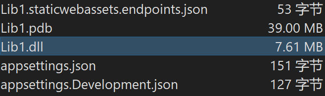
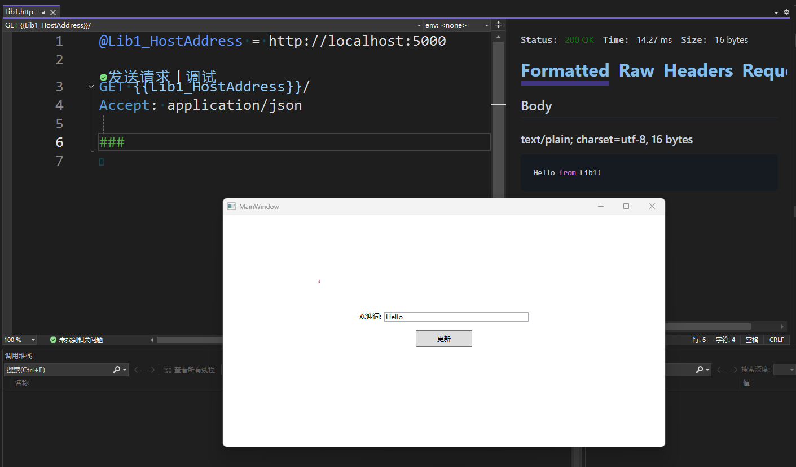
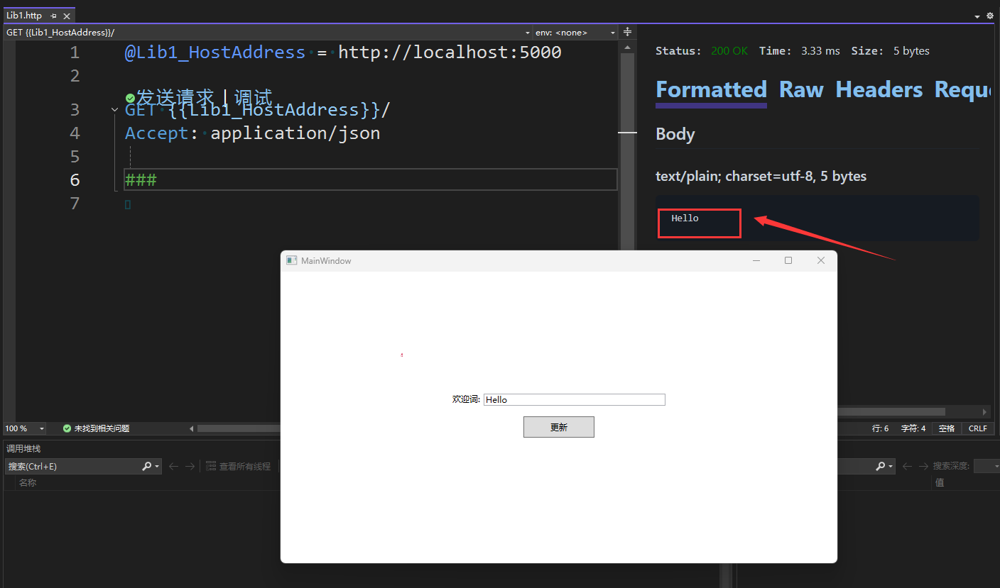

# WPF 引用 ASP.NET Core 的 AOT 版本

之前我写过博客让 WPF 和 ASP.NET Core 跑在一个应用程序进程里面，这样的方式十分简单方便，缺点是输出路径会带一些 ASP.NET Core 的 DLL 文件。本文将来尝试对 ASP.NET Core 进行 AOT 发布为类库，通过类库调用方式在 WPF 里引用 ASP.NET Core 开启 HTTP 服务

<!--more-->
<!-- 发布 -->
<!-- 博客 -->

现在 ASP.NET Core 早已支持 AOT 发布了，只是绝大部分教程都是教大家将其作为应用发布。在本文里面，咱将尝试进行类库发布，发布之后是一个 DLL 文件。通过 UnmanagedCallersOnly 导出函数被其他应用程序所使用

混合 WPF 和 ASP.NET Core 两个框架到一个进程里面是比较舒服的事情，让 WPF 负责界面显示逻辑和一些交互控制，让 ASP.NET Core 负责提供 HTTP 服务，各干各的，各自发挥优势

在上篇博客中，介绍了直接项目引用的方式，在一个进程里面跑起来 WPF 和 ASP.NET Core 框架，详细请看 [dotnet 简单方法在一个进程内同时跑起 WPF 和 ASP.NET Core 框架](https://blog.lindexi.com/post/dotnet-%E7%AE%80%E5%8D%95%E6%96%B9%E6%B3%95%E5%9C%A8%E4%B8%80%E4%B8%AA%E8%BF%9B%E7%A8%8B%E5%86%85%E5%90%8C%E6%97%B6%E8%B7%91%E8%B5%B7-WPF-%E5%92%8C-ASP.NET-Core-%E6%A1%86%E6%9E%B6.html )

在本文这里将着重和大家介绍在 WPF 里面调用的是 AOT 发布的 ASP.NET Core 类库。此方式可以将整个 ASP.NET Core 负载打成一个 DLL 文件，不会在输出路径上带上一些 ASP.NET Core 的 DLL 文件，适用于 HTTP 服务属于业务边缘模块，不想为边缘的模块添加依赖。也适用于让 WPF 和 ASP.NET Core 各自依赖不同的 .NET 版本

首先通过如下命令新建支持 AOT 的 ASP.NET Core 应用

```
dotnet new webapiaot -o Lib1
```

默认模版创建的是顶层语句，即没有在 Program.cs 写 Main 函数等做法。咱需要将其进行改造，改造包含将默认的代码放在一个函数里，和删除其中的演示代码。对于本文的演示需求来说，只需保留 MapGet 一条到 `/` 路径即可，返回一个字符串字段的值，代码如下

```csharp
public static class Program
{
    private static string _greetText = "Hello from Lib1!";

    private static void StartInner()
    {
        var builder = WebApplication.CreateSlimBuilder([]);

        var app = builder.Build();
        app.MapGet("/", () => _greetText);

        app.Run();
    }
}
```

大家可以看到，我删除了 Main 方法，这是因为此项目将作为类库发布，不能有 Main 入口函数，有了也没用。因此只将代码放在 StartInner 里面。附带也能看到 ASP.NET Core 非常简洁，短短 5 行有效代码就可以完成 HTTP 服务

为了能够调用 StartInner 开启辅助，咱再包装 Start 方法，且用 UnmanagedCallersOnly 进行公开，代码如下

```csharp
public static class Program
{
    [UnmanagedCallersOnly(EntryPoint = "Start", CallConvs = [typeof(CallConvCdecl)])]
    public static int Start()
    {
        Console.WriteLine($"Start run");

        Task.Run(StartInner);

        return 2;
    }
}
```

以上代码有一个不良实践，那就是将 StartInner 这个长时间执行的方法放在 `Task.Run` 里面，这样做将会占用线程池资源

继续再添加一个方法，用于给 WPF 层修改返回的 `_greetText` 字段，代码如下

```csharp
    [UnmanagedCallersOnly(EntryPoint = "SetGreetText", CallConvs = [typeof(CallConvCdecl)])]
    public static void SetGreetText(IntPtr greetText, int charCount)
    {
        _greetText = Marshal.PtrToStringUni(greetText, charCount);
    }
```

当前的 .NET 的类库 AOT 只支持基础数据类型，不能传递 .NET 的对象，这也就是为什么参数需要使用指针而不是字符串的原因。在后文将告诉大家简单的调用方法

如此就完成了简单的 ASP.NET Core 部分的活了，全部代码都在 Program.cs 里面，代码如下

```csharp
using System.Runtime.CompilerServices;
using System.Runtime.InteropServices;

namespace Lib1;

public static class Program
{
    [UnmanagedCallersOnly(EntryPoint = "Start", CallConvs = [typeof(CallConvCdecl)])]
    public static int Start()
    {
        Console.WriteLine($"Start run");

        Task.Run(StartInner);

        return 2;
    }

    [UnmanagedCallersOnly(EntryPoint = "SetGreetText", CallConvs = [typeof(CallConvCdecl)])]
    public static void SetGreetText(IntPtr greetText, int charCount)
    {
        _greetText = Marshal.PtrToStringUni(greetText, charCount);
    }

    private static string _greetText = "Hello from Lib1!";

    private static void StartInner()
    {
        var builder = WebApplication.CreateSlimBuilder([]);

        var app = builder.Build();
        app.MapGet("/", () => _greetText);

        app.Run();
    }
}
```

由于当前的 .NET 存在一个已知问题，将导致 ASP.NET Core 作为类库发布之后，再被另一个 .NET 应用引用时，会在控制台输出卡住。解决此问题需要在 csproj 里面添加如下代码配置，详细请参阅 <https://github.com/dotnet/runtime/issues/118773>

```xml
  <PropertyGroup>
    <EventSourceSupport>false</EventSourceSupport>
  </PropertyGroup>
```

如果不知道以上代码应该如何加到 csproj 上，还请使用本文末尾提供的命令行获取本文的所有代码，通过对比我的代码了解应该如何编写

完成准备工作之后，执行如下命令进行发布

```
dotnet publish -r win-x64
```

发布完成之后，拷贝发布出来的 Lib1.dll 文件，将其放入到 WPF 应用的输出文件夹路径。此时的 Lib1.dll 不是一个包含 IL 的 .NET 程序集的 DLL 文件，因此不能作为 WPF 项目的引用 DLL 文件，最多只能作为 None 方式作为引用如果较新则复制到输出路径

这样发布出来的简单 ASP.NET Core 类库只有 7MB 左右，以下截图中，只有 Lib1.dll 是必需的，其他都可以丢掉

<!--  -->


按照以往的方式创建 WPF 空白应用。编辑 MainWindow.xaml 添加一点界面代码

```xml
    <Grid>
        <StackPanel VerticalAlignment="Center">
            <Grid MinWidth="300" HorizontalAlignment="Center">
                <Grid.Resources>
                    <Style TargetType="TextBlock">
                        <Setter Property="Margin" Value="0 5 5 5"></Setter>
                    </Style>
                    <Style TargetType="TextBox">
                        <Setter Property="Margin" Value="0 5 0 5"></Setter>
                    </Style>
                </Grid.Resources>
                <Grid.ColumnDefinitions>
                    <ColumnDefinition Width="Auto"></ColumnDefinition>
                    <ColumnDefinition></ColumnDefinition>
                </Grid.ColumnDefinitions>

                <TextBlock Text="欢迎词:"></TextBlock>
                <TextBox x:Name="GreetTextBox" Grid.Column="1" Text="Hello"></TextBox>
            </Grid>

            <Button x:Name="UpdateButton" Width="100" Height="30" Margin="10" Click="UpdateButton_OnClick">更新</Button>
        </StackPanel>
    </Grid>
```

在 MainWindow.xaml.cs 里面添加两个 P/Invoke 定义函数，代码如下

```csharp
    [DllImport("Lib1.dll")]
    private static extern int Start();

    [DllImport("Lib1.dll")]
    private static extern void SetGreetText(IntPtr greetText, int charCount);
```

通过以上代码可见此时的对 Lib1.dll 的调用和对其他的 Win32 DLL 调用是一样的 P/Invoke 写法

在窗口启动完成之后，调用 Start 启动 ASP.NET Core 服务，代码如下

```csharp
    public MainWindow()
    {
        InitializeComponent();

        Loaded += MainWindow_Loaded;
    }

    private void MainWindow_Loaded(object sender, RoutedEventArgs e)
    {
        Start();
    }
```

点击更新按钮时，将文本框的内容更新同步到 ASP.NET Core 上，代码如下

```csharp
    private unsafe void UpdateButton_OnClick(object sender, RoutedEventArgs e)
    {
        var greetText = GreetTextBox.Text;
        fixed (char* c = greetText)
        {
            SetGreetText(new IntPtr(c), greetText.Length);
        }
    }
```

如以上代码所示，调用的时候需要将字符串对象固定，取出指针传递过去

如此简单代码就完成了 WPF 调用 AOT 版本的 ASP.NET Core 服务，开启 HTTP 服务

尝试运行 WPF 项目，运行之前别忘了拷贝 Lib1.dll 文件到输出文件夹路径，然后用 Lib1 里面自带的 .http 文件发送请求，可见如下界面

<!--  -->


点击按钮，更新一下文本内容，再次发送 http 请求，可见如下界面

<!--  -->


通过以上界面可以知道，此时的 ASP.NET Core 部分已经收到了来自 WPF 部分的数据，且将其通过 HTTP 对外发射数据

本文代码放在 [github](https://github.com/lindexi/lindexi_gd/tree/3acde0686b53ca3122cb0fe28838624e1101500c/WPFDemo/BarnemwheanejayHelbellacall) 和 [gitee](https://gitee.com/lindexi/lindexi_gd/tree/3acde0686b53ca3122cb0fe28838624e1101500c/WPFDemo/BarnemwheanejayHelbellacall) 上，可以使用如下命令行拉取代码。我整个代码仓库比较庞大，使用以下命令行可以进行部分拉取，拉取速度比较快

先创建一个空文件夹，接着使用命令行 cd 命令进入此空文件夹，在命令行里面输入以下代码，即可获取到本文的代码

```
git init
git remote add origin https://gitee.com/lindexi/lindexi_gd.git
git pull origin 3acde0686b53ca3122cb0fe28838624e1101500c
```

以上使用的是国内的 gitee 的源，如果 gitee 不能访问，请替换为 github 的源。请在命令行继续输入以下代码，将 gitee 源换成 github 源进行拉取代码。如果依然拉取不到代码，可以发邮件向我要代码

```
git remote remove origin
git remote add origin https://github.com/lindexi/lindexi_gd.git
git pull origin 3acde0686b53ca3122cb0fe28838624e1101500c
```

获取代码之后，进入 WPFDemo/BarnemwheanejayHelbellacall 文件夹，即可获取到源代码

更多技术博客，请参阅 [博客导航](https://blog.lindexi.com/post/%E5%8D%9A%E5%AE%A2%E5%AF%BC%E8%88%AA.html )