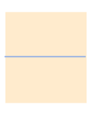
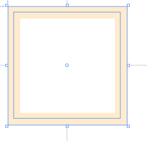
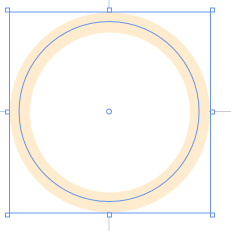

# WPF 形状的 StrokeThickness 属性对边框的影响

在 WPF 中，形状可以使用 StrokeThickness 定义边框的粗细，而边框和形状元素的大小的关系受到这个属性的影响。这个属于记录了下次使用也不一定记得的知识，更建议大家在使用的时候大概了解是这样计算的，建议在每次写的时候，自己测试一下

<!--more-->
<!-- CreateTime:2021/3/11 19:51:05 -->

<!-- 发布 -->

因为不同的形状的表现有所不同，因此本文列出几个不同的形状，使用 StrokeThickness 属性对形状大小的影响

## Line

对于 Line 来说，只有定义两个点的坐标，如下面代码

```xml
    <Line X1="10" Y1="100" X2="100" Y2="100" Stroke="BlanchedAlmond" StrokeThickness="100" />
```

而 StrokeThickness 将以线段作为中心，往两边撑开，相当于一个矩形，矩形中心线就是线段

从 XAML 设计器上比较好了解，可以看到的如下图的蓝色的线部分就是线条的定义，而其他颜色的部分就是 StrokeThickness 的粗细

<!--  -->


这个行为和 SVG 上的行为是相同的

## Rectangle

如下面代码可以在界面添加一个矩形

```xml
    <Rectangle Margin="10,10,10,10" HorizontalAlignment="Left" VerticalAlignment="Top"
               Width="100" Height="100" Stroke="BlanchedAlmond" StrokeThickness="10"></Rectangle>
```

对于矩形来说 StrokeThickness 属性是对内填充的，也就是说无论 StrokeThickness 多大，都不会影响矩形的外接大小。换句话说就是上面代码设置矩形宽度高度是 100 那么矩形无论设置 StrokeThickness 属性是多少，都不会影响视觉上的矩形宽度和高度

<!--  -->


我比较推荐 WPF 的这个设计，固定了矩形的宽度和高度，那么边框的大小是向内的。因为这样设计起来比较好计算

而 SVG 的行为和 WPF 的不相同，在 SVG 里面是使用矩形的边框作为中心，向两边填充。我比较不推荐 SVG 的设计，因为这样子意味着如果修改了矩形的边框，那么矩形的视觉大小也就被更改了

## Ellipse

对于封闭的其他图形，如 Ellipse 来说，行为和矩形相同，都是向内撑开的，如下面代码

```xml
    <Ellipse Margin="10,10,10,10" HorizontalAlignment="Left" VerticalAlignment="Top"
               Width="100" Height="100" Stroke="BlanchedAlmond" StrokeThickness="10"></Ellipse>
```

可以看到的效果如下

<!--  -->


设计器上的蓝色的选择框表示的是形状的大小和坐标，可以看到 StrokeThickness 是在 100 100 的大小内

而蓝色的圆形其实只是设计器给的效果，表示的是在 StrokeThickness 中间的圆形，而不是指在形状的中间向两边填充。设计器上的蓝色的圆形是形状的 RenderedGeometry 属性，这个属性是一个 Geometry 类型

使用 Geometry 类型进行绘制的时候，设置的 Pen 里面的 Thickness 的绘制方式使用的是从 Geometry 线条的中间向两边填充

<a rel="license" href="http://creativecommons.org/licenses/by-nc-sa/4.0/"></a><br />本作品采用<a rel="license" href="http://creativecommons.org/licenses/by-nc-sa/4.0/">知识共享署名-非商业性使用-相同方式共享 4.0 国际许可协议</a>进行许可。欢迎转载、使用、重新发布，但务必保留文章署名[林德熙](http://blog.csdn.net/lindexi_gd)(包含链接:http://blog.csdn.net/lindexi_gd )，不得用于商业目的，基于本文修改后的作品务必以相同的许可发布。如有任何疑问，请与我[联系](mailto:lindexi_gd@163.com)。
