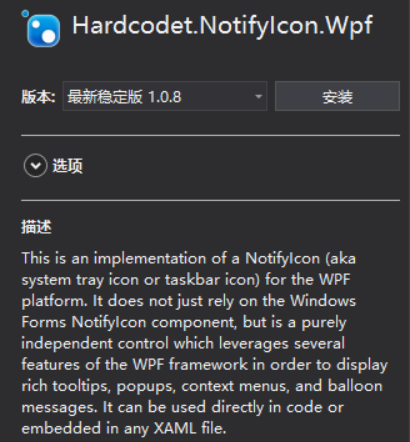
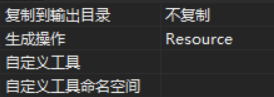
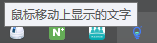
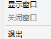
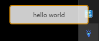
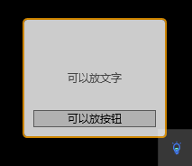
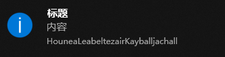

# WPF 托盘显示

本文告诉大家如何在 WPF 实现在托盘显示，同时托盘可以右击打开菜单，双击执行指定的代码

<!--more-->
<!-- CreateTime:2019/6/23 11:52:36 -->


## NotifyIcon WPF

通过 Nuget 安装 Hardcodet.NotifyIcon.Wpf 可以快速做到在 WPF 显示托盘

<!--  -->


因为托盘是程序的托盘，不是窗口的，所以推荐代码是写在 App.xaml.cs 里面

先创建一个托盘的界面，界面在 App.xaml 创建

托盘是需要图标的，可以从 [Iconfont-阿里巴巴矢量图标库](http://www.iconfont.cn/ ) 找到好看的图标。在托盘图标需要是 16x16 32位 的 ico 文件

将图片下载放在解决方案，修改为 Resource 就可以

<!--  -->


在 App.xaml 定义资源 TaskbarIcon 请看代码

```
<Application x:Class="HouneaLeabeltezairKayballjachall.App"
             xmlns="http://schemas.microsoft.com/winfx/2006/xaml/presentation"
             xmlns:x="http://schemas.microsoft.com/winfx/2006/xaml"
             xmlns:local="clr-namespace:HouneaLeabeltezairKayballjachall"
             xmlns:tb="http://www.hardcodet.net/taskbar"
             StartupUri="MainWindow.xaml">
    <Application.Resources>
        <tb:TaskbarIcon x:Key="Taskbar"
                        IconSource="Taskbar.ico">

        </tb:TaskbarIcon>
    </Application.Resources>
</Application>
```

上面代码需要替换 `Class="HouneaLeabeltezairKayballjachall.App"` 为自己的项目

打开 App.xaml.cs 获取资源，资源只有在获取的时候才会创建，创建了 TaskbarIcon 就会在托盘显示

```csharp
        protected override void OnStartup(StartupEventArgs e)
        {
            _taskbar = (TaskbarIcon) FindResource("Taskbar");
            base.OnStartup(e);
        }

        private TaskbarIcon _taskbar;
```

运行代码可以看到图片显示图标，下面的图片是我的图标

<!--  -->


鼠标移动在托盘上面显示文字，可以在 TaskbarIcon 添加代码

```csharp
        <tb:TaskbarIcon x:Key="Taskbar"
                        ToolTipText="鼠标移动上显示的文字"
                        IconSource="Taskbar.ico">

        </tb:TaskbarIcon>
```
<!--  -->


双击托盘运行代码需要添加命令，创建一个 ViewModel 用来绑定命令

```csharp
    public class DelegateCommand : ICommand
    {
        public Action CommandAction { get; set; }
        public Func<bool> CanExecuteFunc { get; set; }

        public void Execute(object parameter)
        {
            CommandAction();
        }

        public bool CanExecute(object parameter)
        {
            return CanExecuteFunc == null || CanExecuteFunc();
        }

        public event EventHandler CanExecuteChanged
        {
            add { CommandManager.RequerySuggested += value; }
            remove { CommandManager.RequerySuggested -= value; }
        }
    }

```

添加一些功能，显示窗口，隐藏窗口

```csharp
    public class NotifyIconViewModel
    {
        /// <summary>
        /// 如果窗口没显示，就显示窗口
        /// </summary>
        public ICommand ShowWindowCommand
        {
            get
            {
                return new DelegateCommand
                {
                    CanExecuteFunc = () => Application.Current.MainWindow == null,
                    CommandAction = () =>
                    {
                        Application.Current.MainWindow = new MainWindow();
                        Application.Current.MainWindow.Show();
                    }
                };
            }
        }

        /// <summary>
        /// 隐藏窗口
        /// </summary>
        public ICommand HideWindowCommand
        {
            get
            {
                return new DelegateCommand
                {
                    CommandAction = () => Application.Current.MainWindow.Close(),
                    CanExecuteFunc = () => Application.Current.MainWindow != null
                };
            }
        }


        /// <summary>
        /// 关闭软件
        /// </summary>
        public ICommand ExitApplicationCommand
        {
            get
            {
                return new DelegateCommand { CommandAction = () => Application.Current.Shutdown() };
            }
        }
    }

```

在界面绑定代码

```csharp
        <tb:TaskbarIcon x:Key="Taskbar"
                        ToolTipText="鼠标移动上显示的文字"
                        DoubleClickCommand="{Binding ShowWindowCommand}"
                        IconSource="Taskbar.ico">

        </tb:TaskbarIcon>
```

这时的 TaskbarIcon 还没有 ViewModel 可以通过下面的方式

```csharp
        <tb:TaskbarIcon x:Key="Taskbar"
                        ToolTipText="鼠标移动上显示的文字"
                        DoubleClickCommand="{Binding ShowWindowCommand}"
                        IconSource="Taskbar.ico">
            <tb:TaskbarIcon.DataContext>
                <local:NotifyIconViewModel />
            </tb:TaskbarIcon.DataContext>
        </tb:TaskbarIcon>
```

现在双击就可以打开 MainWindow 因为默认 MainWindow 是打开的，比较难看到双击打开。在 App.xaml 去掉默认打开 MainWindow 需要找到下面的代码

```csharp
StartupUri="MainWindow.xaml"
```

现在尝试不让默认打开 MainWindow 运行软件，可以看到托盘显示图标，双击图标才可以打开界面

如果要右击显示菜单，需要在 App.xaml 添加定义

```csharp
        <ContextMenu x:Shared="false" x:Key="SysTrayMenu">
            <MenuItem Header="显示窗口" Command="{Binding ShowWindowCommand}" />
            <MenuItem Header="关闭窗口" Command="{Binding HideWindowCommand}" />
            <Separator />
            <MenuItem Header="退出" Command="{Binding ExitApplicationCommand}" />
        </ContextMenu>
```

在 TaskbarIcon 使用菜单

```csharp
        <tb:TaskbarIcon x:Key="Taskbar"
                        ContextMenu="{StaticResource SysTrayMenu}"
                        ToolTipText="鼠标移动上显示的文字"
                        DoubleClickCommand="{Binding ShowWindowCommand}"
                        IconSource="Taskbar.ico">
            <tb:TaskbarIcon.DataContext>
                <local:NotifyIconViewModel />
            </tb:TaskbarIcon.DataContext>
        </tb:TaskbarIcon>
```

因为在 ViewModel 已经写好代码，所以现在就可以运行

<!--  -->


默认的软件设置是关闭最后一个窗口的时候应用就关闭，通过设置 App.ShutdownMode 可以在调用退出才关闭，打开 App.xaml 添加代码

```csharp
 ShutdownMode="OnExplicitShutdown"
```

本文的代码

[WPF 托盘显示 右击打开菜单，双击打开软件-CSDN下载](https://download.csdn.net/download/lindexi_gd/10798424 )

下面还有一些高级的使用

定义托盘鼠标移动上去的文字颜色

```csharp
            <tb:TaskbarIcon.TrayToolTip>
                 里面可以添加控件
            </tb:TaskbarIcon.TrayToolTip>
```

```
        <tb:TaskbarIcon x:Key="Taskbar"
                        ContextMenu="{StaticResource SysTrayMenu}"
                        DoubleClickCommand="{Binding ShowWindowCommand}"
                        IconSource="Taskbar.ico">
            <tb:TaskbarIcon.TrayToolTip>
                <Border
                    Background="White"
                    BorderBrush="Orange"
                    BorderThickness="2"
                    CornerRadius="4"
                    Opacity="0.8"
                    Width="160"
                    Height="40">
                    <TextBlock
                        Text="hello world"
                        HorizontalAlignment="Center"
                        VerticalAlignment="Center" />
                </Border>
            </tb:TaskbarIcon.TrayToolTip>
            <tb:TaskbarIcon.DataContext>
                <local:NotifyIconViewModel />
            </tb:TaskbarIcon.DataContext>
        </tb:TaskbarIcon>

```

<!--  -->


因为可以添加控件，发挥你的想法，如添加按钮

```
        <tb:TaskbarIcon x:Key="Taskbar"
                        ContextMenu="{StaticResource SysTrayMenu}"
                        DoubleClickCommand="{Binding ShowWindowCommand}"
                        IconSource="Taskbar.ico">
            <tb:TaskbarIcon.TrayToolTip>
                <Border
                    Background="White"
                    BorderBrush="Orange"
                    BorderThickness="2"
                    CornerRadius="4"
                    Opacity="0.8"
                    Width="160">
                   <Grid>
                       <TextBlock HorizontalAlignment="Center" VerticalAlignment="Center" Text="可以放文字"></TextBlock>
                       <Button Margin="10,100,10,10" Content="可以放按钮"></Button>
                   </Grid>
                </Border>
            </tb:TaskbarIcon.TrayToolTip>
            <tb:TaskbarIcon.DataContext>
                <local:NotifyIconViewModel />
            </tb:TaskbarIcon.DataContext>
        </tb:TaskbarIcon>

```

<!--  -->


显示气泡

通过下面的代码可以显示气泡

```csharp
Taskbar.ShowBalloonTip("标题", "内容", BalloonIcon.Info);
```

<!--  -->


如果需要自定义气泡，定义一个继承 UIElement 的类，然后传入 TaskbarIcon.ShowCustomBalloon 就可以

如已经定义了 FancyBalloon 气泡，可以通过下面的代码

```csharp
 FancyBalloon balloon = new FancyBalloon();
 TaskbarIcon.ShowCustomBalloon(balloon, PopupAnimation.Slide, 4000 /*多少时间就隐藏*/);
```

代码：[NotifyIcon WPF — Bitbucket](https://bitbucket.org/hardcodet/notifyicon-wpf/overview )

<a rel="license" href="http://creativecommons.org/licenses/by-nc-sa/4.0/"></a><br />本作品采用<a rel="license" href="http://creativecommons.org/licenses/by-nc-sa/4.0/">知识共享署名-非商业性使用-相同方式共享 4.0 国际许可协议</a>进行许可。欢迎转载、使用、重新发布，但务必保留文章署名[林德熙](http://blog.csdn.net/lindexi_gd)(包含链接:http://blog.csdn.net/lindexi_gd )，不得用于商业目的，基于本文修改后的作品务必以相同的许可发布。如有任何疑问，请与我[联系](mailto:lindexi_gd@163.com)。
