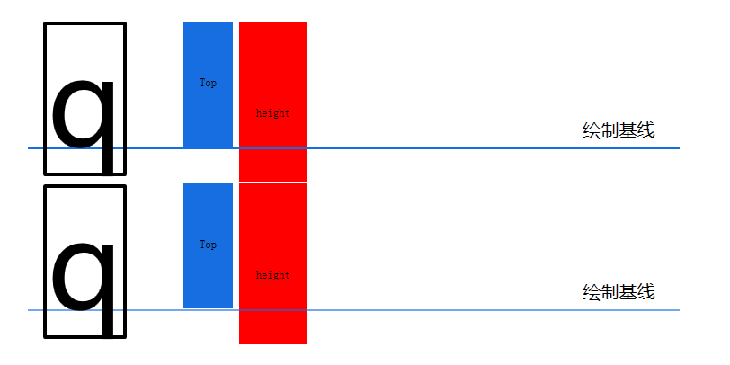
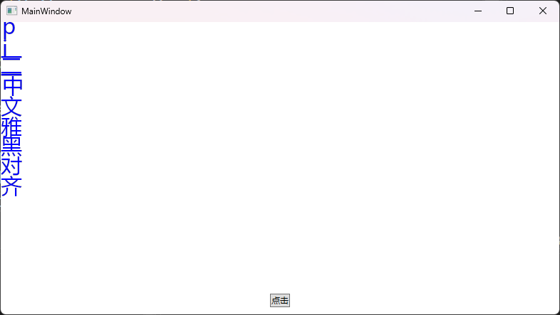
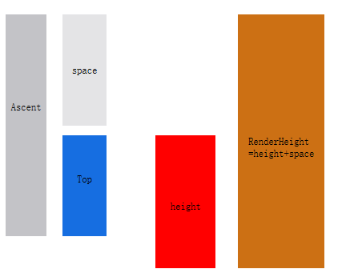
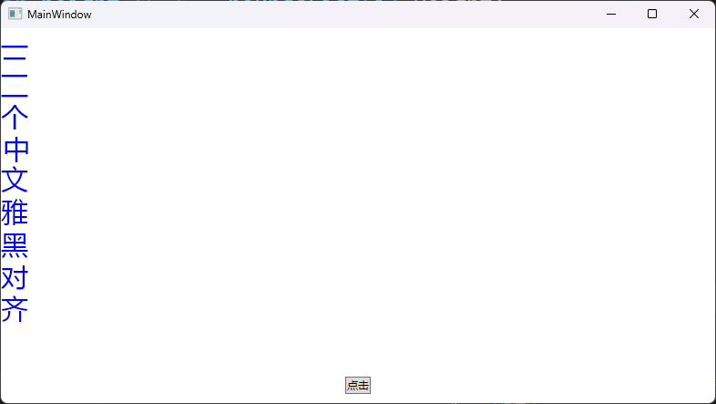
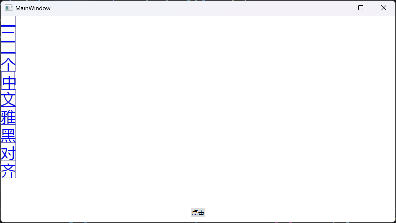
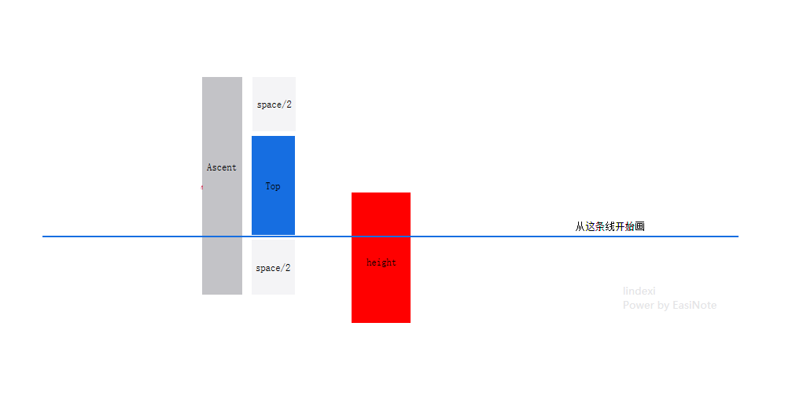
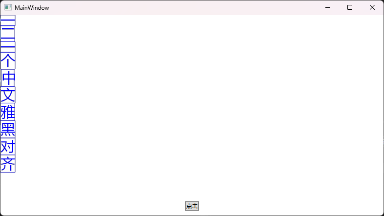
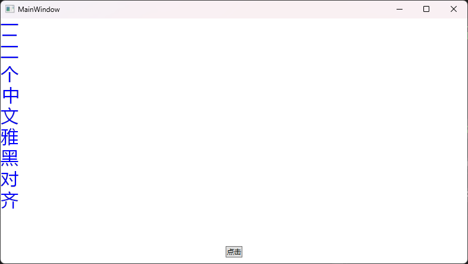

# WPF 探索 Skia 的竖排文本渲染的字符高度

本文记录我探索 Skia 做竖排文本渲染过程中的字符高度计算方法

<!--more-->
<!-- 发布 -->
<!-- 博客 -->

如果只考虑字符和字符之间密集的进行排列，那只需使用 GetGlyphWidths 方法获取字符的字墨尺寸范围即可。如以下代码所示，从 SKFont 获取字墨尺寸范围

```csharp
            using var paint = new SKPaint();
            paint.Color = SKColors.Blue;
            paint.Style = SKPaintStyle.Fill;
            paint.IsAntialias = true;

            using var typeface = SKFontManager.Default.MatchFamily("微软雅黑");
            using var skFont = new SKFont(typeface, 30);

            var text = "pi一二一中文雅黑对齐";

            var glyphList = new ushort[text.Length];
            skFont.GetGlyphs(text, glyphList);
            var widthList = new float[glyphList.Length];
            var boundsList = new SKRect[glyphList.Length];
            skFont.GetGlyphWidths(glyphList, widthList, boundsList, paint);
```

以上获取的 `boundsList` 就是对应的每个字符的在 WPF 概念里面的 字墨尺寸范围 接近的值。这里需要说明的是 WPF 采用的是 DirectWrite 进行渲染，和 Skia 获取的数值上有所偏差，好在对于微软雅黑来说，只是小数点之后的误差而已

在 Skia 里面，传入 DrawText 里面的点坐标指的是字符的 baseline 基线坐标，而不是左上角坐标

默认情况下渲染的字符高度，直接等于字高度是可以的，能够实现一个字紧接一个字的效果。尽管这样会让字过于紧凑，如以下示意图

<!--  -->


对应的代码如下

```csharp
            var positionList = new SKPoint[text.Length];
            var y = 0f;
            for (int i = 0; i < text.Length; i++)
            {
                var height = boundsList[i].Height;
                var charHeight = height;
                var top = boundsList[i].Top;

                paint.Color = SKColors.Blue.WithAlpha(0xC5);
                paint.Style = SKPaintStyle.Stroke;

                positionList[i] = new SKPoint(boundsList[i].Left, y + -top);
                y += charHeight;
            }

            SKTextBlob skTextBlob = SKTextBlob.CreatePositioned(text, skFont, positionList.AsSpan());
            skCanvas.DrawText(skTextBlob, 0, 0, paint);
```

实现的效果十分紧凑的字符排版效果，如此的直排竖排垂直分布排版界面效果如下

<!--  -->


以上代码放在 [github](https://github.com/lindexi/lindexi_gd/tree/d77e52470f55cc00d556dea1c873a1ec5ce61f22/SkiaSharp/DihealereniRakallfairko) 和 [gitee](https://gitee.com/lindexi/lindexi_gd/blob/d77e52470f55cc00d556dea1c873a1ec5ce61f22/SkiaSharp/DihealereniRakallfairko) 上，可以使用如下命令行拉取代码。我整个代码仓库比较庞大，使用以下命令行可以进行部分拉取，拉取速度比较快

先创建一个空文件夹，接着使用命令行 cd 命令进入此空文件夹，在命令行里面输入以下代码，即可获取到本文的代码

```
git init
git remote add origin https://gitee.com/lindexi/lindexi_gd.git
git pull origin d77e52470f55cc00d556dea1c873a1ec5ce61f22
```

以上使用的是国内的 gitee 的源，如果 gitee 不能访问，请替换为 github 的源。请在命令行继续输入以下代码，将 gitee 源换成 github 源进行拉取代码。如果依然拉取不到代码，可以发邮件向我要代码

```
git remote remove origin
git remote add origin https://github.com/lindexi/lindexi_gd.git
git pull origin d77e52470f55cc00d556dea1c873a1ec5ce61f22
```

获取代码之后，进入 SkiaSharp/DihealereniRakallfairko 文件夹，即可获取到源代码

以上的竖排效果只能说是有效果，但整体效果不好。为了实现更好的竖排效果，自然可以想到的就是加上字符边距，如 <https://gitee.com/lindexi/lindexi_gd/blob/0d200a22b3829188a9abb6f967f96a7341f75b5c/LightTextEditorPlus/LightTextEditorPlus.Skia/Platform/SkiaCharInfoMeasurer.cs#L275-277> 或 <https://github.com/lindexi/lindexi_gd/blob/0d200a22b3829188a9abb6f967f96a7341f75b5c/LightTextEditorPlus/LightTextEditorPlus.Skia/Platform/SkiaCharInfoMeasurer.cs#L275-L277> 文本库的补丁代码所示

```csharp
if (!isHorizontal)
{
    // 竖排情况下，不要让字间距过大
    const int margin = 6;
    height = renderBounds.Height + margin;
}
```

自然来说，这个间距是好的。但不足之处至于这是一个魔法值，没有什么理由

一个自然的方法是引入 baseline（Ascent）来作为间距，如下图所示

<!--  -->


引入 baseline（Ascent）来作为间距，即以上代码的 margin 换成了 space 值

```csharp
space = Ascent - Top
```

于是此时的渲染高度计算公式如下

```csharp
RenderHeight = height + space
= 字高度+空隙
```

为了让字不紧凑，就需要使用至少为 baseline（Ascent） 的间距距离。尽管理论上使用 Top 就足够了，但 Top 过于紧凑。引入 baseline 之后，就会因为 Top 和 baseline 之间的差距，引入了 space 高度的空隙。于是引入 baseline 之后的渲染高度就应该是 height 字高加上空隙

更改代码，引入 baseline 作为 margin 的代码如下

```csharp
            var positionList = new SKPoint[text.Length];
            var y = 0f;
            for (int i = 0; i < text.Length; i++)
            {
                var height = boundsList[i].Height;
                var charHeight = height;
                var top = boundsList[i].Top;

                var space = baseline + top;
                charHeight = height + space; // 字高度加空隙等于渲染高度

                paint.Color = SKColors.Blue.WithAlpha(0xC5);
                paint.Style = SKPaintStyle.Stroke;

                positionList[i] = new SKPoint(boundsList[i].Left, y + baseline);
                y += charHeight;
            }

            SKTextBlob skTextBlob = SKTextBlob.CreatePositioned(text, skFont, positionList.AsSpan());

            paint.Style = SKPaintStyle.Fill;
            paint.Color = SKColors.Blue;
            skCanvas.DrawText(skTextBlob, 0, 0, paint);
```

运行之后的界面效果如下

<!--  -->


是不是看起来有些奇怪？试试将每个外接边框也输出出来，代码如下

```csharp
                var height = boundsList[i].Height;
                var charHeight = height;
                var top = boundsList[i].Top;

                var space = baseline + top;
                charHeight = height + space; // 字高度加空隙等于渲染高度

                paint.Color = SKColors.Blue.WithAlpha(0xC5);
                paint.Style = SKPaintStyle.Stroke;

                skCanvas.DrawRect(boundsList[i].Left, y, boundsList[i].Width, charHeight, paint);

                positionList[i] = new SKPoint(boundsList[i].Left, y + baseline);
                y += charHeight;
```

运行的效果如下图，从下图一下就可以看出来，汉字“一”明显过于偏下

<!--  -->


只引入 baseline 依然还是不够的，为了能够在竖排过程中，让一些汉字，如“一”进行垂直方向的居中，这里不会直接从 baseline 开始画，而是取 `(baseline-space/2)` 开始画，确保画出来的效果如下所示

<!--  -->


核心实现代码如下

```csharp
            var positionList = new SKPoint[text.Length];
            var y = 0f;
            for (int i = 0; i < text.Length; i++)
            {
                var height = boundsList[i].Height;
                var charHeight = height;
                var top = boundsList[i].Top;

                var space = baseline + top;
                charHeight = height + space; // 字高度加空隙等于渲染高度

                paint.Color = SKColors.Blue.WithAlpha(0xC5);
                paint.Style = SKPaintStyle.Stroke;

                skCanvas.DrawRect(boundsList[i].Left, y, boundsList[i].Width, charHeight, paint);

                positionList[i] = new SKPoint(boundsList[i].Left, y + baseline - space / 2);
                y += charHeight;
            }
```

画出来的界面效果如下

<!--  -->


去掉调试边框之后的效果如下

<!--  -->


如此看起来垂直方向就十分正常了。以上优化修改的代码放在 [github](https://github.com/lindexi/lindexi_gd/tree/0223eda53dae64ded4aa99a0a4506b6c89af207e/SkiaSharp/RebeduryaiNarjargeka) 和 [gitee](https://gitee.com/lindexi/lindexi_gd/blob/0223eda53dae64ded4aa99a0a4506b6c89af207e/SkiaSharp/RebeduryaiNarjargeka) 上，可以使用如下命令行拉取代码。我整个代码仓库比较庞大，使用以下命令行可以进行部分拉取，拉取速度比较快

先创建一个空文件夹，接着使用命令行 cd 命令进入此空文件夹，在命令行里面输入以下代码，即可获取到本文的代码

```
git init
git remote add origin https://gitee.com/lindexi/lindexi_gd.git
git pull origin 0223eda53dae64ded4aa99a0a4506b6c89af207e
```

以上使用的是国内的 gitee 的源，如果 gitee 不能访问，请替换为 github 的源。请在命令行继续输入以下代码，将 gitee 源换成 github 源进行拉取代码。如果依然拉取不到代码，可以发邮件向我要代码

```
git remote remove origin
git remote add origin https://github.com/lindexi/lindexi_gd.git
git pull origin 0223eda53dae64ded4aa99a0a4506b6c89af207e
```

获取代码之后，进入 SkiaSharp/RebeduryaiNarjargeka 文件夹，即可获取到源代码

更多技术博客，请参阅 [博客导航](https://blog.lindexi.com/post/%E5%8D%9A%E5%AE%A2%E5%AF%BC%E8%88%AA.html )
<!-- 记录课件：《Skia 与文本渲染》 -->