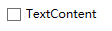
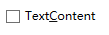
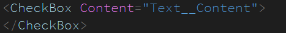

# WPF 控件 Content 的内容不显示下划线字符串

在 WPF 中有一个特性是按下 Alt 键盘选中某个按钮，而这个特性是通过在内容里面的字符串里面添加关键字，让某个字符作为关键字的方法就是在前面加上下划线所以这个下划线默认是不显示的

<!--more-->
<!-- CreateTime:2019/10/16 9:21:32 -->

<!-- csdn -->

请看下面代码

```csharp
        <CheckBox Content="Text_Content">
        </CheckBox>
```

运行的界面可以看到没有了下划线

<!--  -->


如果此时在界面按下了 Alt 键，将会看到 `Text_Content` 中的 `C` 添加了下划线

<!--  -->


按下 Alt + C 就可以选中这个按钮

所以这是一个快捷键的功能，通过在特定字符前面加上下划线的方式，让这个按钮可以使用快捷键

很少有逗比会用中文作为快捷键，虽然这也可以，如下面代码

```xml
        <CheckBox Content="按下Alt键盘加上_逗就可以选中这个按钮">
        </CheckBox>
```

但是输入 逗 字会被用户说逗比

如果此时想要下划线可以通过写两次下划线

```xml
        <CheckBox Content="Text__Content">
        </CheckBox>
```

<!--  -->


或者将 Content 里面添加文本控件

```xml
        <CheckBox>
            <CheckBox.Content>
                <TextBlock Text="Text_Content"></TextBlock>
            </CheckBox.Content>
        </CheckBox>
```

在看到 WPF 控件按钮的文本的下划线看不到的时候，请不要认为这是 WPF 的坑

<a rel="license" href="http://creativecommons.org/licenses/by-nc-sa/4.0/"></a><br />本作品采用<a rel="license" href="http://creativecommons.org/licenses/by-nc-sa/4.0/">知识共享署名-非商业性使用-相同方式共享 4.0 国际许可协议</a>进行许可。欢迎转载、使用、重新发布，但务必保留文章署名[林德熙](http://blog.csdn.net/lindexi_gd)(包含链接:http://blog.csdn.net/lindexi_gd )，不得用于商业目的，基于本文修改后的作品务必以相同的许可发布。如有任何疑问，请与我[联系](mailto:lindexi_gd@163.com)。
