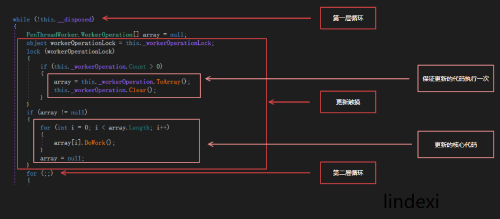
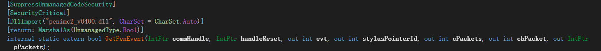
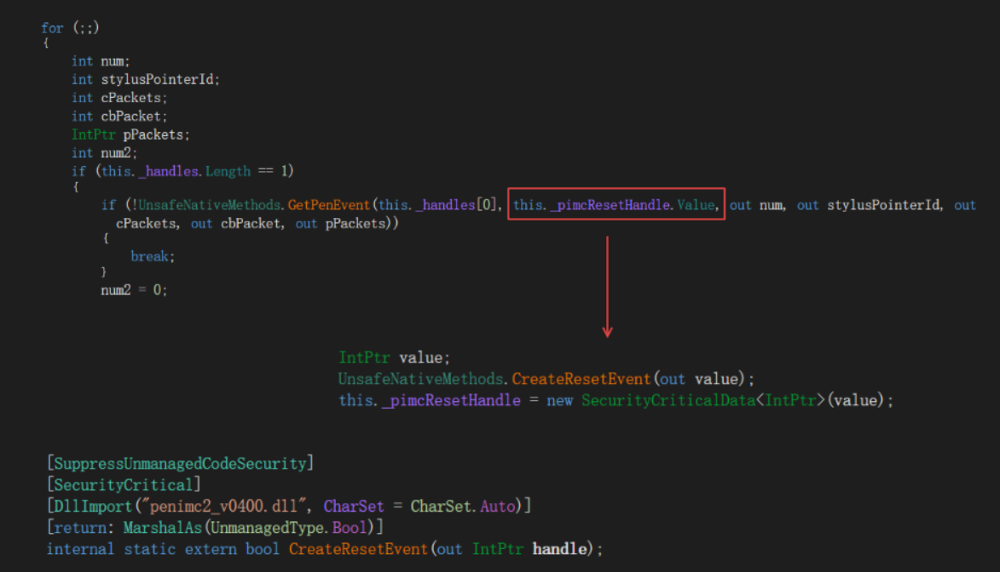
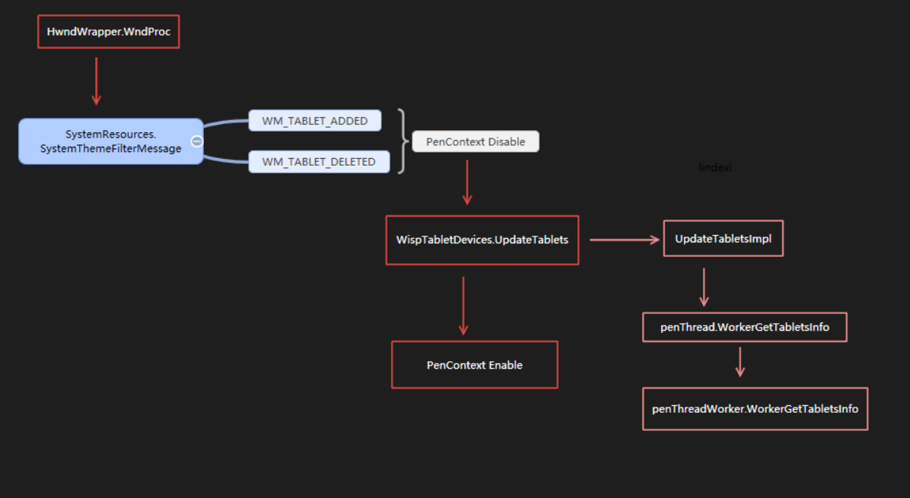
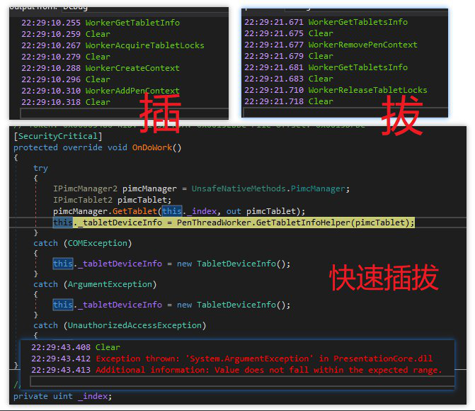

# WPF 插拔触摸设备触摸失效

最近使用 WPF 程序，在不停插拔触摸设备会让 WPF 程序触摸失效。通过分析 WPF 源代码可以找到 WPF 触摸失效的原因。

<!--more-->
<!-- CreateTime:2018/8/15 8:12:47 -->

<!-- csdn -->
<!-- 标签：WPF，触摸 -->

在 Windows 会将所有的 Hid （输入）设备在插拔的时候通过 Windows 消息进行更新设备信息。在触摸的时候，通过一个线程用来收集触摸信息。

本文下面的代码是通过 [dnSpy](https://walterlv.github.io/post/edit-and-recompile-assembly-using-dnspy.html )反编译调试。

## 存在的问题

通过 WPF 的源代码可以发现存在两个问题，两个问题在两个不同的类

 - 在 PenThreadWorker 的 GetPenEventMultiple 传入 `_handles` 为空数组，并且进行无限的等待

 - WorkerOperationGetTabletsInfo 的 OnDoWork 出现 `COMException` 返回空的数组，原本存在触摸设备识别为不存在

## 解决方法

在重新插拔触摸屏就可以恢复。

通过降低 CPU 频率可以减少触摸失效

## 原理

需要从 WPF 代码解释为什么会出现这个问题

在 WPF 的 PresentationCore.dll 有一个类 PenThreadWorker 就是用来收集用户的触摸。这个类的构造函数创建了一个线程，请看下面代码

```csharp
			new Thread(new ThreadStart(this.ThreadProc))
			{
				IsBackground = true
			}.Start();
```

这个线程的实际代码是 `ThreadProc` 函数，在这个函数的第一句话是设置这个线程的线程名为`Stylus Input` 然后进入一个循环

```csharp
while (!this.__disposed)
{
	// 初始化触摸设备代码

    for (;;)
    {
		// 这是获取触摸流程循环
		// 获取用户触摸代码
    }
}
```

这个 `ThreadProc` 有两层循环，初始化流程循环用于在初始化触摸设备，用于更新 `PenContext` 的值。获取触摸流程循环用于拿到用户触摸相关。很多的时候，在用户正常使用的流程只是运行初始化流程循环一次，之后在用户触摸的时候就通过获取触摸流程循环拿到值。本文下面就会使用初始化流程循环指代第一层循环，使用获取触摸流程循环指代第二层循环。

<!--  -->


获取触摸流程循环是通过 `penimc2_v0400.dll` 来拿到触摸收集进程收集到的点。

<!--  -->


在程序开始运行到`UnsafeNativeMethods.GetPenEvent(this._handles[0], this._pimcResetHandle.Value, out num, out stylusPointerId, out cPackets, out cbPacket, out pPackets)`线程就会在这里等待，一旦屏幕任何部分收到触摸信息，就会继续。线程等待的方法是因为在构造函数使用了 `CreateResetEvent` 创建信号量，创建信号量传入 `GetPenEvent` 在收到用户触摸时才释放，于是线程才可以继续运行。

<!--  -->


上面的代码是只处理存在 一个 PenContext 的情况，如果存在多个 PenContext 就会运行 `UnsafeNativeMethods.GetPenEventMultiple(this._handles.Length, this._h
t num, out stylusPointerId, out cPackets, out cbPacket, out pPackets)
` 的方法，这个方法和 `GetPenEvent` 一样在没有收到触摸信息时会卡住，一旦屏幕任何部分收到触摸信息，就会继续。这里的代码需要简单的介绍

```csharp
for (;;)
{
	// 无限循环，直到发现设备更新
	int num;// 表示事件，事件是数值
	// 707：PenInRange
	// 708：PenOutOfRange
	// 709：PenDown
	// 710：PenUp
	// 711：Packets
	int stylusPointerId;
	int cPackets;
	int cbPacket;
	IntPtr pPackets;
	int num2; // 是那个 PenContext 拿到触摸
	// 如果只有一个 PenContext 就使用下面代码
	if (this._handles.Length == 1)
	{
		if (!UnsafeNativeMethods.GetPenEvent(this._handles[0], this._pimcResetHandle.Value, out num, out stylusPointerId, out cPackets, out cbPacket, out pPackets))
		{
			// 如果更新触摸屏，这里会返回，到初始化流程循环

			break;
		}
		// 因为只有一个 PenContext 于是使用数组第一个
		num2 = 0;
	}
	// 如果有比较多个 PenContext 就使用下面代码
	else if (!UnsafeNativeMethods.GetPenEventMultiple(this._handles.Length, this._handles, this._pimcResetHandle.Value, out num2, out num, out stylusPointerId, out cPackets, out cbPacket, out pPackets))
	{
		// 如果更新触摸屏，这里会返回，到初始化流程循环

		break;
	}
	if (num != 1)
	{
		// 拿到用户触摸的所在 penContext 这个 _penContexts 是弱引用
		PenContext penContext = this._penContexts[num2].Target as PenContext;
		if (penContext != null)
		{
			// 执行 penContext 将触摸发送到框架
			this.FireEvent(penContext, num, stylusPointerId, cPackets, cbPacket, pPackets);
		}
	}
	else
	{
		this.FlushCache(true);
		for (int j = 0; j < this._penContexts.Length; j++)
		{
			PenContext penContext2 = this._penContexts[j].Target as PenContext;
			if (penContext2 != null)
			{
				penContext2.FirePenOutOfRange(0, Environment.TickCount);
			}
		}
	}
}
```

这个代码看起来可以很好工作，但是不要忘了，如果有用户在不停出现插拔触摸屏，会出现什么？

因为 `GetPenEvent` 和 `GetPenEventMultiple` 都只有在触摸屏收到触摸信息或者 `_pimcResetHandle` 被释放会返回，而在用户拔出触摸屏时，触摸屏是没有收到触摸信息，于是 `GetPenEvent` 和 `GetPenEventMultiple` 不会因为收到触摸信息返回。在 `GetPenEvent` 和 `GetPenEventMultiple` 收到触摸信息返回的是 true 而在释放 `_pimcResetHandle` 返回的是 false 于是上面代码就根据这个方法判断返回，如果是因为释放 `_pimcResetHandle` 就是因为更新了 `_workerOperation` 从初始化流程循环可以运行 `_workerOperation` 而不是等待触摸，这个过程在用户插拔触摸屏很有用。

从上面的代码可以知道，更新触摸的代码只会执行一次，因为在初始化流程循环会使用一个数组复制`_workerOperation`并且清空，然后运行。这个过程使用了锁，于是更新触摸的代码只会执行一次。

```csharp
PenThreadWorker.WorkerOperation[] array = null;
// 这是一个锁，防止在这个线程运行时，修改 _workerOperation 的值
object workerOperationLock = this._workerOperationLock;
// 复制 _workerOperation 到数组，然后清空这个 _workerOperation 这样做是防止在其他线程等太久
// 如果不复制，直接执行  _workerOperation 而且执行的时间比较长，那么在其他线程需要修改 _workerOperation 就需要等很久，通过这个方法可以先复制到新的数组，复制完成就可以修改
lock (workerOperationLock)
{
	if (this._workerOperation.Count > 0)
	{
		array = this._workerOperation.ToArray();
		this._workerOperation.Clear();
	}
}
if (array != null)
{
	for (int i = 0; i < array.Length; i++)
	{
		array[i].DoWork();
	}
	array = null;
}
```

那么第二个问题，这个 `_workerOperation` 是从哪里赋值的？实际上调用 `WorkerAddPenContext` 函数或调用 `WorkerRemovePenContext` 函数时，就会修改这个值。这个函数就是在触摸屏插拔的时候触发。

下面是尝试在各个 `_workerOperation` 加入和运行的时候输出的日志

```csharp
// 拔
14:51:24.458 WorkerGetTabletsInfo
14:51:24.462 Clear
14:51:24.468 WorkerRemovePenContext
14:51:24.472 Clear
14:51:24.475 WorkerGetTabletsInfo
14:51:24.480 Clear
14:51:24.493 WorkerReleaseTabletLocks
14:51:24.499 Clear
// 插
14:51:25.623 WorkerGetTabletInfo
14:51:25.628 Clear
14:51:25.632 WorkerAcquireTabletLocks
14:51:25.640 Clear
14:51:25.648 WorkerCreateContext
14:51:25.657 Clear
14:51:25.671 WorkerAddPenContext
14:51:25.677 Clear
```

在所有的设备修改都会触发 windows 消息，在 `HwndWrapper.WndProc` 可以收到 Windows 消息

如果收到的消息是 `WM_TABLET_ADDED` 或 `WM_TABLET_DELETED` 就会在 `SystemResources.SystemThemeFilterMessage` 调用 `InvalidateTabletDevices` 刷新触摸屏

```csharp
    private static IntPtr SystemThemeFilterMessage(IntPtr hwnd, int msg, IntPtr wParam, IntPtr lParam, ref bool handled)
    {
    	WindowMessage message = (WindowMessage)msg;
        switch (message)
        {
        	// 其他忽略消息
            case WindowMessage.WM_TABLET_ADDED:
                 InvalidateTabletDevices(message, wParam, lParam);
                 break;
 
            case WindowMessage.WM_TABLET_DELETED:
                 InvalidateTabletDevices(message, wParam, lParam);
                 break;
        }
    }
```

在 `InvalidateTabletDevices` 函数是将消息转发 `StylusLogic.CurrentStylusLogic?.HandleMessage(msg, wParam, lParam);` 使用`StylusLogic.HandleMessage` 处理

这里因为 `StylusLogic` 调用基类 WispLogic 的 `HandleMessage` 方法，所以下面的代码是在`WispLogic` 运行。因为存在添加和移除设备两个不同的消息，所以下面分为两条路径。但是无论是哪条路径最后都是到 `RefreshTablets` 先禁用当前的 PenContext 再收集当前的 PenContext 然后启用

<!--  -->


禁用 PenContext 的方法是调用 `PenContext.Disable` ，这个方法传入一个 bool 告诉是否关闭 `WorkerThread` 这里都是使用 false ，这里核心就是 `_penThreadPenContext.RemovePenContext(this)` 这里的 `RemovePenContext` 会调用 `PenThreadWorker.WorkerRemovePenContext` 这个函数不是立刻运行移除，这个函数先添加 `_workerOperation` 然后释放 `_pimcResetHandle` 等待 Stylus Input 处理完成再继续。

是否还记得刚才的 `ThreadProc` 获取触摸流程循环，在用户没有触摸时，假设只有一个 PenContext 会在 `GetPenEvent` 等待，等待的方法是通过  `_pimcResetHandle` ，现在在 `WorkerRemovePenContext` 函数释放了，于是 `GetPenEvent` 就会返回。这里返回是 false 于是退出获取触摸流程循环，进入初始化流程循环，这时的 `_workerOperation` 有一个值 `WorkerOperationRemoveContext`。在初始化流程循环使用 `WorkerOperationRemoveContext.OnDoWork` 通过 DoWork 使用 `RemovePenContext` 移除。这里就是 `RemovePenContext` 移除 `PenContext` 的过程。

因为上面说了很多细节，但是从代码看，这个流程从主线程通过先添加 `_workerOperation` 加入如何处理的代码，然后通过释放 `_pimcResetHandle` 让处理输入的线程退出获取触摸流程循环，在初始化流程循环处理。

收集当前的 PenContext 是使用 `WispTabletDevices.UpdateTablets` 请看代码

```csharp

WispLogic.cs

		private void RefreshTablets()
		{
			foreach (PenContexts penContexts in this.__penContextsMap.Values)
			{
				penContexts.Disable(false);
			}
			this.WispTabletDevices.UpdateTablets();
			foreach (PenContexts penContexts2 in this.__penContextsMap.Values)
			{
				penContexts2.Enable();
			}
		}

```

在 UpdateTablets 实际是调用 `UpdateTabletsImpl` 这里有一句代码是 `penThread.WorkerGetTabletsInfo` ，而 `penThread.WorkerGetTabletsInfo` 是调用`penThreadWorker.WorkerGetTabletsInfo` 这里会释放 `_pimcResetHandle` ，也就是在 `ThreadProc` 的获取触摸流程循环就会退出。

```csharp
		[SecurityCritical]
		internal TabletDeviceInfo[] WorkerGetTabletsInfo()
		{
			PenThreadWorker.WorkerOperationGetTabletsInfo workerOperationGetTabletsInfo = new PenThreadWorker.WorkerOperationGetTabletsInfo();
			object workerOperationLock = this._workerOperationLock;
			lock (workerOperationLock)
			{
				this._workerOperation.Add(workerOperationGetTabletsInfo);
			}
			// 这里释放 _pimcResetHandle 会让 ThreadProc 的 GetPenEvent 等代码返回
			UnsafeNativeMethods.RaiseResetEvent(this._pimcResetHandle.Value);
			workerOperationGetTabletsInfo.DoneEvent.WaitOne();
			workerOperationGetTabletsInfo.DoneEvent.Close();
			return workerOperationGetTabletsInfo.TabletDevicesInfo;
		}
```

这里 WorkerOperationGetTabletsInfo 就是更新的代码，这里使用 COM 通过[CoCreateInstance](https://blog.csdn.net/a1875566250/article/details/7885905 ) 新建 PimcManager 通过 `PenThreadWorker.GetTabletInfoHelper` 拿到 `_tabletDevicesInfo` 请看代码

```csharp
            protected override void OnDoWork()
            {
                try
                {
                    // create new collection of tablets
                    MS.Win32.Penimc.IPimcManager pimcManager = MS.Win32.Penimc.UnsafeNativeMethods.PimcManager;
                    pimcManager.GetTabletCount(out var cTablets);
 
                    TabletDeviceInfo[] tablets = new TabletDeviceInfo[cTablets];
 
                    for ( uint iTablet = 0; iTablet < cTablets; iTablet++ )
                    {
                        MS.Win32.Penimc.IPimcTablet pimcTablet;
                        pimcManager.GetTablet(iTablet, out pimcTablet);

                        // 出现 System.Runtime.InteropServices.COMException
                        // 0x800706BA
                        tablets[iTablet] = PenThreadWorker.GetTabletInfoHelper(pimcTablet);
                    }
 
                    // Set result data and signal we are done.
                    _tabletDevicesInfo = tablets;
                }
                catch ( System.Runtime.InteropServices.COMException )
                {
                    // result will not be initialized if we fail due to a COM exception.
                    Debug.WriteLine("WorkerOperationGetTabletsInfo.OnDoWork failed due to a COMException");
 
                    // return no devices found on error.
                    _tabletDevicesInfo = new TabletDeviceInfo[0];
                }
                // 其他异常
            }
 
```

如果在 `GetTabletInfoHelper` 出现 `COMException` 或 `ArgumentException`就会返回空的数组，因为无法拿到触摸设备，在 WPF 触摸失效。

下面的图片就是在普通的插拔触摸屏和快速插拔触摸屏时不同的输出，可以看到在快速插拔的时候在  `GetTabletInfoHelper` 出现了 `ArgumentException` 这时就会让 WPF 无法触摸

<!--  -->


因为在 WispLogic 的 RefreshTablets 先禁用了 PenContexts 但是在更新 UpdateTablets 返回的是空数组，于是重新打开 PenContexts 就找不到触摸屏，所以就触摸失效

## 代码存在的问题

在上面所说的 `GetTabletInfoHelper` 出现 `COMException` 返回数组会出现异常会让 WPF 触摸失效。因为在用户插入触摸屏时触发了 TabletAdded 消息，在之后用户触摸时不会有其他的插拔触摸相关消息。所以在第一次收到`WM_TABLET_ADDED`做初始化时，如果出现了 `COMException` 等返回空数组就会失去初始化时机。

第二个问题是因为消息循环和获得输入的线程是两个线程，两个线程之间比较难做到同步，特别是使用释放 `_pimcResetHandle` 的方法让输入线程重新调用 `_workerOperation` ，在插拔触摸屏需要触发多个 Windows 消息，几乎每个消息都需要插入一个  `_workerOperation` 并且使用等待的方式。只要出现线程调度没有处理好，就会出现原来需要添加的 PenContext 没有添加，这时就无法获得触摸。

除了调度的时机，在 `Stylus Input` 线程是使用 `_pimcResetHandle.Value` 在 `GetPenEvent` 等函数进行等待。而 `_workerOperation` 如 `WorkerGetTabletsInfo` 是从主线程的消息循环进入的，这个函数是将 `WorkerOperationGetTabletsInfo` 加入到  `_workerOperation`  然后释放 `_pimcResetHandle.Value` 通过释放  `_pimcResetHandle.Value` 在 `Stylus Input` 线程就可以从 `GetPenEvent` 等函数返回，这时进入循环执行 `_workerOperation` ，然后主线程在等待  `WorkerOperationGetTabletsInfo` 的完成才可以继续代码。这样也就是原来的主线程是需要通过释放 `_pimcResetHandle.Value` 让 `Stylus Input` 线程运行一段代码，并且主线程需要等待 `Stylus Input` 线程运行完成才可以继续。而我看了里面的代码，实在没必要让这些代码在 `Stylus Input` 线程运行。现在 WPF 这些代码的性能会比直接在主线程运行要低，因为代码运行的时间是 主线程释放 `_pimcResetHandle` 等待 `Stylus Input` 线程运行完成，等待 `Stylus Input` 线程运行完成需要等待 CPU 调度 `Stylus Input` 线程运行代码，还需要等待 `Stylus Input` 线程运行完成之后设置`AutoResetEvent`这个等待的时间相对直接在主线程运行是长很多，而且只要 CPU 一直不调度 `Stylus Input` 线程就需要一直等，不如重新创建线程。


第三个问题是在 `PenThreadWorker` 的 `ThreadProc` 的获取触摸流程循环只判断 `_handles.Length == 1` 时调用 GetPenEvent 其他的时候调用 `GetPenEventMultiple`  也就是在 `_handles.Length` 为 0 时也是调用 `GetPenEventMultiple` 这从开发的 API 设计上看，如果没有 `_handles` 也就是没有 PenContext 就不应该进入 `GetPenEventMultiple` 函数。建议是没有 `_handles` 使用另外的函数进行等待。

这里为什么在 `_handles.Length` 不是 1 需要使用 `GetPenEventMultiple` 而不是直接返回的原因是觉得创建线程的代价太高，或如果不进入等待的函数就会进入循环，不停进入循环。实际上这里在 `_handles` 没有值就是用户没有触摸屏，用户插入触摸屏的时间是很少的，没有几个用户一天没事都在插入拔出触摸屏，所以在用户插入触摸屏时再创建一个新的线程，在用户拔出触摸屏去掉这个线程是可以的。 通过这样做减少在这个线程等待的时间，防止用户的软件因为在 `GetPenEventMultiple` 没有释放触摸失效。 

但是无论是什么方法都难以解决所有触摸问题，建议开发接口让应用去修改触摸相关的，如重新进行初始化触摸

参见：

[WPF and Custom Credential Provider in Windows 7](https://social.msdn.microsoft.com/Forums/en-US/a8b6dc70-1421-4e05-bc21-1ebb638ab866/wpf-and-custom-credential-provider-in-windows-7?forum=wpf )

[.net - InvalidCastException with COM client and server in C# - Stack Overflow](https://stackoverflow.com/questions/26476889/invalidcastexception-with-com-client-and-server-in-c-sharp )

[WPF 程序无法触摸操作？我们一起来找原因和解决方法](https://blog.csdn.net/WPwalter/article/details/77986954 )

<a rel="license" href="http://creativecommons.org/licenses/by-nc-sa/4.0/"></a><br />本作品采用<a rel="license" href="http://creativecommons.org/licenses/by-nc-sa/4.0/">知识共享署名-非商业性使用-相同方式共享 4.0 国际许可协议</a>进行许可。欢迎转载、使用、重新发布，但务必保留文章署名[林德熙](http://blog.csdn.net/lindexi_gd)(包含链接:http://blog.csdn.net/lindexi_gd )，不得用于商业目的，基于本文修改后的作品务必以相同的许可发布。如有任何疑问，请与我[联系](mailto:lindexi_gd@163.com)。
