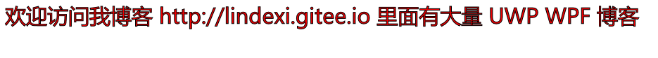
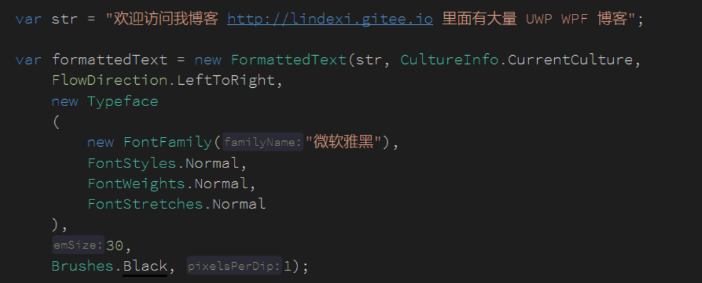

# WPF 文字描边

本文告诉大家如何写出描边的字体

<!--more-->
<!-- CreateTime:2019/1/24 19:47:18 -->

<!-- csdn -->

在WPF如果需要写入描边需要使用 FormattedText 将文字转换为 Geometry 然后通过画出 Geometry 的边框和填充画出描边

<!--  -->


首先创建一个类继承 UIElement 这样就可以重写 OnRender 方法在里面画出文字

假设需要画出的文字是 欢迎访问我博客 http://lindexi.gitee.io 里面有大量 UWP WPF 博客

```csharp
       protected override void OnRender(DrawingContext drawingContext)
        {
            var str = "欢迎访问我博客 http://lindexi.gitee.io 里面有大量 UWP WPF 博客";

            base.OnRender(drawingContext);
        }
```

通过字符串创建 FormattedText 这里需要传入很多参数

```csharp
            var formattedText = new FormattedText(str, CultureInfo.CurrentCulture,
                FlowDirection.LeftToRight,
                new Typeface
                (
                    new FontFamily("微软雅黑"),
                    FontStyles.Normal,
                    FontWeights.Normal,
                    FontStretches.Normal
                ),
                30,
                Brushes.Black, 96);
```

<!--  -->


调用 formattedText.BuildGeometry 可以创建 Geometry 参数传入左上角坐标

然后就是画出这个 Geometry 通过这个 Pen 设置描边的宽度和颜色

```csharp
            drawingContext.DrawGeometry
            (
                new SolidColorBrush((Color) ColorConverter.ConvertFromString("#F00002")),
                new Pen(new SolidColorBrush(Colors.Black), 1),
                geometry
            );
```

打开 xaml 添加这个控件运行代码就可以看到上面界面

```csharp
        <local:CureekaMasar></local:CureekaMasar>
```

所有代码请看下面

```csharp
       protected override void OnRender(DrawingContext drawingContext)
        {
            var str = "欢迎访问我博客 http://lindexi.gitee.io 里面有大量 UWP WPF 博客";

            var formattedText = new FormattedText(str, CultureInfo.CurrentCulture,
                FlowDirection.LeftToRight,
                new Typeface
                (
                    new FontFamily("微软雅黑"),
                    FontStyles.Normal,
                    FontWeights.Normal,
                    FontStretches.Normal
                ),
                30,
                Brushes.Black, 1);

            var geometry = formattedText.BuildGeometry(new Point(10, 10));
            
            drawingContext.DrawGeometry
            (
                new SolidColorBrush((Color) ColorConverter.ConvertFromString("#F00002")),
                new Pen(new SolidColorBrush(Colors.Black), 1),
                geometry
            );

            base.OnRender(drawingContext);
        }
```


<a rel="license" href="http://creativecommons.org/licenses/by-nc-sa/4.0/"></a><br />本作品采用<a rel="license" href="http://creativecommons.org/licenses/by-nc-sa/4.0/">知识共享署名-非商业性使用-相同方式共享 4.0 国际许可协议</a>进行许可。欢迎转载、使用、重新发布，但务必保留文章署名[林德熙](http://blog.csdn.net/lindexi_gd)(包含链接:http://blog.csdn.net/lindexi_gd )，不得用于商业目的，基于本文修改后的作品务必以相同的许可发布。如有任何疑问，请与我[联系](mailto:lindexi_gd@163.com)。
