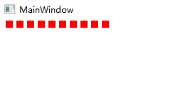
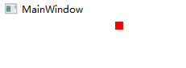

# WPF 更改 DrawingVisual 的 RenderOpen 用到的对象的内容将持续影响渲染效果

在 WPF 里面，可以通过 DrawingVisual 来进行使用底层的绘制方法，此方法需要调用  DrawingVisual 的 RenderOpen 拿到 DrawingContext 类型的对象，接着调用此对象的方法来进行界面绘制。在绘制完成之后，如果依然保存绘制过程的对象，例如 Transform 对象，那当界面再次刷新时，如果更改此对象的属性，将会影响渲染

<!--more-->

<!-- 发布 -->

似乎这不是一个可以做简单描述的问题，其实这个问题也让我前天花了半天的时间才解决的一个界面渲染问题的其中一个。我在编写一个简单的轻量的文本库的时候，发现了文本字排版存在了一点问题。我的文本排版才能的是将文本转换为 Geometry 对象，接着在 DrawingContext 里面绘制出来。我为了实现让文本可以叠加特效的功能，因此不采用 GlyphRun 类型，同时为了减少 Geometry 对象的创建，我不能在 Geometry 对象上叠加变换

因为为了让文本的字能排版对，我就需要设置每个字在界面绘制的坐标。为了简化逻辑，我采用一个 RectangleGeometry 来代替文字的 Geometry 对象。如基础的知识，在 DrawingContext 里面如果想要在指定的地方绘制某个内容，可以采用的方法是调用 PushTransform 方法，设置当前绘制的变换，也就包括了设置当前绘制在哪，如下面代码

```csharp
            var drawingVisual = new DrawingVisual();
            using (var drawingContext = drawingVisual.RenderOpen())
            {
                var rectangleGeometry = new RectangleGeometry(new Rect(0, 0, 10, 10));

                for (int i = 0; i < 10; i++)
                {
                    var translateTransform = new TranslateTransform();

                    translateTransform.X = i * 15;

                    drawingContext.PushTransform(translateTransform);

                    drawingContext.DrawGeometry(Brushes.Red, null, rectangleGeometry);

                    drawingContext.Pop();
                }
            }
```

此时的界面能工作，大概如下

<!--  -->


然而我看到了每次都需要创建一个 TranslateTransform 对象，我觉得也许会影响内存。是否 TranslateTransform 对象可以和 RectangleGeometry 对象一样复用。在调用 Pop 方法之后，是否 TranslateTransform 对象的内容已被拷贝，于是我变更代码如下

```csharp
            var drawingVisual = new DrawingVisual();

            using (var drawingContext = drawingVisual.RenderOpen())
            {
                var rectangleGeometry = new RectangleGeometry(new Rect(0, 0, 10, 10));

                var translateTransform = new TranslateTransform();

                for (int i = 0; i < 10; i++)
                {
                    translateTransform.X = i * 15 + 10;

                    drawingContext.PushTransform(translateTransform);

                    drawingContext.DrawGeometry(Brushes.Red, null, rectangleGeometry);

                    drawingContext.Pop();
                }
            }
```

此时的 TranslateTransform 是复用的，然而界面就不能很好工作，所有的矩形都会绘制到最后的地方。看起来 PushTransform 内部没有拷贝 TranslateTransform 的对象，只是记录这条指令而已

<!--  -->


从以上的例子可以看到在 DrawingContext 里面绘制的内容，其实调用 PushTransform 方法只是将传入的 TranslateTransform 进行记录，而没有进行更多的拷贝。在后续变更 TranslateTransform 时，将会在渲染的时候，读取到变更之后的 TranslateTransform 对象的属性

在调用 DrawingVisual 的 RenderOpen 之后，在 DrawingContext 里面调用绘制方法时，不是立刻进行绘制，而是收集绘制的指令。实际的绘制渲染是在渲染线程通过 DirectX 等来实现的

在 RenderOpen 关闭之后，对 TranslateTransform 对象的变更也会影响到最终的渲染结果，因为 RenderOpen 关闭时不是立刻进行渲染。如下面代码，将会让所有的绘制的矩形都放在 X 是 500 的地方

```csharp
            var drawingVisual = new DrawingVisual();
            var translateTransform = new TranslateTransform();
            using (var drawingContext = drawingVisual.RenderOpen())
            {
                var rectangleGeometry = new RectangleGeometry(new Rect(0, 0, 10, 10));

                for (int i = 0; i < 10; i++)
                {
                    translateTransform.X = i * 15;

                    drawingContext.PushTransform(translateTransform);

                    drawingContext.DrawGeometry(Brushes.Red, null, rectangleGeometry);

                    drawingContext.Pop();
                }
            }

            translateTransform.X = 500;
```

那如果再做一些更有趣的事情呢？我在不断的更改 TranslateTransform 的属性，如下面代码

```csharp
    class Foo : UIElement
    {
        public Foo()
        {
            var drawingVisual = new DrawingVisual();
            var translateTransform = new TranslateTransform();
            using (var drawingContext = drawingVisual.RenderOpen())
            {
                var rectangleGeometry = new RectangleGeometry(new Rect(0, 0, 10, 10));

                for (int i = 0; i < 10; i++)
                {
                    translateTransform.X = i * 15;

                    drawingContext.PushTransform(translateTransform);

                    drawingContext.DrawGeometry(Brushes.Red, null, rectangleGeometry);

                    drawingContext.Pop();
                }
            }

            translateTransform.X = 500;

            Visual = drawingVisual;

            SetTranslateTransform(translateTransform);
        }

        private async void SetTranslateTransform(TranslateTransform translateTransform)
        {
            while (true)
            {
                translateTransform.X++;

                if (translateTransform.X > 700)
                {
                    translateTransform.X = 0;
                }

                await Task.Delay(TimeSpan.FromMilliseconds(10));
            }
        }

        protected override Visual GetVisualChild(int index) => Visual;
        protected override int VisualChildrenCount => 1;

        private Visual Visual { get; }
    }

```

以上代码的预期行为是什么？还请大家跑跑试试

其实就是界面在做动画，只是此动画有些有趣，需要在界面有其他逻辑进行界面刷新的时候，或者说触发渲染线程进行渲染时，才会进行动画刷新

本文所有代码放在 [github](https://github.com/lindexi/lindexi_gd/tree/2af349867a6e6da136e5bc068357877f38788216/KebelrafoRalneanarjeargi) 和 [gitee](https://gitee.com/lindexi/lindexi_gd/tree/2af349867a6e6da136e5bc068357877f38788216/KebelrafoRalneanarjeargi) 欢迎小伙伴访问


<a rel="license" href="http://creativecommons.org/licenses/by-nc-sa/4.0/"></a><br />本作品采用<a rel="license" href="http://creativecommons.org/licenses/by-nc-sa/4.0/">知识共享署名-非商业性使用-相同方式共享 4.0 国际许可协议</a>进行许可。欢迎转载、使用、重新发布，但务必保留文章署名[林德熙](http://blog.csdn.net/lindexi_gd)(包含链接:http://blog.csdn.net/lindexi_gd )，不得用于商业目的，基于本文修改后的作品务必以相同的许可发布。如有任何疑问，请与我[联系](mailto:lindexi_gd@163.com)。  
