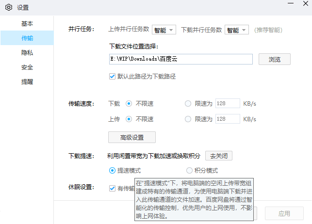

# WPF 框架全构建环境虚拟机硬盘分享

现在 WPF 完全开源了，咱可以构建自己私有的版本。我分享一个虚拟机硬盘给你，只要你下载下来，通过 VMWare 导入，即可无需任何配置，拿到一个能构建 WPF 官方源代码的全构建环境。可以用来只做你的定制版的 WPF 框架

<!--more-->
<!-- CreateTime:7/4/2020 9:11:47 AM -->

<!-- 发布 -->

现在 WPF 完全开源，但是构建的过程中需要用到很多工具，这些工具和 VS 环境相对来说需要一段时间才能拉下来，再加上每个小伙伴有趣的定制，也许会忘记安装复杂的 C++ 环境。因此我就拜托了太子帮我做一个虚拟机，我在虚拟机里面添加了 WPF 框架的全构建环境，同时构建 WPF 源代码通过之后，将硬盘保存起来，只需要 VMWare 导入此硬盘即可拿到全构建环境

百度网盘链接

链接：[https://pan.baidu.com/s/1_p5xdtG1wayI7tzqGfCL2w](https://pan.baidu.com/s/1_p5xdtG1wayI7tzqGfCL2w) 

提取码：gk99

如果百度下载太慢，可以尝试开启 P2P 模式：

<!--  -->


或者可以尝试使用[磁力链接1](magnet:?xt=urn:btih:6B489EEDA460298F10498D13C48D9B46FE175F1D&dn=Windows_10_x64_for_WPF&tr=http%3a%2f%2ftorrent.walterlv.com%3a36690%2fannounce&tr=udp%3a%2f%2ftracker.opentrackr.org%3a1337%2fannounce&tr=http%3a%2f%2fp4p.arenabg.com%3a1337%2fannounce&tr=http%3a%2f%2ftracker3.itzmx.com%3a6961%2fannounce&tr=http%3a%2f%2ftracker1.itzmx.com%3a8080%2fannounce&tr=http%3a%2f%2ftracker.zerobytes.xyz%3a1337%2fannounce&tr=http%3a%2f%2ftracker.nyap2p.com%3a8080%2fannounce&tr=http%3a%2f%2fopentracker.i2p.rocks%3a6969%2fannounce&tr=http%3a%2f%2fh4.trakx.nibba.trade%3a80%2fannounce&tr=udp%3a%2f%2fexplodie.org%3a6969%2fannounce&tr=http%3a%2f%2fvps02.net.orel.ru%3a80%2fannounce&tr=http%3a%2f%2ftrun.tom.ru%3a80%2fannounce&tr=http%3a%2f%2ftracker2.dler.org%3a80%2fannounce&tr=http%3a%2f%2ftracker.yoshi210.com%3a6969%2fannounce&tr=http%3a%2f%2ftracker.ygsub.com%3a6969%2fannounce&tr=http%3a%2f%2ftracker.sloppyta.co%3a80%2fannounce&tr=http%3a%2f%2ftracker.skyts.net%3a6969%2fannounce&tr=http%3a%2f%2ftracker.lelux.fi%3a80%2fannounce&tr=http%3a%2f%2ftracker.gbitt.info%3a80%2fannounce&tr=http%3a%2f%2ftracker.dler.org%3a6969%2fannounce&tr=http%3a%2f%2ftracker.bt4g.com%3a2095%2fannounce&tr=http%3a%2f%2ft3.leech.ie%3a80%2fannounce&tr=http%3a%2f%2ft2.leech.ie%3a80%2fannounce&tr=http%3a%2f%2ft1.leech.ie%3a80%2fannounce&tr=http%3a%2f%2ft.overflow.biz%3a6969%2fannounce&tr=http%3a%2f%2ft.nyaatracker.com%3a80%2fannounce&tr=http%3a%2f%2fretracker.sevstar.net%3a2710%2fannounce&tr=http%3a%2f%2fpow7.com%3a80%2fannounce&tr=http%3a%2f%2fopen.acgtracker.com%3a1096%2fannounce&tr=http%3a%2f%2fopen.acgnxtracker.com%3a80%2fannounce&tr=http%3a%2f%2fmail2.zelenaya.net%3a80%2fannounce&tr=http%3a%2f%2faaa.army%3a8866%2fannounce&tr=http%3a%2f%2ftracker4.itzmx.com%3a2710%2fannounce&tr=http%3a%2f%2ftracker2.itzmx.com%3a6961%2fannounce&tr=http%3a%2f%2ftracker.shittyurl.org%3a80%2fannounce&tr=http%3a%2f%2ft.acg.rip%3a6699%2fannounce) 或 [磁力链接2](magnet:?xt=urn:btih:2580F4E5E2B56FEC2B64B48585B6F9DD8B9D1B76&dn=Windows_10_x64_for_WPF.7z&tr=http%3a%2f%2ftorrent.walterlv.com%3a36690%2fannounce&tr=udp%3a%2f%2ftracker.opentrackr.org%3a1337%2fannounce&tr=http%3a%2f%2fp4p.arenabg.com%3a1337%2fannounce&tr=http%3a%2f%2ftracker3.itzmx.com%3a6961%2fannounce&tr=http%3a%2f%2ftracker1.itzmx.com%3a8080%2fannounce&tr=http%3a%2f%2ftracker.zerobytes.xyz%3a1337%2fannounce&tr=http%3a%2f%2ftracker.nyap2p.com%3a8080%2fannounce&tr=http%3a%2f%2fopentracker.i2p.rocks%3a6969%2fannounce&tr=http%3a%2f%2fh4.trakx.nibba.trade%3a80%2fannounce&tr=udp%3a%2f%2fexplodie.org%3a6969%2fannounce&tr=http%3a%2f%2fvps02.net.orel.ru%3a80%2fannounce&tr=http%3a%2f%2ftrun.tom.ru%3a80%2fannounce&tr=http%3a%2f%2ftracker2.dler.org%3a80%2fannounce&tr=http%3a%2f%2ftracker.yoshi210.com%3a6969%2fannounce&tr=http%3a%2f%2ftracker.ygsub.com%3a6969%2fannounce&tr=http%3a%2f%2ftracker.sloppyta.co%3a80%2fannounce&tr=http%3a%2f%2ftracker.skyts.net%3a6969%2fannounce&tr=http%3a%2f%2ftracker.lelux.fi%3a80%2fannounce&tr=http%3a%2f%2ftracker.gbitt.info%3a80%2fannounce&tr=http%3a%2f%2ftracker.dler.org%3a6969%2fannounce&tr=http%3a%2f%2ftracker.bt4g.com%3a2095%2fannounce&tr=http%3a%2f%2ft3.leech.ie%3a80%2fannounce&tr=http%3a%2f%2ft2.leech.ie%3a80%2fannounce&tr=http%3a%2f%2ft1.leech.ie%3a80%2fannounce&tr=http%3a%2f%2ft.overflow.biz%3a6969%2fannounce&tr=http%3a%2f%2ft.nyaatracker.com%3a80%2fannounce&tr=http%3a%2f%2fretracker.sevstar.net%3a2710%2fannounce&tr=http%3a%2f%2fpow7.com%3a80%2fannounce&tr=http%3a%2f%2fopen.acgtracker.com%3a1096%2fannounce&tr=http%3a%2f%2fopen.acgnxtracker.com%3a80%2fannounce&tr=http%3a%2f%2fmail2.zelenaya.net%3a80%2fannounce&tr=http%3a%2f%2faaa.army%3a8866%2fannounce&tr=http%3a%2f%2ftracker4.itzmx.com%3a2710%2fannounce&tr=http%3a%2f%2ftracker2.itzmx.com%3a6961%2fannounce&tr=http%3a%2f%2ftracker.shittyurl.org%3a80%2fannounce&tr=http%3a%2f%2ft.acg.rip%3a6699%2fannounce) 用 BT 软件下载

在 VMWare 最新版本，版本最低是 15.5 版本，导入虚拟机硬盘，然后启动虚拟机。此时将会打开一个 win10 系统，这个系统里面将包含社区版的 VS 以及构建 WPF 需要的工具包。如需独立下载 WPF 构建套件，请点击 [WPF 构建套件 .tools 3.1.7z](https://download.csdn.net/download/lindexi_gd/12572234) 下载完成之后解压缩文件到 WPF 仓库的 `.tools` 文件夹里面

这个系统的用户名是 dotnet-wpf 密码是 wpf 进入之后，里面仅有 WPF 源代码和构建环境

完全的 WPF 仓库放在 `C:\Code\WPF` 这个仓库已经构建通过

构建命令是 `build.cmd -pack -ci -configuration Release -prepareMachine /p:Platform=x86` 在 `artifacts\packages\Release` 文件夹可以找到构建完成输出文件


附磁力链接地址，如第一个用户找不到，可以添加 `torrent.walterlv.com:36690` 用户

```
// 磁力链接1 纯硬盘文件 58G 文件

magnet:?xt=urn:btih:6B489EEDA460298F10498D13C48D9B46FE175F1D&dn=Windows_10_x64_for_WPF&tr=http%3a%2f%2ftorrent.walterlv.com%3a36690%2fannounce&tr=udp%3a%2f%2ftracker.opentrackr.org%3a1337%2fannounce&tr=http%3a%2f%2fp4p.arenabg.com%3a1337%2fannounce&tr=http%3a%2f%2ftracker3.itzmx.com%3a6961%2fannounce&tr=http%3a%2f%2ftracker1.itzmx.com%3a8080%2fannounce&tr=http%3a%2f%2ftracker.zerobytes.xyz%3a1337%2fannounce&tr=http%3a%2f%2ftracker.nyap2p.com%3a8080%2fannounce&tr=http%3a%2f%2fopentracker.i2p.rocks%3a6969%2fannounce&tr=http%3a%2f%2fh4.trakx.nibba.trade%3a80%2fannounce&tr=udp%3a%2f%2fexplodie.org%3a6969%2fannounce&tr=http%3a%2f%2fvps02.net.orel.ru%3a80%2fannounce&tr=http%3a%2f%2ftrun.tom.ru%3a80%2fannounce&tr=http%3a%2f%2ftracker2.dler.org%3a80%2fannounce&tr=http%3a%2f%2ftracker.yoshi210.com%3a6969%2fannounce&tr=http%3a%2f%2ftracker.ygsub.com%3a6969%2fannounce&tr=http%3a%2f%2ftracker.sloppyta.co%3a80%2fannounce&tr=http%3a%2f%2ftracker.skyts.net%3a6969%2fannounce&tr=http%3a%2f%2ftracker.lelux.fi%3a80%2fannounce&tr=http%3a%2f%2ftracker.gbitt.info%3a80%2fannounce&tr=http%3a%2f%2ftracker.dler.org%3a6969%2fannounce&tr=http%3a%2f%2ftracker.bt4g.com%3a2095%2fannounce&tr=http%3a%2f%2ft3.leech.ie%3a80%2fannounce&tr=http%3a%2f%2ft2.leech.ie%3a80%2fannounce&tr=http%3a%2f%2ft1.leech.ie%3a80%2fannounce&tr=http%3a%2f%2ft.overflow.biz%3a6969%2fannounce&tr=http%3a%2f%2ft.nyaatracker.com%3a80%2fannounce&tr=http%3a%2f%2fretracker.sevstar.net%3a2710%2fannounce&tr=http%3a%2f%2fpow7.com%3a80%2fannounce&tr=http%3a%2f%2fopen.acgtracker.com%3a1096%2fannounce&tr=http%3a%2f%2fopen.acgnxtracker.com%3a80%2fannounce&tr=http%3a%2f%2fmail2.zelenaya.net%3a80%2fannounce&tr=http%3a%2f%2faaa.army%3a8866%2fannounce&tr=http%3a%2f%2ftracker4.itzmx.com%3a2710%2fannounce&tr=http%3a%2f%2ftracker2.itzmx.com%3a6961%2fannounce&tr=http%3a%2f%2ftracker.shittyurl.org%3a80%2fannounce&tr=http%3a%2f%2ft.acg.rip%3a6699%2fannounce

// 磁力链接2 压缩档 7z 压缩 22G 文件

magnet:?xt=urn:btih:2580F4E5E2B56FEC2B64B48585B6F9DD8B9D1B76&dn=Windows_10_x64_for_WPF.7z&tr=http%3a%2f%2ftorrent.walterlv.com%3a36690%2fannounce&tr=udp%3a%2f%2ftracker.opentrackr.org%3a1337%2fannounce&tr=http%3a%2f%2fp4p.arenabg.com%3a1337%2fannounce&tr=http%3a%2f%2ftracker3.itzmx.com%3a6961%2fannounce&tr=http%3a%2f%2ftracker1.itzmx.com%3a8080%2fannounce&tr=http%3a%2f%2ftracker.zerobytes.xyz%3a1337%2fannounce&tr=http%3a%2f%2ftracker.nyap2p.com%3a8080%2fannounce&tr=http%3a%2f%2fopentracker.i2p.rocks%3a6969%2fannounce&tr=http%3a%2f%2fh4.trakx.nibba.trade%3a80%2fannounce&tr=udp%3a%2f%2fexplodie.org%3a6969%2fannounce&tr=http%3a%2f%2fvps02.net.orel.ru%3a80%2fannounce&tr=http%3a%2f%2ftrun.tom.ru%3a80%2fannounce&tr=http%3a%2f%2ftracker2.dler.org%3a80%2fannounce&tr=http%3a%2f%2ftracker.yoshi210.com%3a6969%2fannounce&tr=http%3a%2f%2ftracker.ygsub.com%3a6969%2fannounce&tr=http%3a%2f%2ftracker.sloppyta.co%3a80%2fannounce&tr=http%3a%2f%2ftracker.skyts.net%3a6969%2fannounce&tr=http%3a%2f%2ftracker.lelux.fi%3a80%2fannounce&tr=http%3a%2f%2ftracker.gbitt.info%3a80%2fannounce&tr=http%3a%2f%2ftracker.dler.org%3a6969%2fannounce&tr=http%3a%2f%2ftracker.bt4g.com%3a2095%2fannounce&tr=http%3a%2f%2ft3.leech.ie%3a80%2fannounce&tr=http%3a%2f%2ft2.leech.ie%3a80%2fannounce&tr=http%3a%2f%2ft1.leech.ie%3a80%2fannounce&tr=http%3a%2f%2ft.overflow.biz%3a6969%2fannounce&tr=http%3a%2f%2ft.nyaatracker.com%3a80%2fannounce&tr=http%3a%2f%2fretracker.sevstar.net%3a2710%2fannounce&tr=http%3a%2f%2fpow7.com%3a80%2fannounce&tr=http%3a%2f%2fopen.acgtracker.com%3a1096%2fannounce&tr=http%3a%2f%2fopen.acgnxtracker.com%3a80%2fannounce&tr=http%3a%2f%2fmail2.zelenaya.net%3a80%2fannounce&tr=http%3a%2f%2faaa.army%3a8866%2fannounce&tr=http%3a%2f%2ftracker4.itzmx.com%3a2710%2fannounce&tr=http%3a%2f%2ftracker2.itzmx.com%3a6961%2fannounce&tr=http%3a%2f%2ftracker.shittyurl.org%3a80%2fannounce&tr=http%3a%2f%2ft.acg.rip%3a6699%2fannounce
```

如不知道如何使用磁力链接…… 请使用百度网盘，如百度网盘链接炸了，请发邮件给我

<a rel="license" href="http://creativecommons.org/licenses/by-nc-sa/4.0/"></a><br />本作品采用<a rel="license" href="http://creativecommons.org/licenses/by-nc-sa/4.0/">知识共享署名-非商业性使用-相同方式共享 4.0 国际许可协议</a>进行许可。欢迎转载、使用、重新发布，但务必保留文章署名[林德熙](http://blog.csdn.net/lindexi_gd)(包含链接:http://blog.csdn.net/lindexi_gd )，不得用于商业目的，基于本文修改后的作品务必以相同的许可发布。如有任何疑问，请与我[联系](mailto:lindexi_gd@163.com)。
