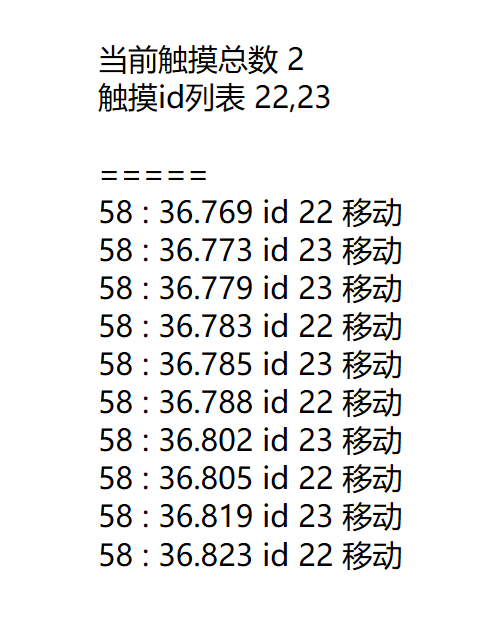

# WPF 测试触摸设备发送触摸按下和抬起不成对

我最近拿到一个显示器，这个设备在触摸的时候总是丢笔，我通过本文的程序测试这个设备是否触摸的按下和抬起不成对

<!--more-->
<!-- CreateTime:2019/11/29 8:47:13 -->

<!-- csdn -->

在触摸设备里面，如果用的是微软的 HID 协议，那么需要符合协议才能让 Windows 的软件能使用

关于 HID 协议请看[Windows 的 Pen 协议](https://blog.lindexi.com/post/Windows-%E7%9A%84-Pen-%E5%8D%8F%E8%AE%AE.html)

如果发送的消息里面，只有按下没有抬起，或者反过来，那么软件将会出现丢笔，也就是有时的触摸没反应

我需要在软件里面测试拿到当前触摸几个点，分别的 id 是什么，如果有一个点在抬起之前再次收到按下，那么告诉用户当前存在触摸按下。如果有一个点没有抬起，在我所有手离开触摸设备，发现还有点没有收到抬起，那么告诉用户当前存在触摸点没有抬起

<!--  -->

其实在 HID 设备里面，对于按下和移动用的都是 0x07 而对抬起用的是 0x04 详细请看[Windows 的 Pen 协议](https://blog.lindexi.com/post/Windows-%E7%9A%84-Pen-%E5%8D%8F%E8%AE%AE.html)

这个测试工具的源代码请看 [github](https://github.com/lindexi/lindexi_gd/tree/ab74e3f14597e48d71c7cf478e55211991748a0c/WhearernweaemKeefnca )

 本作品采用<a rel="license" href="http://creativecommons.org/licenses/by-nc-sa/4.0/">知识共享署名-非商业性使用-相同方式共享 4.0 国际许可协议</a>进行许可。欢迎转载、使用、重新发布，但务必保留文章署名[林德熙](http://blog.csdn.net/lindexi_gd)(包含链接:http://blog.csdn.net/lindexi_gd )，不得用于商业目的，基于本文修改后的作品务必以相同的许可发布。如有任何疑问，请与我[联系](mailto:lindexi_gd@163.com)。
