# WPF 渲染原理

在 WPF 最主要的就是渲染，因为 WPF 是一个界面框架。想用一篇博客就能告诉大家完整的 WPF 渲染原理是不可能的。本文告诉大家 WPF 从开发者告诉如何画图像到在屏幕显示的过程。本文是从一个很高的地方来看渲染的过程，在本文之后会添加很多博客来告诉大家渲染的细节。

<!--more-->
<!-- CreateTime:2019/9/8 10:40:00 -->

<div id="toc"></div>

<!-- 标签：WPF,渲染 -->

从 WPF 画图像到屏幕显示是比较复杂的，本渣也不敢说这就是 WPF 的做法，但是看了很多博客，好像都是这么说的，看了代码，好像 WPF 是这样写的。

本文将会分为三个不同的层来讲，第一层就是 WPF 的总体结构，第二层是消息循环相关，第三层是在 dx 渲染到屏幕。

## WPF 组成

因为 WPF 是一个 UI 框架，作为一个框架最主要的是交互和显示。本文只告诉大家渲染的原理。但是本文不会告诉大家任何关于渲染的算法，只是告诉大家渲染的过程如何从 WPF 元素显示到屏幕。

下面的图片是从[WPF Architecture](https://docs.microsoft.com/en-us/dotnet/framework/wpf/advanced/wpf-architecture ) 找到


WPF 有三个主要的模块 PresentationFramework、 PresentationCore 和基础层

在 WPF 最顶层，也就是给开发者使用的元素，元素的显示就是使用 DrawingContext 告诉 WPF 需要如何渲染。最简单的方法也就是继承 FrameworkElement 然后重写 OnRender 方法，通过 OnRender 方法画出最基础的界面。这就是在框架的顶层，在这的上面就不属于底层框架的。如在显示上面封装的 Image 等这些。

那么在调用 OnRender 画出内容，是不是 WPF 会立刻显示，如果大家有看 [WPF 使用 Direct2D1 画图入门](https://blog.csdn.net/lindexi_gd/article/details/80387784 )就会发现在渲染是调用 CompositionTarget.Rendering 才知道是什么时候渲染，因为 WPF 是分开渲染和交互，实际的 OnRender 画出的内容的代码是指导渲染，也就是告诉 WPF 如何渲染。那么 WPF 在什么时候渲染就是代码不知道的。为什么 WPF 需要这样做还需要从 WPF 的体系结构开始说起。

我在下面偷了一张图，图片是从[Overview of Windows Presentation Foundation (WPF) Architecture](https://www.c-sharpcorner.com/UploadFile/819f33/overview-of-windows-presentation-foundation-wpf-architectu/ )找到，在 WPF 可以分为三层。第一层就是 WPF 的托管层，这一层的代码都是托管代码。第二层就是 WPF 的非托管层，包括刚才告诉大家的模块。最后一层就是系统核心元素层。下面简单介绍一下 WPF 的体系结构


如果觉得对 WPF 的体系结构已经足够了解，那么请跳到下一节。

### 托管层

在托管层最重要的就是 Presentation Framework、Presentation Core 和 Window Base ，很多小伙伴说的 WPF 只是包含这几个模块，因为其他的模块几乎都不会知道。也就是基本使用的类都在下面三个 dll 可以找到

- PresentationFramework.dll 提供最顶层封装，包括应用的窗口、控制的 Panel 和 Styles 这些类都是在这可以找到，包括交互的控制，动画和几乎可以用到的界面的控件

- PresentationCore.dll 提供底层的 WPF 功能，如2d、3d和 geometry 这些类，在 PresentationCore 是对 MIL 和托管中间封装，包括提供了 UI Element 和 Visual 这些类，在显示模块包含视觉树和显示指令，也就是刚才说的 OnRender 重写方法。

- WindowsBase.dll 提供最底层的基础类，包括调度对象 Dispatcher objects 和依赖属性

### 非托管层

非托管层用来进行高性能的 DX 渲染和连接非托管层

- milCore.dll 用来作为 WPF 的组合引擎，这时一个使用本地代码编译的库，包含最主要的媒体集成层 Media Integration Layer (MIL) 的基础支持，作用是封装 Dx 的接口支持 2D 和 3D 的渲染，使用本地代码编译是为了获得最好的性能，而且用在 WPF 上层和底层的 DirextX 和 User32 的接口之间。值的一说的是在 Windows Vista 的桌面窗口管理器(Desktop Windows Manager，DWM)就是使用milcore.dll渲染桌面的。

- WindowsCodecs.dll 这时另一个底层的图片支持代码，用来支持 WPF 旋转、放大图片等，这是一个使用本地代码编译的，提供了很多图片的加密解密，可以让 WPF 把图片画在屏幕

### 核心系统层

这一层就是系统的核心，如 User32、GDI、Device Drivers，显卡等，这些组合在程序里是最底层的接口

- User32 提供内存和进程分割，这是一个通用的 API 不止是 WPF 使用，这个库决定一个元素可以在屏幕的哪里显示，也就是窗口显示的最底层的代码就在这。但是这个代码只提供让窗口在哪里显示，如何显示就需要下面的代码

- DirectX 这就是 WPF 渲染的最底层的库，可以渲染 WPF 的几乎所有控件，需要注意 WPF 使用的是 Dx9 或 Dx12 fl9 没有充分使用 Dx 进行画出现代的窗口。

- GDI 这个代码依赖显卡，是进行 CPU 渲染的接口，提供了绘制原语和提高质量

- CLR 因为 WPF 现在还运行在 dotnet framework 所以需要使用运行时，提供了普通的类和方法，用来方便开发者，大概有 30 万 API 可以使用

- Device Drivers 设备驱动程序是在系统特殊的用来驱动一些硬件

在下面使用到的代码实际都是从最上层拿到的，只有最上层的代码，微软才会开放。而关键的 milCore 代码我还拿不到，只能通过 WinDbg 拿到调用的堆栈。现在还没有完全知道 milCore 的过程，所以也不会在本文告诉大家。

本文的顺序是从消息调度到开发者使用 OnRender 方法给绘制原语，再到如何把绘制原语给渲染线程的过程。从渲染线程调用 milCore ，在通过 milCore 调用 DirectX 的过程就先简单说过。从 DirectX 绘制完成到屏幕显示的过程也是简单告诉大家。

## 消息循环

在 WPF 中也是使用消息循环，因为在之前的很多程序都是需要自己写消息循环才可以收到用户的交互，这里消息循环就是 Windows 会向 WPF 发送一些消息，而且 WPF 也可以给自己发消息，通过消息就可以判断当前软件需要做哪些

在处理消息的最主要的类是 HwndSubclass ，在创建应用就会执行 Attach 函数，这个函数请看代码

```csharp
    internal IntPtr Attach(IntPtr hwnd)
    {
      // 忽略代码
      return this.CriticalAttach(hwnd);
    }
```

从上面代码可以看到主要的是 CriticalAttach 函数，请看代码

```csharp
    internal IntPtr CriticalAttach(IntPtr hwnd)
    {
      // 忽略代码
      NativeMethods.WndProc newWndProc = new NativeMethods.WndProc(this.SubclassWndProc); // 创建处理消息
      IntPtr windowLongPtr = UnsafeNativeMethods.GetWindowLongPtr(new HandleRef((object) this, hwnd), -4);
      this.HookWindowProc(hwnd, newWndProc, windowLongPtr);
      return (IntPtr) this._gcHandle;
    }
```

这里 SubclassWndProc 就是主要处理消息，但是在上面代码是 HookWindowProc 注册。在 GetWindowLongPtr 大家也许都很熟悉，拿到这个函数就是拿到窗口，下面来看一下 HookWindowProc 代码

```csharp
      private void HookWindowProc(IntPtr hwnd, NativeMethods.WndProc newWndProc, IntPtr oldWndProc)
        {
            _hwndAttached = hwnd;
            _hwndHandleRef = new HandleRef(null,_hwndAttached);
            _bond = Bond.Attached;
 
            _attachedWndProc = newWndProc;
            _oldWndProc = oldWndProc;

            // 这有下面的代码才是获得消息
            IntPtr oldWndProc2 = (IntPtr)UnsafeNativeMethods.CriticalSetWindowLong(_hwndHandleRef, NativeMethods.GWL_WNDPROC, _attachedWndProc);
 
            // 跟踪这个窗口，可以在 CLR 关闭，撤掉管理的窗口代码
            ManagedWndProcTracker.TrackHwndSubclass(this, _hwndAttached);
        }
```

这里 NativeMethods.GWL_WNDPROC 的值就是 -4 在 CriticalSetWindowLong 是这样写

```csharp
       internal static IntPtr CriticalSetWindowLong(HandleRef hWnd, int nIndex, NativeMethods.WndProc dwNewLong)
        {
            int errorCode;
            IntPtr retVal;
 
            retVal = NativeMethodsSetLastError.SetWindowLongPtrWndProc(hWnd, nIndex, dwNewLong);
            errorCode = Marshal.GetLastWin32Error();
 
            return retVal;
        }
```

<!-- 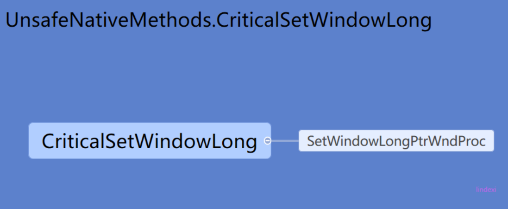 -->


所以核心就是 SetWindowLongPtrWndProc 调用 SetWindowLongWrapper 设置获得消息

那么消息是如何作为事件？

```csharp
       internal IntPtr SubclassWndProc(IntPtr hwnd, Int32 msg, IntPtr wParam, IntPtr lParam)
        {
           // 忽略的代码

        	// 获得当前线程的 dispatcher 也就是不是主线程也可以处理
                Dispatcher dispatcher = Dispatcher.FromThread(Thread.CurrentThread);
                
                  
           // 忽略的代码
 
                    
                    DispatcherOperationCallbackParameter param = _paramDispatcherCallbackOperation;
                    _paramDispatcherCallbackOperation = null;
                    param.hwnd = hwnd;
                    param.msg = msg;
                    param.wParam = wParam;
                    param.lParam = lParam;
                    // 插入处理的消息
                    object result = dispatcher.Invoke(
                             DispatcherPriority.Send,
                             _dispatcherOperationCallback,
                             param);
            var retval = param.retVal;
            return retval;
        }
```

也就是调用的 SubclassWndProc 实际上就是封装消息，然后调用 dispatcher 执行。那么 `_dispatcherOperationCallback` 有是如何做的？实际上 这个也是调用这个弱引用委托，请看代码，下面的代码是去掉判断参数

```csharp
      private object DispatcherCallbackOperation(object o)
        {
            DispatcherOperationCallbackParameter param = (DispatcherOperationCallbackParameter)o;
            param.handled = false;
            param.retVal = IntPtr.Zero; // 把返回值设置为 空，把是否处理设置为 false ，在下面调用函数，如果可以处理就设置 param.handled 为 true
            HwndWrapperHook hook = _hook.Target as HwndWrapperHook;
            param.retVal = hook(param.hwnd, param.msg, param.wParam, param.lParam, ref param.handled);
            return param;
        }
```

那么这个 Handle 有什么用？这个属性就是在为 false 会在 SubclassWndProc 使用下面代码

```csharp
            // 如果窗口无法处理这个消息，把他发到下一个链，因为 Windows 消息是可以传到下一个窗口
           if(!handled)
            {
                retval = CallOldWindowProc(oldWndProc, hwnd, message, wParam, lParam);
            }
```

那么这个处理 `_hook` 是怎么传过来的，这个`_hook` 是一个弱引用，具体的传送过来需要从 Dispatcher 开始说，请看下面

## Dispatcher 调度

关于调度需要从 PushFrame 开始说，请看[深入了解 WPF Dispatcher 的工作原理（PushFrame 部分） - walterlv](https://walterlv.github.io/post/dotnet/2017/09/26/dispatcher-push-frame.html )，walterlv大佬已经告诉大家底层的原理我就可以不再这里详细告诉大家

在 Dispatcher 的构造可以看到下面代码

```csharp
         MessageOnlyHwndWrapper window = new MessageOnlyHwndWrapper();
```

创建 MessageOnlyHwndWrapper 可以收到消息，并且把消息放在 Dispatcher 用来处理，那么 MessageOnlyHwndWrapper 为什么可以收到消息？ 可以看到 MessageOnlyHwndWrapper 的代码很简单

```csharp
    internal class MessageOnlyHwndWrapper : HwndWrapper
    {
        public MessageOnlyHwndWrapper() : base(0, 0, 0, 0, 0, 0, 0, "", NativeMethods.HWND_MESSAGE, null)
        {
        }
    }
```

就需要看一下 HwndWrapper 类的代码，这个类的构造函数的关键代码

```csharp
        public HwndWrapper()//太多参数，这里就不写了
        {
        	 _wndProc = new SecurityCriticalData<HwndWrapperHook>(new HwndWrapperHook(WndProc));

        	 // 还记得刚才说的消息，就是在这里创建 HwndSubclass 可以直接拿到消息
        	 HwndSubclass hwndSubclass = new HwndSubclass(_wndProc.Value);
        }
```

所以在上面说的 `_hook` 弱引用就是 传入的`_wndProc` ，那么这个 `_wndProc` 的关键代码就是`WndProc`，在 `HwndWrapper` 的函数

```csharp
       private IntPtr WndProc(IntPtr hwnd, int msg, IntPtr wParam, IntPtr lParam, ref bool handled)
        {
            IntPtr result = IntPtr.Zero;
            WindowMessage message = (WindowMessage)msg;
        
            // 遍历所有的 _hooks 处理消息

                foreach(HwndWrapperHook hook in _hooks.Value)
                {
                    result = hook(hwnd, msg, wParam, lParam, ref handled);
 
                    if(handled)
                    {
                        break;
                    }
                }
 
            return result;
        }
```

所以这个方法也就是没有做具体处理，是通过`AddHook`函数添加的处理

```csharp
       public void AddHook(HwndWrapperHook hook)
        {
            //VerifyAccess();
            if(_hooks == null)
            {
                _hooks = new SecurityCriticalDataClass<WeakReferenceList>(new WeakReferenceList());
            }
 
            _hooks.Value.Insert(0, hook);
        }
```

因为垃圾微软的代码，在 Dispatcher 的构造函数才调用 AddHook ，也就是在构造函数创建了 MessageOnlyHwndWrapper 在这个类初始化，具体处理是在初始化之后才加上，所以可以看到这个类有很多没有用的代码，因为初始化创建的值都是空，在创建之后才加上

```csharp
 private Dispatcher()
 {
 	       MessageOnlyHwndWrapper window = new MessageOnlyHwndWrapper();
 	       _hook = new HwndWrapperHook(WndProcHook);
 	       window.AddHook(_hook);
 }
```

<!-- 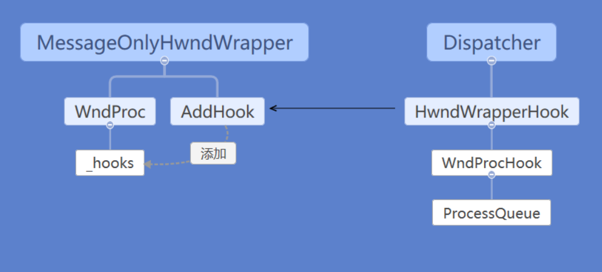 -->


最核心的处理消息就是 Dispatcher 的 WndProcHook 这个方法实际上只是调用 ProcessQueue 方法。

<!-- 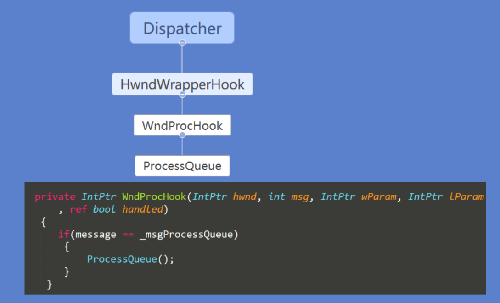 -->


在 SubclassWndProc 调用的`dispatcher.Invoke( DispatcherPriority.Send,_dispatcherOperationCallback,param)`就是调用`WndProcHook` 函数传入参数 

如果收到了画窗口的消息，就会把这个消息发送给DWM，通过DWM把窗口画的内容画到屏幕。


## RenderContent

在使用绘制原语之后，最底层的函数是 UIElement.RenderContent ，请看代码

```csharp
  internal override void RenderContent(RenderContext ctx, bool isOnChannel)
    {
      DUCE.Channel channel = ctx.Channel;

        DUCE.IResource drawingContent = (DUCE.IResource) this._drawingContent;
        drawingContent.AddRefOnChannel(channel);

        DUCE.CompositionNode.SetContent(this._proxy.GetHandle(channel), drawingContent.GetHandle(channel), channel);
        this.SetFlags(channel, true, VisualProxyFlags.IsContentConnected);
     
    }
```

<!-- 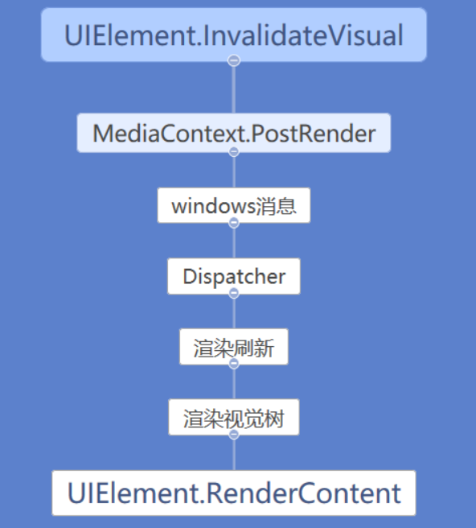 -->


通过 DUCE.CompositionNode.SetContent 调用 `channel.SendCommand` 就可以发送到渲染线程

```csharp
      internal static unsafe void SetContent(DUCE.ResourceHandle hCompositionNode, DUCE.ResourceHandle hContent, DUCE.Channel channel)
      {
        DUCE.MILCMD_VISUAL_SETCONTENT visualSetcontent;
        visualSetcontent.Type = MILCMD.MilCmdVisualSetContent;
        visualSetcontent.Handle = hCompositionNode;
        visualSetcontent.hContent = hContent;

        // 通过下面代码发送到另一个线程
        channel.SendCommand((byte*) &visualSetcontent, sizeof (DUCE.MILCMD_VISUAL_SETCONTENT));
      }
```

<!-- 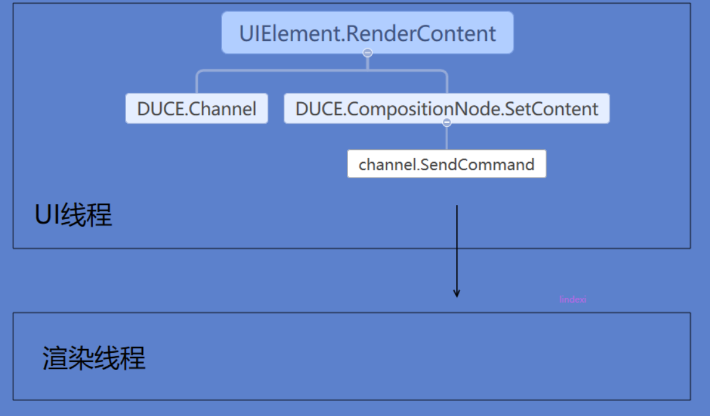 -->


那么这个渲染是如何触发，实际上在`Dispatcher.ProcessQueue`调用，在上面已经有告诉大家 ProcessQueue 是在 WndProcHook 触发的


```csharp
       private IntPtr WndProcHook(IntPtr hwnd, int msg, IntPtr wParam, IntPtr lParam, ref bool handled)
        {
           if(message == _msgProcessQueue)
            {
                ProcessQueue();
            }
         }
```

这里 `_msgProcessQueue` 就是在  Dispatcher 静态构造函数的自定义消息

```csharp
      static Dispatcher()
        {
            _msgProcessQueue = UnsafeNativeMethods.RegisterWindowMessage("DispatcherProcessQueue");
           // 下面还有很多代码
        }
 
```

<!-- 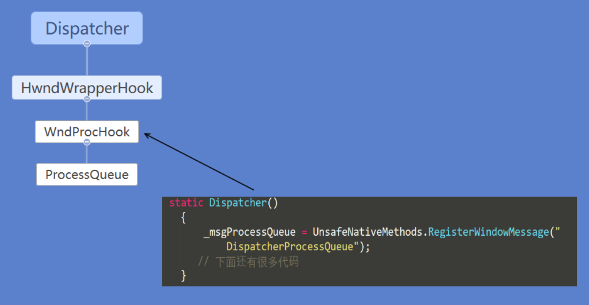 -->


那么这个消息是怎么发送，在`UIElement.InvalidateVisual`函数会调用`MediaContext.PostRender`这里就发送自定义消息，于是就可以开始渲染

在消息循环是会不断获取消息，这里说的渲染是包括两个方面，一个是 WPF 把内容画到窗口，也就是上面说的自定义消息，还有另一个就是把窗口内容画在屏幕。这两个都是依靠 Windows 消息，只是第一个消息是 WPF 自己发给自己，也就是自己玩的。从 Dispatcher 拿到自定义的消息，就开始执行视觉树的对象，调用对应的绘制，这里是收集到绘制原语，也就是告诉显卡可以怎么画。在底层是通过 `System.Windows.Media.Composition.DUCE` 的 Channel 把数据发送到渲染线程，渲染线程就是使用 Dx 进行绘制。在 Dx 画是使用 MilCore 从渲染线程连接到 Dx 画出来的

在渲染线程收集到的都是绘制原语，绘制原语就是在 Visual 底层调用的DrawingContext 传入的方法

<!-- 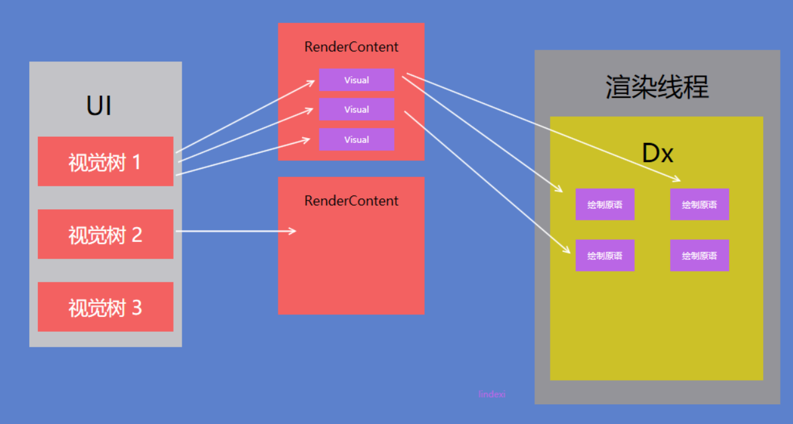 -->


这一部分没有完全跟源代码，如果有哪些地方和实际不相同，请告诉我

渲染线程拿到了绘制原语就可以进行绘制，绘制的过程需要进行处理图片和一些基础形状，大概的过程请看下面

<!-- 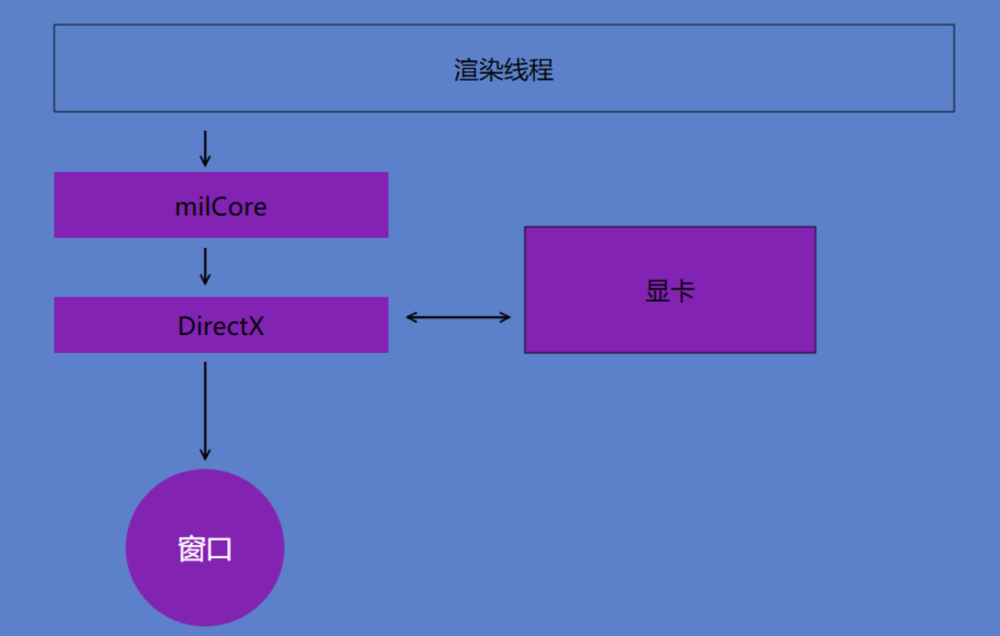 -->


这时到了 Dx 才会使用显卡进行渲染，并且绘制的是窗口指针。也就是窗口绘制完成在屏幕还是无法看到的。

在绘制的时候需要使用 MIL 解码一些图片和一些形状才可以用到 dx 进行渲染

<!-- 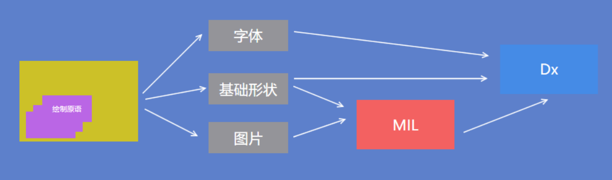 -->


在窗口画完之后，会通过 `WM_PAINT` 告诉 DWM 可以画出窗口。但是现代的应用是不需要在窗口刷新的过程通过 windows 消息发送到 DWM 才进行窗口刷新。只有在窗口存在部分不可见，如窗口有一部分在屏幕之外，从屏幕外移到屏幕内，或者窗口最小化到显示才需要通过 windows 告诉 DWM 刷新。

<!-- 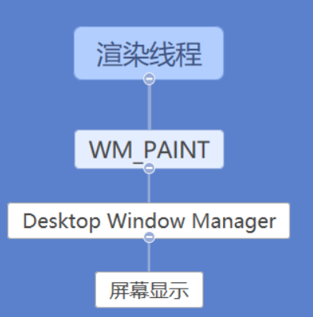 -->


那么这里 DWM 是什么？请看下面

## 桌面窗口管理

在 Windows 系统，很重要的就是 DWM（Desktop Window Manager）可以把窗口画到屏幕，并且支持窗口做半透明和其他的对其他窗口的视觉处理。

需要知道，发送 `WM_PAINT` 消息只能通过系统发送而不能通过应用发送，也就是上面说的通过 `WM_PAINT` 告诉 DWM 可以画出窗口，不是软件主动告诉系统，而是系统会不断刷新。

对于不可见的窗口，在 DWM 是不会发送 `WM_PAINT` 到这个窗口。

详细的 `WM_PAINT` 请看 [WMPAINT详解和WMERASEBKGND - CSDN博客](https://blog.csdn.net/rankun1/article/details/50596634 )

如果系统没有发送 `WM_PAINT` 到应用，屏幕怎么知道窗口需要刷新？实际通过[Drawing Without the WM\_PAINT Message](https://docs.microsoft.com/en-us/windows/desktop/gdi/drawing-without-the-wm-paint-message ) 的方法就可以做到。

在 Windows 8 之后就无法手动设置关闭 DWM 的合成，只有在 windows 7 和以前的系统才可以设置关闭合成。通过 DWM 合成技术可以将每个绘制的窗口认为是一个位图，通过对位图处理添加阴影等，做出好看界面。

更多请看 [Desktop Window Manager](https://docs.microsoft.com/en-us/windows/desktop/dwm/dwm-overview ) 

## 从控件画出来到屏幕显示

虽然上面写了很多，但是好多小伙伴都不会仔细去看，所以本渣就在这里重新把过程说一遍。需要知道，这里说的省略很多细节，上面的也是有很多细节没有告诉大家。

在渲染的时候，是需要通过多个方式把渲染的任务放在 Dispather 里，在 WPF 应用内是可以通过 InvalidateVisual 的方法通知，而系统也在不断发送消息告诉一个应用开始渲染。

<!-- 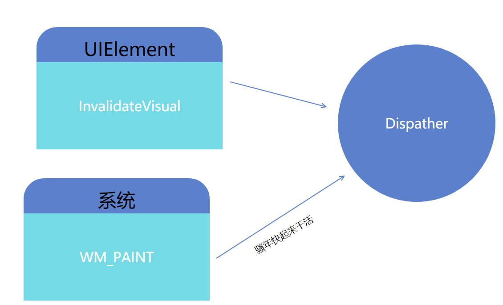 -->


在 Dispatcher 收到消息之后就可以把渲染任务放在队列，按照优先级一个个出队

<!-- 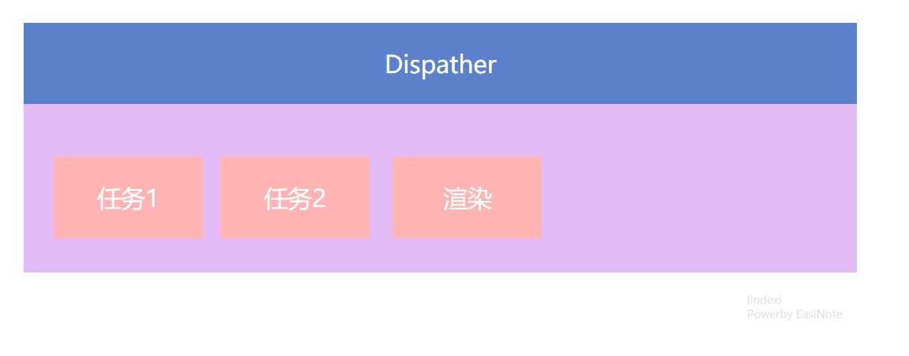 -->


这时在 Dispatcher 内部通过渲染的调用就会通过 DispatcherOperation 执行对应的任务

渲染的任务是通过`mscorlib.dll!System.Threading.ExecutionContext.Run(System.Threading.ExecutionContext executionContext, System.Threading.ContextCallback callback, object state)`触发，从 mscorlib 再次调进 WindowBase ，再从  WindowBase 的 `WindowsBase.dll!System.Windows.Threading.ExceptionWrapper.InternalRealCall(System.Delegate callback, object args, int numArgs)` 调用 ` PresentationFramework.dll!System.Windows.Window.ShowHelper(object booleanBox)` 也就是显示的最近的代码

<!-- 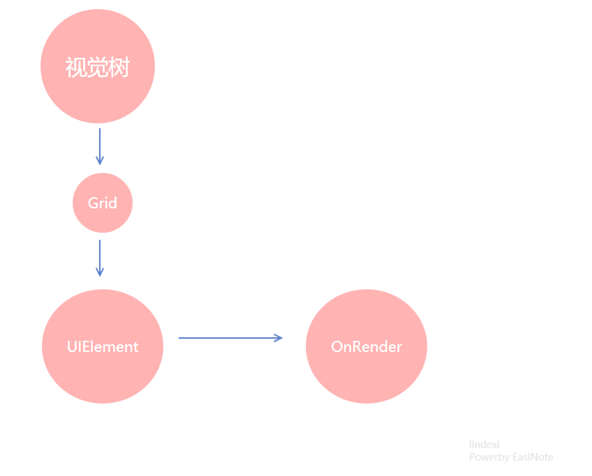 -->


总的渲染结构请看下图

<!-- 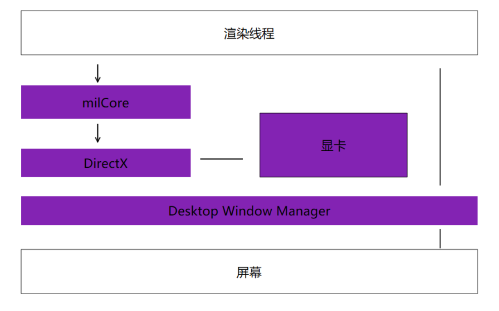 -->


渲染需要经过消息循环和 Dispatcher 循环，也就是渲染的方法不是直接通过控件调用渲染。控件是通过发送消息经过消息循环再调用到控件的 OnRender 方法。再 OnRender 方法里，经过 Drawing 方法输出绘制原语到渲染线程。渲染线程经过 MIL 和 Dx 渲染界面到窗口。屏幕管理更新窗口让用户在屏幕可以看到、

关于渲染性能请看 [WPF Drawing Performance](http://kynosarges.org/WpfPerformance.html )

课件 [WPF 渲染原理](https://r302.cc/p2m3ea)

更多 WPF 渲染请看 [渲染相关](https://lindexi.gitee.io/post/%E6%B8%B2%E6%9F%93.html )

参见：

[一站式WPF--Window（一） - 周永恒 - 博客园](https://www.cnblogs.com/Zhouyongh/archive/2009/11/30/1613628.html )

[WPF起步(上) --- WPF是如何把图像画到屏幕上 - CSDN博客](https://blog.csdn.net/eparg/article/details/1930357 )

[深入了解 WPF Dispatcher 的工作原理（PushFrame 部分） - walterlv](https://walterlv.github.io/post/dotnet/2017/09/26/dispatcher-push-frame.html )

[WPF 使用 Direct2D1 画图入门](https://blog.csdn.net/lindexi_gd/article/details/80387784 )

[Overview of Windows Presentation Foundation (WPF) Architecture](https://www.c-sharpcorner.com/UploadFile/819f33/overview-of-windows-presentation-foundation-wpf-architectu/ )

[WPF Architecture ](https://docs.microsoft.com/en-us/dotnet/framework/wpf/advanced/wpf-architecture )

[WPF Drawing Performance](http://kynosarges.org/WpfPerformance.html )

[WM_PAINT详解和WM_ERASEBKGND - CSDN博客](https://blog.csdn.net/rankun1/article/details/50596634 )

[Sharing Message Loops Between Win32 and WPF ](https://docs.microsoft.com/en-us/dotnet/framework/wpf/advanced/sharing-message-loops-between-win32-and-wpf )

[1.3 WPF体系结构 - 51CTO.COM](http://book.51cto.com/art/200908/145309.htm )

[WM_PAINT message ](https://docs.microsoft.com/zh-cn/windows/desktop/gdi/wm-paint )

[Custom Window Frame Using DWM ](https://docs.microsoft.com/en-us/windows/desktop/dwm/customframe )

[Performance Considerations and Best Practices ](https://docs.microsoft.com/en-us/windows/desktop/dwm/bestpractices-ovw )

[Drawing Without the WM\_PAINT Message](https://docs.microsoft.com/en-us/windows/desktop/gdi/drawing-without-the-wm-paint-message )

[Win32知识之窗口绘制窗口第一讲](https://www.cnblogs.com/iBinary/p/9576439.html )

[win32程序之窗口程序以及消息机制](https://www.cnblogs.com/iBinary/p/9580268.html )

<a rel="license" href="http://creativecommons.org/licenses/by-nc-sa/4.0/"></a><br />本作品采用<a rel="license" href="http://creativecommons.org/licenses/by-nc-sa/4.0/">知识共享署名-非商业性使用-相同方式共享 4.0 国际许可协议</a>进行许可。欢迎转载、使用、重新发布，但务必保留文章署名[林德熙](http://blog.csdn.net/lindexi_gd)(包含链接:http://blog.csdn.net/lindexi_gd )，不得用于商业目的，基于本文修改后的作品务必以相同的许可发布。如有任何疑问，请与我[联系](mailto:lindexi_gd@163.com)。  

